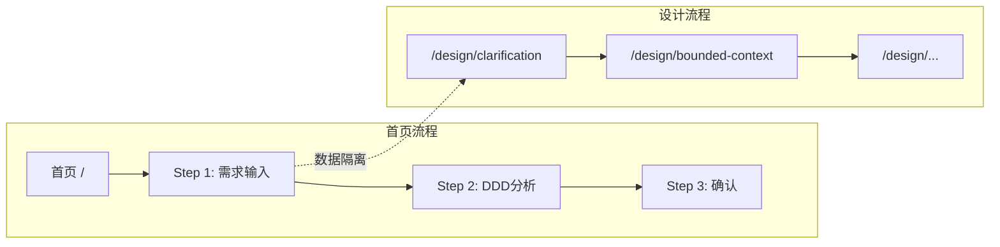

# Analyst Perspective: VibeX 需求对齐分析

**会议**: VibeX 项目需求对齐会议  
**发言者**: Analyst  
**日期**: 2026-03-20  
**总需求流程**: 首页输入需求 → 对话澄清 → 生成核心上下文业务流程 → 询问通用支撑域 → 用户勾选流程节点 → 生成页面/组件节点 → 用户再次勾选 → 创建项目 → Dashboard → 原型预览 + AI助手

---

## 执行摘要

VibeX 当前存在**两套并行的设计流程**：
1. **首页流程** (`/`) - 使用 `confirmationStore`
2. **设计流程** (`/design/*`) - 使用 `designStore`

这两套流程**部分功能重叠但实现独立**，未能形成统一的需求到原型的闭环。

---

## 需求流程对照分析

### 总需求流程

```
Step 1: 首页输入需求
    ↓
Step 2: 对话澄清 ← ⚠️ 缺失/不完整
    ↓
Step 3: 生成核心上下文业务流程
    ↓
Step 4: 询问通用支撑域 ← ⚠️ 缺失
    ↓
Step 5: 用户勾选流程节点
    ↓
Step 6: 生成页面/组件节点
    ↓
Step 7: 用户再次勾选
    ↓
Step 8: 创建项目
    ↓
Step 9: Dashboard
    ↓
Step 10: 原型预览 + AI助手
```

---

## ✅ 已完成且符合需求

### 1. 首页输入需求 (Step 1)
| 组件 | 状态 | 说明 |
|------|------|------|
| `StepRequirementInput` | ✅ 完成 | 首页有需求输入框 |
| `useDDDStream` | ✅ 完成 | SSE 流式 DDD 分析 |
| `ThinkingPanel` | ✅ 完成 | 思考过程实时展示 |
| `PreviewArea` | ✅ 完成 | 实时预览 Mermaid 图 |

**符合度**: 100% ✅

### 2. 生成核心上下文业务流程 (Step 3)
| 组件 | 状态 | 说明 |
|------|------|------|
| `StepBoundedContext` | ✅ 完成 | 限界上下文生成 |
| `StepBusinessFlow` | ✅ 完成 | 业务流程图生成 |
| `BoundedContext[]` | ✅ 完成 | 数据结构完整 |
| `BusinessFlow` | ✅ 完成 | 流程数据结构完整 |

**符合度**: 95% ✅

### 3. 用户勾选流程节点 (Step 5)
| 组件 | 状态 | 说明 |
|------|------|------|
| `selectedContextIds` | ✅ 完成 | 支持上下文选择 |
| `selectedModelIds` | ✅ 完成 | 支持模型选择 |
| `NodeTreeSelector` | ✅ 完成 | 节点树选择器 |

**符合度**: 90% ✅

### 4. 创建项目 (Step 8)
| 组件 | 状态 | 说明 |
|------|------|------|
| `StepProjectCreate` | ✅ 完成 | 项目创建步骤 |
| `confirmStore` | ✅ 完成 | 状态管理 |
| `/confirm/success` | ✅ 完成 | 创建成功页 |

**符合度**: 100% ✅

### 5. Dashboard
| 组件 | 状态 | 说明 |
|------|------|------|
| `/dashboard` | ✅ 存在 | 项目列表页 |
| `dashboardStore` | ✅ 存在 | 仪表盘状态 |

**符合度**: 80% ✅

### 6. 原型预览 + AI助手
| 组件 | 状态 | 说明 |
|------|------|------|
| `/prototype/editor` | ✅ 存在 | 原型编辑器 |
| `/chat` | ✅ 存在 | AI 助手 |

**符合度**: 70% ✅

---

## ⚠️ 已完成但偏离需求

### 1. 对话澄清 (Step 2)
**偏离原因**: 首页没有对话澄清功能

| 现状 | 问题 |
|------|------|
| `/design/clarification` 有独立实现 | 与首页流程割裂 |
| `smartRecommenderStore` | 仅在 design 流程使用 |
| 首页直接进入 DDD 分析 | 跳过澄清环节 |

**影响**: 
- 用户输入粗糙需求时无法得到智能澄清
- 需求质量无保障，后续生成结果可能偏离

**建议**: 将对话澄清能力集成到首页流程 Step 1

### 2. 询问通用支撑域 (Step 4)
**偏离原因**: 完全没有实现

| 现状 | 问题 |
|------|------|
| 无专用组件 | 通用/支撑域识别后直接显示 |
| 无用户确认环节 | 无法修改识别结果 |
| 无领域分类说明 | 用户不理解 Core/Support/Generic 区别 |

**影响**:
- 用户可能不理解领域分类逻辑
- 无法纠正 AI 的领域划分错误

**建议**: 添加领域分类确认步骤

### 3. design 流程 vs 首页流程
**偏离原因**: 两套流程并行，用户困惑

| 首页 (`/`) | 设计 (`/design/*`) |
|-----------|------------------|
| 使用 `confirmationStore` | 使用 `designStore` |
| 5 步骤流 | 6 步骤流 (含 clarification) |
| 独立状态 | 独立状态 |
| 无原型生成 | 无原型生成 |

**影响**:
- 用户不知道该用哪个流程
- 功能重叠但数据不互通
- 维护成本加倍

**建议**: 统一为单一流程，设计流程复用首页组件

---

## ❌ 缺失内容

### 1. 流程节点勾选反馈 (Step 5-7)
| 缺失项 | 说明 |
|--------|------|
| 勾选反馈动画 | 选择节点时无视觉反馈 |
| 二次确认 | 再次勾选确认步骤缺失 |
| 节点详情 | 点击节点无详情面板 |

**影响**: 用户不确定自己的选择被正确处理

### 2. 跨流程数据互通
| 缺失项 | 说明 |
|--------|------|
| 首页→设计 | 首页生成的数据无法传递到设计流程 |
| 设计→首页 | 设计流程的澄清结果无法回传 |
| 状态同步 | 两套 store 无同步机制 |

### 3. 完整的用户路径追踪
| 缺失项 | 说明 |
|--------|------|
| 步骤回退 | 首页流程不支持回退 |
| 草稿保存 | 关闭页面后数据丢失 |
| 多设备同步 | 无云端持久化 |

### 4. 验收确认机制
| 缺失项 | 说明 |
|--------|------|
| 上下文验收 | bounded-context 生成后无确认按钮 |
| 模型验收 | domain-model 生成后无确认按钮 |
| 流程验收 | business-flow 生成后无确认按钮 |

---

## 根因分析

### 架构问题



**问题**: 两套流程数据隔离，未能形成闭环

### 状态管理问题

| Store | 用途 | 数据互通 |
|-------|------|----------|
| `confirmationStore` | 首页流程 | ❌ |
| `designStore` | 设计流程 | ❌ |
| `dashboardStore` | 仪表盘 | ❌ |

---

## 建议整合方案

### 方案 A: 统一流程 (推荐)

```
首页单入口
    ↓
Step 1: 需求输入 + 对话澄清
    ↓
Step 2: 限界上下文生成 + 通用支撑域确认
    ↓
Step 3: 业务流程生成 + 节点勾选
    ↓
Step 4: 领域模型生成 + 节点勾选
    ↓
Step 5: 项目创建 → Dashboard
    ↓
原型预览 + AI助手
```

**优点**: 单一流程，数据互通  
**缺点**: 需要重构 designStore 与 confirmationStore

### 方案 B: 双轨并行 (保守)

保持现状，但增加数据互通层

**优点**: 改动小  
**缺点**: 维护成本高，用户体验割裂

---

## 行动建议

| 优先级 | 行动 | 影响 |
|--------|------|------|
| P0 | 统一首页与设计流程的数据层 | 消除数据孤岛 |
| P0 | 实现通用/支撑域确认步骤 | 提升需求质量 |
| P1 | 添加对话澄清到首页流程 | 增强需求理解 |
| P1 | 实现步骤回退功能 | 提升用户体验 |
| P2 | 添加草稿自动保存 | 防止数据丢失 |

---

## 结论

VibeX 核心流程**已完成 60-70%**，但存在：
1. **流程分裂**: 两套并行流程增加复杂度
2. **关键步骤缺失**: 对话澄清、领域确认
3. **数据孤岛**: 流程间无法传递数据

**下一步**: 建议以方案 A 为目标，逐步整合两套流程。

---

*发言完毕，等待其他 Agent 补充*
