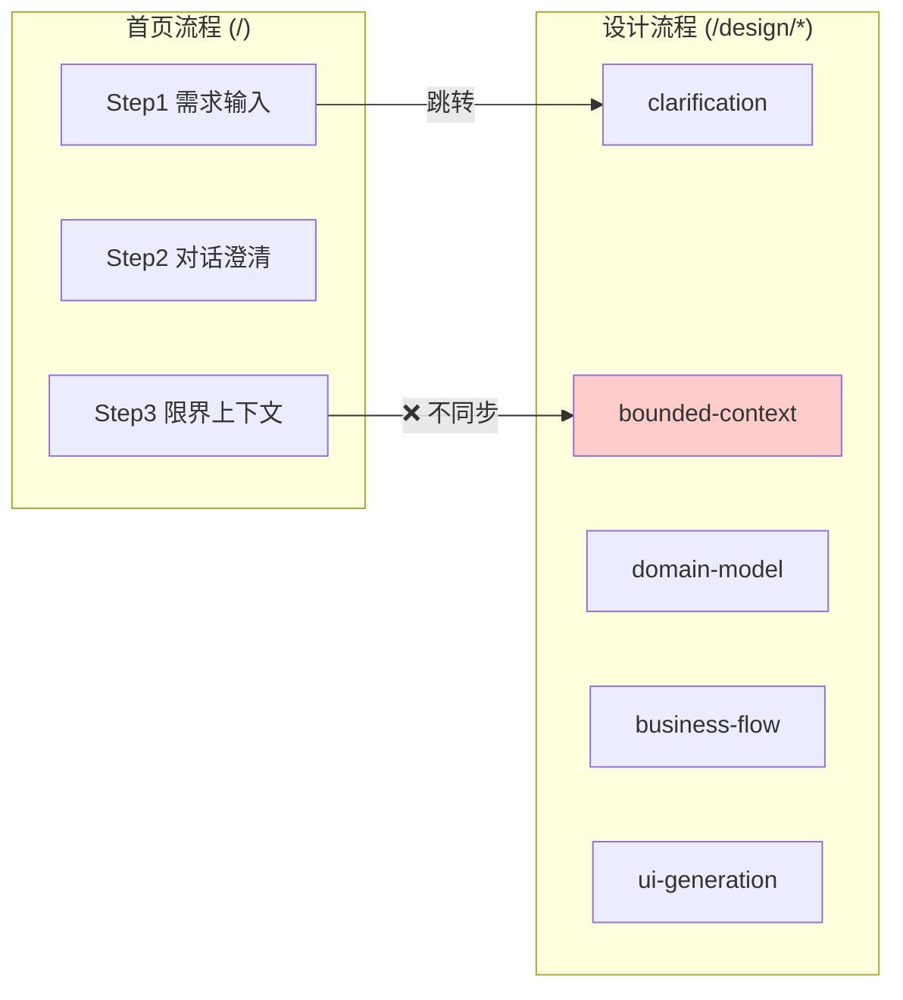

# Architect Perspective: VibeX 需求对齐架构分析

**会议**: VibeX 项目需求对齐会议
**发言者**: Architect
**日期**: 2026-03-20

---

## 总需求流程

```
Step 1: 首页输入需求
Step 2: 对话澄清
Step 3: 生成核心上下文业务流程
Step 4: 询问通用支撑域
Step 5: 用户勾选流程节点
Step 6: 生成页面/组件节点
Step 7: 用户再次勾选
Step 8: 创建项目
Step 9: Dashboard
Step 10: 原型预览 + AI助手
```

---

## 一、需求流程映射（Architecture 视角）

| 需求步骤 | 现有架构 | 状态 | Architect 评估 |
|---------|---------|------|---------------|
| Step 1: 首页输入需求 | `useDDDStream` + `StepRequirementInput` | ✅ 完成 | **符合** — SSE 流式分析已接入 |
| Step 2: 对话澄清 | `vibex-interactive-confirmation` | ✅ PRD完成 | **部分符合** — confirmationStore 与 designStore 数据不同步 |
| Step 3: 生成核心上下文业务流程 | `bounded-context` API + MermaidPreview | ✅ 完成 | **符合** — 但 API 路由存在不一致（`/api/ddd/...` vs `/api/v1/domain-model/...`），见 `vibex-ddd-api-fix` |
| Step 4: 询问通用支撑域 | — | ❌ 缺失 | **完全缺失** — 无专门架构设计 |
| Step 5: 用户勾选流程节点 | FlowNodeSelector 组件 | ⚠️ 有Bug | **回归问题** — 节点不可点击，见 `vibex-step2-regression` |
| Step 6: 生成页面/组件节点 | UI 生成 API + ComponentTree | ⚠️ 存疑 | **需确认** — 是否复用首页流程还是独立 design 流程 |
| Step 7: 用户再次勾选 | — | ❌ 缺失 | **完全缺失** — 无第二轮确认机制 |
| Step 8: 创建项目 | 项目创建 API | ✅ 完成 | **符合** |
| Step 9: Dashboard | — | ❌ 缺失 | **完全缺失** — 无专门架构 |
| Step 10: 原型预览 + AI助手 | — | ❌ 缺失 | **完全缺失** — 原型渲染 + AI 对话无架构 |

---

## 二、关键架构偏离分析

### 2.1 首页流程 vs 设计流程 — 双流程分裂

**问题**: 存在两套并行流程但数据不同步：



- **首页** 用 `confirmationStore`
- **设计页** 用 `designStore`
- 两者数据**不互通**，导致首页生成的内容无法直接进入设计页

**架构建议**: 统一数据层到 `designStore`，首页作为 `designStore` 的写入端。

### 2.2 确认流程（Confirm）- 步骤定义混乱

**问题**: 当前系统有多个"确认"概念：
- `ConfirmationStore` — 首页对话澄清状态
- `/confirm` 页面 — 项目确认页
- `vibex-interactive-confirmation` PRD — 交互确认机制

这三个概念的**边界和职责不清**，可能导致：
- 状态冗余存储
- 重复确认 UX
- 维护困难

**架构建议**: 统一为单一 `ConfirmationPhase` 状态机阶段，区分"对话澄清"和"节点确认"两个子阶段。

### 2.3 Step 5/6/7 — 节点勾选流程无架构支撑

**问题**: 用户在 Step 5 勾选流程节点、Step 7 再次勾选，但：
- `FlowNodeSelector` 组件没有 `selected` 状态的持久化机制
- 没有"第一轮勾选 → API 生成 → 第二轮勾选"的数据流设计
- 组件树生成后无独立预览和编辑能力

**架构建议**:
```typescript
// 设计数据流
FlowNode[] → 用户勾选(S1) → API生成组件树 → 用户勾选(S2) → 项目创建
                  ↑                          ↑
            localStorage 持久化        designStore 快照
```

### 2.4 Dashboard + 原型预览 + AI助手 — 完全空白

**问题**: 需求流程 Step 9/10 无任何架构设计文档。现有 `DashboardPage` 是通用页面，不包含：
- **原型预览**: 生成的页面/组件如何渲染为可交互原型
- **AI助手**: AI 对话能力如何在 Dashboard 上下文中工作
- **项目状态**: 从首页创建的项目如何展示在 Dashboard

**架构建议**: 需要独立 Epic：
- `Epic: Dashboard 2.0` — 项目管理 + 原型预览
- `Epic: AI 集成` — AI 助手能力抽象

---

## 三、现有架构符合度评估

### ✅ 完全符合（可直接使用）

| 架构 | 对应需求 | 说明 |
|------|---------|------|
| `vibex-ddd-api-fix` | Step 3 | 路由对齐 + Relationships 边生成 |
| `vibex-domain-model-mermaid-render` | Step 3 | 统一 SSE 数据源，Mermaid 实时渲染 |
| `vibex-proposal-five-step-flow` | Step 1-5 | 五步流程 XState 状态机设计 |
| `vibex-step2-issues` (Epic 1-4) | Step 2-5 | 设计页面导航 + API 持久化 + 步骤回退 |
| `vibex-type-safety-cleanup` | 基础设施 | TypeScript 类型安全 |

### ⚠️ 部分符合（需修正）

| 架构 | 问题 | 修正方向 |
|------|------|----------|
| `vibex-homepage-flow-redesign` | 三步 vs 五步混用 | 统一为五步流程，废弃三步常量 |
| `vibex-onboarding-redesign` | 独立 onboarding 流程 | 确认与首页流程是否合并 |
| `vibex-interactive-confirmation` | confirmationStore 独立 | 合并到 designStore |

### ❌ 缺失（需新建）

| 缺失能力 | 优先级 | 说明 |
|---------|--------|------|
| Step 4: 通用支撑域询问 | P1 | 限界上下文补充生成 |
| Step 5/7: 两轮节点勾选 | P0 | 勾选 → 生成 → 确认数据流 |
| Step 9: Dashboard 原型预览 | P1 | 项目展示 + 原型渲染 |
| Step 10: AI 助手集成 | P2 | AI 能力抽象 |
| 首页→设计页数据同步 | P0 | confirmationStore → designStore 同步 |

---

## 四、技术债务与风险

| 风险 | 影响 | 建议 |
|------|------|------|
| API 路由不一致 | 限界上下文/领域模型 API 404 | `vibex-ddd-api-fix` 需尽快实施 |
| confirmationStore / designStore 分裂 | 数据丢失，用户体验断层 | 统一到 designStore |
| 步骤状态无快照 | 回退后数据丢失 | `vibex-step2-issues` Epic 4 需完成 |
| 节点勾选状态不持久化 | Step 5/7 无法完成 | localStorage 或 Store 快照 |
| 无 Dashboard 原型预览 | 需求流程断裂 | 需新建 Epic |

---

## 五、架构实施建议

### 优先级排序

1. **P0 — 立即修复**: `vibex-ddd-api-fix` + 首页→设计页数据同步
2. **P0 — 回归修复**: `vibex-step2-regression`（节点不可点击）
3. **P1 — 核心闭环**: 两轮勾选数据流 + `vibex-step2-issues` Epic 4
4. **P1 — 新建 Epic**: Dashboard 2.0 架构设计
5. **P2 — 中期规划**: AI 助手集成抽象 + 通用支撑域询问

### 架构原则

> **一个数据源**: 所有设计流程共享 `designStore`，首页仅为 `designStore` 的快速入口。
> **状态快照化**: 每步骤完成后保存快照，支持任意回退。
> **渐进式确认**: 勾选确认分为两轮，生成结果可预览后再确认。

---

*Architect Perspective — VibeX 需求对齐会议 — 2026-03-20*
