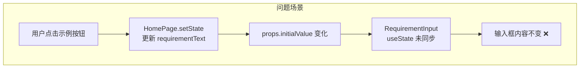
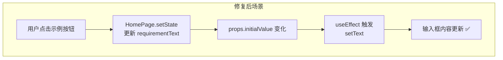
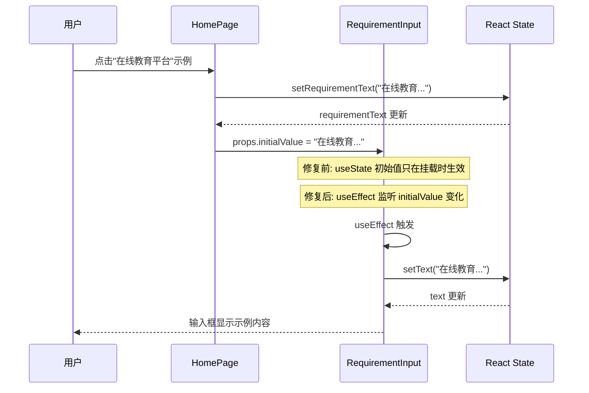
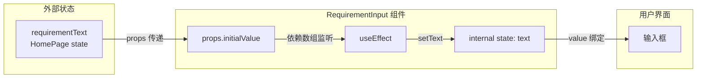
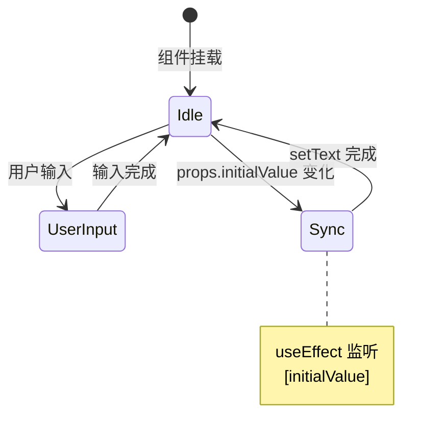

# 示例输入修复 (vibex-sample-input-fix) - 架构设计

**项目**: vibex-sample-input-fix
**版本**: 1.0
**架构师**: architect
**工作目录**: /root/.openclaw/vibex
**修复状态**: ✅ 已实现

---

## 1. Tech Stack (技术栈)

### 1.1 核心技术选型

| 组件 | 技术选型 | 版本 | 选择理由 |
|------|----------|------|----------|
| 前端框架 | React | 18.x | 项目已有技术栈 |
| 状态管理 | React useState | 内置 | 简单场景，无需引入额外状态管理 |
| 同步机制 | React useEffect | 内置 | 标准 React 模式，监听 props 变化 |
| 测试框架 | Jest + React Testing Library | 现有 | 项目已有测试基础设施 |
| 类型检查 | TypeScript | 5.x | 项目已有技术栈 |

### 1.2 无需引入的外部依赖

本修复为轻量级改动，无需引入任何新的外部依赖。

---

## 2. Architecture Diagram (架构图)

### 2.1 问题流程图



### 2.2 修复后流程图



### 2.3 组件交互图



### 2.4 数据流图



---

## 3. API Definitions (接口定义)

### 3.1 RequirementInput Props 接口

```typescript
// src/components/requirement-input/RequirementInput.tsx

export interface RequirementInputProps {
  /** 初始值 - 从外部传入，支持动态更新 */
  initialValue?: string;

  /** 值变更回调 - 内部 state 变化时触发 */
  onValueChange?: (value: string) => void;

  /** 生成回调 - 点击"开始生成"时触发 */
  onGenerate?: (value: string) => void;

  /** 自定义类名 */
  className?: string;

  /** 禁用诊断功能 */
  disableDiagnosis?: boolean;

  /** 禁用优化功能 */
  disableOptimization?: boolean;
}
```

### 3.2 组件内部状态接口

```typescript
// 组件内部状态
const [text, setText] = useState<string>(initialValue);

// 同步逻辑
useEffect(() => {
  setText(initialValue);
}, [initialValue]);
```

### 3.3 修复代码对比

#### 修复前

```typescript
export function RequirementInput({
  initialValue = '',
  // ...其他 props
}: RequirementInputProps) {
  // ❌ 问题: useState 初始值只在首次挂载时生效
  const [text, setText] = useState(initialValue);

  // 没有 useEffect 同步外部变化
  // ...
}
```

#### 修复后

```typescript
export function RequirementInput({
  initialValue = '',
  // ...其他 props
}: RequirementInputProps) {
  // useState 用于管理内部状态
  const [text, setText] = useState(initialValue);

  // ✅ 修复: 添加 useEffect 同步外部 initialValue 变化
  useEffect(() => {
    setText(initialValue);
  }, [initialValue]);

  // ...
}
```

---

## 4. Data Model (数据模型)

### 4.1 状态同步模型



### 4.2 数据流向

```
┌─────────────────────────────────────────────────────────────────┐
│                        HomePage                                   │
│  ┌─────────────────────────────────────────────────────────┐    │
│  │ const [requirementText, setRequirementText] = useState  │    │
│  └─────────────────────────────────────────────────────────┘    │
│                              │                                   │
│                              ▼                                   │
│              setRequirementText(sample.desc)                     │
│                              │                                   │
└──────────────────────────────│───────────────────────────────────┘
                               │
                               ▼ props.initialValue
┌─────────────────────────────────────────────────────────────────┐
│                    RequirementInput                               │
│  ┌─────────────────────────────────────────────────────────┐    │
│  │ const [text, setText] = useState(initialValue)          │    │
│  └─────────────────────────────────────────────────────────┘    │
│                              │                                   │
│                              ▼                                   │
│  ┌─────────────────────────────────────────────────────────┐    │
│  │ useEffect(() => {                                        │    │
│  │   setText(initialValue);  // ← 同步外部变化             │    │
│  │ }, [initialValue]);                                      │    │
│  └─────────────────────────────────────────────────────────┘    │
│                              │                                   │
│                              ▼                                   │
│                     <textarea value={text} />                    │
└─────────────────────────────────────────────────────────────────┘
```

### 4.3 Props 与 State 关系

| 层级 | 名称 | 类型 | 来源 | 说明 |
|------|------|------|------|------|
| Props | initialValue | string | 父组件 | 初始值/外部更新值 |
| State | text | string | 组件内部 | 实际显示值 |
| Derived | isDisabled | boolean | computed | text.trim() === '' |

---

## 5. Testing Strategy (测试策略)

### 5.1 测试框架

| 项目 | 选择 | 理由 |
|------|------|------|
| 测试框架 | Jest | 项目已有配置 |
| 测试库 | React Testing Library | 项目已有配置 |
| 覆盖率工具 | Jest 内置 | 无需额外配置 |
| 目标覆盖率 | **> 80%** | 核心逻辑全覆盖 |

### 5.2 测试目录结构

```
vibex-fronted/src/components/requirement-input/
├── RequirementInput.tsx
├── RequirementInput.module.css
└── __tests__/
    └── RequirementInput.test.tsx  # 补充测试
```

### 5.3 核心测试用例

```typescript
// RequirementInput.test.tsx

import { render, screen, fireEvent } from '@testing-library/react';
import { RequirementInput } from '../RequirementInput';

describe('RequirementInput - initialValue 同步', () => {
  
  // 测试 1: 基本同步功能
  it('应在 initialValue 变化时同步到内部 state', () => {
    const { rerender } = render(
      <RequirementInput initialValue="" />
    );
    
    const textarea = screen.getByRole('textbox');
    expect(textarea).toHaveValue('');
    
    // 模拟示例点击场景
    rerender(
      <RequirementInput initialValue="在线教育平台，支持课程管理和学员学习进度追踪" />
    );
    
    expect(textarea).toHaveValue('在线教育平台，支持课程管理和学员学习进度追踪');
  });

  // 测试 2: 连续变化场景
  it('应在连续多次 initialValue 变化时正确同步', () => {
    const { rerender } = render(
      <RequirementInput initialValue="示例1" />
    );
    
    expect(screen.getByRole('textbox')).toHaveValue('示例1');
    
    rerender(<RequirementInput initialValue="示例2" />);
    expect(screen.getByRole('textbox')).toHaveValue('示例2');
    
    rerender(<RequirementInput initialValue="示例3" />);
    expect(screen.getByRole('textbox')).toHaveValue('示例3');
  });

  // 测试 3: 空值同步
  it('应在 initialValue 变为空时清空输入框', () => {
    const { rerender } = render(
      <RequirementInput initialValue="有内容" />
    );
    
    expect(screen.getByRole('textbox')).toHaveValue('有内容');
    
    rerender(<RequirementInput initialValue="" />);
    expect(screen.getByRole('textbox')).toHaveValue('');
  });

  // 测试 4: 用户输入后外部更新覆盖
  it('用户输入后 initialValue 变化应覆盖用户输入', () => {
    const { rerender } = render(
      <RequirementInput initialValue="" />
    );
    
    const textarea = screen.getByRole('textbox');
    
    // 用户输入
    fireEvent.change(textarea, { target: { value: '用户自己的输入' } });
    expect(textarea).toHaveValue('用户自己的输入');
    
    // 点击示例（外部更新）
    rerender(<RequirementInput initialValue="示例覆盖" />);
    expect(textarea).toHaveValue('示例覆盖');
  });

  // 测试 5: 生成按钮功能不受影响
  it('开始生成按钮应使用当前 text 值', () => {
    const handleGenerate = jest.fn();
    
    render(
      <RequirementInput 
        initialValue="测试需求" 
        onGenerate={handleGenerate}
      />
    );
    
    const generateButton = screen.getByText('✨ 开始生成');
    fireEvent.click(generateButton);
    
    expect(handleGenerate).toHaveBeenCalledWith('测试需求');
  });

  // 测试 6: onValueChange 回调正常工作
  it('onValueChange 应在用户输入时触发', () => {
    const handleValueChange = jest.fn();
    
    render(
      <RequirementInput 
        initialValue="" 
        onValueChange={handleValueChange}
      />
    );
    
    const textarea = screen.getByRole('textbox');
    fireEvent.change(textarea, { target: { value: '新内容' } });
    
    expect(handleValueChange).toHaveBeenCalledWith('新内容');
  });
});

describe('RequirementInput - 边界情况', () => {
  
  // 测试 7: undefined 处理
  it('应正确处理 undefined initialValue', () => {
    render(<RequirementInput />);
    
    const textarea = screen.getByRole('textbox');
    expect(textarea).toHaveValue('');
  });

  // 测试 8: 禁用生成按钮
  it('输入为空时应禁用生成按钮', () => {
    render(<RequirementInput initialValue="" />);
    
    const generateButton = screen.getByText('✨ 开始生成');
    expect(generateButton).toBeDisabled();
  });

  // 测试 9: 有内容时启用生成按钮
  it('输入有内容时应启用生成按钮', () => {
    const { rerender } = render(<RequirementInput initialValue="" />);
    
    const generateButton = screen.getByText('✨ 开始生成');
    expect(generateButton).toBeDisabled();
    
    rerender(<RequirementInput initialValue="有内容" />);
    expect(generateButton).not.toBeDisabled();
  });
});
```

### 5.4 运行测试

```bash
# 运行 RequirementInput 组件测试
npm test -- --testPathPattern="RequirementInput"

# 运行并生成覆盖率报告
npm test -- --coverage --testPathPattern="RequirementInput"

# 监听模式
npm test -- --watch --testPathPattern="RequirementInput"
```

### 5.5 覆盖率要求

| 指标 | 目标 | 说明 |
|------|------|------|
| Statements | > 80% | 所有语句覆盖 |
| Branches | > 75% | 条件分支覆盖 |
| Functions | > 80% | 函数覆盖 |
| Lines | > 80% | 行覆盖 |

---

## 6. 风险评估与缓解

### 6.1 已识别风险

| 风险 | 影响 | 可能性 | 等级 | 缓解措施 |
|------|------|--------|------|----------|
| ESLint 警告 | 代码规范警告 | 高 | 🟢 Low | 可接受或添加 eslint-disable |
| 用户输入被覆盖 | 中等体验影响 | 低 | 🟡 Medium | 可接受（用户主动点击示例） |
| 空值同步 | 清空用户输入 | 低 | 🟢 Low | 正常行为 |
| 快速连续更新 | 多次渲染 | 低 | 🟢 Low | React 批处理优化 |

### 6.2 ESLint 处理建议

```typescript
// 方案 1: 添加 eslint-disable 注释（推荐）
useEffect(() => {
  setText(initialValue);
  // eslint-disable-next-line react-hooks/exhaustive-deps
}, [initialValue]);

// 方案 2: 包含 text 依赖（可选，会改变行为）
useEffect(() => {
  if (initialValue !== text) {
    setText(initialValue);
  }
}, [initialValue, text]);
```

---

## 7. 替代方案评估

### 7.1 方案对比

| 方案 | 实现 | 优点 | 缺点 | 推荐度 |
|------|------|------|------|--------|
| **A. useEffect 同步** | 当前实现 | 简单、直观、改动最小 | ESLint 警告 | ⭐⭐⭐⭐⭐ |
| **B. 完全受控组件** | 父组件管理状态 | 数据流清晰 | 需改动调用方，改动大 | ⭐⭐⭐ |
| **C. key 强制重挂载** | key={initialValue} | 绝对同步 | 性能开销、状态丢失 | ⭐⭐ |
| **D. useDerivedState Hook** | 自定义 Hook | 封装良好 | 需额外实现 | ⭐⭐⭐ |

### 7.2 推荐方案

**当前方案 A (useEffect 同步)** 是最佳选择：
- 改动最小（仅 3 行代码）
- 符合 React 模式
- 无需修改调用方
- 性能开销可忽略

---

## 8. 实施检查清单

### 8.1 ✅ 已完成

- [x] 问题根因分析
- [x] 修复代码实现
- [x] 功能验证（手动测试）
- [x] 提交代码

### 8.2 待完成

- [ ] 补充单元测试
- [ ] 解决 ESLint 警告（可选）
- [ ] Code Review
- [ ] 合并到主分支

---

## 9. 未来优化建议

### 9.1 短期 (P1)

1. **补充测试用例**: 添加 `initialValue` 动态变化测试
2. **处理 ESLint 警告**: 添加注释或调整依赖数组

### 9.2 长期 (P2)

1. **考虑受控组件模式**:
   ```typescript
   // 如需更精细控制，可改为完全受控
   interface ControlledProps {
     value: string;           // 去掉 initialValue
     onChange: (v: string) => void;
   }
   ```

2. **提取同步逻辑为 Hook**:
   ```typescript
   // hooks/useDerivedState.ts
   export function useDerivedState<T>(externalValue: T): [T, (v: T) => void] {
     const [state, setState] = useState(externalValue);
     
     useEffect(() => {
       setState(externalValue);
     }, [externalValue]);
     
     return [state, setState];
   }
   ```

---

## 10. 总结

### 10.1 修复概述

| 项目 | 状态 |
|------|------|
| 问题 | 首页示例按钮点击后需求输入框未填充 |
| 根因 | useState 初始值只在首次挂载时生效 |
| 解决方案 | 添加 useEffect 同步外部 initialValue 变化 |
| 代码改动 | 3 行 |
| 风险等级 | 低 |

### 10.2 技术债务

| 项目 | 优先级 | 说明 |
|------|--------|------|
| 单元测试补充 | P0 | 需覆盖 initialValue 动态变化场景 |
| ESLint 警告处理 | P2 | 可选，不影响功能 |

---

**产出物**: `docs/vibex-sample-input-fix/architecture.md`
**验证**: `test -f /root/.openclaw/vibex/docs/vibex-sample-input-fix/architecture.md`