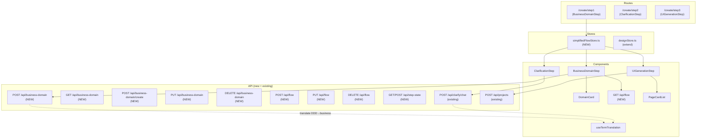
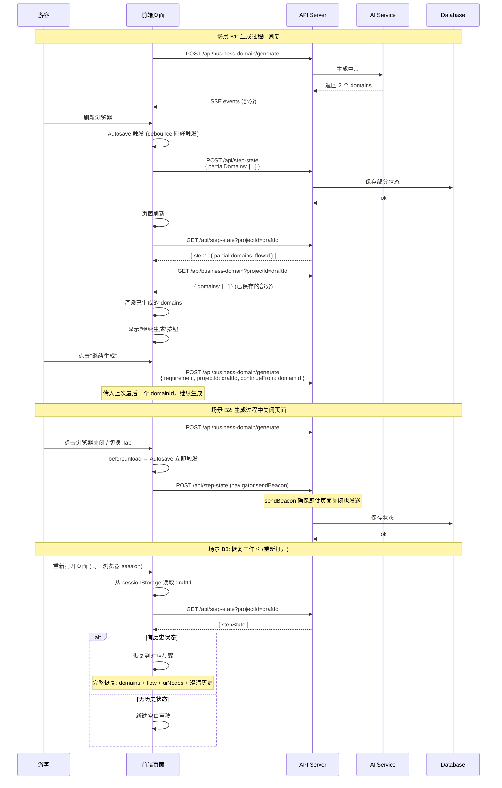
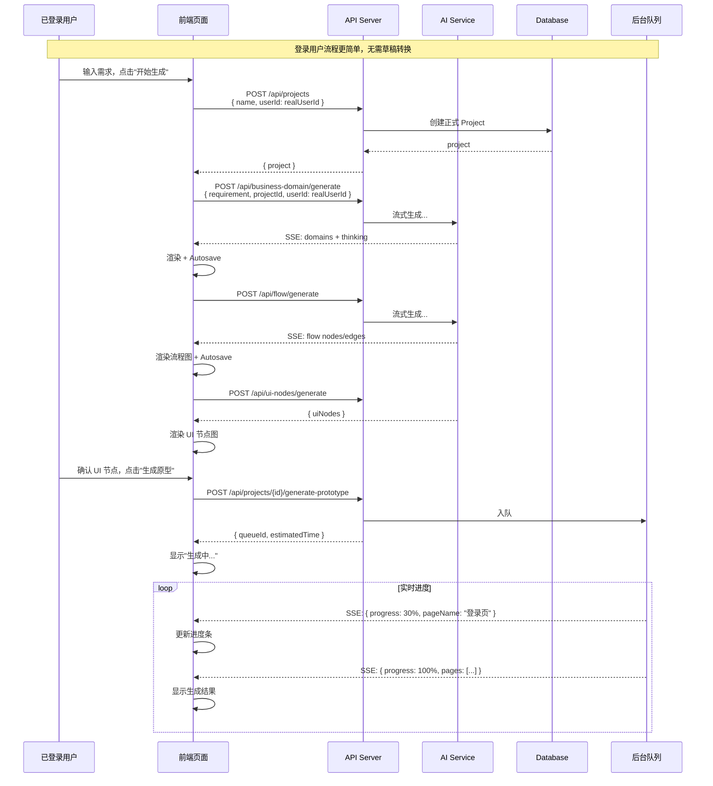

# Architecture: Vibex Simplified Flow (5→3 Steps)

**Project**: `vibex-simplified-flow`  
**Architect**: architect  
**Date**: 2026-03-23  
**Status**: design-architecture (revised)  
**Revision**: Complete API + DataStructure 清单 (per 小羊 驳回要求)

---

## ⚠️ Cloudflare Worker 路由约束

> **约束**: Cloudflare Worker 不支持 Next.js 动态路由 `[id]`
> 
> ❌ 避免: `/api/projects/[id]`  
> ✅ 改为: `/api/projects?id=xxx`

所有 API 遵循此约束，CRUD 操作用 `?id=xxx` 查询参数。

---

## 1. Context & Problem

### Current State
- **5-step DDD flow**: bounded-context → clarification → business-flow → ui-generation → domain-model
- Problems: DDD jargon confuses non-expert users; 5 steps too long; no user editing

### Goals
1. Compress to **3 steps** with business-language UI
2. User can edit nodes, check features
3. Backward compatible via Feature Flag

### Step Mapping

```
OLD (5 steps)                          NEW (3 steps)
─────────────────                      ────────────────
Step 1: bounded-context        →       Step 1: 业务领域定义
Step 2: clarification         →       Step 2: 需求澄清 (unchanged)
Step 3: business-flow          →       Step 3: UI 生成
Step 4: ui-generation         ↗
Step 5: domain-model         ↗
```

---

## 2. Architecture

### 2.1 Component Architecture



### 2.2 Data Flow (游客模式 — Session 标识)

```
游客输入需求
    ↓
创建草稿项目（sessionId 作为临时 userId）
    ↓
点击"开始生成"
    ↓
POST /api/business-domain/generate (SSE 流式)
    ↓
流式展示领域情况（核心域/支撑域/通用域）
    ↓
中止/等待/关闭/刷新 → Autosave
    ↓
恢复 → 继续生成
    ↓
生成领域关联业务流程（POST /api/flow/generate）
    ↓
展示核心域流程（询问：是否展示关联通用域/支撑域流程？）
    ↓
勾选/编辑 → Autosave
    ↓
根据业务流程生成 UI 节点图
    ↓
勾选/编辑/自然语言录入 → Autosave
    ↓
创建正式项目（游客 → 提示登录 / 已登录用户）
    ↓
后台队列：按 UI 节点依次生成 JSON DSL → 页面原型
```

**关键变化：**
- 草稿项目用 `sessionId` 标识，登录后关联 `userId`
- 领域生成后**询问是否展示支撑域/通用域流程**（用户可控）
- **Step3 变为后台异步队列**，不阻塞前端
- Autosave 贯穿全程，支持中断恢复

---

### 2.3 API Sequence Diagram (时序图)

#### 场景 A：游客完整流程（无需登录）

```mermaid
sequenceDiagram
    participant U as 游客 (前端)
    participant F as 前端页面
    participant API as API Server
    participant AI as AI Service
    participant DB as Database
    participant Q as 后台队列

    rect rgb(240, 248, 255)
        Note over U,Q: 阶段 0: 草稿项目创建
        U->>F: 输入需求描述
        F->>F: 生成 sessionId (UUID/cookies)
        F->>API: POST /api/projects<br/>{ name: "草稿", userId: sessionId }
        API->>DB: 创建 Project (sessionId as userId)
        DB-->>API: draftProject
        API-->>F: { project with draftId }
        Note over F: 跳转到 /create/step1<br/>draftId 存入 sessionStorage
    end

    rect rgb(255, 250, 240)
        Note over U,AI: 阶段 1: 流式生成业务领域
        U->>F: 点击"开始生成"
        F->>API: POST /api/business-domain/generate<br/>{ requirement, projectId: draftId, userId: sessionId }
        API->>AI: 调用 AI
        loop 流式返回
            AI-->>API: thinking event
            API-->>F: SSE: { type: 'thinking', content: '...' }
            F->>F: 渲染 AI 思考过程
            AI-->>API: domain event (核心域)
            API-->>F: SSE: { type: 'domain', domain: {...}, type: 'core' }
            F->>F: 渲染核心域 DomainCard (高亮)
            AI-->>API: domain event (支撑域)
            API-->>F: SSE: { type: 'domain', domain: {...}, type: 'supporting' }
            F->>F: 渲染支撑域 DomainCard (次级显示)
            AI-->>API: domain event (通用域)
            API-->>F: SSE: { type: 'domain', domain: {...}, type: 'generic' }
            F->>F: 渲染通用域 DomainCard (折叠)
        end
        AI-->>API: done
        API->>DB: 存储所有 domains
        DB-->>API: ok
        API-->>F: SSE: { type: 'done', domains: [...] }
        F->>F: 渲染完整列表，Autosave

        F->>API: POST /api/step-state<br/>{ projectId: draftId, currentStep: 1, step1 }
        API-->>F: { updatedAt }
    end

    rect rgb(255, 255, 230)
        Note over U,AI: 阶段 1.5: 生成业务流程
        U->>F: 点击"生成流程"
        F->>API: POST /api/flow/generate<br/>{ domainIds, requirement, userId: sessionId }
        API->>AI: 调用 AI (仅核心域 nodes)
        AI-->>API: SSE stream (核心域流程)
        API-->>F: SSE: { type: 'node' }, { type: 'edge' }
        F->>F: 渲染 ReactFlow (核心域流程)
        AI-->>API: done
        API->>DB: 存储 flow
        API-->>F: SSE: { type: 'done' }

        F->>F: 弹窗询问: "是否展示支撑域/通用域流程？"
        alt 用户选择展示支撑域
            U->>F: 勾选"展示支撑域"
            F->>API: POST /api/flow/generate<br/>{ domainIds: [支撑域ids] }
            API-->>F: 补充支撑域 nodes/edges
            F->>F: 追加到 ReactFlow
        else 用户选择仅展示核心域
            Note over F: 保持当前流程图
        end

        F->>API: POST /api/step-state<br/>{ step1.flowId, currentStep: 1 }
        API-->>F: ok
    end

    rect rgb(255, 248, 255)
        Note over U,F: 阶段 2: 勾选/编辑业务流程
        U->>F: 勾选关心的流程节点
        U->>F: 编辑节点名称/连线
        U->>F: 自然语言录入补充要求
        loop Autosave (debounce 3s)
            F->>API: POST /api/step-state<br/>{ projectId: draftId, currentStep: 1, step1 }
            API-->>F: { updatedAt }
        end
        U->>F: 刷新页面
        F->>API: GET /api/step-state?projectId=draftId
        API-->>F: { stepState }
        F->>F: 恢复流程图编辑状态
        Note over F: 所有编辑完整恢复
    end

    rect rgb(230, 255, 240)
        Note over U,Q: 阶段 3: UI 节点图 + 创建正式项目
        U->>F: 点击"生成 UI"
        F->>API: POST /api/ui-nodes/generate<br/>{ flow, requirement, userId: sessionId }
        API->>AI: 调用 AI
        AI-->>API: uiNodes[]
        API-->>F: { uiNodes: [...] }
        F->>F: 渲染 UI 节点图 (可勾选/编辑)
        loop Autosave
            F->>API: POST /api/step-state<br/>{ currentStep: 2, step2: { uiNodes, annotations } }
            API-->>F: ok
        end

        U->>F: 点击"创建项目"
        F->>F: 检测: 已登录?

        alt 游客未登录
            F->>U: 提示: "请登录以保存项目"
            U->>F: 登录/注册
            F->>API: POST /api/auth/login<br/>或 POST /api/auth/register
            API-->>F: { token, user }
            F->>API: POST /api/projects/convert<br/>{ draftId, userId: realUserId }
            API->>DB: UPDATE project: sessionId → userId
            DB-->>API: ok
            API-->>F: { project with real userId }
            Note over F: 草稿 → 正式项目，session 数据不丢失
        else 已登录
            F->>API: POST /api/projects<br/>{ name, userId: realUserId, data: draftId }
            API->>DB: 创建正式 Project，复制草稿数据
            DB-->>API: project
            API-->>F: { project }
        end

        F->>F: 跳转项目详情页，显示"生成中..."

        F->>Q: 触发后台生成队列
        Note over Q: 后台异步处理
        Q->>Q: 按 UI 节点顺序<br/>生成 JSON DSL
        Q->>Q: 依次生成页面原型
        Q->>F: WebSocket/SSE: { pageGenerated, progress }
        F->>F: 实时更新进度
    end
```



#### 场景 B：游客中断 & 恢复



#### 场景 C：登录用户流程



#### API 调用总览表（按新流程）

| 序号 | 阶段 | API | 作用 | 触发时机 | 游客 | 登录 |
|------|------|-----|------|---------|------|------|
| 1 | 草稿 | `POST /api/projects` | 创建草稿项目 | 首次输入需求 | ✅ sessionId | ❌ |
| 2 | 草稿 | `GET /api/step-state?projectId=` | 获取草稿状态 | 页面加载 | ✅ | ❌ |
| 3 | Step1-A | `POST /api/business-domain/generate` | 流式生成领域 | 点击"开始生成" | ✅ | ✅ |
| 4 | Step1-A | `GET /api/business-domain?projectId=` | 获取领域列表 | 页面加载/恢复 | ✅ | ✅ |
| 5 | Step1-A | `PUT /api/business-domain?id=` | 编辑领域 | 用户编辑 | ✅ | ✅ |
| 6 | Step1-A | `POST /api/step-state` | Autosave | 数据变更后 3s | ✅ | ✅ |
| 7 | Step1-B | `POST /api/flow/generate` | 流式生成流程 | 点击"生成流程" | ✅ | ✅ |
| 8 | Step1-B | `GET /api/flow?projectId=` | 获取流程图 | 恢复/加载 | ✅ | ✅ |
| 9 | Step1-B | `PUT /api/flow?id=` | 编辑流程节点 | 用户拖动/编辑 | ✅ | ✅ |
| 10 | Step1-B | `POST /api/flow/generate`<br/>(补充支撑域) | 补充域流程 | 用户选择展示支撑域 | ✅ | ✅ |
| 11 | Step1-B | `POST /api/step-state` | Autosave | 数据变更后 3s | ✅ | ✅ |
| 12 | Step2 | `POST /api/ui-nodes/generate` | 生成 UI 节点图 | 点击"生成 UI" | ✅ | ✅ |
| 13 | Step2 | `POST /api/step-state` | Autosave | UI 节点编辑后 | ✅ | ✅ |
| 14 | 登录 | `POST /api/auth/login` | 登录 | 游客点击"创建项目" | ✅ | ❌ |
| 15 | 登录 | `POST /api/auth/register` | 注册 | 游客选择注册 | ✅ | ❌ |
| 16 | 转换 | `POST /api/projects/convert` | 草稿转正式项目 | 登录后 | ✅ | ❌ |
| 17 | 正式 | `POST /api/projects` | 创建正式项目 | 已登录用户直接创建 | ❌ | ✅ |
| 18 | 生成 | `POST /api/ui-nodes/generate`<br/>(确认) | 确认 UI 节点 | 点击"生成原型" | ✅ | ✅ |
| 19 | 后台 | WebSocket/SSE | 实时进度推送 | 原型生成中 | ✅ | ✅ |
| 20 | 清理 | `DELETE /api/step-state?projectId=` | 清除草稿状态 | 项目创建完成后 | ✅ | ✅ |

---


---

## 2.4 专业架构增强索引

> 详细设计请查阅对应章节或 Spec 文件。

| 模块 | 详细设计位置 | 核心要点 |
|------|-------------|---------|
| Session 管理 | § 2.4.1（保留） | sessionId 格式、Cookie 安全、草稿清理 |
| Autosave 版本控制 | [SPEC-04](specs/SPEC-04-step-state.md) | 乐观锁 + version + changeLog |
| 后台队列系统 | § 2.4.3（保留） | BullMQ + Redis + SSE 进度 |
| 速率限制 | § 2.4.4（保留） | 分层限流 + 熔断器 |
| 错误恢复 | § 2.4.5（保留） | 6 类错误 × 恢复策略 |
| 数据一致性 | [SPEC-05](specs/SPEC-05-project-convert.md) | Prisma Transaction 原子转换 |
| 支撑域展示交互 | § 2.4.7（保留） | 核心/支撑/通用域颜色规范 |
| 自然语言集成 | § 2.4.8（保留） | UINodeAnnotation + AI 理解 |

---

## 3. API 契约索引 ⭐

> **主文档仅作为索引**，每个 API 的完整规格说明请查阅对应的 Spec 文件。
>
> 路径: `docs/vibex-simplified-flow/specs/SPEC-XX-*.md`

### 3.1 生成类 API（AI，流式）

| API | Spec | 流式 | 功能 |
|-----|------|------|------|
| `POST /api/business-domain/generate` | [SPEC-01](specs/SPEC-01-business-domain-generate.md) | SSE | 流式生成业务领域（核心/支撑/通用） |
| `POST /api/flow/generate` | [SPEC-02](specs/SPEC-02-flow-generate.md) | SSE | 流式生成业务流程（基于 domains） |
| `POST /api/ui-nodes/generate` | [SPEC-08](specs/SPEC-08-ui-nodes-generate.md) | — | 根据流程图生成 UI 节点 |

### 3.2 数据操作 API

| API | Spec | 功能 |
|-----|------|------|
| `GET /api/projects?id=&include=snapshot` | [SPEC-03](specs/SPEC-03-project-snapshot.md) | 完整快照（所有项目数据的单一入口） |
| `POST /api/step-state` | [SPEC-04](specs/SPEC-04-step-state.md) | Autosave（debounce 3s + 乐观锁） |
| `GET /api/step-state?projectId=` | [SPEC-04](specs/SPEC-04-step-state.md) | 获取步骤状态 |
| `DELETE /api/step-state?projectId=` | [SPEC-04](specs/SPEC-04-step-state.md) | 清除步骤状态 |

### 3.3 项目管理 API

| API | Spec | 功能 |
|-----|------|------|
| `POST /api/projects` | [现有](specs/) | 创建项目 |
| `GET /api/projects` | [现有](specs/) | 列表 |
| `GET /api/projects?id=` | [现有](specs/) | 详情 |
| `PUT /api/projects?id=` | [现有](specs/) | 更新 |
| `DELETE /api/projects?id=` | [现有](specs/) | 删除 |
| `POST /api/projects/convert` | [SPEC-05](specs/SPEC-05-project-convert.md) | 草稿转正式（sessionId → userId） |
| `POST /api/projects/clone` | [SPEC-06](specs/SPEC-06-project-clone.md) | 克隆项目（模板市场） |
| `POST /api/projects?id=&action=rollback` | [SPEC-07](specs/SPEC-07-project-rollback.md) | 版本回滚（Copy-on-Write） |

### 3.4 模板 & 历史 API

| API | Spec | 功能 |
|-----|------|------|
| `GET /api/templates` | [SPEC-09](specs/SPEC-09-templates.md) | 模板市场列表 |
| `GET /api/projects?id=&include=history` | [SPEC-03](specs/SPEC-03-project-snapshot.md) | 变更历史（分页） |

### 3.5 现有 API（保持兼容）

| API | 模块 | 说明 |
|-----|------|------|
| `POST /api/auth/login` | Auth | 登录 |
| `POST /api/auth/register` | Auth | 注册 |
| `POST /api/auth/logout` | Auth | 登出 |
| `POST /api/clarify/chat` | Clarify | 需求澄清（交互式） |
| `POST /api/ai-ui-generation` | UI | AI UI 代码生成（流式） |
| `POST /api/chat` | Chat | 通用聊天（流式） |
| `POST /api/domain-model` | Domain | 类图生成 |
| `GET/POST/PUT/DELETE /api/flow` | Flow | Flow CRUD（无动态路由） |
| `GET/POST/PUT/DELETE /api/pages` | Pages | Page CRUD |

### 3.6 Spec 文件总览

| 文件 | 行数 | 负责人 | 状态 |
|------|------|--------|------|
| [SPEC-01](specs/SPEC-01-business-domain-generate.md) | ~380 | dev | draft |
| [SPEC-02](specs/SPEC-02-flow-generate.md) | ~270 | dev | draft |
| [SPEC-03](specs/SPEC-03-project-snapshot.md) | ~325 | dev | draft |
| [SPEC-04](specs/SPEC-04-step-state.md) | ~316 | dev | draft |
| [SPEC-05](specs/SPEC-05-project-convert.md) | ~228 | dev | draft |
| [SPEC-06](specs/SPEC-06-project-clone.md) | ~233 | dev | draft |
| [SPEC-07](specs/SPEC-07-project-rollback.md) | ~204 | dev | draft |
| [SPEC-08](specs/SPEC-08-ui-nodes-generate.md) | ~197 | dev | draft |
| [SPEC-09](specs/SPEC-09-templates.md) | ~176 | dev | draft |
| [SPEC-template](specs/SPEC-template.md) | ~183 | — | 模板 |
| [INDEX](specs/INDEX.md) | ~96 | — | 索引 |

**总 Spec 行数**: ~2734 行

---

## 4. 数据结构索引

> **完整类型定义**请查阅对应 Spec 文件。

### 4.1 核心实体索引

| 实体 | Spec | 说明 |
|------|------|------|
| `User` | — | 用户（现有） |
| `Project` | [SPEC-03](specs/SPEC-03-project-snapshot.md) | 扩展: status, version, isTemplate |
| `Page` | — | 页面（现有） |
| `FlowData` | [SPEC-02](specs/SPEC-02-flow-generate.md) | 流程图 |
| `BusinessDomain` | [SPEC-01](specs/SPEC-01-business-domain-generate.md) | 业务领域 |
| `Feature` | [SPEC-01](specs/SPEC-01-business-domain-generate.md) | 功能项 |
| `UINode` | [SPEC-08](specs/SPEC-08-ui-nodes-generate.md) | UI 节点 |
| `StepState` | [SPEC-04](specs/SPEC-04-step-state.md) | 步骤状态（含 version + changeLog） |
| `ChangeEntry` | [SPEC-04](specs/SPEC-04-step-state.md) | 变更历史条目 |
| `ProjectSnapshot` | [SPEC-03](specs/SPEC-03-project-snapshot.md) | **完整快照**（一站式数据结构） |
| `VisitorSession` | [SPEC-05](specs/SPEC-05-project-convert.md) | 游客 session |

### 4.2 ProjectSnapshot — 完整数据参考

> 掌握此类型即可处理项目所有操作。详见 [SPEC-03](specs/SPEC-03-project-snapshot.md) § 4.0.1。

```
ProjectSnapshot
├── identity       → project + version + isTemplate
├── progress       → currentStep + status
├── step1          → domains + flow + 勾选项 + 中断信息
├── step2          → uiNodes + annotations
├── step3          → 原型生成状态 + 队列
├── history         → ChangeEntry[]（可回滚）
└── meta           → 统计元数据
```

---

## 5. 数据库变更索引

> 完整 Prisma Schema 请查阅 [SPEC-03](specs/SPEC-03-project-snapshot.md) § Prisma Schema。

**新增表:**

| 表名 | 说明 | 关联 |
|------|------|------|
| `BusinessDomain` | 业务领域 | Project |
| `Feature` | 功能项 | BusinessDomain |
| `StepState` | 步骤状态（含 version + changeLog） | Project |
| `UINode` | UI 节点 | Project, FlowData |
| `PrototypeGenerationJob` | 原型生成任务 | Project |

**Project 扩展字段:**
- `status: String` — `draft | active | converted | archived`
- `parentDraftId: String?` — 转换后关联原草稿
- `clonedFrom: String?` — 克隆来源

---

## 6. 术语翻译索引

> 详见 `specs/term-map.md`

| DDD 术语 | 业务语言 |
|---------|---------|
| bounded-context | 业务领域 |
| core-domain | 核心业务 |
| supporting-domain | 支撑业务 |
| aggregate-root | 核心实体 |
| domain-event | 业务事件 |
| business-flow | 业务流程 |

---

## 7. 测试策略索引

> 详见 [INDEX](specs/INDEX.md) § 验收流程

| 测试类型 | Spec | 说明 |
|---------|------|------|
| 单元测试 | 各 SPEC | Jest + API 测试 |
| API 稳定性 | 各 SPEC | curl 验证命令 |
| E2E | SPEC-01~09 | Cypress 端到端 |
| 回归 | — | Feature Flag = false 旧流程 |

---


## 8. Implementation Phases

### Phase 1: Infrastructure (P0)
| Task | Agent | Output |
|------|-------|--------|
| Create `termMap.ts` + `useTermTranslation.ts` | dev | Translation layer |
| Create `simplifiedFlowStore.ts` | dev | Zustand store |
| Add Feature Flag `ENABLE_SIMPLIFIED_FLOW` | dev | env config |
| Create Prisma migration for new tables | dev | DB schema |
| Create `useAutosave` hook (debounce 3s) | dev | Autosave hook |

### Phase 2: API Contracts (P0) — **Test API first!**
| Task | Agent | Output |
|------|-------|--------|
| Implement `POST /api/business-domain/generate` (SSE streaming, Step A) | dev | New endpoint |
| Implement `POST /api/flow/generate` (SSE streaming, Step B) | dev | New endpoint |
| Implement `GET/PUT/DELETE /api/business-domain` (CRUD) | dev | CRUD endpoints |
| Implement `GET/POST/DELETE /api/step-state` (autosave) | dev | Step state endpoints |
| Implement `GET/POST/PUT/DELETE /api/flow` (no dynamic route) | dev | Flow endpoints |
| AbortController 中断机制 | dev | User can interrupt generation |
| Test all new APIs with curl + boundary cases | tester | API verified | |

### Phase 3: Step 1 Components (P0)
| Task | Agent | Output |
|------|-------|--------|
| Create `/create/step1` route | dev | BusinessDomainStep |
| Create `DomainCard` component | dev | Domain display |
| Create `FlowChart` (ReactFlow) | dev | Flow visualization |
| Node edit + feature check | dev | Interactive editing |

### Phase 4: Step 2 & 3 + Integration (P1)
| Task | Agent | Output |
|------|-------|--------|
| Create `/create/step2`, `/create/step3` routes | dev | Steps wired |
| Step data persistence (Zustand → API) | dev | Store → API |
| Old routes → redirect or flag guard | dev | Backward compat |

### Phase 5: E2E + Regression (P0)
| Task | Agent | Output |
|------|-------|--------|
| Cypress E2E for 3-step flow | tester | Full coverage |
| Regression: old flow still works | tester | Flag=false |
| Route audit: no `[id]` in production APIs | reviewer | 0 violations |

---

## 9. Trade-offs

| Decision | Trade-off |
|----------|-----------|
| 两步生成 vs 并行生成 | ✅ 用户可见 AI 思考过程，可随时中断；⚠️ 需要两次 API 调用 |
| Autosave vs 手动保存 | ✅ 数据防丢失，类似 Google Docs；⚠️ 额外的 API 请求 |
| 全局 Feature Flag (统一) | ✅ 简单，一处配置全站生效；⚠️ 用户无法独立选择 |
| Feature 过滤 flow | ✅ 用户只看到关心的流程；⚠️ 后端需要按 domainIds 筛选 |
| 前端翻译层 vs 后端翻译 | ✅ API 契约不变；⚠️ 前端代码增多 |
| Query params `?id=xxx` vs dynamic `[id]` | ✅ Cloudflare Worker 兼容；⚠️ URL 稍长 |
| 乐观锁 (updatedAt) | ✅ 并发修改安全；⚠️ 前端需要处理 409 冲突 |

---

## 10. Verification Checklist

### API Contract (关键验证)
- [ ] `POST /api/business-domain/generate` SSE stream 返回 `thinking` / `domain` / `done` 事件
- [ ] `POST /api/business-domain/generate` 中断后，AI 停止生成（AbortController）
- [ ] `POST /api/business-domain/generate` 生成后 domains 自动存储到 DB
- [ ] `POST /api/flow/generate` 基于已保存的 domains 生成 flow（支持 feature 过滤）
- [ ] `GET /api/step-state?projectId=xxx` 返回当前步骤状态（首次返回 `data: null`）
- [ ] `POST /api/step-state` autosave 后服务端返回 `updatedAt`
- [ ] `POST /api/step-state` 乐观锁冲突返回 409
- [ ] `GET /api/flow?flowId=xxx` / `?projectId=xxx` 无动态路由
- [ ] `PUT /api/flow?id=xxx` 更新 nodes/edges 后数据持久化

### 边界校验验证
- [ ] 必填字段缺失 → 400 + 具体字段名
- [ ] 无效枚举值 → 400 + 有效值列表
- [ ] 超长字段 → 400 + 最大长度
- [ ] 越权访问 → 403
- [ ] 资源不存在 → 404
- [ ] 并发修改冲突 → 409 + serverUpdatedAt

### 流式生成验证
- [ ] AI 思考过程流式可见（`thinking` 事件）
- [ ] 逐个 domain 流式返回（`domain` 事件 + index）
- [ ] 用户中断后新请求正常处理
- [ ] `generationTime` 准确反映耗时

### Autosave 验证
- [ ] 前端数据变更后 3s 内自动 POST
- [ ] 刷新页面后数据恢复（GET → setState）
- [ ] 乐观锁正确处理（409 时提示用户刷新）

### 权限验证
- [ ] 用户只能操作自己 userId 下的资源
- [ ] JWT token 缺失 → 401
- [ ] JWT token 过期 → 401
- [ ] userId 与 JWT 不匹配 → 403

### Feature Flag (全局)
- [ ] `ENABLE_SIMPLIFIED_FLOW=true` → 新 3 步流程
- [ ] `ENABLE_SIMPLIFIED_FLOW=false` → 旧 5 步流程（回归）

### Cloudflare Worker 合规
- [ ] 新 API 文件中无 `[id]` 动态路由
- [ ] `grep -r '\[.*\]' src/app/api/' 返回 0

### 测试覆盖率
- [ ] `npm test -- --testPathPattern="api"` 通过
- [ ] Cypress E2E 覆盖完整 3 步流程
- [ ] `npm run build` 成功
- [ ] 所有 curl 示例验证通过
