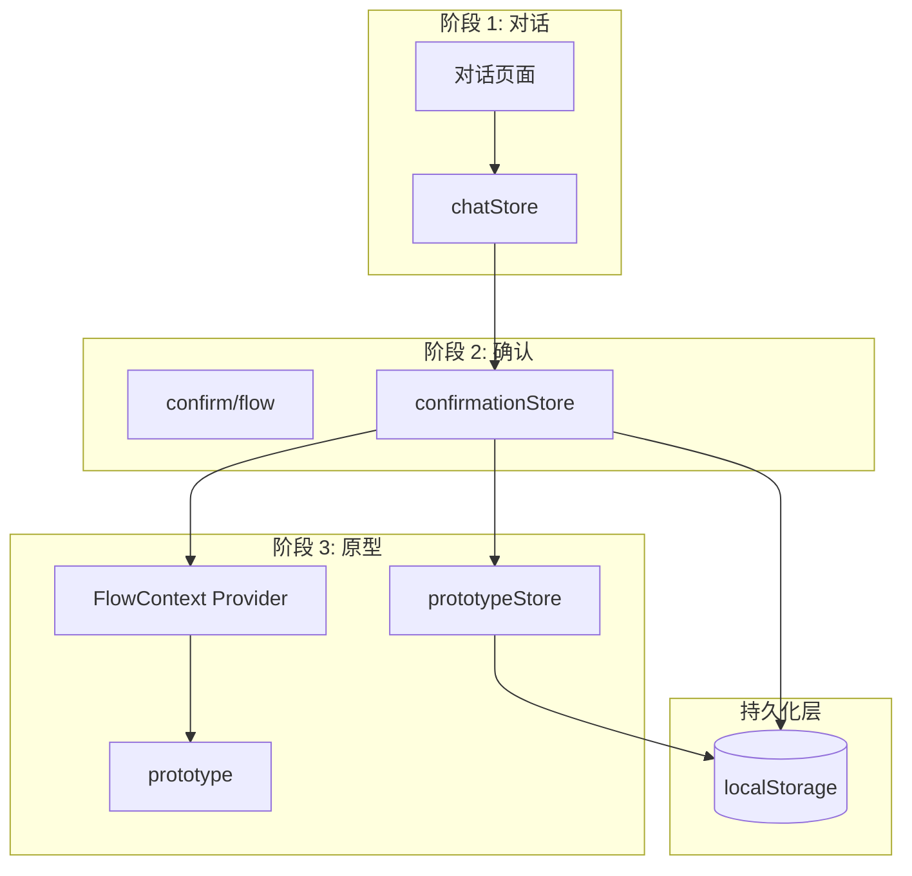
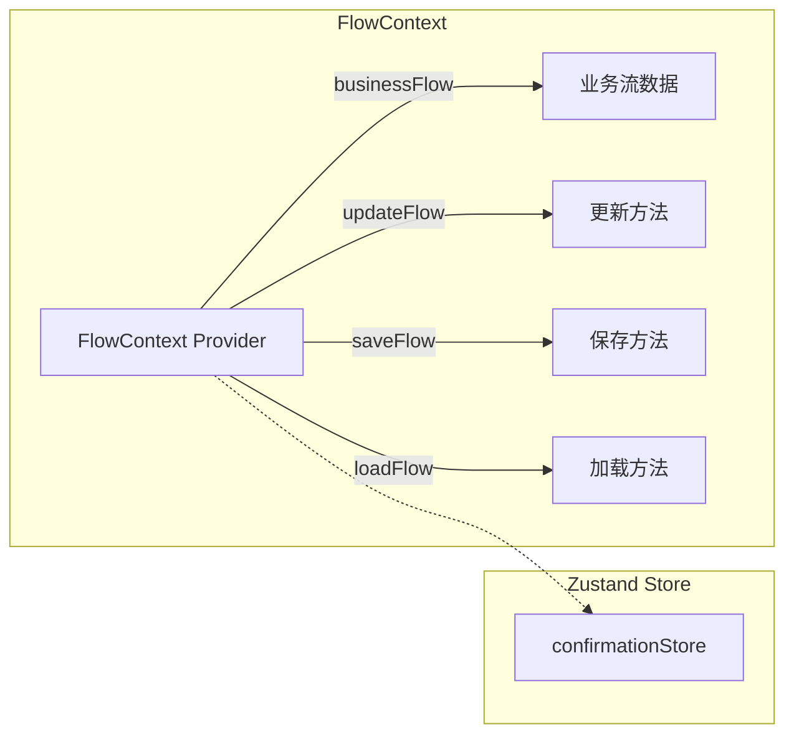
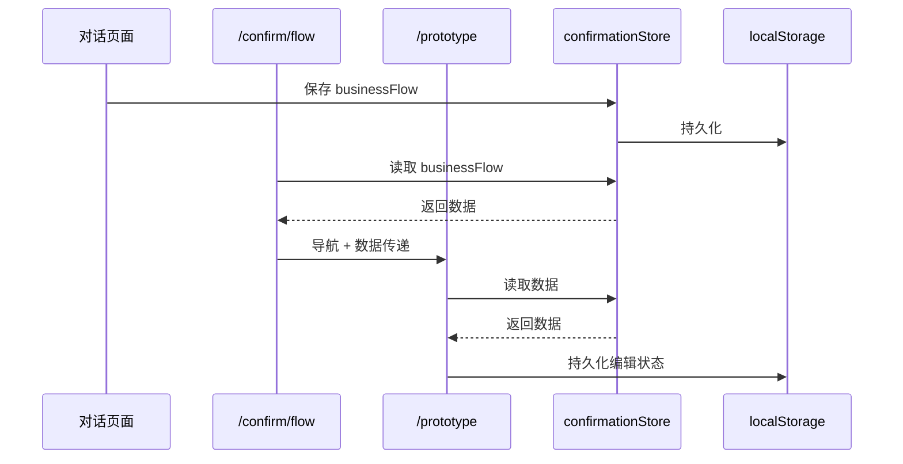

# 阶段衔接与 FlowContext 架构设计

**项目**: vibex-stage-integration  
**架构师**: Architect Agent  
**日期**: 2026-03-18  
**状态**: ✅ 设计完成

---

## 一、技术栈

| 技术 | 用途 |
|------|------|
| React 18.x | UI 框架 |
| Zustand 4.x | 状态管理 + 持久化 |
| React Context | FlowContext |
| localStorage/sessionStorage | 数据持久化 |

---

## 二、架构图

### 2.1 整体架构



### 2.2 FlowContext 设计



---

## 三、核心设计

### 3.1 FlowContext 实现

```typescript
// contexts/FlowContext.tsx

interface FlowData {
  businessFlow: BusinessFlow;
  mermaidCode: string;
  metadata: {
    createdAt: string;
    updatedAt: string;
    version: string;
  };
}

interface FlowContextValue {
  flowData: FlowData | null;
  updateFlow: (data: Partial<FlowData>) => void;
  saveFlow: () => Promise<void>;
  loadFlow: () => Promise<FlowData | null>;
  clearFlow: () => void;
}

const FlowContext = createContext<FlowContextValue | null>(null);

export const FlowProvider: React.FC<{ children: React.ReactNode }> = ({ children }) => {
  const confirmationStore = useConfirmationStore();
  
  const flowData = useMemo(() => ({
    businessFlow: confirmationStore.businessFlow,
    mermaidCode: confirmationStore.mermaidCode,
    metadata: {
      createdAt: confirmationStore.createdAt,
      updatedAt: new Date().toISOString(),
      version: '1.0'
    }
  }), [confirmationStore]);
  
  const updateFlow = useCallback((data: Partial<FlowData>) => {
    confirmationStore.updateBusinessFlow(data.businessFlow);
    confirmationStore.setMermaidCode(data.mermaidCode || '');
  }, [confirmationStore]);
  
  const saveFlow = useCallback(async () => {
    const data = flowData;
    await persistToStorage('flowData', data);
  }, [flowData]);
  
  const loadFlow = useCallback(async () => {
    return await loadFromStorage<FlowData>('flowData');
  }, []);
  
  const clearFlow = useCallback(() => {
    confirmationStore.reset();
    clearStorage('flowData');
  }, [confirmationStore]);
  
  return (
    <FlowContext.Provider value={{ flowData, updateFlow, saveFlow, loadFlow, clearFlow }}>
      {children}
    </FlowContext.Provider>
  );
};
```

### 3.2 阶段状态管理 Hook

```typescript
// hooks/useStageTransition.ts

interface StageTransitionState {
  currentStage: 'chat' | 'confirm' | 'prototype';
  canProceed: boolean;
  canGoBack: boolean;
  history: string[];
}

export const useStageTransition = () => {
  const [state, setState] = useState<StageTransitionState>({
    currentStage: 'chat',
    canProceed: false,
    canGoBack: false,
    history: []
  });
  
  const goToStage = useCallback((stage: StageTransitionState['currentStage']) => {
    setState(prev => ({
      currentStage: stage,
      canProceed: stage !== 'prototype',
      canGoBack: stage !== 'chat',
      history: [...prev.history, stage]
    }));
  }, []);
  
  const goNext = useCallback(() => {
    const stageOrder = ['chat', 'confirm', 'prototype'];
    const currentIdx = stageOrder.indexOf(state.currentStage);
    if (currentIdx < stageOrder.length - 1) {
      goToStage(stageOrder[currentIdx + 1]);
    }
  }, [state.currentStage, goToStage]);
  
  const goBack = useCallback(() => {
    const stageOrder = ['chat', 'confirm', 'prototype'];
    const currentIdx = stageOrder.indexOf(state.currentStage);
    if (currentIdx > 0) {
      goToStage(stageOrder[currentIdx - 1]);
    }
  }, [state.currentStage, goToStage]);
  
  return {
    ...state,
    goToStage,
    goNext,
    goBack
  };
};
```

### 3.3 数据传递流程



### 3.4 持久化策略

```typescript
// stores/persistence.ts

interface PersistConfig<T> {
  name: string;
  storage: 'local' | 'session';
  partialize?: (state: T) => Partial<T>;
}

// confirmationStore 持久化
const confirmationPersist: PersistConfig<ConfirmationState> = {
  name: 'vibex-confirmation',
  storage: 'local',
  partialize: (state) => ({
    businessFlow: state.businessFlow,
    mermaidCode: state.mermaidCode,
    createdAt: state.createdAt
  })
};

// prototypeStore 持久化
const prototypePersist: PersistConfig<PrototypeState> = {
  name: 'vibex-prototype',
  storage: 'local',
  partialize: (state) => ({
    editingFlow: state.editingFlow,
    lastModified: new Date().toISOString()
  })
};
```

---

## 四、接口定义

### 4.1 FlowContext API

```typescript
// types/flow.ts

export interface FlowContextValue {
  // 数据
  flowData: FlowData | null;
  
  // 方法
  updateFlow(data: Partial<FlowData>): void;
  saveFlow(): Promise<void>;
  loadFlow(): Promise<FlowData | null>;
  clearFlow(): void;
}

export interface FlowData {
  businessFlow: BusinessFlow;
  mermaidCode: string;
  metadata: {
    createdAt: string;
    updatedAt: string;
    version: string;
  };
}
```

### 4.2 Stage Transition API

```typescript
// types/stage.ts

export interface StageTransitionValue {
  currentStage: 'chat' | 'confirm' | 'prototype';
  canProceed: boolean;
  canGoBack: boolean;
  goToStage(stage: StageType): void;
  goNext(): void;
  goBack(): void;
}
```

---

## 五、测试策略

### 5.1 单元测试

```typescript
describe('FlowContext', () => {
  it('应提供 businessFlow 访问', () => {
    const { result } = renderHook(() => useFlow());
    expect(result.current.flowData).toBeDefined();
  });
  
  it('updateFlow 应更新状态', () => {
    const { result } = renderHook(() => useFlow());
    
    act(() => {
      result.current.updateFlow({ mermaidCode: 'test' });
    });
    
    expect(result.current.flowData?.mermaidCode).toBe('test');
  });
  
  it('saveFlow/loadFlow 应持久化数据', async () => {
    const { result } = renderHook(() => useFlow());
    
    await act(async () => {
      await result.current.saveFlow();
    });
    
    // 验证持久化
  });
});
```

### 5.2 E2E 测试

```typescript
test('阶段间数据传递', async ({ page }) => {
  // 阶段 1: 对话
  await page.goto('/chat');
  await page.fill('[data-testid=input]', '测试需求');
  await page.click('[data-testid=generate]');
  await page.waitForSelector('[data-testid=flow-ready]');
  
  // 阶段 2: 确认
  await page.click('[data-testid=confirm]');
  await expect(page).toHaveURL('/confirm/flow');
  await expect(page.locator('[data-testid=flow-preview]')).toBeVisible();
  
  // 阶段 3: 原型
  await page.click('[data-testid=proceed]');
  await expect(page).toHaveURL('/prototype');
  await expect(page.locator('[data-testid=business-flow]')).toBeVisible();
  
  // 刷新测试
  await page.reload();
  await expect(page.locator('[data-testid=business-flow]')).toBeVisible();
});
```

---

## 六、验收标准

| ID | 验收标准 | 验证 |
|----|----------|------|
| ARCH-001 | FlowContext 存在 | 代码检查 |
| ARCH-002 | 阶段间数据不断裂 | E2E 测试 |
| ARCH-003 | 持久化正常工作 | 刷新测试 |
| ARCH-004 | useStageTransition 可用 | 单元测试 |

---

## 七、实施计划

```mermaid
gantt
    title 阶段衔接实施计划
    dateFormat  HH:mm
    section Week 1
    修复数据传递    :a1, 08:00, 4h
    FlowContext 实现 :a2, after a1, 4h
    section Week 2
    阶段状态管理    :b1, 08:00, 6h
    持久化策略      :b2, after b1, 8h
```



---

## 八、产出物

| 文件 | 位置 |
|------|------|
| 架构文档 | `docs/vibex-stage-integration/architecture.md` |
| FlowContext | `src/contexts/FlowContext.tsx` |
| useStageTransition | `src/hooks/useStageTransition.ts` |

---

**完成时间**: 2026-03-18 06:26  
**架构师**: Architect Agent