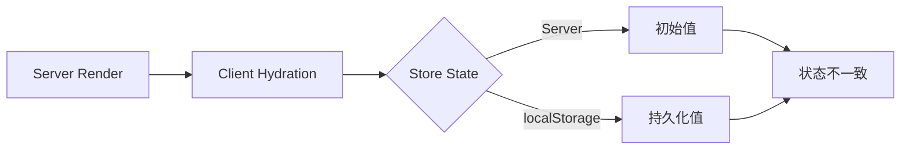

# 需求分析: 状态渲染修复

**项目**: vibex-state-render-fix
**日期**: 2026-03-17
**分析师**: Architect Agent

---

## 1. 执行摘要

### 问题

Zustand store 状态持久化和页面刷新后状态恢复存在竞态条件，导致：
1. 用户输入数据在刷新后丢失
2. Hydration 警告出现在控制台
3. SSR/CSR 状态不一致

### 影响范围

| Store | 影响 | 优先级 |
|-------|------|--------|
| authStore | 用户登录状态丢失 | P0 |
| confirmationStore | 确认流程中断 | P1 |
| designStore | 设计流程数据丢失 | P1 |

---

## 2. 根因分析

### 2.1 Hydration 时序问题



**问题**:
1. Server 端无法访问 localStorage
2. Client 端 hydration 时机不确定
3. React 18 并发渲染加剧问题

### 2.2 Store 初始化顺序问题

```
当前初始化顺序：
1. authStore (有 persist)
2. confirmationStore (有 persist)
3. designStore (有 persist)

问题：
- 各 store 独立初始化，无统一控制
- 无 hydration 完成检测
- 状态恢复顺序不确定
```

### 2.3 版本迁移缺失

| Store | 当前版本 | 迁移脚本 | 状态 |
|-------|----------|----------|------|
| authStore | 1 | ❌ 无 | 风险 |
| confirmationStore | 1 | ❌ 无 | 风险 |
| designStore | 无 | ❌ 无 | 高风险 |

---

## 3. 解决方案

### 3.1 Hydration 检测方案

```typescript
// 创建 useHydration Hook
export function useHydration() {
  const [isHydrated, setIsHydrated] = useState(false);
  
  useEffect(() => {
    // 等待所有 store hydration 完成
    const unsubscribers = [
      useAuthStore.persist.onHydrated(() => {}),
      useConfirmationStore.persist.onHydrated(() => {}),
      useDesignStore.persist.onHydrated(() => {}),
    ];
    
    setIsHydrated(true);
    return () => unsubscribers.forEach(unsub => unsub());
  }, []);
  
  return { isHydrated };
}
```

### 3.2 Store 初始化控制

```typescript
// StoreProvider 统一管理
export function StoreProvider({ children }) {
  const { isHydrated } = useHydration();
  
  if (!isHydrated) {
    return <LoadingSpinner />;
  }
  
  return children;
}
```

### 3.3 版本迁移支持

```typescript
// 添加 migrate 配置
persist(
  (set) => ({ /* state */ }),
  {
    name: 'store-name',
    version: 1,
    migrate: (oldState, oldVersion) => {
      // 迁移逻辑
      return oldState;
    },
  }
)
```

---

## 4. 工作量估算

| 任务 | 工时 |
|------|------|
| useHydration Hook | 2h |
| Store 初始化修复 | 2h |
| 测试验证 | 2h |
| **总计** | **6h** |

---

## 5. 验收标准

| ID | 验收标准 | 测试方法 |
|----|----------|----------|
| AC1 | 页面刷新后状态恢复 | E2E 测试 |
| AC2 | 无 Hydration 警告 | 控制台检查 |
| AC3 | 首屏加载 < 2s | Lighthouse |

---

**产出物**: `/root/.openclaw/vibex/docs/vibex-state-render-fix/analysis.md`