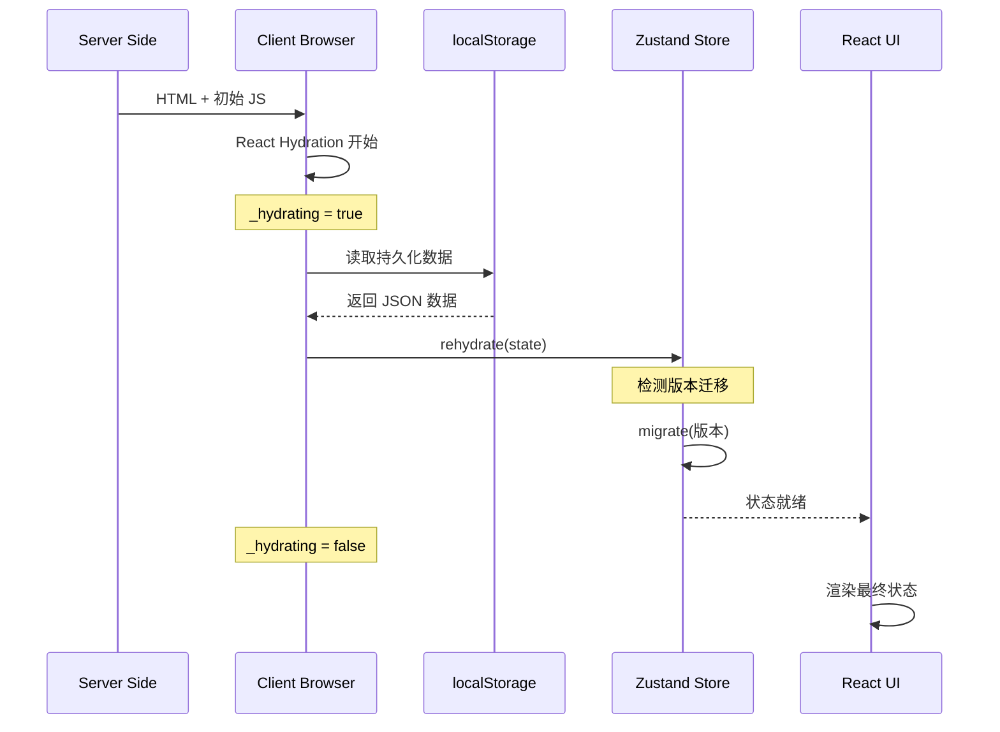
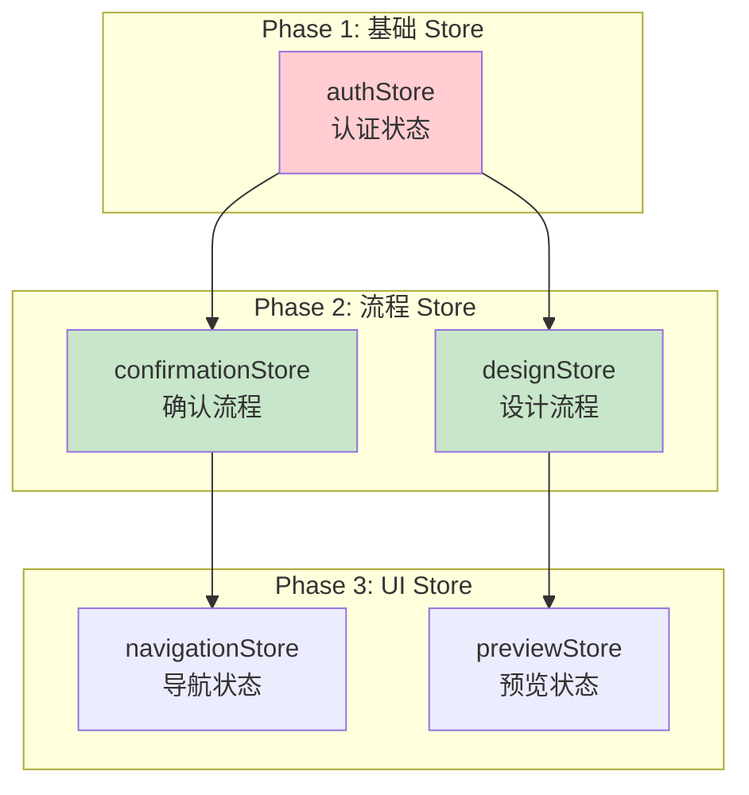
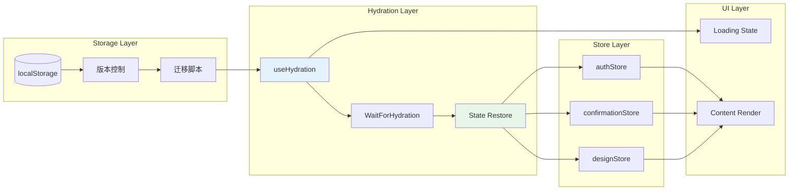
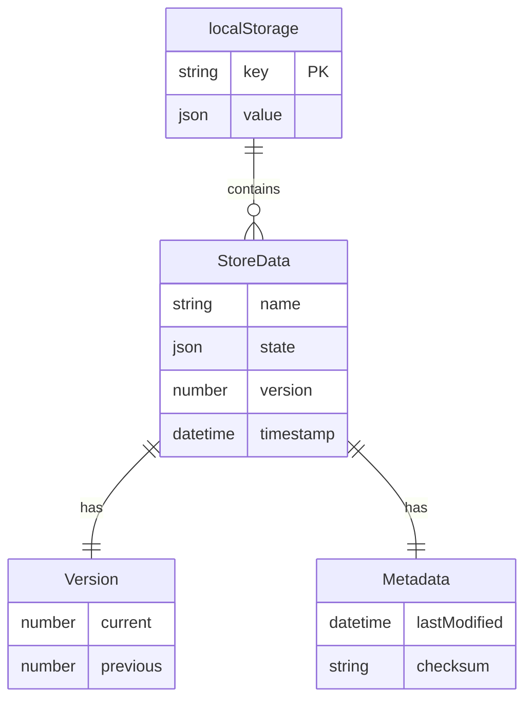
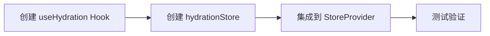
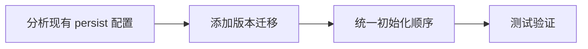
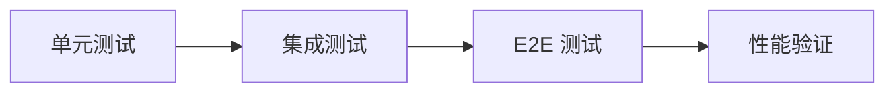

# Architecture: 状态渲染修复

**项目**: vibex-state-render-fix
**架构师**: Architect Agent
**日期**: 2026-03-17
**状态**: ✅ 设计完成

---

## 1. Tech Stack (版本选择及理由)

### 1.1 现有技术栈

| 技术 | 版本 | 理由 |
|------|------|------|
| Zustand | ^4.x | 已有，轻量状态管理 |
| Zustand Persist | 内置中间件 | 已有，localStorage 持久化 |
| React | 19.2.3 | 已有，支持 Suspense |
| Next.js | 16.1.6 | 已有，App Router SSR |

### 1.2 需要新增

| 技术 | 用途 | 理由 |
|------|------|------|
| useHydration Hook | Hydration 检测 | 解决 SSR/CSR 不一致 |
| StoreProvider | 统一初始化 | 控制初始化顺序 |

### 1.3 现有 Store 分析

| Store | 持久化 | 问题 |
|-------|--------|------|
| `authStore.ts` | ✅ persist | Hydration 时机问题 |
| `confirmationStore.ts` | ✅ persist | 版本迁移问题 |
| `designStore.ts` | ✅ persist | 数据完整性问题 |

---

## 2. Architecture Diagram (Mermaid)

### 2.1 Hydration 流程架构



### 2.2 Store 初始化顺序



### 2.3 状态恢复架构



---

## 3. API Definitions (接口签名)

### 3.1 useHydration Hook

```typescript
// src/hooks/useHydration.ts

interface UseHydrationOptions {
  stores: Array<{
    name: string;
    onHydrated?: (state: unknown) => void;
  }>;
  timeout?: number;
  onTimeout?: () => void;
}

interface UseHydrationReturn {
  isHydrated: boolean;
  isHydrating: boolean;
  error: Error | null;
  retry: () => void;
}

export function useHydration(options?: UseHydrationOptions): UseHydrationReturn;

// 使用示例
function App() {
  const { isHydrated, isHydrating } = useHydration({
    stores: [
      { name: 'auth-store' },
      { name: 'confirmation-store' },
      { name: 'design-store' },
    ],
    timeout: 5000,
    onTimeout: () => console.warn('Hydration timeout'),
  });
  
  if (isHydrating) {
    return <LoadingSpinner />;
  }
  
  return <MainContent />;
}
```

### 3.2 StoreProvider 组件

```typescript
// src/providers/StoreProvider.tsx

interface StoreProviderProps {
  children: React.ReactNode;
  fallback?: React.ReactNode;
  onHydrationComplete?: () => void;
}

export function StoreProvider({ 
  children, 
  fallback = <LoadingSpinner />,
  onHydrationComplete 
}: StoreProviderProps): React.ReactElement;

// 内部实现
function StoreProviderInner({ children }: StoreProviderProps) {
  const isHydrated = useHydrationStore((state) => state._hydrated);
  
  useEffect(() => {
    if (isHydrated) {
      // 触发所有 store 的 onHydrated 回调
      authStore.persist.onHydrated?.();
      confirmationStore.persist.onHydrated?.();
      designStore.persist.onHydrated?.();
    }
  }, [isHydrated]);
  
  if (!isHydrated) {
    return fallback;
  }
  
  return <>{children}</>;
}
```

### 3.3 Store 持久化配置增强

```typescript
// src/stores/types.ts

interface PersistConfig<T> {
  name: string;
  version: number;
  storage: Storage;
  migrate?: (persistedState: unknown, version: number) => T;
  partialize?: (state: T) => Partial<T>;
  onRehydrateStorage?: (state: T) => void;
}

// 标准化配置
const createPersistConfig = <T>(name: string, version: number): PersistConfig<T> => ({
  name: `vibex-${name}`,
  version,
  storage: createJSONStorage(() => localStorage),
  migrate: (persistedState: unknown, fromVersion: number) => {
    // 默认迁移逻辑
    return persistedState as T;
  },
});

// 使用示例
export const useAuthStore = create<AuthState>()(
  devtools(
    persist(
      (set, get) => ({
        // ... state and actions
      }),
      createPersistConfig<AuthState>('auth', 1)
    )
  )
);
```

### 3.4 Hydration 状态管理

```typescript
// src/stores/hydrationStore.ts

interface HydrationState {
  _hydrated: boolean;
  _hydrating: boolean;
  _error: Error | null;
  
  // Store 级别的 hydration 状态
  storeStatus: Record<string, 'pending' | 'hydrating' | 'hydrated' | 'error'>;
  
  // Actions
  setStoreHydrated: (storeName: string) => void;
  setStoreError: (storeName: string, error: Error) => void;
  setAllHydrated: () => void;
  retry: () => void;
}

export const useHydrationStore = create<HydrationState>((set) => ({
  _hydrated: false,
  _hydrating: true,
  _error: null,
  storeStatus: {
    'auth-store': 'pending',
    'confirmation-store': 'pending',
    'design-store': 'pending',
  },
  
  setStoreHydrated: (storeName) => set((state) => ({
    storeStatus: { ...state.storeStatus, [storeName]: 'hydrated' },
  })),
  
  setStoreError: (storeName, error) => set((state) => ({
    storeStatus: { ...state.storeStatus, [storeName]: 'error' },
    _error: error,
  })),
  
  setAllHydrated: () => set({ _hydrated: true, _hydrating: false }),
  
  retry: () => set({ _hydrating: true, _error: null }),
}));
```

---

## 4. Data Model (核心实体关系)

### 4.1 持久化数据模型



### 4.2 Store 数据结构

```typescript
// 持久化数据格式
interface PersistedStoreData<T> {
  state: T;
  version: number;
  timestamp: number;
  checksum?: string;
}

// authStore 持久化字段
interface AuthPersistedState {
  user: User | null;
  token: string | null;
  isAuthenticated: boolean;
}

// confirmationStore 持久化字段
interface ConfirmationPersistedState {
  step: ConfirmationStep;
  requirementText: string;
  boundedContexts: BoundedContext[];
  selectedContextIds: string[];
  // ... 其他关键字段
}

// designStore 持久化字段
interface DesignPersistedState {
  currentStep: DesignStep;
  requirementText: string;
  clarifications: ClarificationRound[];
  domainEntities: DomainEntity[];
  // ... 其他关键字段
}
```

### 4.3 版本迁移配置

```typescript
// src/stores/migrations.ts

type MigrationFn<T> = (oldState: unknown) => T;

interface MigrationConfig<T> {
  fromVersion: number;
  toVersion: number;
  migrate: MigrationFn<T>;
}

// confirmationStore 迁移配置
const confirmationMigrations: MigrationConfig<ConfirmationState>[] = [
  {
    fromVersion: 0,
    toVersion: 1,
    migrate: (oldState) => ({
      ...oldState,
      selectedContextIds: [], // 新增字段默认值
    }),
  },
];

// 应用迁移
function applyMigrations<T>(
  persistedState: unknown,
  fromVersion: number,
  toVersion: number,
  migrations: MigrationConfig<T>[]
): T {
  let state = persistedState;
  let currentVersion = fromVersion;
  
  while (currentVersion < toVersion) {
    const migration = migrations.find(
      m => m.fromVersion === currentVersion && m.toVersion === currentVersion + 1
    );
    
    if (migration) {
      state = migration.migrate(state);
      currentVersion = migration.toVersion;
    } else {
      break;
    }
  }
  
  return state as T;
}
```

---

## 5. Testing Strategy (测试契约)

### 5.1 测试框架

| 类型 | 框架 | 覆盖目标 |
|------|------|----------|
| Unit Tests | Jest | Hook 和 Store 逻辑 > 80% |
| Integration Tests | Jest | Hydration 流程 > 70% |
| E2E Tests | Playwright | 刷新恢复 > 90% |

### 5.2 核心测试用例

```typescript
// src/hooks/__tests__/useHydration.test.ts

describe('useHydration', () => {
  // TC-001: 基本检测
  it('should return isHydrated false initially on client', () => {
    const { result } = renderHook(() => useHydration());
    
    expect(result.current.isHydrating).toBe(true);
    expect(result.current.isHydrated).toBe(false);
  });

  // TC-002: Hydration 完成
  it('should set isHydrated true after hydration', async () => {
    const { result } = renderHook(() => useHydration());
    
    await waitFor(() => {
      expect(result.current.isHydrated).toBe(true);
    });
  });

  // TC-003: 超时处理
  it('should handle timeout gracefully', async () => {
    const onTimeout = jest.fn();
    
    const { result } = renderHook(() => 
      useHydration({ timeout: 100, onTimeout })
    );
    
    await waitFor(() => {
      expect(onTimeout).toHaveBeenCalled();
    }, { timeout: 200 });
  });

  // TC-004: 重试功能
  it('should allow retry on error', async () => {
    const { result } = renderHook(() => useHydration());
    
    // 模拟错误
    act(() => {
      result.current.error = new Error('test');
    });
    
    act(() => {
      result.current.retry();
    });
    
    expect(result.current.isHydrating).toBe(true);
  });
});
```

### 5.3 Store 持久化测试

```typescript
// src/stores/__tests__/confirmationStore.persistence.test.ts

describe('confirmationStore persistence', () => {
  beforeEach(() => {
    localStorage.clear();
  });

  // TC-001: 持久化写入
  it('should persist state to localStorage on change', () => {
    const { result } = renderHook(() => useConfirmationStore());
    
    act(() => {
      result.current.setRequirementText('test requirement');
    });
    
    const stored = localStorage.getItem('confirmation-flow-storage');
    const parsed = JSON.parse(stored!);
    
    expect(parsed.state.requirementText).toBe('test requirement');
  });

  // TC-002: 页面刷新恢复
  it('should restore state after page refresh', async () => {
    // 设置初始状态
    localStorage.setItem('confirmation-flow-storage', JSON.stringify({
      state: { requirementText: 'saved requirement' },
      version: 1,
    }));
    
    // 重新创建 store
    const { result } = renderHook(() => useConfirmationStore());
    
    await waitFor(() => {
      expect(result.current.requirementText).toBe('saved requirement');
    });
  });

  // TC-003: 版本迁移
  it('should migrate state from older version', async () => {
    // 模拟旧版本数据
    localStorage.setItem('confirmation-flow-storage', JSON.stringify({
      state: { requirementText: 'old data' },
      version: 0, // 旧版本
    }));
    
    const { result } = renderHook(() => useConfirmationStore());
    
    await waitFor(() => {
      expect(result.current.selectedContextIds).toBeDefined();
    });
  });
});
```

### 5.4 E2E 测试场景

```typescript
// tests/e2e/state-persistence.spec.ts

import { test, expect } from '@playwright/test';

test.describe('State Persistence', () => {
  test('should restore auth state after page refresh', async ({ page }) => {
    // 登录
    await page.goto('/');
    await page.fill('input[name="email"]', 'test@example.com');
    await page.click('button:has-text("登录")');
    
    // 验证登录状态
    await expect(page.locator('[data-testid="user-avatar"]')).toBeVisible();
    
    // 刷新页面
    await page.reload();
    
    // 验证状态恢复
    await expect(page.locator('[data-testid="user-avatar"]')).toBeVisible();
  });

  test('should restore confirmation flow state after refresh', async ({ page }) => {
    await page.goto('/confirm');
    
    // 输入需求
    await page.fill('textarea', '电商订单系统');
    await page.click('button:has-text("开始生成")');
    
    // 等待第一步完成
    await page.waitForSelector('[data-step="2"]', { timeout: 10000 });
    
    // 刷新页面
    await page.reload();
    
    // 验证状态恢复
    await expect(page.locator('[data-step="2"]')).toBeVisible();
    await expect(page.locator('textarea')).toHaveValue('电商订单系统');
  });

  test('should not show hydration warnings in console', async ({ page }) => {
    const warnings: string[] = [];
    
    page.on('console', (msg) => {
      if (msg.type() === 'warning') {
        warnings.push(msg.text());
      }
    });
    
    await page.goto('/');
    await page.waitForLoadState('networkidle');
    
    const hydrationWarnings = warnings.filter(w => 
      w.includes('hydration') || w.includes('Hydration')
    );
    
    expect(hydrationWarnings).toHaveLength(0);
  });
});
```

---

## 6. 实施路径

### Phase 1: Hydration 检测 (2h)



**关键文件**:
- `src/hooks/useHydration.ts`
- `src/stores/hydrationStore.ts`
- `src/providers/StoreProvider.tsx`

### Phase 2: Store 初始化修复 (2h)



**关键改动**:
```typescript
// authStore.ts - 添加 onRehydrateStorage
persist(
  (set, get) => ({ /* ... */ }),
  {
    name: 'auth-store',
    version: 1,
    onRehydrateStorage: () => {
      useHydrationStore.getState().setStoreHydrated('auth-store');
    },
  }
)
```

### Phase 3: 测试与验证 (2h)



---

## 7. 技术决策记录

### ADR-001: Hydration 检测策略

**Status**: Accepted

**Context**: 如何检测 Zustand persist 的 hydration 状态？

**Decision**: 
创建独立的 `hydrationStore` 跟踪各 store 的 hydration 状态，通过 `onRehydrateStorage` 回调更新。

**Consequences**:
- ✅ 精确控制渲染时机
- ✅ 可检测各 store 独立状态
- ⚠️ 需要每个 store 配置回调

### ADR-002: 版本迁移策略

**Status**: Accepted

**Context**: 如何处理 localStorage 中旧版本数据的迁移？

**Decision**: 
使用 Zustand persist 的 `migrate` 配置，定义迁移函数处理版本升级。

**Consequences**:
- ✅ 自动迁移，用户无感知
- ✅ 数据不丢失
- ⚠️ 需要维护迁移脚本

### ADR-003: Loading 状态策略

**Status**: Accepted

**Context**: Hydration 期间是否显示 Loading？

**Decision**: 
是的，在 `_hydrating` 为 true 时显示 Loading spinner，避免闪烁。

**Consequences**:
- ✅ 无 UI 闪烁
- ✅ 用户体验平滑
- ⚠️ 首屏渲染略慢

---

## 8. 验收检查清单

### 8.1 功能验收

- [ ] 页面刷新后状态完整恢复
- [ ] 多个 store 初始化顺序正确
- [ ] Hydration 完成后才渲染内容

### 8.2 性能验收

- [ ] Hydration 时间 < 500ms
- [ ] 首屏加载时间 < 2s
- [ ] 无内存泄漏

### 8.3 错误处理验收

- [ ] localStorage 损坏时可恢复
- [ ] 版本迁移失败时有降级方案
- [ ] 无控制台 Hydration 警告

---

## 9. 风险评估

| 风险 | 可能性 | 影响 | 缓解措施 |
|------|--------|------|----------|
| Hydration 超时 | 🟢 低 | 中 | 超时后显示默认状态 |
| localStorage 损坏 | 🟡 中 | 中 | 数据校验 + 恢复默认 |
| 版本迁移失败 | 🟢 低 | 高 | 降级到默认状态 |

---

## 10. 产出物清单

| 文件 | 说明 | 状态 |
|------|------|------|
| `architecture.md` | 架构设计文档 | ✅ 本文档 |
| `useHydration.ts` | Hydration 检测 Hook | 待实施 |
| `hydrationStore.ts` | Hydration 状态管理 | 待实施 |
| `StoreProvider.tsx` | Store 提供者 | 待实施 |
| `migrations.ts` | 版本迁移脚本 | 待实施 |

---

**预估工时**: 6 小时

**完成标准**: 页面刷新后状态完整恢复，无 Hydration 警告

---

*Generated by: Architect Agent*
*Date: 2026-03-17*