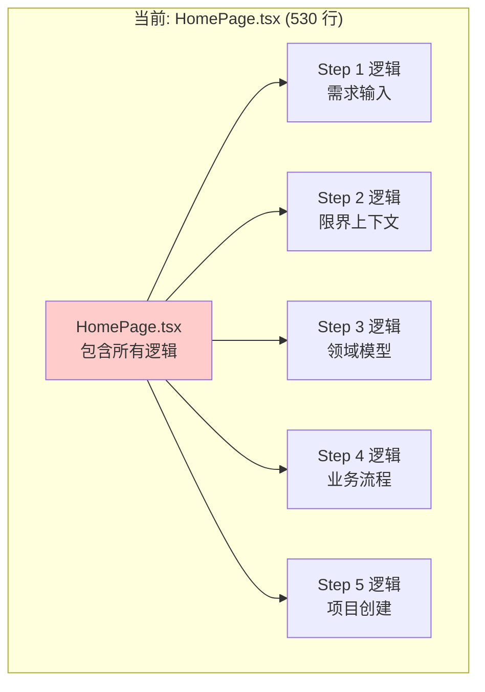
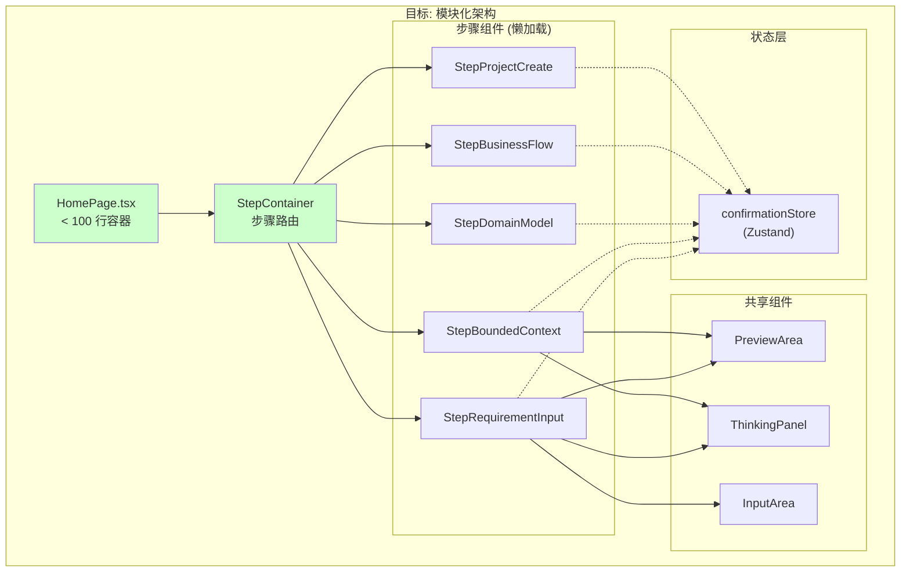
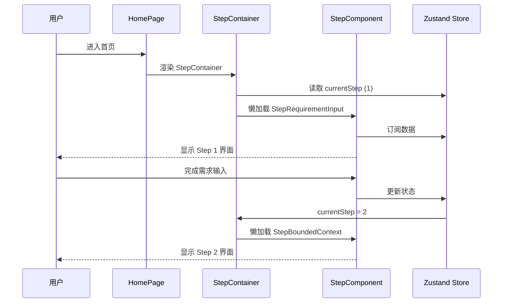
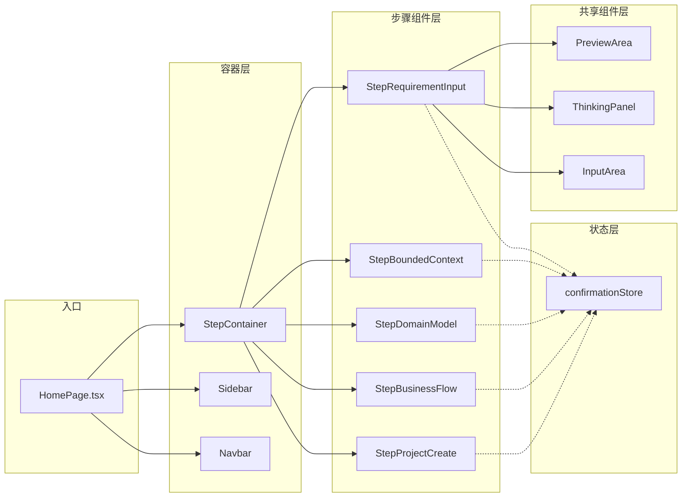
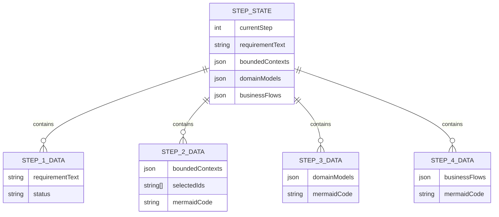

# 架构设计: 首页步骤组件模块化重构

**项目**: vibex-step-modular-architecture
**版本**: 1.0
**日期**: 2026-03-17
**作者**: Architect Agent

---

## 1. Tech Stack (技术栈选型)

### 1.1 核心技术栈

| 组件 | 选型 | 版本 | 理由 |
|------|------|------|------|
| **前端框架** | React | 18+ | 现有技术栈 |
| **状态管理** | Zustand | 现有 | 已有 confirmationStore |
| **组件加载** | React.lazy + Suspense | 内置 | 代码分割优化 |
| **样式方案** | CSS Module | 现有 | 保持一致性 |

### 1.2 技术选型对比

| 方案 | 优点 | 缺点 | 推荐 |
|------|------|------|------|
| **A: 懒加载步骤组件** | 按需加载、代码分割 | 需要处理 Loading 状态 | ⭐⭐⭐⭐⭐ |
| B: 全量导入步骤组件 | 无 Loading 闪烁 | 首屏加载慢 | ⭐⭐⭐ |

**结论**: 采用 **方案 A** - 使用 React.lazy 懒加载步骤组件，优化首屏加载性能。

---

## 2. Architecture Diagram (架构图)

### 2.1 当前架构 (单体)



### 2.2 目标架构 (模块化)



### 2.3 步骤切换流程



### 2.4 组件依赖关系



---

## 3. API Definitions (接口定义)

### 3.1 步骤组件通用接口

```typescript
// types/step.ts

import type { BoundedContext, DomainModel, BusinessFlow } from './models';

/**
 * 步骤组件通用 Props
 */
interface StepComponentProps {
  /** 步骤导航 */
  onNavigate: (step: number) => void;
  /** 是否为当前激活步骤 */
  isActive: boolean;
}

/**
 * Step 1: 需求输入
 */
interface StepRequirementInputProps extends StepComponentProps {
  // 从 Store 内部订阅
}

/**
 * Step 2: 限界上下文
 */
interface StepBoundedContextProps extends StepComponentProps {
  // 从 Store 内部订阅
}

/**
 * Step 3: 领域模型
 */
interface StepDomainModelProps extends StepComponentProps {
  // 从 Store 内部订阅
}

/**
 * Step 4: 业务流程
 */
interface StepBusinessFlowProps extends StepComponentProps {
  // 从 Store 内部订阅
}

/**
 * Step 5: 项目创建
 */
interface StepProjectCreateProps extends StepComponentProps {
  // 从 Store 内部订阅
}
```

### 3.2 StepContainer 接口

```typescript
// components/homepage/StepContainer.tsx

interface StepContainerProps {
  /** 当前步骤 (1-5) */
  currentStep: number;
  /** 步骤切换回调 */
  onStepChange?: (step: number) => void;
}

/**
 * 步骤组件映射
 */
type StepComponentMap = {
  [key: number]: React.LazyExoticComponent<React.ComponentType<StepComponentProps>>;
};
```

### 3.3 Zustand Store 接口

```typescript
// stores/confirmationStore.ts

interface ConfirmationState {
  // 当前步骤
  currentStep: number;
  
  // 需求文本
  requirementText: string;
  
  // Step 2 数据
  boundedContexts: BoundedContext[];
  selectedContextIds: string[];
  
  // Step 3 数据
  domainModels: DomainModel[];
  modelMermaidCode: string;
  
  // Step 4 数据
  businessFlows: BusinessFlow[];
  flowMermaidCode: string;
  
  // Actions
  setCurrentStep: (step: number) => void;
  setRequirementText: (text: string) => void;
  setBoundedContexts: (contexts: BoundedContext[]) => void;
  // ...
}

// Selectors (推荐按需订阅)
const useCurrentStep = () => useConfirmationStore(s => s.currentStep);
const useRequirementText = () => useConfirmationStore(s => s.requirementText);
const useBoundedContexts = () => useConfirmationStore(s => s.boundedContexts);
```

---

## 4. Data Model (数据模型)

### 4.1 步骤状态模型



### 4.2 步骤与数据映射

| 步骤 | 组件 | 核心数据 | Store 订阅 |
|------|------|---------|-----------|
| 1 | StepRequirementInput | requirementText | requirementText |
| 2 | StepBoundedContext | boundedContexts | boundedContexts, contextMermaidCode |
| 3 | StepDomainModel | domainModels | domainModels, modelMermaidCode |
| 4 | StepBusinessFlow | businessFlows | businessFlows, flowMermaidCode |
| 5 | StepProjectCreate | projectConfig | all data |

---

## 5. Implementation Details (实现细节)

### 5.1 StepContainer 实现

```tsx
// components/homepage/StepContainer.tsx
import { lazy, Suspense, ComponentType } from 'react';
import { useConfirmationStore } from '@/stores/confirmationStore';
import { StepLoading } from './StepLoading';

// 懒加载步骤组件
const StepComponents: Record<number, React.LazyExoticComponent<ComponentType>> = {
  1: lazy(() => import('./steps/StepRequirementInput')),
  2: lazy(() => import('./steps/StepBoundedContext')),
  3: lazy(() => import('./steps/StepDomainModel')),
  4: lazy(() => import('./steps/StepBusinessFlow')),
  5: lazy(() => import('./steps/StepProjectCreate')),
};

export function StepContainer() {
  const currentStep = useConfirmationStore(s => s.currentStep);
  const StepComponent = StepComponents[currentStep];

  if (!StepComponent) {
    return <div>Invalid step: {currentStep}</div>;
  }

  return (
    <Suspense fallback={<StepLoading step={currentStep} />}>
      <StepComponent onNavigate={handleNavigate} isActive={true} />
    </Suspense>
  );
}

function handleNavigate(step: number) {
  useConfirmationStore.getState().setCurrentStep(step);
}
```

### 5.2 单步骤组件示例

```tsx
// components/homepage/steps/StepRequirementInput.tsx
import { useDDDStream } from '@/hooks/useDDDStream';
import { useConfirmationStore } from '@/stores/confirmationStore';
import { PreviewArea } from '../PreviewArea';
import { ThinkingPanel } from '../ThinkingPanel';
import { InputArea } from '../InputArea';
import type { StepComponentProps } from '../types';

export function StepRequirementInput({ onNavigate, isActive }: StepComponentProps) {
  // Store 订阅 (按需)
  const requirementText = useConfirmationStore(s => s.requirementText);
  const setRequirementText = useConfirmationStore(s => s.setRequirementText);
  const setCurrentStep = useConfirmationStore(s => s.setCurrentStep);

  // SSE Hook
  const {
    thinkingMessages,
    boundedContexts,
    status,
    errorMessage,
    generateContexts,
    abort,
  } = useDDDStream();

  // 生成完成后的回调
  const handleComplete = () => {
    if (boundedContexts.length > 0) {
      useConfirmationStore.getState().setBoundedContexts(boundedContexts);
      setCurrentStep(2);
      onNavigate(2);
    }
  };

  return (
    <div className={styles.stepContainer}>
      {/* 图形区 */}
      <div className={styles.previewSection}>
        <PreviewArea mermaidCode="" status="idle" />
      </div>

      {/* 思考区 */}
      <div className={styles.thinkingSection}>
        <ThinkingPanel
          thinkingMessages={thinkingMessages}
          status={status}
          errorMessage={errorMessage}
          onAbort={abort}
          onComplete={handleComplete}
        />
      </div>

      {/* 录入区 */}
      <div className={styles.inputSection}>
        <InputArea
          value={requirementText}
          onChange={setRequirementText}
          onSubmit={generateContexts}
          placeholder="输入您的需求..."
          submitLabel="开始生成"
          disabled={status === 'thinking'}
        />
      </div>
    </div>
  );
}
```

### 5.3 StepBoundedContext 组件

```tsx
// components/homepage/steps/StepBoundedContext.tsx
import { useDDDStream, useDomainModelStream } from '@/hooks/useDDDStream';
import { useConfirmationStore } from '@/stores/confirmationStore';
import { PreviewArea } from '../PreviewArea';
import { ThinkingPanel } from '../ThinkingPanel';
import { ContextSelector } from '../ContextSelector';
import type { StepComponentProps } from '../types';

export function StepBoundedContext({ onNavigate, isActive }: StepComponentProps) {
  // Store 订阅
  const boundedContexts = useConfirmationStore(s => s.boundedContexts);
  const contextMermaidCode = useConfirmationStore(s => s.contextMermaidCode);
  
  // SSE Hook (领域模型生成)
  const {
    thinkingMessages,
    domainModels,
    mermaidCode: modelMermaidCode,
    status,
    generateDomainModels,
    abort,
  } = useDomainModelStream();

  // 选中的上下文
  const [selectedIds, setSelectedIds] = useState<Set<string>>(new Set());

  const handleGenerateModel = () => {
    const selected = boundedContexts.filter(c => selectedIds.has(c.id));
    generateDomainModels(requirementText, selected);
  };

  return (
    <div className={styles.stepContainer}>
      {/* 图形区 - 显示限界上下文图 */}
      <PreviewArea 
        mermaidCode={contextMermaidCode}
        status="done"
      />

      {/* 思考区 */}
      <ThinkingPanel
        thinkingMessages={thinkingMessages}
        status={status}
        onAbort={abort}
      />

      {/* 录入区 - 上下文选择 */}
      <div className={styles.inputSection}>
        <ContextSelector
          contexts={boundedContexts}
          selectedIds={selectedIds}
          onChange={setSelectedIds}
        />
        <button 
          onClick={handleGenerateModel}
          disabled={selectedIds.size === 0 || status === 'thinking'}
        >
          生成领域模型
        </button>
      </div>
    </div>
  );
}
```

### 5.4 HomePage 简化后

```tsx
// components/homepage/HomePage.tsx
import { StepContainer } from './StepContainer';
import { Sidebar } from './Sidebar';
import { Navbar } from './Navbar';
import styles from './HomePage.module.css';

export function HomePage() {
  return (
    <div className={styles.container}>
      <Navbar />
      <div className={styles.mainContent}>
        <Sidebar />
        <main className={styles.content}>
          <StepContainer />
        </main>
      </div>
    </div>
  );
}

export default HomePage;
```

---

## 6. Testing Strategy (测试策略)

### 6.1 测试框架

| 测试类型 | 框架 | 覆盖率目标 |
|----------|------|-----------|
| 单元测试 | Jest + React Testing Library | ≥ 85% |
| 集成测试 | React Testing Library | ≥ 70% |
| E2E 测试 | Playwright | 关键路径 100% |

### 6.2 核心测试用例

#### 6.2.1 单步骤单元测试

```typescript
// steps/__tests__/StepRequirementInput.test.tsx
import { render, screen, fireEvent } from '@testing-library/react';
import { StepRequirementInput } from '../StepRequirementInput';

// Mock hooks
jest.mock('@/hooks/useDDDStream', () => ({
  useDDDStream: () => ({
    thinkingMessages: [],
    status: 'idle',
    generateContexts: jest.fn(),
    abort: jest.fn(),
  }),
}));

describe('StepRequirementInput', () => {
  it('should render input area', () => {
    render(<StepRequirementInput onNavigate={jest.fn()} isActive={true} />);
    expect(screen.getByPlaceholderText(/输入您的需求/)).toBeInTheDocument();
  });

  it('should call generateContexts on submit', async () => {
    const mockGenerate = jest.fn();
    jest.spyOn(require('@/hooks/useDDDStream'), 'useDDDStream').mockReturnValue({
      generateContexts: mockGenerate,
      status: 'idle',
    });

    render(<StepRequirementInput onNavigate={jest.fn()} isActive={true} />);
    
    const input = screen.getByPlaceholderText(/输入您的需求/);
    fireEvent.change(input, { target: { value: '电商系统' } });
    
    const submitBtn = screen.getByText('开始生成');
    fireEvent.click(submitBtn);
    
    expect(mockGenerate).toHaveBeenCalledWith('电商系统');
  });
});
```

#### 6.2.2 StepContainer 测试

```typescript
// __tests__/StepContainer.test.tsx
import { render, screen } from '@testing-library/react';
import { StepContainer } from '../StepContainer';
import { useConfirmationStore } from '@/stores/confirmationStore';

jest.mock('../steps/StepRequirementInput', () => ({
  StepRequirementInput: () => <div data-testid="step-1">Step 1</div>,
}));

describe('StepContainer', () => {
  it('should render Step 1 when currentStep is 1', () => {
    useConfirmationStore.setState({ currentStep: 1 });
    
    render(<StepContainer />);
    
    expect(screen.getByTestId('step-1')).toBeInTheDocument();
  });

  it('should show loading state during lazy load', () => {
    // 测试 Suspense fallback
    useConfirmationStore.setState({ currentStep: 2 });
    
    render(<StepContainer />);
    
    // 在懒加载完成前应显示 Loading
    expect(screen.getByText(/加载中/)).toBeInTheDocument();
  });
});
```

#### 6.2.3 E2E 测试

```typescript
// e2e/step-navigation.spec.ts
import { test, expect } from '@playwright/test';

test.describe('Step Navigation', () => {
  test('should navigate through all steps', async ({ page }) => {
    await page.goto('/');
    
    // Step 1: 输入需求
    await page.fill('[data-testid="requirement-input"]', '电商系统');
    await page.click('button:has-text("开始生成")');
    
    // 等待 Step 2 显示
    await expect(page.locator('[data-testid="step-2"]')).toBeVisible({ timeout: 60000 });
    
    // Step 2: 选择上下文
    await page.click('[data-testid="context-checkbox"]:first-child');
    await page.click('button:has-text("生成领域模型")');
    
    // 等待 Step 3 显示
    await expect(page.locator('[data-testid="step-3"]')).toBeVisible({ timeout: 60000 });
  });
});
```

---

## 7. Implementation Roadmap (实施路线图)

### Phase 1: 目录结构创建 (2h)

| 步骤 | 工时 | 产出物 |
|------|------|--------|
| 1.1 创建 steps/ 目录 | 0.5h | 目录结构 |
| 1.2 创建类型定义 | 1h | types/step.ts |
| 1.3 创建 Loading 组件 | 0.5h | StepLoading.tsx |

### Phase 2: 步骤组件实现 (8h)

| 步骤 | 工时 | 产出物 |
|------|------|--------|
| 2.1 StepRequirementInput | 2h | Step 1 组件 |
| 2.2 StepBoundedContext | 2h | Step 2 组件 |
| 2.3 StepDomainModel | 2h | Step 3 组件 |
| 2.4 StepBusinessFlow | 1h | Step 4 组件 |
| 2.5 StepProjectCreate | 1h | Step 5 组件 |

### Phase 3: 容器与简化 (4h)

| 步骤 | 工时 | 产出物 |
|------|------|--------|
| 3.1 StepContainer 实现 | 2h | 容器组件 |
| 3.2 HomePage 简化 | 2h | 简化后的 HomePage |

### Phase 4: 测试验证 (3h)

| 步骤 | 工时 | 内容 |
|------|------|------|
| 4.1 单元测试 | 2h | Jest 测试 |
| 4.2 E2E 测试 | 1h | Playwright 测试 |

**总工期**: 17h ≈ 2.5 人日

---

## 8. 风险评估

| 风险 | 等级 | 影响 | 缓解措施 |
|------|------|------|----------|
| 状态同步延迟 | 🟡 中 | UI 不一致 | 使用 Zustand selector 精确订阅 |
| 懒加载闪烁 | 🟢 低 | 用户体验 | 添加骨架屏 Loading |
| 样式冲突 | 🟢 低 | UI 异常 | CSS Module 隔离 |
| 功能回归 | 🟡 中 | 功能缺失 | 完整回归测试 |

---

## 9. Acceptance Criteria (验收标准)

### 9.1 结构验收

- [ ] AC1.1: `steps/` 目录存在
- [ ] AC1.2: 5 个步骤组件文件存在
- [ ] AC1.3: 每个组件可独立渲染
- [ ] AC1.4: 组件导出正确

### 9.2 功能验收

- [ ] AC2.1: StepContainer 按步骤渲染
- [ ] AC2.2: 步骤切换正常
- [ ] AC2.3: Store 状态同步正确
- [ ] AC2.4: 懒加载工作正常

### 9.3 代码验收

- [ ] AC3.1: HomePage.tsx < 100 行
- [ ] AC3.2: 无步骤逻辑代码在 HomePage
- [ ] AC3.3: 类型定义完整

### 9.4 验证命令

```bash
# 检查文件结构
ls -la components/homepage/steps/

# 检查代码行数
wc -l components/homepage/HomePage.tsx

# 运行测试
npm test -- --testPathPattern="steps/"

# E2E 测试
npm run test:e2e -- --grep "Step Navigation"
```

---

## 10. File Structure (文件结构)

```
components/homepage/
├── HomePage.tsx              # < 100 行容器
├── HomePage.module.css
├── index.ts
├── types.ts                  # 类型定义
├── StepContainer.tsx         # 步骤容器
├── StepLoading.tsx           # Loading 组件
├── steps/
│   ├── StepRequirementInput.tsx
│   ├── StepBoundedContext.tsx
│   ├── StepDomainModel.tsx
│   ├── StepBusinessFlow.tsx
│   ├── StepProjectCreate.tsx
│   └── __tests__/
│       ├── StepRequirementInput.test.tsx
│       └── ...
├── PreviewArea/
├── ThinkingPanel/
├── InputArea/
├── Sidebar/
├── Navbar/
└── hooks/
```

---

## 11. References (参考文档)

| 文档 | 路径 |
|------|------|
| 需求分析 | `/root/.openclaw/vibex/docs/vibex-step-modular-architecture/analysis.md` |
| PRD | `/root/.openclaw/vibex/docs/prd/vibex-step-modular-architecture-prd.md` |
| Zustand Store | `vibex-fronted/src/stores/confirmationStore.ts` |

---

**产出物**: `/root/.openclaw/vibex/docs/vibex-step-modular-architecture/architecture.md`
**作者**: Architect Agent
**日期**: 2026-03-17