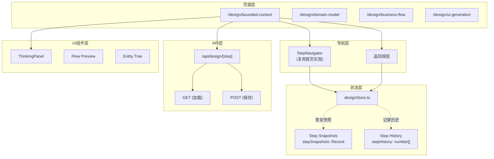
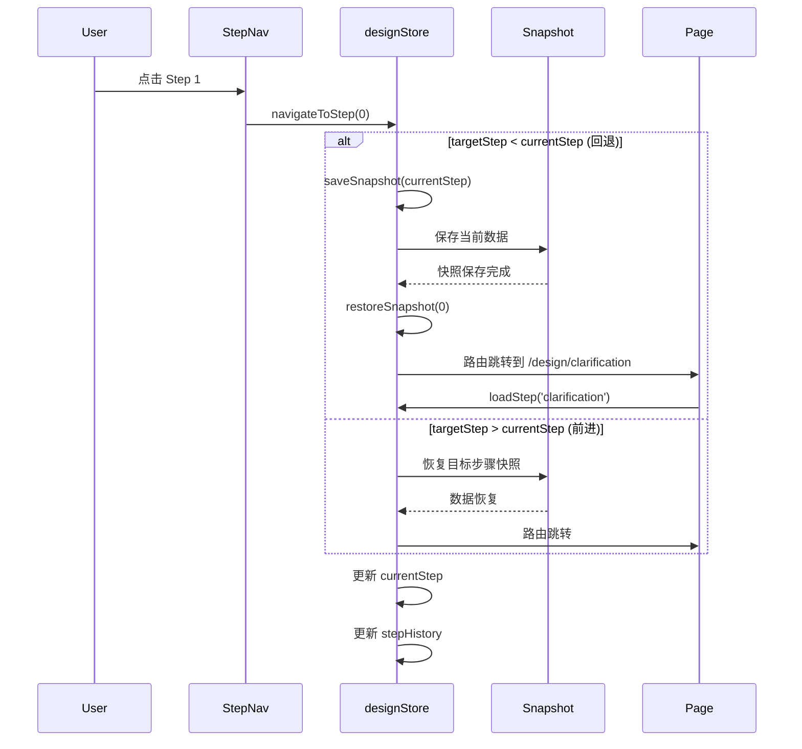

# 架构设计: 设计流程 Step 2-5 集成

**项目**: vibex-step2-issues  
**架构师**: Architect Agent  
**日期**: 2026-03-20

---

## 1. 问题概述

| 现状 | 5个 `/design/*` 页面中仅 `clarification` 有实现，其余4个为占位桩 |
|------|------|
| 目标 | 接入步骤导航、流式思考面板、API 持久化、步骤回退 |
| 涉及页面 | bounded-context / domain-model / business-flow / ui-generation |

---

## 2. 整体架构



---

## 3. designStore 扩展

### 3.1 当前状态

```typescript
// 现有字段
interface DesignState {
  currentStep: number;
  clarificationData: ClarificationRound[];
  boundedContexts: BoundedContext[];
  domainEntities: DomainEntity[];
  businessFlow: BusinessFlow;
  uiStructure: UIStructure;
  // ...
}
```

### 3.2 扩展字段

```typescript
// 扩展后的 designStore
interface DesignState {
  // 现有
  currentStep: number;
  
  // 新增：步骤历史（用于回退）
  stepHistory: number[];           // e.g., [0, 1, 2]
  
  // 新增：每步骤数据快照
  stepSnapshots: Partial<Record<DesignStep, unknown>>; // e.g., { 'clarification': {...}, 'bounded-context': {...} }
  
  // 新增：当前步骤的"脏"状态（未保存变更）
  isDirty: boolean;
  
  // Actions
  navigateToStep: (step: number) => void;       // 前进或回退
  saveSnapshot: (step: DesignStep) => void;     // 保存当前步骤快照
  restoreSnapshot: (step: DesignStep) => void;  // 恢复快照
  clearForwardSnapshots: (fromStep: number) => void; // 回退到Step1时清除后续快照
}
```

### 3.3 核心逻辑

```typescript
// designStore.ts — 新增 actions

navigateToStep: (targetStep: number) => {
  const { currentStep, stepHistory, stepSnapshots } = get();
  
  if (targetStep < currentStep) {
    // 回退：保存当前快照，恢复目标步骤快照
    const currentStepName = stepIndexToName(currentStep);
    set((state) => ({
      stepSnapshots: {
        ...state.stepSnapshots,
        [currentStepName]: getStepData(currentStep),
      },
    }));
    
    const targetStepName = stepIndexToName(targetStep);
    const snapshot = stepSnapshots[targetStepName];
    if (snapshot) {
      restoreStepData(targetStepName, snapshot);
    }
    
    set({ currentStep: targetStep });
    set((state) => ({ stepHistory: [...state.stepHistory, targetStep] }));
  } else {
    // 前进：直接从快照恢复（如果存在）
    const targetStepName = stepIndexToName(targetStep);
    const snapshot = stepSnapshots[targetStepName];
    if (snapshot) {
      restoreStepData(targetStepName, snapshot);
    }
    set({ currentStep: targetStep });
    set((state) => ({ stepHistory: [...state.stepHistory, targetStep] }));
  }
},

clearForwardSnapshots: (fromStep: number) => {
  set((state) => {
    const stepsToKeep: DesignStep[] = ['clarification', 'bounded-context', 'domain-model', 'business-flow', 'ui-generation']
      .slice(0, fromStep + 1) as DesignStep[];
    
    const newSnapshots: Partial<Record<DesignStep, unknown>> = {};
    for (const step of stepsToKeep) {
      if (state.stepSnapshots[step]) {
        newSnapshots[step] = state.stepSnapshots[step];
      }
    }
    
    return { stepSnapshots: newSnapshots };
  });
},
```

---

## 4. API 层设计

### 4.1 API 端点

```
GET  /api/design/[step]          → 获取当前步骤数据
POST /api/design/[step]          → 保存步骤数据
```

### 4.2 实现

```typescript
// app/api/design/[step]/route.ts

type DesignStep = 'clarification' | 'bounded-context' | 'domain-model' | 'business-flow' | 'ui-generation';

// 内存存储（开发阶段）
const designData: Record<DesignStep, unknown> = {
  'clarification': null,
  'bounded-context': null,
  'domain-model': null,
  'business-flow': null,
  'ui-generation': null,
};

export async function GET(req: Request, { params }: { params: { step: string } }) {
  const step = params.step as DesignStep;
  const data = designData[step] ?? {};
  return Response.json(data);
}

export async function POST(req: Request, { params }: { params: { step: string } }) {
  const step = params.step as DesignStep;
  const body = await req.json();
  
  designData[step] = body;
  
  return Response.json({
    success: true,
    step,
    savedAt: new Date().toISOString(),
  });
}
```

### 4.3 前端 API 服务

```typescript
// services/api/design.api.ts

export class DesignApiService {
  async load(step: DesignStep): Promise<unknown> {
    const res = await fetch(`/api/design/${step}`);
    if (!res.ok) throw new Error(`Failed to load ${step}`);
    return res.json();
  }

  async save(step: DesignStep, data: unknown): Promise<void> {
    const res = await fetch(`/api/design/${step}`, {
      method: 'POST',
      headers: { 'Content-Type': 'application/json' },
      body: JSON.stringify(data),
    });
    if (!res.ok) throw new Error(`Failed to save ${step}`);
  }
}

export const designApi = new DesignApiService();
```

### 4.4 designStore 集成 API

```typescript
// designStore.ts — 添加 API 集成

interface DesignState {
  // ...existing fields...
  
  // API 加载状态
  isLoading: boolean;
  isSaving: boolean;
  
  // Actions
  loadStep: (step: DesignStep) => Promise<void>;
  saveStep: (step: DesignStep) => Promise<void>;
}

// 实现
loadStep: async (step: DesignStep) => {
  set({ isLoading: true });
  try {
    const data = await designApi.load(step);
    restoreStepData(step, data);
  } finally {
    set({ isLoading: false });
  }
},

saveStep: async (step: DesignStep) => {
  set({ isSaving: true, isDirty: false });
  try {
    const data = getStepData(step);
    await designApi.save(step, data);
  } finally {
    set({ isSaving: false });
  }
},
```

---

## 5. 页面集成架构

### 5.1 统一 Layout（每个 design 页面复用）

```typescript
// components/design/DesignPageLayout.tsx

interface DesignPageLayoutProps {
  stepIndex: number;        // 0-4
  stepName: string;         // 'bounded-context' 等
  children: React.ReactNode;
  thinkingContent?: ThinkingStep[];
}

export function DesignPageLayout({ stepIndex, stepName, children, thinkingContent }: DesignPageLayoutProps) {
  const { currentStep, navigateToStep, isLoading, isSaving } = useDesignStore();
  const router = useRouter();
  
  const steps = [
    { id: 0, label: '澄清', path: '/design/clarification' },
    { id: 1, label: '上下文', path: '/design/bounded-context' },
    { id: 2, label: '领域模型', path: '/design/domain-model' },
    { id: 3, label: '业务流程', path: '/design/business-flow' },
    { id: 4, label: 'UI生成', path: '/design/ui-generation' },
  ];

  const handleStepClick = (stepId: number) => {
    if (stepId < currentStep) {
      // 回退
      navigateToStep(stepId);
    }
    router.push(steps[stepId].path);
  };

  return (
    <div className={styles.layout}>
      <StepNavigator
        steps={steps}
        currentStep={currentStep}
        onStepClick={handleStepClick}
        completedSteps={Array.from({ length: currentStep }, (_, i) => i)}
      />
      
      {thinkingContent && thinkingContent.length > 0 && (
        <ThinkingPanel thinkingMessages={thinkingContent} />
      )}
      
      <main className={styles.content}>
        {isLoading && <LoadingOverlay />}
        {children}
      </main>
      
      <PageFooter stepName={stepName} />
    </div>
  );
}
```

### 5.2 bounded-context 页面集成

```typescript
// app/design/bounded-context/page.tsx

export default function BoundedContextPage() {
  const { currentStep, loadStep, saveStep, isDirty } = useDesignStore();
  
  // 挂载时加载数据
  useEffect(() => {
    loadStep('bounded-context');
  }, []);
  
  // 离开时自动保存
  useEffect(() => {
    const handleBeforeUnload = () => {
      if (isDirty) saveStep('bounded-context');
    };
    window.addEventListener('beforeunload', handleBeforeUnload);
    return () => window.removeEventListener('beforeunload', handleBeforeUnload);
  }, [isDirty]);

  return (
    <DesignPageLayout stepIndex={1} stepName="bounded-context">
      <BoundedContextEditor />
    </DesignPageLayout>
  );
}
```

---

## 6. 步骤回退时序图



---

## 7. 测试策略

```typescript
// __tests__/design-store-navigation.test.ts

describe('Design Store Navigation', () => {
  it('AC1: 回退到 Step 1 时 currentStep = 0', () => {
    useDesignStore.setState({ currentStep: 2 });
    useDesignStore.getState().navigateToStep(0);
    expect(useDesignStore.getState().currentStep).toBe(0);
  });

  it('AC2: 回退后前进数据一致（快照恢复）', () => {
    const testData = { contexts: [{ name: 'Test' }] };
    useDesignStore.setState({
      currentStep: 1,
      stepSnapshots: { 'bounded-context': testData },
    });
    
    useDesignStore.getState().navigateToStep(1);
    const restored = useDesignStore.getState().boundedContexts;
    expect(restored).toEqual(testData.contexts);
  });

  it('AC3: 回退到 Step 1 后后续快照清除', () => {
    useDesignStore.setState({
      currentStep: 3,
      stepSnapshots: {
        'clarification': { id: 1 },
        'bounded-context': { id: 2 },
        'domain-model': { id: 3 },
        'business-flow': { id: 4 },
      },
    });
    
    useDesignStore.getState().navigateToStep(0);
    expect(useDesignStore.getState().stepSnapshots).toEqual({
      'clarification': { id: 1 },
    });
  });

  it('AC4: stepHistory 记录正确', () => {
    useDesignStore.setState({ currentStep: 0, stepHistory: [0] });
    useDesignStore.getState().navigateToStep(1);
    useDesignStore.getState().navigateToStep(2);
    expect(useDesignStore.getState().stepHistory).toEqual([0, 1, 2]);
  });
});

// __tests__/design-api.test.ts

describe('Design API', () => {
  it('AC1: GET /api/design/bounded-context 返回数据', async () => {
    const res = await fetch('/api/design/bounded-context');
    expect(res.status).toBe(200);
    expect(typeof (await res.json())).toBe('object');
  });

  it('AC2: POST 后 GET 返回最新数据', async () => {
    const testData = { boundedContexts: [{ name: 'Test' }] };
    await fetch('/api/design/bounded-context', {
      method: 'POST',
      body: JSON.stringify(testData),
      headers: { 'Content-Type': 'application/json' },
    });
    
    const res = await fetch('/api/design/bounded-context');
    expect(await res.json()).toMatchObject({ boundedContexts: [{ name: 'Test' }] });
  });
});
```

---

## 8. 实施计划

```
Phase 1: designStore 扩展 (0.5天)
  - 添加 stepHistory, stepSnapshots, isDirty
  - 实现 navigateToStep, saveSnapshot, restoreSnapshot

Phase 2: API 层 (0.5天)
  - /api/design/[step] GET/POST
  - designApi 服务类
  - designStore loadStep/saveStep

Phase 3: 页面集成 (1天)
  - DesignPageLayout 组件
  - bounded-context, domain-model, business-flow, ui-generation
  - ThinkingPanel 集成

Phase 4: 测试 (0.5天)
  - store 单元测试
  - API 集成测试
  - Playwright E2E

总工作量: 2.5 天
```

---

*Generated by: Architect Agent*
