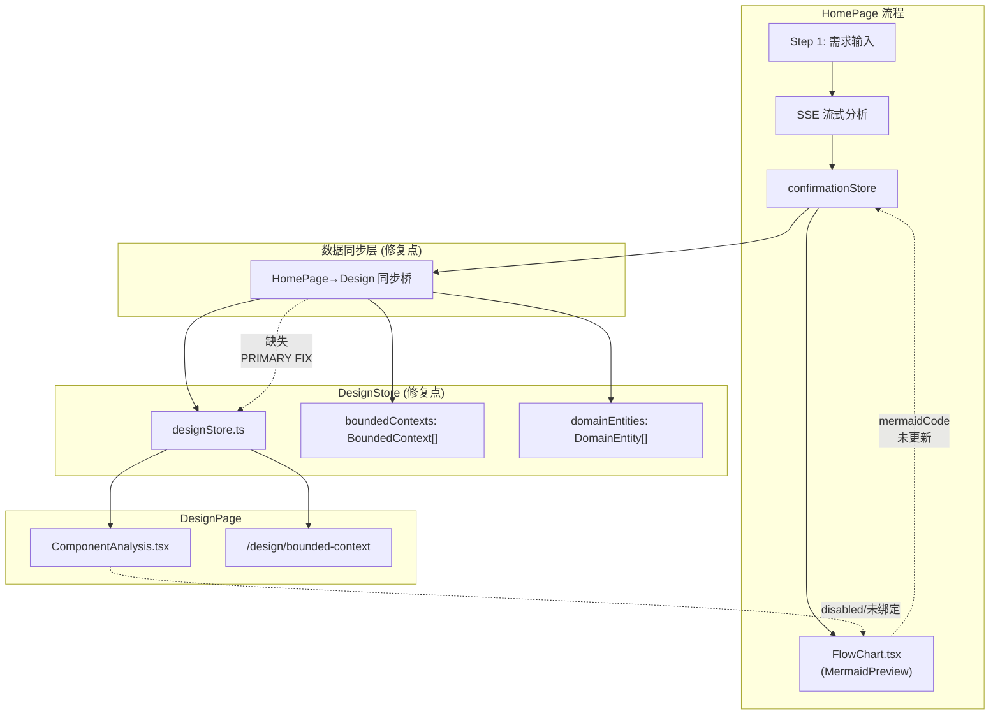
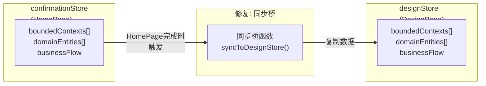

# 架构设计: Step 2 回归问题修复

**项目**: vibex-step2-regression  
**架构师**: Architect Agent  
**日期**: 2026-03-20

---

## 1. 问题概述

| 问题 | 症状 | 根因定位 |
|------|------|----------|
| F1: UI组件分析点不了 | 按钮 disabled 或事件未绑定 | ComponentAnalysis.tsx |
| F2: 第一步流程图不显示 | Mermaid 占位图 | FlowChart.tsx / mermaidCode 状态 |
| F3: HomePage→Design 数据不同步 | designStore 与 confirmationStore 隔离 | designStore.ts |

---

## 2. 整体架构



---

## 3. 修复方案

### 3.1 F1: UI组件分析点击修复

**根因**: ComponentAnalysis 组件按钮为 disabled 或 onClick 未绑定

**检查清单**:

```typescript
// ComponentAnalysis.tsx — 问题排查
interface ComponentAnalysisProps {
  onClick?: () => void;        // ← 可能缺失
  disabled?: boolean;           // ← 可能硬编码 true
}

// 错误写法
<button disabled={true} onClick={undefined}>

// 正确写法
<button 
  disabled={disabled || isLoading}
  onClick={onClick ?? handleDefaultClick}
>
  {label}
</button>
```

**修复代码**:

```typescript
// ComponentAnalysis.tsx
interface ComponentAnalysisProps {
  onClick?: () => void;
  disabled?: boolean;
  isLoading?: boolean;
}

export function ComponentAnalysis({ 
  onClick, 
  disabled = false, 
  isLoading = false 
}: ComponentAnalysisProps) {
  const handleClick = useCallback(() => {
    if (!disabled && !isLoading && onClick) {
      onClick();
    }
  }, [disabled, isLoading, onClick]);

  return (
    <button
      data-testid="component-analysis"
      disabled={disabled || isLoading}
      onClick={handleClick}
      className={styles.analysisButton}
    >
      {isLoading ? '分析中...' : 'UI组件分析'}
    </button>
  );
}
```

**HomePage 集成**:

```typescript
// HomePage.tsx
import { ComponentAnalysis } from '@/components/homepage/ComponentAnalysis';

export function HomePage() {
  const [isAnalyzing, setIsAnalyzing] = useState(false);

  const handleComponentAnalysis = useCallback(() => {
    // 跳转到设计页面或打开分析模态
    router.push('/design/component-analysis');
  }, []);

  return (
    <ComponentAnalysis
      onClick={handleComponentAnalysis}
      disabled={isAnalyzing}
      isLoading={isAnalyzing}
    />
  );
}
```

---

### 3.2 F2: 流程图不显示修复

**根因**: `confirmationStore.flowMermaidCode` 未更新或 MermaidPreview 未订阅

**修复点 1: 状态更新后触发重渲染**

```typescript
// FlowChart.tsx (或 PreviewArea 中的 FlowChart)
export function FlowChart() {
  const flowMermaidCode = useConfirmationStore((s) => s.flowMermaidCode);
  const [svg, setSvg] = useState('');
  const isReady = useRef(false);

  // 监听 mermaidCode 变化
  useEffect(() => {
    if (!flowMermaidCode) {
      setSvg('');
      return;
    }

    const renderMermaid = async () => {
      try {
        const manager = MermaidManager.getInstance();
        if (!manager.isInitialized()) {
          await manager.initialize();
        }
        const result = await manager.render(flowMermaidCode);
        setSvg(result);
      } catch (err) {
        console.error('[FlowChart] Render failed:', err);
        setSvg('');
      }
    };

    renderMermaid();
  }, [flowMermaidCode]);

  if (!svg) {
    return <FlowChartPlaceholder />;
  }

  return <div dangerouslySetInnerHTML={{ __html: svg }} />;
}
```

**修复点 2: 确认流程结束时保存 mermaidCode**

```typescript
// 在 StepBusinessFlow 或 confirmationStore 中
export const useConfirmationStore = create(
  persist(
    (set, get) => ({
      flowMermaidCode: null as string | null,
      
      setFlowMermaidCode: (code: string) => {
        set({ flowMermaidCode: code });
      },
      
      // 新增: 流程完成时同步
      onFlowComplete: (flow: BusinessFlow, mermaidCode: string) => {
        set({
          flowMermaidCode: mermaidCode,
          businessFlow: flow,
          currentStep: 3, // Step 4 业务流程
        });
      },
    }),
    { name: 'vibex-confirmation' }
  )
);
```

**修复点 3: MermaidManager 确保初始化**

```typescript
// 确保 MermaidManager 在 FlowChart 挂载前初始化
// App-level: 在 RootLayout 中提前初始化
export default function RootLayout({ children }) {
  useEffect(() => {
    MermaidManager.getInstance().initialize().catch(console.error);
  }, []);

  return (
    <html>
      <body>{children}</body>
    </html>
  );
}
```

---

### 3.3 F3: HomePage→Design 数据同步桥

**根因**: confirmationStore 和 designStore 是两个独立的 store，无同步机制



**同步桥实现**:

```typescript
// lib/sync/confirmation-to-design.ts

export function syncConfirmationToDesignStore() {
  const confirmation = useConfirmationStore.getState();
  const design = useDesignStore.getState();

  // 同步限界上下文
  if (confirmation.boundedContexts?.length > 0) {
    design.setBoundedContexts(confirmation.boundedContexts);
  }

  // 同步领域实体
  if (confirmation.domainEntities?.length > 0) {
    design.setDomainEntities(confirmation.domainEntities);
  }

  // 同步业务流程（Mermaid）
  if (confirmation.flowMermaidCode) {
    design.setFlowMermaidCode(confirmation.flowMermaidCode);
  }

  // 同步澄清数据
  if (confirmation.clarificationRounds?.length > 0) {
    design.setClarificationRounds(confirmation.clarificationRounds);
  }

  console.debug('[SyncBridge] Confirmation → DesignStore synced');
}
```

**集成点**: 在 HomePage 导航到 DesignPage 时调用

```typescript
// HomePage.tsx
const handleNavigateToDesign = useCallback(() => {
  // 1. 同步数据
  syncConfirmationToDesignStore();
  
  // 2. 跳转到设计页面
  router.push('/design/bounded-context');
}, []);
```

**或者在 designStore 中监听 confirmationStore 变化**:

```typescript
// designStore.ts
// 添加 effect hook 来同步
export function useSyncFromConfirmation() {
  const confirmation = useConfirmationStore();
  
  useEffect(() => {
    if (confirmation.boundedContexts?.length > 0) {
      useDesignStore.getState().setBoundedContexts(confirmation.boundedContexts);
    }
  }, [confirmation.boundedContexts]);
}
```

---

## 4. 数据模型

```typescript
// 同步数据结构
interface DesignSyncPayload {
  boundedContexts: BoundedContext[];
  domainEntities: DomainEntity[];
  businessFlow: BusinessFlow;
  flowMermaidCode: string;
  clarificationRounds: ClarificationRound[];
  source: 'homepage' | 'design';
  syncedAt: string;
}

// 类型兼容性检查
type BoundedContext = {
  id: string;
  name: string;
  description: string;
  entities: string[];
};

// confirmationStore 和 designStore 的 boundedContext 类型需一致
type ConfirmationBoundedContext = BoundedContext;
type DesignBoundedContext = BoundedContext;
// 两者应共享同一类型定义，避免 cast
```

---

## 5. 测试策略

```typescript
// __tests__/step2-regression.test.ts

describe('F1: ComponentAnalysis Click', () => {
  it('ST-01: 按钮可点击（不 disabled）', () => {
    render(<ComponentAnalysis disabled={false} onClick={vi.fn()} />);
    expect(screen.getByTestId('component-analysis')).not.toBeDisabled();
  });

  it('ST-02: 点击触发 onClick', () => {
    const handler = vi.fn();
    render(<ComponentAnalysis onClick={handler} />);
    fireEvent.click(screen.getByTestId('component-analysis'));
    expect(handler).toHaveBeenCalledTimes(1);
  });
});

describe('F2: FlowChart Rendering', () => {
  it('ST-03: mermaidCode 有值时渲染 SVG', async () => {
    useConfirmationStore.setState({ flowMermaidCode: 'graph TD\nA-->B' });
    render(<FlowChart />);
    await waitFor(() => {
      expect(document.querySelector('.mermaid svg')).toBeInTheDocument();
    });
  });

  it('ST-04: mermaidCode 非空且格式正确', () => {
    useConfirmationStore.setState({ flowMermaidCode: 'graph TD\nA-->B' });
    const code = useConfirmationStore.getState().flowMermaidCode;
    expect(code).toContain('graph');
    expect(code).toMatch(/graph\s+(TD|LR|RL|BT)/);
  });
});

describe('F3: HomePage→Design Data Sync', () => {
  it('F2.3: boundedContexts 从 confirmation 同步到 design', () => {
    const testContexts = [{ id: '1', name: 'Test' }];
    useConfirmationStore.setState({ boundedContexts: testContexts });
    
    syncConfirmationToDesignStore();
    
    expect(useDesignStore.getState().boundedContexts).toEqual(testContexts);
  });
});
```

---

## 6. 实施计划

```
Phase 1: F1 修复 (1h)
  Step 1.1: 检查 ComponentAnalysis.tsx 按钮状态
  Step 1.2: 添加 disabled/onClick 绑定
  Step 1.3: HomePage 集成
  Step 1.4: 单元测试

Phase 2: F2 修复 (2h)
  Step 2.1: 检查 FlowChart mermaidCode 订阅
  Step 2.2: 添加 useEffect 监听
  Step 2.3: MermaidManager 初始化时序
  Step 2.4: FlowChart 单元测试

Phase 3: F3 修复 (1h)
  Step 3.1: 创建 syncConfirmationToDesignStore()
  Step 3.2: 集成到 HomePage 导航
  Step 3.3: 添加 store 同步测试

Phase 4: E2E 验证 (1h)
  Step 4.1: 首页→设计页面完整流程 E2E
  Step 4.2: npm run build 验证

总工作量: 5h
```

---

## 7. 技术决策

| 决策点 | 选项 | 选择 | 理由 |
|--------|------|------|------|
| 同步时机 | 导航时同步 vs 实时监听 | 导航时同步 | 避免 store 耦合，性能更好 |
| 同步方向 | confirmation → design（单向）| ✅ | 首页是数据源，设计页是消费方 |
| 同步字段 | boundedContexts + entities + flow | ✅ | 覆盖所有关键数据 |
| F1 修复位置 | ComponentAnalysis 组件内部 | ✅ | 解耦，不影响其他组件 |

---

*Generated by: Architect Agent*
