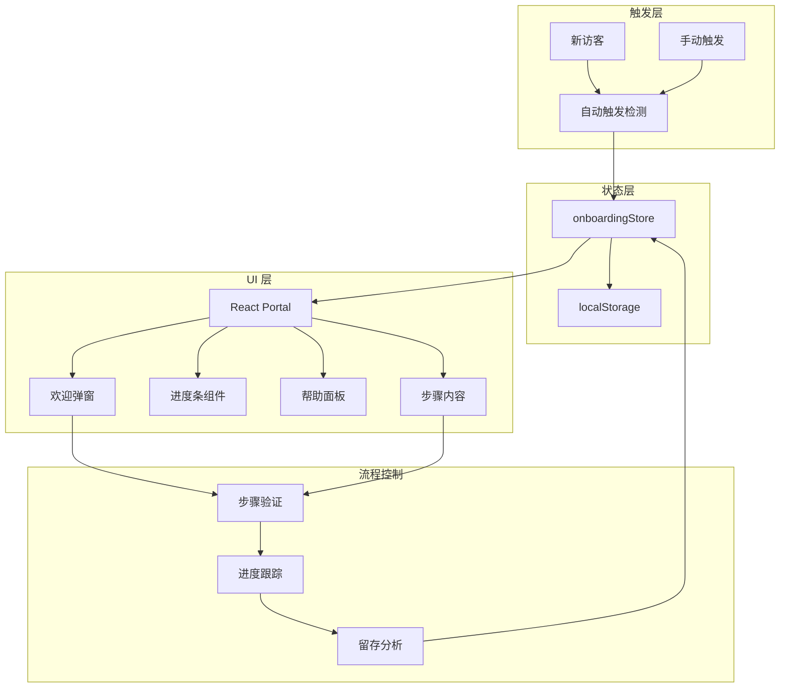
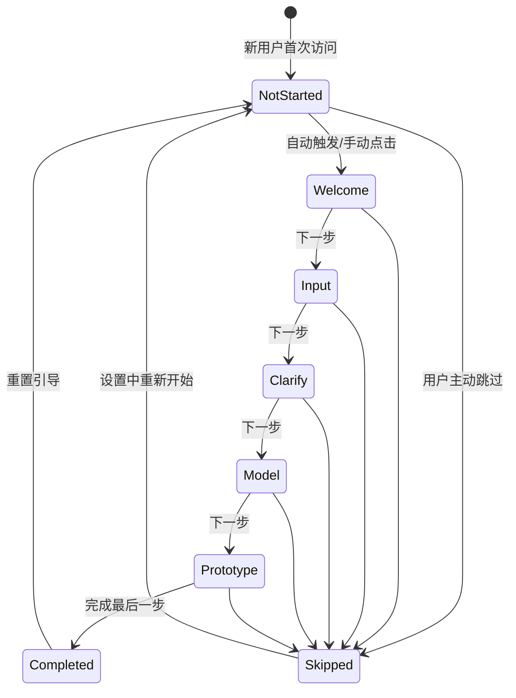
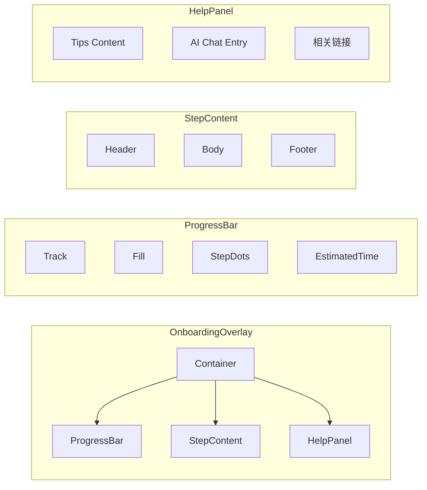
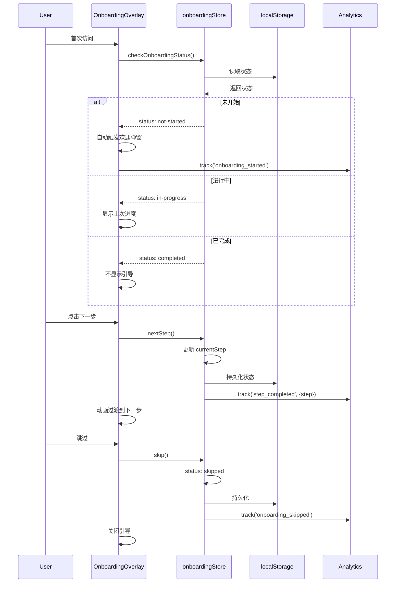
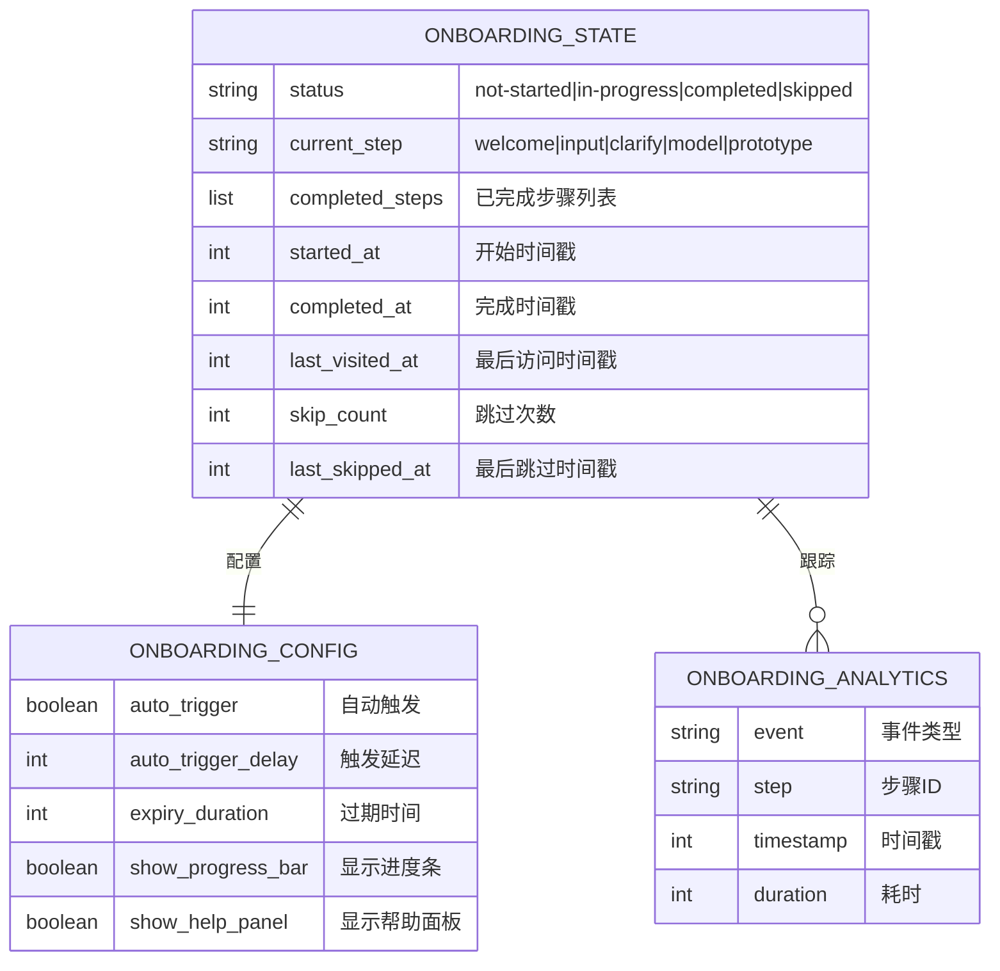

# 用户引导流程优化架构设计文档

**项目**: vibex-user-onboarding-optimization  
**版本**: v1.0  
**日期**: 2026-03-15  
**作者**: Architect Agent

---

## 1. Tech Stack (技术栈选型)

### 1.1 核心技术栈

| 组件 | 选型 | 版本 | 理由 |
|------|------|------|------|
| **状态管理** | Zustand | 现有 | 已有 onboardingStore |
| **持久化** | localStorage | 现有 | 已有 persist 中间件 |
| **UI 组件** | React Portal | 18+ | 弹窗隔离，不影响主流程 |
| **动画** | Framer Motion | 现有 | 已有，提升体验 |
| **进度条** | 自定义组件 | 新增 | 轻量级 |
| **帮助面板** | React Sidepanel | 现有 | 复用 panel 系统 |

### 1.2 技术选型对比

| 方案 | 优点 | 缺点 | 推荐度 |
|------|------|------|--------|
| **React Portal + Overlay** | 隔离性好，不影响主页面 | 需处理 z-index | ⭐⭐⭐⭐⭐ |
| Modal 对话框 | 实现简单 | 阻塞主流程 | ⭐⭐⭐ |
| Floating UI | 功能丰富 | 额外依赖 | ⭐⭐⭐ |
| Custom Tooltip | 完全可控 | 开发成本高 | ⭐⭐⭐ |

**结论**: 采用 **React Portal + Overlay** 方案，复用现有 panel 系统。

---

## 2. Architecture Diagram (架构图)

### 2.1 整体架构



### 2.2 引导流程状态机



### 2.3 组件架构



### 2.4 数据流



---

## 3. API Definitions (接口定义)

### 3.1 OnboardingStore 扩展接口

```typescript
// stores/onboarding/types.ts

import type { OnboardingStep, OnboardingStatus } from './types';

/**
 * 引导配置
 */
export interface OnboardingConfig {
  /** 是否启用自动触发 */
  autoTrigger: boolean;
  /** 自动触发延迟 (ms) */
  autoTriggerDelay: number;
  /** 引导过期时间 (ms) */
  expiryDuration: number;
  /** 是否显示进度条 */
  showProgressBar: boolean;
  /** 是否显示帮助面板 */
  showHelpPanel: boolean;
}

/**
 * 步骤进度信息
 */
export interface StepProgress {
  step: OnboardingStep;
  completed: boolean;
  estimatedTime: number;  // 剩余时间 (秒)
  canNavigate: boolean;  // 是否可跳转
}

/**
 * 引导状态 (扩展)
 */
export interface OnboardingState {
  // 现有字段
  status: OnboardingStatus;
  currentStep: OnboardingStep;
  completedSteps: OnboardingStep[];
  startedAt?: number;
  completedAt?: number;
  
  // 新增字段
  lastVisitedAt?: number;
  skipCount?: number;
  lastSkippedAt?: number;
}

/**
 * 引导 Actions (扩展)
 */
export interface OnboardingActions {
  // 现有 Actions
  start: () => void;
  nextStep: () => void;
  prevStep: () => void;
  goToStep: (step: OnboardingStep) => void;
  completeStep: (step: OnboardingStep) => void;
  complete: () => void;
  skip: () => void;
  reset: () => void;
  
  // 新增 Actions
  /** 检查并触发引导 */
  checkAndTrigger: () => void;
  /** 获取步骤进度 */
  getStepProgress: () => StepProgress[];
  /** 获取预计剩余时间 */
  getEstimatedRemainingTime: () => number;
  /** 标记步骤已查看 */
  markStepViewed: (step: OnboardingStep) => void;
  /** 检查是否可重新触发 */
  canRetrigger: () => boolean;
}

/**
 * 完整 Store 类型
 */
export type OnboardingStore = OnboardingState & OnboardingActions;
```

### 3.2 进度条组件接口

```typescript
// components/onboarding/ProgressBar.tsx

export interface ProgressBarProps {
  /** 当前步骤 */
  currentStep: OnboardingStep;
  /** 已完成步骤 */
  completedSteps: OnboardingStep[];
  /** 预计剩余时间 (秒) */
  estimatedRemainingTime?: number;
  /** 是否可点击跳转 */
  clickable?: boolean;
  /** 点击回调 */
  onStepClick?: (step: OnboardingStep) => void;
  /** 类名 */
  className?: string;
}

/**
 * 顶部进度条组件
 * 显示：Step X/5 | 预计剩余时间 | 可点击跳转
 */
export function ProgressBar({
  currentStep,
  completedSteps,
  estimatedRemainingTime,
  clickable = true,
  onStepClick,
  className,
}: ProgressBarProps): JSX.Element;
```

### 3.3 帮助面板组件接口

```typescript
// components/onboarding/HelpPanel.tsx

export interface HelpContent {
  /** 步骤 ID */
  stepId: OnboardingStep;
  /** 标题 */
  title: string;
  /** 内容 */
  content: string;
  /** 提示列表 */
  tips?: string[];
  /** 相关链接 */
  links?: Array<{
    text: string;
    url: string;
  }>;
}

export interface HelpPanelProps {
  /** 当前步骤 */
  currentStep: OnboardingStep;
  /** 是否展开 */
  isOpen?: boolean;
  /** 关闭回调 */
  onClose?: () => void;
  /** AI 聊天回调 */
  onAIClick?: () => void;
  /** 类名 */
  className?: string;
}

/**
 * 上下文帮助面板
 * 显示当前步骤的提示、技巧、相关链接
 */
export function HelpPanel({
  currentStep,
  isOpen = false,
  onClose,
  onAIClick,
  className,
}: HelpPanelProps): JSX.Element;
```

### 3.4 引导覆盖层组件接口

```typescript
// components/onboarding/OnboardingOverlay.tsx

export interface OnboardingOverlayProps {
  /** 是否显示 */
  isOpen?: boolean;
  /** 关闭回调 */
  onClose?: () => void;
  /** 完成回调 */
  onComplete?: () => void;
  /** 跳过回调 */
  onSkip?: () => void;
  /** 类名 */
  className?: string;
}

/**
 * 引导覆盖层主组件
 * 使用 React Portal 渲染，包含欢迎弹窗、进度条、帮助面板
 */
export function OnboardingOverlay({
  isOpen,
  onClose,
  onComplete,
  onSkip,
  className,
}: OnboardingOverlayProps): JSX.Element | null;
```

### 3.5 引导 Hook 接口

```typescript
// hooks/useOnboarding.ts

export interface UseOnboardingReturn {
  /** 引导状态 */
  status: OnboardingStatus;
  /** 当前步骤 */
  currentStep: OnboardingStep;
  /** 已完成步骤 */
  completedSteps: OnboardingStep[];
  /** 是否在进行中 */
  isActive: boolean;
  /** 进度百分比 */
  progress: number;
  /** 预计剩余时间 */
  estimatedTime: number;
  /** 开始引导 */
  start: () => void;
  /** 下一步 */
  next: () => void;
  /** 上一步 */
  prev: () => void;
  /** 跳转步骤 */
  goTo: (step: OnboardingStep) => void;
  /** 跳过 */
  skip: () => void;
  /** 重置 */
  reset: () => void;
}

/**
 * 引导功能 Hook
 * 提供简化的引导状态和操作
 */
export function useOnboarding(): UseOnboardingReturn;
```

---

## 4. Data Model (数据模型)

### 4.1 引导状态数据模型



### 4.2 localStorage 数据结构

```typescript
// 存储键: vibex-onboarding

interface OnboardingStorage {
  // 状态
  state: {
    status: OnboardingStatus;
    currentStep: OnboardingStep;
    completedSteps: OnboardingStep[];
    startedAt?: number;
    completedAt?: number;
    lastVisitedAt?: number;
    skipCount?: number;
    lastSkippedAt?: number;
  };
  
  // 版本
  version: number;
}

// 存储键: vibex-onboarding-config

interface OnboardingConfigStorage {
  autoTrigger: boolean;
  autoTriggerDelay: number;
  expiryDuration: number;
  showProgressBar: boolean;
  showHelpPanel: boolean;
}
```

### 4.3 步骤配置数据

```typescript
// 配置: onboardingSteps.ts

export interface OnboardingStepConfig {
  id: OnboardingStep;
  title: string;
  description: string;
  icon: string;
  duration: string;           // 显示的时长
  durationSeconds: number;    // 实际秒数
  route?: string;            // 对应路由 (可选)
  targetElement?: string;    // 高亮目标元素选择器
  helpContent: HelpContent;   // 帮助面板内容
}

export const ONBOARDING_STEP_CONFIGS: Record<OnboardingStep, OnboardingStepConfig> = {
  welcome: {
    id: 'welcome',
    title: '欢迎使用 VibeX',
    description: 'AI 驱动的协作式设计平台，让产品需求分析更高效',
    icon: '🎯',
    duration: '1分钟',
    durationSeconds: 60,
    route: '/',
    helpContent: {
      title: '什么是 VibeX?',
      content: 'VibeX 是一个基于 DDD (领域驱动设计) 的 AI 协作平台，帮助团队快速分析和设计产品。',
      tips: [
        '支持多人协作',
        'AI 辅助需求分析',
        '自动生成领域模型',
      ],
    },
  },
  input: {
    id: 'input',
    title: '描述您的需求',
    description: '用自然语言描述您的产品需求，AI 会帮您分析',
    icon: '📝',
    duration: '2分钟',
    durationSeconds: 120,
    route: '/?step=input',
    targetElement: '[data-testid=requirement-input]',
    helpContent: {
      title: '如何描述需求?',
      content: '尽量详细地描述您的产品功能、用户群体、业务流程。',
      tips: [
        '描述核心功能',
        '说明目标用户',
        '列出关键业务流程',
      ],
    },
  },
  // ... 其他步骤配置
};
```

---

## 5. Implementation Details (实现细节)

### 5.1 扩展 OnboardingStore

```typescript
// stores/onboarding/onboardingStore.ts (扩展)

import { create } from 'zustand';
import { persist, createJSONStorage } from 'zustand/middleware';
import { OnboardingStep, OnboardingStatus, STEP_ORDER, getNextStep, getStepIndex } from './types';

const STORAGE_KEY = 'vibex-onboarding';

// 默认配置
const DEFAULT_CONFIG = {
  autoTrigger: true,
  autoTriggerDelay: 1000,
  expiryDuration: 7 * 24 * 60 * 60 * 1000, // 7 天
  showProgressBar: true,
  showHelpPanel: true,
};

interface OnboardingState {
  // 现有字段
  status: OnboardingStatus;
  currentStep: OnboardingStep;
  completedSteps: OnboardingStep[];
  startedAt?: number;
  completedAt?: number;
  
  // 新增字段
  lastVisitedAt?: number;
  skipCount?: number;
  lastSkippedAt?: number;
}

export const useOnboardingStore = create<OnboardingState & OnboardingActions>()(
  persist(
    (set, get) => ({
      status: 'not-started',
      currentStep: 'welcome',
      completedSteps: [],
      skipCount: 0,

      // 检查并触发引导
      checkAndTrigger: () => {
        const { status, lastVisitedAt } = get();
        const now = Date.now();
        
        if (status === 'not-started') {
          // 检查是否过期
          if (lastVisitedAt && (now - lastVisitedAt) > DEFAULT_CONFIG.expiryDuration) {
            // 过期了，重置状态
            set({
              status: 'not-started',
              currentStep: 'welcome',
              completedSteps: [],
              startedAt: undefined,
            });
          } else {
            // 自动开始
            set({ status: 'in-progress', startedAt: now });
          }
        }
        
        set({ lastVisitedAt: now });
      },

      // 扩展 nextStep 方法
      nextStep: () => {
        const { currentStep, completedSteps, status } = get();
        
        if (status !== 'in-progress') return;
        
        // 标记当前步骤为完成
        if (!completedSteps.includes(currentStep)) {
          set({ completedSteps: [...completedSteps, currentStep] });
        }
        
        const next = getNextStep(currentStep);
        if (next) {
          set({ currentStep: next });
        } else {
          // 没有下一步，完成引导
          get().complete();
        }
      },

      // 扩展 skip 方法
      skip: () => {
        const { skipCount = 0 } = get();
        set({
          status: 'skipped',
          skipCount: skipCount + 1,
          lastSkippedAt: Date.now(),
        });
      },

      // 获取步骤进度
      getStepProgress: (): StepProgress[] => {
        const { currentStep, completedSteps } = get();
        
        return STEP_ORDER.map((step, index) => {
          const stepIndex = getStepIndex(step);
          const currentIndex = getStepIndex(currentStep);
          
          return {
            step,
            completed: completedSteps.includes(step),
            estimatedTime: Math.max(0, (STEP_ORDER.length - index - 1) * 120),
            canNavigate: completedSteps.includes(step) || step === currentStep,
          };
        });
      },

      // 获取预计剩余时间
      getEstimatedRemainingTime: () => {
        const { currentStep, completedSteps } = get();
        const currentIndex = getStepIndex(currentStep);
        const remainingSteps = STEP_ORDER.length - currentIndex - 1;
        
        return remainingSteps * 120;
      },

      // 检查是否可重新触发
      canRetrigger: () => {
        const { skipCount = 0, lastSkippedAt } = get();
        
        if (skipCount >= 3) return true;
        
        if (lastSkippedAt) {
          const daysSinceSkip = (Date.now() - lastSkippedAt) / (24 * 60 * 60 * 1000);
          return daysSinceSkip >= 1;
        }
        
        return true;
      },
      
      // ... 其他现有方法保持不变
    }),
    {
      name: STORAGE_KEY,
      storage: createJSONStorage(() => localStorage),
    }
  )
);
```

### 5.2 进度条组件实现

```typescript
// components/onboarding/ProgressBar.tsx

'use client';

import { useMemo } from 'react';
import { motion } from 'framer-motion';
import { useOnboardingStore, ONBOARDING_STEP_CONFIGS } from '@/stores/onboarding';
import styles from './Onboarding.module.css';

interface ProgressBarProps {
  currentStep: string;
  completedSteps: string[];
  estimatedRemainingTime?: number;
  clickable?: boolean;
  onStepClick?: (step: string) => void;
  className?: string;
}

export function ProgressBar({
  currentStep,
  completedSteps,
  estimatedRemainingTime,
  clickable = true,
  onStepClick,
  className,
}: ProgressBarProps) {
  const stepOrder = ['welcome', 'input', 'clarify', 'model', 'prototype'];
  const currentIndex = stepOrder.indexOf(currentStep);
  const progress = ((currentIndex + 1) / stepOrder.length) * 100;
  
  const formatTime = (seconds: number): string => {
    if (seconds < 60) return `${seconds}秒`;
    const mins = Math.floor(seconds / 60);
    return `约${mins}分钟`;
  };

  return (
    <div className={`${styles.progressBar} ${className || ''}`}>
      <div className={styles.track}>
        <motion.div 
          className={styles.fill}
          initial={{ width: 0 }}
          animate={{ width: `${progress}%` }}
          transition={{ duration: 0.3 }}
        />
      </div>
      
      <div className={styles.steps}>
        {stepOrder.map((step, index) => {
          const isCompleted = completedSteps.includes(step);
          const isCurrent = step === currentStep;
          const config = ONBOARDING_STEP_CONFIGS[step as keyof typeof ONBOARDING_STEP_CONFIGS];
          
          return (
            <button
              key={step}
              className={`${styles.step} ${isCompleted ? styles.completed : ''} ${isCurrent ? styles.current : ''}`}
              onClick={() => clickable && isCompleted && onStepClick?.(step)}
              disabled={!clickable || (!isCompleted && !isCurrent)}
              title={config?.title}
            >
              <span className={styles.stepNumber}>
                {isCompleted ? '✓' : index + 1}
              </span>
              <span className={styles.stepLabel}>{config?.title}</span>
            </button>
          );
        })}
      </div>
      
      {estimatedRemainingTime !== undefined && (
        <div className={styles.timeEstimate}>
          预计剩余: {formatTime(estimatedRemainingTime)}
        </div>
      )}
    </div>
  );
}
```

### 5.3 帮助面板组件实现

```typescript
// components/onboarding/HelpPanel.tsx

'use client';

import { useState } from 'react';
import { motion, AnimatePresence } from 'framer-motion';
import { ONBOARDING_STEP_CONFIGS } from '@/stores/onboarding';
import styles from './Onboarding.module.css';

interface HelpPanelProps {
  currentStep: string;
  isOpen?: boolean;
  onClose?: () => void;
  onAIClick?: () => void;
  className?: string;
}

export function HelpPanel({
  currentStep,
  isOpen = false,
  onClose,
  onAIClick,
  className,
}: HelpPanelProps) {
  const config = ONBOARDING_STEP_CONFIGS[currentStep as keyof typeof ONBOARDING_STEP_CONFIGS];
  const helpContent = config?.helpContent;

  return (
    <AnimatePresence>
      {isOpen && helpContent && (
        <motion.div
          className={`${styles.helpPanel} ${className || ''}`}
          initial={{ opacity: 0, x: 20 }}
          animate={{ opacity: 1, x: 0 }}
          exit={{ opacity: 0, x: 20 }}
          transition={{ duration: 0.2 }}
        >
          <div className={styles.helpHeader}>
            <h3>{helpContent.title}</h3>
            <button className={styles.closeButton} onClick={onClose}>
              ×
            </button>
          </div>
          
          <div className={styles.helpContent}>
            <p>{helpContent.content}</p>
          </div>
          
          {helpContent.tips && helpContent.tips.length > 0 && (
            <div className={styles.tips}>
              <h4>💡 提示</h4>
              <ul>
                {helpContent.tips.map((tip, index) => (
                  <li key={index}>{tip}</li>
                ))}
              </ul>
            </div>
          )}
          
          <button className={styles.aiButton} onClick={onAIClick}>
            <span>🤖</span>
            <span>向 AI 提问</span>
          </button>
        </motion.div>
      )}
    </AnimatePresence>
  );
}
```

### 5.4 引导覆盖层主组件

```typescript
// components/onboarding/OnboardingOverlay.tsx

'use client';

import { useEffect, useCallback } from 'react';
import { createPortal } from 'react-dom';
import { useOnboardingStore } from '@/stores/onboarding';
import { ProgressBar } from './ProgressBar';
import { HelpPanel } from './HelpPanel';
import { WelcomeModal } from './WelcomeModal';
import { StepContent } from './StepContent';
import styles from './Onboarding.module.css';

interface OnboardingOverlayProps {
  onComplete?: () => void;
  onSkip?: () => void;
}

export function OnboardingOverlay({
  onComplete,
  onSkip,
}: OnboardingOverlayProps) {
  const {
    status,
    currentStep,
    completedSteps,
    checkAndTrigger,
    nextStep,
    prevStep,
    goToStep,
    skip,
    reset,
    getEstimatedRemainingTime,
  } = useOnboardingStore();

  useEffect(() => {
    checkAndTrigger();
  }, [checkAndTrigger]);

  useEffect(() => {
    if (status === 'completed') {
      onComplete?.();
    }
  }, [status, onComplete]);

  const handleSkip = useCallback(() => {
    skip();
    onSkip?.();
  }, [skip, onSkip]);

  if (status !== 'in-progress' && status !== 'not-started') {
    return null;
  }

  if (currentStep === 'welcome' && !completedSteps.includes('welcome')) {
    return createPortal(
      <WelcomeModal onStart={nextStep} onSkip={handleSkip} />,
      document.body
    );
  }

  return createPortal(
    <div className={styles.overlay}>
      <div className={styles.topBar}>
        <ProgressBar
          currentStep={currentStep}
          completedSteps={completedSteps}
          estimatedRemainingTime={getEstimatedRemainingTime()}
          onStepClick={goToStep}
        />
        
        <button className={styles.skipButton} onClick={handleSkip}>
          跳过引导
        </button>
      </div>
      
      <div className={styles.mainContent}>
        <StepContent
          step={currentStep}
          onNext={nextStep}
          onPrev={prevStep}
        />
      </div>
      
      <HelpPanel
        currentStep={currentStep}
        isOpen={true}
        onAIClick={() => {}}
      />
    </div>,
    document.body
  );
}
```

---

## 6. Testing Strategy (测试策略)

### 6.1 测试框架

| 测试类型 | 框架 | 工具 |
|----------|------|------|
| 单元测试 | Jest 30.2 | @testing-library/react |
| 组件测试 | Jest | @testing-library/react |
| E2E 测试 | Playwright | - |

### 6.2 核心测试用例

```typescript
// __tests__/stores/onboarding/onboardingStore.test.ts

import { useOnboardingStore } from '@/stores/onboarding';

describe('OnboardingStore Extensions', () => {
  beforeEach(() => {
    useOnboardingStore.getState().reset();
    localStorage.clear();
  });

  describe('checkAndTrigger', () => {
    it('should auto-trigger for new user', () => {
      const { checkAndTrigger } = useOnboardingStore.getState();
      
      checkAndTrigger();
      
      expect(useOnboardingStore.getState().status).toBe('in-progress');
    });

    it('should not trigger for completed user', () => {
      const store = useOnboardingStore.getState();
      store.complete();
      store.checkAndTrigger();
      
      expect(store.status).toBe('completed');
    });
  });

  describe('getEstimatedRemainingTime', () => {
    it('should return correct remaining time', () => {
      const { nextStep, getEstimatedRemainingTime } = useOnboardingStore.getState();
      
      let remaining = getEstimatedRemainingTime();
      expect(remaining).toBeGreaterThan(0);
      
      nextStep();
      remaining = getEstimatedRemainingTime();
      expect(remaining).toBeLessThan(480);
    });
  });
});
```

### 6.3 E2E 测试

```typescript
// e2e/onboarding.spec.ts

import { test, expect } from '@playwright/test';

test.describe('User Onboarding', () => {
  test('should auto-trigger for new visitor', async ({ page }) => {
    await page.addInitScript(() => {
      localStorage.clear();
    });
    
    await page.goto('/');
    await page.waitForSelector('[data-testid=onboarding-welcome]');
    await expect(page.locator('text=欢迎使用 VibeX')).toBeVisible();
  });

  test('should show progress bar after welcome', async ({ page }) => {
    await page.goto('/');
    await page.click('[data-testid=start-onboarding]');
    
    await expect(page.locator('[data-testid=progress-bar]')).toBeVisible();
    await expect(page.locator('text=Step 2/5')).toBeVisible();
  });

  test('should allow skipping', async ({ page }) => {
    await page.goto('/');
    await page.click('[data-testid=start-onboarding]');
    await page.click('[data-testid=skip-onboarding]');
    
    await expect(page.locator('[data-testid=onboarding-overlay]')).not.toBeVisible();
  });
});
```

---

## 7. Implementation Roadmap (实施路线图)

### Phase 1: 基础扩展 (1 天)

| 步骤 | 工时 | 产出物 |
|------|------|--------|
| 1.1 扩展 Store | 2h | checkAndTrigger, getEstimatedRemainingTime 等 |
| 1.2 添加类型定义 | 1h | 新的接口定义 |
| 1.3 Store 单元测试 | 2h | __tests__/stores/onboarding/ |

### Phase 2: 组件开发 (1 天)

| 步骤 | 工时 | 产出物 |
|------|------|--------|
| 2.1 进度条组件 | 3h | ProgressBar.tsx |
| 2.2 帮助面板组件 | 2h | HelpPanel.tsx |
| 2.3 欢迎弹窗 | 1h | WelcomeModal.tsx |
| 2.4 组件测试 | 2h | __tests__/components/onboarding/ |

### Phase 3: 集成与优化 (1 天)

| 步骤 | 工时 | 内容 |
|------|------|------|
| 3.1 主组件集成 | 2h | OnboardingOverlay.tsx |
| 3.2 首页集成 | 2h | 挂载引导组件 |
| 3.3 E2E 测试 | 3h | 完整用户流程测试 |

**总工期**: 3 天

---

## 8. 风险评估

| 风险 | 等级 | 缓解措施 |
|------|------|----------|
| 自动触发时机不当 | 🟡 中 | 添加延迟 + 用户可跳过 |
| 进度条遮挡内容 | 🟡 中 | 可折叠设计 + 位置可调 |
| 跳过率过高 | 🟡 中 | 优化引导内容 + A/B 测试 |
| 与现有功能冲突 | 🟢 低 | 使用 Portal 隔离 |

---

## 9. Acceptance Criteria (验收标准)

### 9.1 功能验收

- [ ] 首次访问用户自动弹出引导 (AC1)
- [ ] 顶部显示进度条 (AC2)
- [ ] 每步显示预计剩余时间 (AC3)
- [ ] 点击进度可跳转已完成步骤 (AC4)
- [ ] 跳过后可在设置页重新开始 (AC5)
- [ ] 跳过不影响正常流程使用 (AC6)

### 9.2 验证命令

```bash
# 运行单元测试
npm test -- --testPathPattern="onboarding"

# 运行 E2E 测试
npm run test:e2e -- --grep "Onboarding"
```

---

**产出物**: `docs/vibex-user-onboarding-optimization/architecture.md`  
**作者**: Architect Agent  
**日期**: 2026-03-15