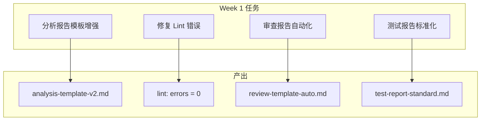
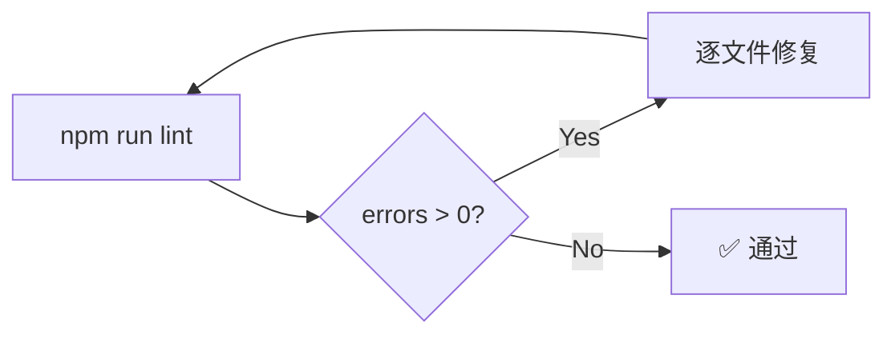
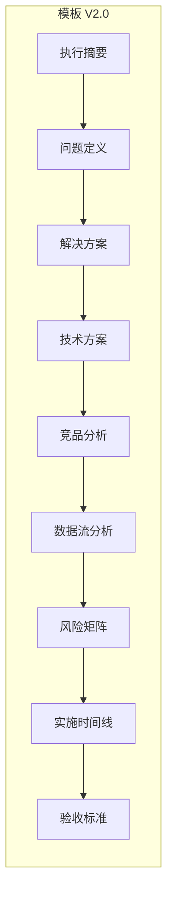
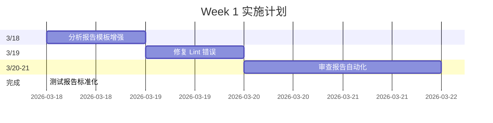

# Week 1 优先任务实施架构设计

**项目**: week1-impl-20260318  
**架构师**: Architect Agent  
**日期**: 2026-03-18  
**状态**: ✅ 设计完成

---

## 一、技术栈

| 技术 | 用途 |
|------|------|
| ESLint | 代码检查 |
| Markdown | 报告模板 |
| Node.js Scripts | 自动化 |

---

## 二、架构图

### 2.1 整体架构



### 2.2 Lint 修复流程



---

## 三、任务分解

### 3.1 F1: 分析报告模板增强



**文件**: `docs/templates/analysis-template-v2.md`

### 3.2 F2: 修复 Lint 错误

```bash
# Lint 修复命令
npm run lint 2>&1 | grep "error"

# 常见错误类型
- unused-vars
- missing-imports
- type-errors

# 修复策略
1. 先修复 blocking errors
2. 再修复 warnings
3. 最后优化 suggestions
```

### 3.3 F3: 审查报告自动化

```typescript
// 自动化模板结构
interface ReviewReport {
  project: string;
  timestamp: string;
  reviewer: string;
  
  // 审查维度
  codeQuality: {
    score: number;
    issues: Issue[];
  };
  security: {
    score: number;
    vulnerabilities: Vuln[];
  };
  functionality: {
    passed: boolean;
    details: string;
  };
  
  // 决策
  decision: 'approved' | 'rejected' | 'conditional';
  comments: string[];
}
```

### 3.4 F4: 测试报告标准化

```markdown
## 测试报告标准结构

### 1. 测试概览
- 项目名称
- 测试日期
- 测试人员
- 测试类型

### 2. 测试结果
| 测试项 | 状态 | 备注 |
|--------|------|------|
| xxx    | PASS | -    |

### 3. 覆盖率
- 语句覆盖率: xx%
- 分支覆盖率: xx%

### 4. 问题汇总
- 严重: x
- 中等: x
- 轻微: x
```

---

## 四、接口定义

### 4.1 模板接口

```typescript
interface AnalysisTemplateV2 {
  // 执行摘要
  summary: {
    conclusion: string;
    metrics: Metric[];
    recommendations: Recommendation[];
  };
  
  // 问题定义
  problemStatement: {
    background: string;
    coreProblems: Problem[];
  };
  
  // 解决方案
  solution: {
    options: Option[];
    recommendation: string;
  };
  
  // 技术方案
  technical: {
    architecture: string;
    dataFlow: string;
  };
  
  // 竞品分析
  competitiveAnalysis: {
    competitors: Competitor[];
    comparison: Comparison[];
  };
  
  // 风险矩阵
  riskMatrix: {
    risks: Risk[];
    probability: 'high' | 'medium' | 'low';
    impact: 'high' | 'medium' | 'low';
  };
  
  // 实施时间线
  timeline: {
    phases: Phase[];
    milestones: Milestone[];
  };
  
  // 验收标准
  acceptanceCriteria: AC[];
}
```

---

## 五、验收标准

| ID | 任务 | 验收标准 | 验证方法 |
|----|------|----------|----------|
| ARCH-001 | 模板增强 | analysis-template-v2.md 存在 | 文件检查 |
| ARCH-002 | 模板增强 | 包含 9 个章节 | 代码检查 |
| ARCH-003 | Lint 修复 | npm run lint 通过 | CI |
| ARCH-004 | 审查自动化 | 模板可生成报告 | 演示 |
| ARCH-005 | 测试标准化 | 报告格式统一 | 审查 |

---

## 六、实施计划



---

## 七、约束检查

| 约束 | 状态 | 说明 |
|------|------|------|
| 不删除现有模板 | ✅ | 创建 V2 而非替换 V1 |
| 保持向后兼容 | ✅ | 模板结构扩展 |
| 不删除现有测试 | ✅ | 仅修复 Lint 错误 |
| 保持现有功能 | ✅ | 零破坏变更 |
| 不破坏审查流程 | ✅ | 新模板独立使用 |

---

## 八、产出物

| 文件 | 位置 |
|------|------|
| 架构文档 | `docs/week1-impl-20260318/architecture.md` |
| 分析模板 V2 | `docs/templates/analysis-template-v2.md` |
| 审查自动化模板 | `docs/templates/review-template-auto.md` |
| 测试报告标准 | `docs/templates/test-report-standard.md` |

---

**完成时间**: 2026-03-18 07:51  
**架构师**: Architect Agent