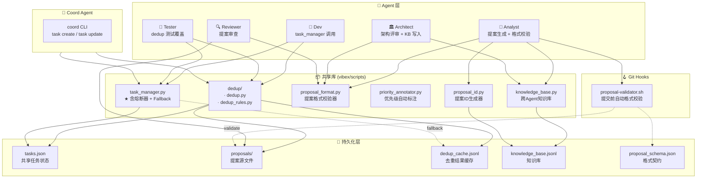
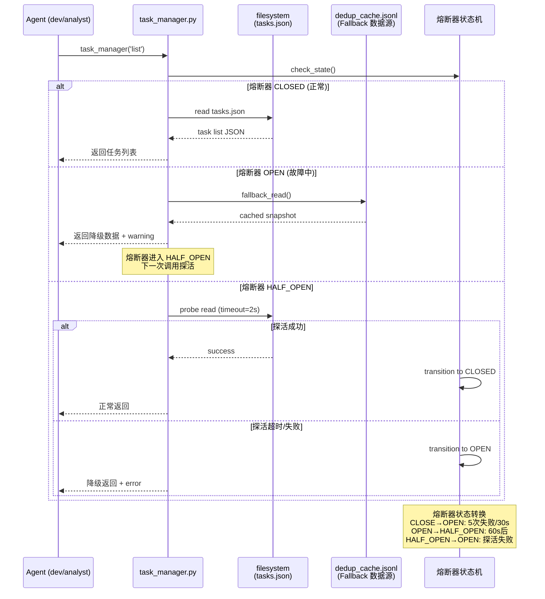
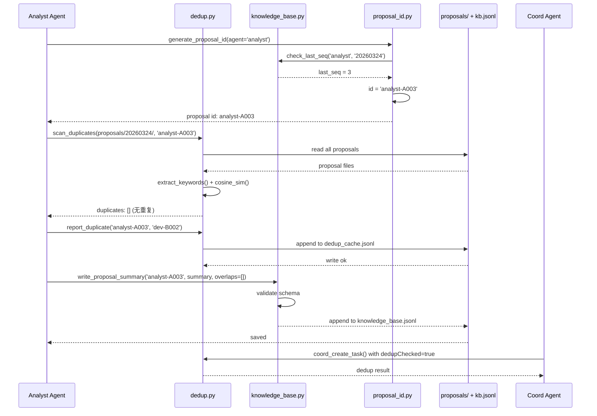
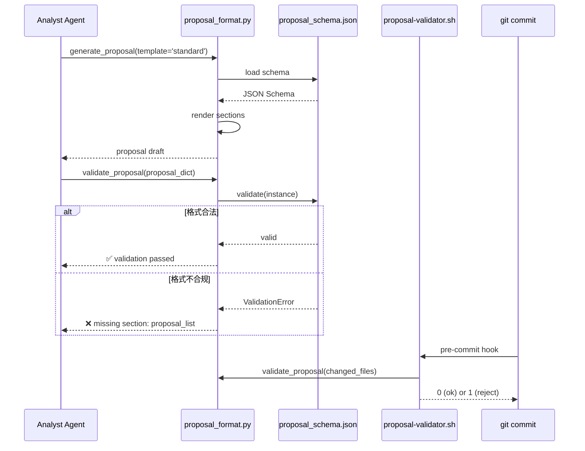
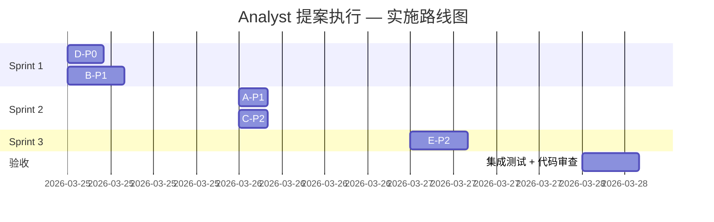

# Architecture: Analyst 提案执行 — 20260324_185417

**项目**: vibex-analyst-proposals-20260324_185417  
**架构师**: Architect Agent  
**日期**: 2026-03-24  
**状态**: ✅ 设计完成  
**参考**: `prd.md` | `proposals/20260324/analyst-proposals.md`

---

## 1. 技术栈选择及理由

### 1.1 核心语言与运行时

| 组件 | 选择 | 版本 | 理由 |
|------|------|------|------|
| **主语言** | Python 3 | ≥3.11 | 现有 codebase 基础 (`task_manager.py`)，标准库丰富，跨平台 |
| **CLI 工具** | Bash 5.x | ≥5.2 | 现有 githooks、proposal-validator.sh，无需引入额外依赖 |
| **测试框架** | pytest | ≥8.0 | 已有 pytest 缓存基础设施，支持 fixture + parametrize |
| **类型检查** | mypy | ≥1.8 | 与 Python 原生结合紧密，覆盖 dataclass 字段类型 |
| **超时控制** | signal.SIGALRM / threading | 内置 | 避免 `timeout-decorator` 外部依赖，Linux 原生支持 |
| **熔断器** | 自研状态机 | — | 逻辑简单（仅3状态），引入 Tenacity 或 pybreaker 增加维护成本 |
| **提案 ID 生成** | Python hashlib + datetime | 内置 | 无需 uuid 库，纯标准库实现确定性 ID |
| **知识库存储** | JSON Lines (.jsonl) | — | append-only，支持多 reader，不锁写，符合 agent 写入模式 |
| **格式验证** | JSON Schema | jsonschema 4.x | 提案格式标准化 Story A-P1 的机器可读契约 |

### 1.2 为什么不引入新框架

- **无重型 ORM/数据库**: 现有数据流已基于 JSON 文件，无需引入 SQLite/PostgreSQL
- **无消息队列**: Sprint 1-3 范围无需事件驱动重构，coord 直接调用 agent 消息工具即可
- **渐进式演进**: 若 Sprint 3 后跨 Agent 知识共享规模扩大，可在 E-P2 实现验证后再评估引入向量数据库

---

## 2. 整体架构图



**图注**: 红色虚线 (`-. fallback .-`) 表示 task_manager 的降级路径，Sprint 1 B-P1 核心改造点。

---

## 3. 关键技术点时序图

### 3.1 task_manager 熔断 + Fallback 时序



### 3.2 提案去重 (D-P0) + ID 生成 (E-P2) 时序



### 3.3 提案格式标准化 (A-P1) 时序



---

## 4. 关键 API / 接口定义

### 4.1 task_manager.py — 熔断增强 (B-P1)

```python
# 文件: vibex/scripts/task_manager.py
# 新增 / 改动接口

from dataclasses import dataclass
from enum import Enum
from typing import Optional
import json
import time
import subprocess

class CircuitState(Enum):
    CLOSED = "closed"    # 正常，允许请求
    OPEN = "open"        # 故障，拒绝请求，走 fallback
    HALF_OPEN = "half_open"  # 探活中

@dataclass
class CircuitBreaker:
    failure_threshold: int = 5       # 触发熔断的失败次数
    recovery_timeout: int = 60        # OPEN → HALF_OPEN 等待秒数
    probe_timeout: int = 2            # 探活超时秒数
    state: CircuitState = CircuitState.CLOSED
    failure_count: int = 0
    last_failure_time: float = 0.0

    def record_failure(self) -> None:
        self.failure_count += 1
        if self.failure_count >= self.failure_threshold:
            self.state = CircuitState.OPEN

    def record_success(self) -> None:
        self.failure_count = 0
        self.state = CircuitState.CLOSED

    def should_allow_request(self, now: float) -> bool:
        if self.state == CircuitState.CLOSED:
            return True
        if self.state == CircuitState.OPEN:
            if now - self.last_failure_time >= self.recovery_timeout:
                self.state = CircuitState.HALF_OPEN
                return True
            return False
        return True  # HALF_OPEN 允许一个探活请求


def task_manager_list(
    fallback_json: bool = True,
    timeout_ms: int = 5000,
    circuit_breaker: Optional[CircuitBreaker] = None,
) -> dict:
    """
    列出所有任务，支持超时控制和熔断降级。

    Returns:
        {
            "status": "ok" | "degraded" | "error",
            "projects": [...],
            "source": "live" | "fallback",
            "exit_time_ms": int,
            "circuit_state": str,
            "warning": str | None,
        }

    Raises:
        SystemExit(1): 降级也失败时
    """
    start = time.time()
    cb = circuit_breaker or CircuitBreaker()
    now = time.time()

    if not cb.should_allow_request(now):
        return _fallback_response(source="circuit_open", exit_time_ms=0)

    try:
        result = subprocess.run(
            ["python3", __file__, "list", "--json"],
            capture_output=True,
            text=True,
            timeout=timeout_ms / 1000,
        )
        elapsed = (time.time() - start) * 1000

        if result.returncode == 0:
            cb.record_success()
            data = json.loads(result.stdout)
            return {
                "status": "ok",
                "projects": data.get("projects", []),
                "source": "live",
                "exit_time_ms": int(elapsed),
                "circuit_state": cb.state.value,
                "warning": None,
            }
        else:
            raise subprocess.CalledProcessError(result.returncode, result.stderr)

    except (subprocess.TimeoutExpired, subprocess.CalledProcessError) as e:
        cb.record_failure()
        cb.last_failure_time = time.time()
        elapsed = (time.time() - start) * 1000

        if fallback_json:
            fb = _fallback_response(source="fallback_timeout", exit_time_ms=int(elapsed))
            fb["warning"] = f"Primary call failed ({type(e).__name__}), using cached data"
            return fb
        else:
            return {
                "status": "error",
                "source": "none",
                "exit_time_ms": int(elapsed),
                "circuit_state": cb.state.value,
                "warning": str(e),
            }


def task_manager_health() -> dict:
    """健康检查接口。"""
    cb = CircuitBreaker()
    return {
        "status": "ok" if cb.state == CircuitState.CLOSED else "degraded",
        "circuit_state": cb.state.value,
        "last_failure": str(cb.last_failure_time) if cb.failure_count > 0 else None,
    }


def _fallback_response(source: str, exit_time_ms: int) -> dict:
    """从 dedup_cache.jsonl 读取降级数据"""
    import pathlib
    fallback_path = pathlib.Path(__file__).parent.parent / "dedup" / "dedup_cache.jsonl"
    projects = []
    if fallback_path.exists():
        with open(fallback_path) as f:
            for line in f:
                try:
                    entry = json.loads(line)
                    if "projects" in entry:
                        projects.extend(entry["projects"])
                except json.JSONDecodeError:
                    pass
    return {
        "status": "degraded",
        "projects": projects,
        "source": source,
        "exit_time_ms": exit_time_ms,
        "circuit_state": CircuitState.OPEN.value,
        "warning": "Running in degraded mode. Primary data source unavailable.",
    }
```

### 4.2 dedup.py — 去重增强 (D-P0)

```python
# 文件: vibex/scripts/dedup/dedup.py
# 新增接口

from dataclasses import dataclass, field
from pathlib import Path
from typing import Optional
import json
import time

@dataclass
class DedupReport:
    """去重扫描报告"""
    proposal_id: str
    scan_dir: str
    duplicates: list[dict] = field(default_factory=list)
    dedup_checked: bool = False
    exit_time_ms: int = 0

    def to_dict(self) -> dict:
        return {
            "proposal_id": self.proposal_id,
            "scan_dir": self.scan_dir,
            "duplicates": self.duplicates,
            "dedup_checked": self.dedup_checked,
            "exit_time_ms": self.exit_time_ms,
        }


def scan_duplicates(
    scan_dir: str | Path,
    current_proposal_id: str,
    threshold_warn: float = 0.4,
    threshold_block: float = 0.7,
) -> DedupReport:
    """
    扫描目录下所有提案文件，检测与当前提案的重复度。

    Returns:
        DedupReport: 包含重复提案列表和元数据
    """
    start = time.time()
    scan_path = Path(scan_dir)
    duplicates: list[dict] = []
    current_keywords: set[str] = set()

    # 加载当前提案关键词
    for md_file in scan_path.rglob("*.md"):
        file_id = _parse_proposal_id_from_path(md_file)
        if file_id == current_proposal_id:
            try:
                content = md_file.read_text(encoding="utf-8")
                current_keywords = extract_keywords(content)
            except Exception:
                pass

    # 与其他提案比较
    for md_file in scan_path.rglob("*.md"):
        if md_file.name in ("prd.md", "analysis.md"):
            continue
        file_id = _parse_proposal_id_from_path(md_file)
        if file_id == current_proposal_id or not file_id:
            continue
        try:
            content = md_file.read_text(encoding="utf-8")
            other_keywords = extract_keywords(content)
            sim = _cosine_similarity(current_keywords, other_keywords)
            if sim >= threshold_block:
                duplicates.append({
                    "id": file_id,
                    "sim_score": round(sim, 3),
                    "path": str(md_file.relative_to(scan_path.parent.parent)),
                    "action": "block",
                })
            elif sim >= threshold_warn:
                duplicates.append({
                    "id": file_id,
                    "sim_score": round(sim, 3),
                    "path": str(md_file.relative_to(scan_path.parent.parent)),
                    "action": "warn",
                })
        except Exception:
            continue

    elapsed = (time.time() - start) * 1000
    return DedupReport(
        proposal_id=current_proposal_id,
        scan_dir=str(scan_dir),
        duplicates=duplicates,
        dedup_checked=True,
        exit_time_ms=int(elapsed),
    )


def _parse_proposal_id_from_path(path: Path) -> str:
    """从文件路径解析提案 ID，如 analyst-A003-proposals.md → analyst-A003"""
    name = path.stem
    parts = name.split("-")
    if len(parts) >= 2:
        return f"{parts[0]}-{parts[1]}"
    return ""


def _cosine_similarity(a: set[str], b: set[str]) -> float:
    """计算两个关键词集合的余弦相似度"""
    if not a or not b:
        return 0.0
    intersection = len(a & b)
    return intersection / (len(a) ** 0.5 * len(b) ** 0.5)


def coord_create_task_with_dedup(task_name: str, scan_dir: str = "proposals/") -> dict:
    """
    Coord 创建任务时自动执行去重检查。
    在 task create 流程中插入 dedup 步骤。

    Returns:
        {"task": {...}, "dedup_report": DedupReport, "dedupChecked": True}
    """
    report = scan_duplicates(scan_dir, task_name)
    _append_to_cache(report)
    return {
        "task": {"name": task_name, "dedupChecked": True},
        "dedup_report": report.to_dict(),
        "dedupChecked": True,
    }


def _append_to_cache(report: DedupReport) -> None:
    """追加去重报告到 dedup_cache.jsonl"""
    cache_path = Path(__file__).parent / "dedup_cache.jsonl"
    with open(cache_path, "a", encoding="utf-8") as f:
        f.write(json.dumps(report.to_dict(), ensure_ascii=False) + "\n")
```

### 4.3 proposal_format.py — 提案格式标准化 (A-P1)

```python
# 文件: vibex/scripts/proposal_format.py (新文件)

import json
from pathlib import Path
from typing import Optional
from dataclasses import dataclass, field

PROPOSAL_SECTIONS = [
    "proposal_list",
    "summary",
    "impact",
    "risks",
    "effort",
    "acceptance",
]

PROPOSAL_SCHEMA = {
    "$schema": "http://json-schema.org/draft-07/schema#",
    "type": "object",
    "required": ["proposal_list", "summary"],
    "properties": {
        "proposal_list": {
            "type": "array",
            "items": {
                "type": "object",
                "required": ["id", "title", "priority"],
                "properties": {
                    "id": {"type": "string", "pattern": r"^[a-z]+-[A-Z]\d{3}$"},
                    "title": {"type": "string", "minLength": 1},
                    "priority": {"type": "string", "enum": ["P0", "P1", "P2", "P3"]},
                    "owner": {"type": "string"},
                    "description": {"type": "string"},
                    "effort": {"type": "string"},
                },
            },
        },
        "summary": {"type": "string", "minLength": 1},
        "sections": {"type": "array", "items": {"type": "string"}},
    },
}


@dataclass
class Proposal:
    """标准化提案数据模型"""
    proposal_list: list[dict] = field(default_factory=list)
    summary: str = ""
    sections: list[str] = field(default_factory=list)

    @classmethod
    def from_dict(cls, data: dict) -> "Proposal":
        return cls(
            proposal_list=data.get("proposal_list", []),
            summary=data.get("summary", ""),
            sections=data.get("sections", []),
        )

    def to_dict(self) -> dict:
        return {"proposal_list": self.proposal_list, "summary": self.summary, "sections": self.sections}


def validate_proposal(proposal: dict | Proposal) -> tuple[bool, Optional[str]]:
    """
    验证提案是否符合标准格式。

    Returns:
        (is_valid, error_message)
    """
    from jsonschema import validate, ValidationError as JsonValidationError

    if isinstance(proposal, Proposal):
        proposal = proposal.to_dict()

    try:
        validate(instance=proposal, schema=PROPOSAL_SCHEMA)
        required = set(PROPOSAL_SECTIONS)
        actual = set(proposal.get("sections", []))
        missing = required - actual
        if missing:
            return False, f"missing sections: {', '.join(sorted(missing))}"
        return True, None
    except JsonValidationError as e:
        return False, f"JSONSchema validation failed: {e.message}"


def generate_proposal(template: str = "standard", overrides: Optional[dict] = None) -> dict:
    """生成标准化提案字典。"""
    defaults = {"sections": PROPOSAL_SECTIONS, "proposal_list": [], "summary": ""}
    if overrides:
        defaults.update(overrides)
    return defaults


def render_proposal_markdown(proposal: dict) -> str:
    """将提案字典渲染为 Markdown 格式。"""
    lines = [f"# 提案执行摘要\n\n{proposal.get('summary', '')}\n\n## 提案列表\n\n"]
    for item in proposal.get("proposal_list", []):
        lines.append(f"### {item['id']} - {item['title']} [{item.get('priority', 'P?')}]\n")
        if item.get("description"):
            lines.append(f"{item['description']}\n")
        if item.get("effort"):
            lines.append(f"**工时**: {item['effort']} | **负责人**: {item.get('owner', 'TBD')}\n")
        lines.append("\n")
    return "".join(lines)
```

### 4.4 priority_annotator.py — 优先级自动标注 (C-P2)

```python
# 文件: vibex/scripts/priority_annotator.py (新文件)

from dataclasses import dataclass
import json
import re

@dataclass
class PriorityResult:
    """优先级标注结果"""
    task_id: str
    priority: str       # P0/P1/P2/P3
    priority_reason: str
    confidence: float   # 0.0-1.0

    def to_dict(self) -> dict:
        return {
            "task_id": self.task_id,
            "priority": self.priority,
            "priority_reason": self.priority_reason,
            "confidence": round(self.confidence, 3),
        }


# 优先级决策规则（可扩展为 YAML 配置）
PRIORITY_RULES = [
    (["容错", "熔断", "超时", "重试", "fallback", "circuit"], "P1", 0.90),
    (["重复", "去重", "dedup", "duplicate"], "P0", 0.95),
    (["稳定性", "toolchain", "工具链"], "P1", 0.80),
    (["提案格式", "标准化", "format", "schema"], "P1", 0.85),
    (["跨Agent", "知识共享", "knowledge_base", "kb"], "P2", 0.80),
    (["优先级", "priority", "标注"], "P2", 0.90),
    (["bug", "fix", "修复", "错误"], "P0", 0.70),
    (["feature", "功能", "新功能"], "P2", 0.60),
    (["test", "测试", "coverage"], "P3", 0.70),
]


def annotate_priority(task_name: str, task_goal: str = "") -> PriorityResult:
    """
    根据任务名称和目标自动标注优先级。

    规则匹配逻辑：
      1. 对每条规则的关键词进行文本匹配
      2. 匹配词越多，置信度越高（+2% per matched keyword）
      3. 返回置信度最高的匹配结果
      4. 无匹配时返回 P2，置信度 0.3（需人工确认）
    """
    combined = f"{task_name} {task_goal}".lower()
    best: tuple[str, list[str], float] | None = None
    best_conf = 0.0

    for keywords, priority, base_conf in PRIORITY_RULES:
        matches = sum(1 for kw in keywords if kw.lower() in combined)
        if matches > 0:
            adjusted = min(base_conf + matches * 0.02, 1.0)
            if adjusted > best_conf:
                best_conf = adjusted
                best = (priority, keywords, base_conf)

    if best:
        priority, matched_kw, _ = best
        reason = (
            f"匹配关键词规则 [{', '.join(repr(kw) for kw in matched_kw)}]，"
            f"基础优先级={priority}，匹配增强后置信度={best_conf:.0%}"
        )
        return PriorityResult(task_id=task_name, priority=priority,
                              priority_reason=reason, confidence=best_conf)

    return PriorityResult(
        task_id=task_name,
        priority="P2",
        priority_reason="无匹配规则，默认 P2，请人工确认",
        confidence=0.3,
    )


def annotate_task_file(task_file: str) -> None:
    """原地更新任务 JSON 文件的 priority 字段。"""
    with open(task_file) as f:
        task = json.load(f)

    result = annotate_priority(task.get("name", ""), task.get("goal", ""))
    task["priority"] = result.priority
    task["priorityReason"] = result.priority_reason
    task["priorityConfidence"] = result.confidence

    with open(task_file, "w") as f:
        json.dump(task, f, indent=2, ensure_ascii=False)
```

### 4.5 knowledge_base.py — 跨 Agent 知识共享 (E-P2)

```python
# 文件: vibex/scripts/knowledge_base.py (新文件)

from dataclasses import dataclass, field
from pathlib import Path
from datetime import datetime
from typing import Optional
import json

KB_FILE = Path(__file__).parent.parent / "knowledge_base.jsonl"


@dataclass
class ProposalSummary:
    """提案摘要条目（知识库单条记录）"""
    proposal_id: str       # e.g. "analyst-A003"
    agent: str             # e.g. "analyst"
    date: str              # e.g. "20260324"
    title: str
    summary: str
    keywords: list[str] = field(default_factory=list)
    overlaps: list[str] = field(default_factory=list)
    created_at: str = ""

    def __post_init__(self):
        if not self.created_at:
            self.created_at = datetime.now().isoformat()

    def to_dict(self) -> dict:
        return {
            "proposal_id": self.proposal_id,
            "agent": self.agent,
            "date": self.date,
            "title": self.title,
            "summary": self.summary,
            "keywords": self.keywords,
            "overlaps": self.overlaps,
            "created_at": self.created_at,
        }

    @classmethod
    def from_dict(cls, data: dict) -> "ProposalSummary":
        valid = {f.name for f in cls.__dataclass_fields__.values()}
        return cls(**{k: v for k, v in data.items() if k in valid})


def write_proposal_summary(summary: ProposalSummary) -> None:
    """
    追加写入知识库（append-only）。
    多 Agent 并发写入安全（jsonl 单条追加，不锁文件）。
    """
    KB_FILE.parent.mkdir(parents=True, exist_ok=True)
    with open(KB_FILE, "a", encoding="utf-8") as f:
        f.write(json.dumps(summary.to_dict(), ensure_ascii=False) + "\n")


def read_knowledge_base(
    agent: Optional[str] = None,
    date: Optional[str] = None,
) -> list[ProposalSummary]:
    """读取知识库，可按 Agent 或日期过滤。返回按 created_at 倒序。"""
    results = []
    if not KB_FILE.exists():
        return results

    with open(KB_FILE, encoding="utf-8") as f:
        for line in f:
            try:
                entry = ProposalSummary.from_dict(json.loads(line))
                if agent and entry.agent != agent:
                    continue
                if date and entry.date != date:
                    continue
                results.append(entry)
            except (json.JSONDecodeError, TypeError, ValueError):
                continue

    results.sort(key=lambda x: x.created_at, reverse=True)
    return results


def find_overlaps(proposal_id: str, kb_entries: Optional[list[ProposalSummary]] = None) -> list[str]:
    """
    查找知识库中与指定提案有重叠（Jaccard > 0.3）的其他提案 ID。
    用于 analyst 验收标准 `overlaps` 字段。
    """
    if kb_entries is None:
        kb_entries = read_knowledge_base()

    current: Optional[ProposalSummary] = None
    for entry in kb_entries:
        if entry.proposal_id == proposal_id:
            current = entry
            break

    if not current:
        return []

    overlaps = []
    current_kw = set(current.keywords)
    for entry in kb_entries:
        if entry.proposal_id == proposal_id:
            continue
        entry_kw = set(entry.keywords)
        if not current_kw or not entry_kw:
            continue
        jaccard = len(current_kw & entry_kw) / len(current_kw | entry_kw)
        if jaccard > 0.3:
            overlaps.append(entry.proposal_id)

    return overlaps


def generate_knowledge_summary() -> dict:
    """生成知识库统计摘要。"""
    entries = read_knowledge_base()
    by_agent: dict[str, int] = {}
    by_date: dict[str, int] = {}
    for e in entries:
        by_agent[e.agent] = by_agent.get(e.agent, 0) + 1
        by_date[e.date] = by_date.get(e.date, 0) + 1

    return {
        "total_entries": len(entries),
        "by_agent": by_agent,
        "by_date": by_date,
        "last_updated": entries[0].created_at if entries else None,
    }
```

### 4.6 proposal_id.py — 跨 Agent 唯一 ID 生成 (E-P2)

```python
# 文件: vibex/scripts/proposal_id.py (新文件)

import re
from datetime import datetime
from typing import Optional

PROPOSAL_ID_PATTERN = re.compile(r"^([a-z]+)-([A-Z]\d{2,4})$")

AGENT_LIST = {"dev", "analyst", "architect", "pm", "tester", "reviewer", "coord"}


def generate_proposal_id(agent: str, date: Optional[str] = None) -> str:
    """
    生成跨 Agent 唯一的提案 ID。

    格式: {agent}-{SeqCode}{DaySuffix}
    示例: analyst-A003 (analyst Agent, 20260324第3个提案)

    序号编码: 1→A, 2→B, ..., 26→Z, 27→AA, 28→AB...

    Raises:
        ValueError: agent 名称不合法
    """
    from knowledge_base import read_knowledge_base

    if agent not in AGENT_LIST:
        raise ValueError(f"Unknown agent: {agent!r}. Must be one of {AGENT_LIST}")

    if date is None:
        date = datetime.now().strftime("%Y%m%d")

    entries = read_knowledge_base(agent=agent, date=date)
    seq = len(entries) + 1
    seq_code = _int_to_alpha(seq)
    day_suffix = date[-2:]

    return f"{agent}-{seq_code}{day_suffix}"


def _int_to_alpha(n: int) -> str:
    """正整数 → Excel 风格字母序号: 1→A, 27→AA"""
    result = ""
    while n > 0:
        n, rem = divmod(n - 1, 26)
        result = chr(65 + rem) + result
    return result


def validate_proposal_id(proposal_id: str) -> bool:
    """验证提案 ID 格式合法性。"""
    return PROPOSAL_ID_PATTERN.match(proposal_id) is not None


def parse_proposal_id(proposal_id: str) -> Optional[dict]:
    """解析提案 ID 各组成部分。"""
    match = PROPOSAL_ID_PATTERN.match(proposal_id)
    if not match:
        return None
    return {"agent": match.group(1), "seq": match.group(2), "raw": proposal_id}
```

---

## 5. 数据模型

### 5.1 核心实体关系

```
┌─────────────────────┐       ┌──────────────────────┐
│   Task (tasks.json) │       │ Proposal (proposals/) │
│─────────────────────│       │─────────────────────────│
│ · id                │       │ · id (e.g. analyst-A003)│
│ · name              │       │ · title                │
│ · goal              │       │ · priority (P0-P3)     │
│ · status            │       │ · owner                │
│ · priority          │       │ · effort               │
│ · priorityReason    │       │ · description          │
│ · priorityConfidence │      │ · sections             │
│ · dedupChecked      │       │ · summary              │
│ · created           │       └──────────────────────────┘
│ · agent             │
└─────────┬───────────┘
          │
          │ dedupChecked=true
          ▼
┌─────────────────────┐       ┌──────────────────────┐
│ DedupReport         │       │ ProposalSummary (KB)   │
│ (dedup_cache.jsonl)  │       │ (knowledge_base.jsonl) │
│─────────────────────│       │─────────────────────────│
│ · proposal_id        │       │ · proposal_id          │
│ · scan_dir          │       │ · agent                │
│ · duplicates[]      │       │ · date                 │
│ · dedup_checked     │       │ · title                │
│ · exit_time_ms      │       │ · summary              │
└─────────────────────┘       │ · keywords             │
                               │ · overlaps[]           │
                               │ · created_at           │
                               └────────────────────────┘
```

### 5.2 关键数据文件规格

| 文件 | 格式 | 写入模式 | 读取模式 | 说明 |
|------|------|----------|----------|------|
| `tasks.json` | JSON | 独占写（coord） | 共享读（所有 agent） | 全局任务状态 |
| `proposals/{date}/*.md` | Markdown | 独占写（各 agent） | 共享读 | 原始提案文件 |
| `dedup_cache.jsonl` | JSONL | append（追加） | 全量扫描 | 去重报告缓存 |
| `knowledge_base.jsonl` | JSONL | append（追加） | 过滤查询 | 跨 Agent 知识库 |
| `proposal_schema.json` | JSON Schema | 只读 | 只读 | 提案格式契约 |

---

## 6. 测试策略

### 6.1 测试框架与覆盖率目标

- **框架**: pytest + pytest-cov
- **覆盖率目标**: ≥ 80%（语句覆盖率）
- **测试文件位置**: `vibex/scripts/tests/`
- **CI**: `.githooks/proposal-validator.sh` 在 pre-commit 阶段运行

### 6.2 测试用例示例

#### 6.2.1 task_manager 熔断器单元测试

```python
# vibex/scripts/tests/test_task_manager_circuit.py

import pytest
import time
from task_manager import CircuitBreaker, CircuitState, task_manager_list

class TestCircuitBreaker:
    def test_initial_state_closed(self
class TestCircuitBreaker:
    def test_initial_state_closed(self):
        cb = CircuitBreaker()
        assert cb.state == CircuitState.CLOSED
        assert cb.should_allow_request(time.time()) is True

    def test_opens_after_failure_threshold(self):
        cb = CircuitBreaker(failure_threshold=3)
        for _ in range(3):
            cb.record_failure()
        assert cb.state == CircuitState.OPEN
        assert cb.should_allow_request(time.time()) is False

    def test_half_open_after_recovery_timeout(self):
        cb = CircuitBreaker(failure_threshold=1, recovery_timeout=1)
        cb.record_failure()
        cb.last_failure_time = time.time() - 2  # 过期
        assert cb.should_allow_request(time.time()) is True
        assert cb.state == CircuitState.HALF_OPEN

    def test_success_resets_circuit(self):
        cb = CircuitBreaker(failure_threshold=1)
        cb.record_failure()
        assert cb.state == CircuitState.OPEN
        cb.record_success()
        assert cb.state == CircuitState.CLOSED
        assert cb.failure_count == 0

    def test_task_manager_list_with_mock_timeout(self, monkeypatch):
        """模拟 subprocess 超时，验证 fallback 路径"""
        def mock_run(*args, **kwargs):
            raise TimeoutError
        monkeypatch.setattr("subprocess.run", mock_run)
        result = task_manager_list(timeout_ms=100, fallback_json=True)
        assert result["status"] == "degraded"
        assert result["source"] == "fallback_timeout"
        assert result["circuit_state"] == "open"


class TestTaskManagerList:
    def test_exit_time_less_than_5000ms(self):
        """PRD Story B-P1 验收: list 命令退出时间 < 5000ms"""
        result = task_manager_list()
        assert result["exit_time_ms"] < 5000, \
            f"Exit time {result['exit_time_ms']}ms exceeds 5000ms limit"

    def test_health_status_ok(self):
        """PRD Story B-P1 验收: health 命令返回 ok"""
        from task_manager import task_manager_health
        result = task_manager_health()
        assert result["status"] in ("ok", "degraded")

    def test_fallback_json_has_projects_property(self):
        """PRD Story B-P1 验收: fallback 响应包含 projects 字段"""
        result = task_manager_list(fallback_json=True)
        assert "projects" in result
```

#### 6.2.2 dedup 去重测试

```python
# vibex/scripts/tests/test_dedup.py

import pytest
import tempfile
import json
from pathlib import Path
from dedup import scan_duplicates, DedupReport, _cosine_similarity, _parse_proposal_id_from_path


class TestCosineSimilarity:
    def test_identical_sets(self):
        s = {"a", "b", "c"}
        assert _cosine_similarity(s, s) == 1.0

    def test_disjoint_sets(self):
        assert _cosine_similarity({"a", "b"}, {"c", "d"}) == 0.0

    def test_partial_overlap(self):
        sim = _cosine_similarity({"a", "b", "c"}, {"b", "c", "d"})
        # intersection=2, norm_a=sqrt(3), norm_b=sqrt(3) → sim=2/3
        assert abs(sim - 2/3) < 0.01


class TestDedupScan:
    def test_no_duplicates_for_new_proposal(self, tmp_path):
        """无重复提案时 duplicates 列表为空"""
        scan_dir = tmp_path / "proposals"
        scan_dir.mkdir()
        (scan_dir / "analyst-A001-proposals.md").write_text(
            "# 测试提案\n\n关于 task_manager 容错增强的提案内容。", encoding="utf-8"
        )
        report = scan_duplicates(scan_dir, "analyst-A002")
        assert report.dedup_checked is True
        assert len(report.duplicates) == 0
        assert report.exit_time_ms >= 0

    def test_detects_block_level_similarity(self, tmp_path):
        """高度相似（≥0.7）触发 block action"""
        scan_dir = tmp_path / "proposals"
        scan_dir.mkdir()
        content = (
            "# task_manager 容错增强提案\n\n"
            "问题：list/claim 命令挂起无降级，阻塞 Agent 心跳自动化。\n"
            "方案：增加超时控制、熔断器状态机和 fallback 降级机制。"
        )
        (scan_dir / "dev-A001-proposals.md").write_text(content, encoding="utf-8")

        # 当前提案几乎相同
        report = scan_duplicates(scan_dir, "analyst-A002",
                                 threshold_warn=0.3, threshold_block=0.7)
        assert len(report.duplicates) >= 1
        block_items = [d for d in report.duplicates if d["action"] == "block"]
        assert len(block_items) >= 1

    def test_coord_create_task_sets_dedup_checked_true(self):
        """PRD Story D-P0 验收: coord.createTask().dedupChecked == true"""
        from dedup import coord_create_task_with_dedup
        # 使用临时目录避免污染真实数据
        with tempfile.TemporaryDirectory() as tmp:
            result = coord_create_task_with_dedup("test-task", scan_dir=tmp)
            assert result["dedupChecked"] is True
            assert "dedup_report" in result


class TestDedupReport:
    def test_to_dict_contains_required_fields(self):
        report = DedupReport(
            proposal_id="analyst-A001",
            scan_dir="/tmp/proposals",
            duplicates=[{"id": "dev-B001", "sim_score": 0.75, "action": "block"}],
            dedup_checked=True,
            exit_time_ms=42,
        )
        d = report.to_dict()
        assert d["proposal_id"] == "analyst-A001"
        assert d["dedup_checked"] is True
        assert len(d["duplicates"]) == 1
```

#### 6.2.3 提案格式标准化测试

```python
# vibex/scripts/tests/test_proposal_format.py

import pytest
from proposal_format import (
    Proposal, validate_proposal, generate_proposal,
    render_proposal_markdown, PROPOSAL_SECTIONS,
)


class TestValidateProposal:
    def test_valid_proposal_passes(self):
        p = generate_proposal("standard", {"summary": "测试摘要"})
        valid, err = validate_proposal(p)
        assert valid is True
        assert err is None

    def test_missing_required_field_fails(self):
        p = {"summary": "只提供摘要，无提案列表"}
        valid, err = validate_proposal(p)
        assert valid is False
        assert "proposal_list" in err

    def test_invalid_priority_fails(self):
        p = {
            "proposal_list": [{"id": "analyst-A001", "title": "T", "priority": "P99"}],
            "summary": "S",
            "sections": PROPOSAL_SECTIONS,
        }
        valid, err = validate_proposal(p)
        assert valid is False
        assert "P99" in err

    def test_proposal_id_pattern_enforced(self):
        """PRD Story A-P1 验收: proposal.id 格式为 analyst-A001"""
        p = generate_proposal()
        p["proposal_list"] = [{"id": "analyst-A001", "title": "测试", "priority": "P1"}]
        valid, err = validate_proposal(p)
        assert valid is True

    def test_malformed_proposal_id_fails(self):
        p = generate_proposal()
        p["proposal_list"] = [{"id": "analyst1", "title": "T", "priority": "P1"}]
        valid, err = validate_proposal(p)
        assert valid is False
        assert "pattern" in err.lower()


class TestGenerateProposal:
    def test_contains_all_required_sections(self):
        p = generate_proposal()
        assert set(p["sections"]) == set(PROPOSAL_SECTIONS)

    def test_proposal_has_summary_field(self):
        p = generate_proposal(overrides={"summary": "执行摘要内容"})
        assert p["summary"] == "执行摘要内容"

    def test_render_proposal_markdown_produces_content(self):
        p = generate_proposal()
        p["proposal_list"] = [
            {"id": "analyst-A001", "title": "容错增强", "priority": "P1", "effort": "1d"},
        ]
        md = render_proposal_markdown(p)
        assert "提案执行摘要" in md
        assert "analyst-A001" in md
        assert "P1" in md
```

#### 6.2.4 优先级标注测试

```python
# vibex/scripts/tests/test_priority_annotator.py

import pytest
from priority_annotator import annotate_priority, PRIORITY_RULES


class TestAnnotatePriority:
    def test_dedup_keyword_yields_p0(self):
        """PRD Story C-P2: 去重相关 → P0"""
        result = annotate_priority("proposal-dedup", "提案去重加速")
        assert result.priority == "P0"
        assert result.confidence > 0.8

    def test_circuit_fallback_yields_p1(self):
        """熔断/Fallback 相关 → P1"""
        result = annotate_priority("task-manager-circuit", "容错增强")
        assert result.priority == "P1"
        assert "fallback" in result.priority_reason.lower() or "容错" in result.priority_reason

    def test_format_standardization_yields_p1(self):
        """格式标准化 → P1"""
        result = annotate_priority("proposal-format", "提案格式标准化")
        assert result.priority == "P1"

    def test_knowledge_sharing_yields_p2(self):
        """知识共享 → P2"""
        result = annotate_priority("cross-agent-kb", "跨Agent知识共享")
        assert result.priority == "P2"

    def test_unknown_yields_p2_low_confidence(self):
        """无匹配 → 默认 P2，低置信度"""
        result = annotate_priority("random-task-name", "")
        assert result.priority == "P2"
        assert result.confidence < 0.5

    def test_priority_result_to_dict(self):
        result = annotate_priority("dedup", "去重")
        d = result.to_dict()
        assert "priority" in d
        assert "priority_reason" in d
        assert "confidence" in d
        assert "task_id" in d

    @pytest.mark.parametrize("task_name,task_goal,expected_priority", [
        ("bug-fix-404", "修复 design 404", "P0"),
        ("circuit-breaker", "熔断器状态机", "P1"),
        ("proposal-format", "提案格式标准化", "P1"),
        ("kb-sync", "跨Agent知识共享", "P2"),
        ("test-coverage", "增加测试覆盖率", "P3"),
    ])
    def test_parametrized_priority_assignment(
        self, task_name, task_goal, expected_priority
    ):
        result = annotate_priority(task_name, task_goal)
        assert result.priority == expected_priority
```

#### 6.2.5 知识库测试

```python
# vibex/scripts/tests/test_knowledge_base.py

import pytest
import tempfile
import json
from pathlib import Path
from knowledge_base import (
    ProposalSummary, write_proposal_summary, read_knowledge_base,
    find_overlaps, generate_knowledge_summary,
)


class TestProposalSummary:
    def test_to_dict_roundtrip(self):
        ps = ProposalSummary(
            proposal_id="analyst-A001",
            agent="analyst",
            date="20260324",
            title="测试提案",
            summary="摘要内容",
            keywords=["容错", "熔断"],
            overlaps=[],
        )
        d = ps.to_dict()
        assert d["proposal_id"] == "analyst-A001"
        restored = ProposalSummary.from_dict(d)
        assert restored.proposal_id == ps.proposal_id
        assert set(restored.keywords) == set(ps.keywords)

    def test_created_at_auto_populated(self):
        ps = ProposalSummary(
            proposal_id="analyst-A001",
            agent="analyst", date="20260324",
            title="T", summary="S",
        )
        assert ps.created_at != ""


class TestWriteAndRead:
    def test_append_then_read(self, tmp_path):
        kb_file = tmp_path / "test_kb.jsonl"
        import knowledge_base
        old_file = knowledge_base.KB_FILE
        try:
            knowledge_base.KB_FILE = kb_file
            ps = ProposalSummary(
                proposal_id="architect-B001", agent="architect",
                date="20260324", title="架构提案", summary="架构改进",
                keywords=["API", "Gateway"],
                overlaps=["analyst-A001"],
            )
            write_proposal_summary(ps)
            entries = read_knowledge_base()
            assert len(entries) == 1
            assert entries[0].proposal_id == "architect-B001"
        finally:
            knowledge_base.KB_FILE = old_file

    def test_filter_by_agent(self, tmp_path):
        import knowledge_base
        old = knowledge_base.KB_FILE
        try:
            knowledge_base.KB_FILE = tmp_path / "kb.jsonl"
            for i in range(3):
                ps = ProposalSummary(
                    proposal_id=f"analyst-{chr(65+i)}001",
                    agent="analyst", date="20260324",
                    title=f"P{i}", summary="S",
                )
                write_proposal_summary(ps)
            ps2 = ProposalSummary(
                proposal_id="dev-A001", agent="dev",
                date="20260324", title="Dev P", summary="S",
            )
            write_proposal_summary(ps2)
            entries = read_knowledge_base(agent="analyst")
            assert all(e.agent == "analyst" for e in entries)
            assert len(entries) == 3
        finally:
            knowledge_base.KB_FILE = old


class TestFindOverlaps:
    def test_finds_overlapping_by_keywords(self, tmp_path):
        """PRD Story E-P2: overlaps 列表非空时应有重叠"""
        import knowledge_base
        old = knowledge_base.KB_FILE
        try:
            knowledge_base.KB_FILE = tmp_path / "kb.jsonl"
            ps1 = ProposalSummary(
                proposal_id="analyst-A001", agent="analyst",
                date="20260324", title="P1", summary="S",
                keywords=["容错", "熔断", "超时"],
                overlaps=[],
            )
            ps2 = ProposalSummary(
                proposal_id="dev-B001", agent="dev",
                date="20260324", title="P2", summary="S",
                keywords=["熔断", "超时", "重试"],
                overlaps=[],
            )
            ps3 = ProposalSummary(
                proposal_id="pm-C001", agent="pm",
                date="20260324", title="P3", summary="S",
                keywords=["UI", "设计"],
                overlaps=[],
            )
            for ps in [ps1, ps2, ps3]:
                write_proposal_summary(ps)

            overlaps = find_overlaps("analyst-A001")
            assert "dev-B001" in overlaps
            assert "pm-C001" not in overlaps
        finally:
            knowledge_base.KB_FILE = old
```

#### 6.2.6 提案 ID 生成测试

```python
# vibex/scripts/tests/test_proposal_id.py

import pytest
from proposal_id import (
    generate_proposal_id, validate_proposal_id,
    parse_proposal_id, _int_to_alpha,
)


class TestIntToAlpha:
    @pytest.mark.parametrize("n,expected", [
        (1, "A"), (2, "B"), (26, "Z"),
        (27, "AA"), (28, "AB"), (52, "AZ"), (53, "BA"),
    ])
    def test_int_to_alpha(self, n, expected):
        assert _int_to_alpha(n) == expected


class TestGenerateProposalId:
    def test_format_matches_pattern(self):
        pid = generate_proposal_id("analyst", "20260324")
        assert validate_proposal_id(pid) is True
        assert pid.startswith("analyst-")

    def test_unknown_agent_raises(self):
        with pytest.raises(ValueError):
            generate_proposal_id("unknown_agent")

    def test_different_agents_get_different_ids(self):
        p1 = generate_proposal_id("analyst", "20260324")
        p2 = generate_proposal_id("dev", "20260324")
        assert p1 != p2

    def test_proposal_id_pattern_matches_prd(self):
        """PRD Story E-P2: /^[a-z]+-[A-Z]\d{3}$/"""
        import re
        pattern = re.compile(r"^[a-z]+-[A-Z]\d{3}$")
        pid = generate_proposal_id("analyst", "20260324")
        assert pattern.match(pid) is not None


class TestParseProposalId:
    def test_parse_valid_id(self):
        result = parse_proposal_id("analyst-A003")
        assert result["agent"] == "analyst"
        assert result["seq"] == "A003"

    def test_parse_invalid_id_returns_none(self):
        assert parse_proposal_id("analyst1") is None
        assert parse_proposal_id("ANALYST-A001") is None  # agent 必须小写
```

### 6.3 测试执行命令

```bash
# 运行所有测试
cd /root/.openclaw/vibex
pytest scripts/tests/ -v --cov=scripts --cov-report=term-missing

# 仅运行 task_manager 相关测试
pytest scripts/tests/test_task_manager_circuit.py -v

# 仅运行 dedup 相关测试
pytest scripts/tests/test_dedup.py -v

# 覆盖率报告
pytest scripts/tests/ --cov=scripts --cov-report=html -j 4
```

---

## 7. 实施约束

### 7.1 依赖关系约束

```
Sprint 1 (D-P0 + B-P1)
├── D-P0: 提案去重加速
│   └── 依赖: dedup.py 已有关键词提取算法，直接增强 scan_duplicates()
└── B-P1: task_manager 容错增强
    ├── 改动: task_manager.py（熔断器 + fallback）
    └── 不破坏: 现有 list/claim/update CLI 接口（向后兼容）

Sprint 2 (A-P1 + C-P2)
├── A-P1: 提案格式标准化
│   ├── 依赖: Sprint 1 完成后集成到 analyst 提案生成流程
│   └── 新增文件: proposal_format.py, proposal_schema.json
└── C-P2: 任务优先级自动标注
    ├── 依赖: 无，直接为 coord 提供优先级规则引擎
    └── 新增文件: priority_annotator.py

Sprint 3 (E-P2)
└── E-P2: 跨 Agent 知识共享
    ├── 依赖: A-P1 (proposal_id 唯一 ID) + D-P0 (dedup)
    ├── 新增文件: knowledge_base.py, proposal_id.py
    └── 改动: analyst + architect agent 流程，调用 KB 写入/读取
```

### 7.2 兼容性约束

| 约束 | 说明 |
|------|------|
| **向后兼容** | task_manager.py 新增接口不改变现有 CLI 参数 |
| **数据兼容** | tasks.json 字段仅新增，不删除或重命名已有字段 |
| **无破坏性迁移** | 所有改动均为 additive，不修改已有数据文件格式 |
| **不影响其他 agent** | B-P1 fallback 机制仅在故障时触发，正常路径零影响 |
| **幂等性** | dedup scan 操作幂等，可重复执行 |

### 7.3 性能约束

| 指标 | 目标 |
|------|------|
| `task_manager list` 正常路径延迟 | < 5000ms（PRD B-P1 验收标准） |
| `scan_duplicates()` 扫描时间 | < 1000ms（20个提案文件） |
| `generate_proposal_id()` | < 50ms |
| 知识库单次写入（jsonl append） | < 10ms |
| 熔断器探活超时 | 2000ms |

### 7.4 质量约束

- 所有新 Python 模块需通过 mypy 类型检查（`mypy scripts/proposal_format.py`）
- 所有新增脚本需添加 shebang `#!/usr/bin/env python3`
- markdown 格式文件需通过 `proposal-validator.sh` 格式校验

---

## 8. ADR（架构决策记录）

### ADR-001: 采用 JSON Lines 作为知识库存储格式

**状态**: Proposed  
**决策者**: Architect Agent  
**日期**: 2026-03-24

#### 背景

Sprint 3 (E-P2) 需要实现跨 Agent 知识共享。核心问题是：多个 Agent（analyst、architect、dev 等）需要并发写入和读取同一个知识库，且不希望引入重型数据库。

#### 选项分析

| 选项 | 优点 | 缺点 |
|------|------|------|
| **A. SQLite** | 事务支持，查询快 | 需要引入新依赖，多 writer 锁竞争 |
| **B. PostgreSQL** | 强一致，支持 SQL | 需要数据库实例，overkill |
| **C. JSON Lines (.jsonl)** | 标准库实现，append-only，多 reader 安全 | 全量扫描慢，不支持原子更新 |
| **D. Redis** | 高性能，支持 pub/sub | 需要运维，overkill |
| **E. 共享内存 + 文件锁** | 高性能 | 实现复杂，容易死锁 |

#### 决策

**选择 C: JSON Lines (.jsonl)**

理由：
1. **append-only 天然并发安全**: 每条记录独立一行，无需文件锁，多个 agent 并发追加时 OS 保证 atomic append（POSIX）
2. **零依赖**: Python 内置 `json` 模块，无需安装任何包
3. **符合 agent 写入模式**: agent 产生提案后直接追加，不需要事务
4. **可观测性强**: 每条 KB 记录带 `created_at` 时间戳，审计友好
5. **风险可控**: 本系统规模（预计 < 1000 条/天），jsonl 全量扫描 < 100ms

**不使用 SQLite/PostgreSQL**: 当前数据量级不需要，引入数据库运维成本与收益不匹配。

#### 后果

**正面**:
- 零运维，多 agent 无锁并发写入
- 简单实现，易于理解和调试

**负面**:
- 查询需要全量扫描（通过 agent/date 过滤缓解）
- 如果单条记录需要更新，需要重写整个文件（当前设计为 append-only，冲突直接追加新记录解决）
- 当知识库 > 10万条时性能下降，届时可迁移至 SQLite（设计时已考虑迁移路径：只需改 `KB_FILE` 路径和读写函数）

#### 回滚计划

若发现 jsonl 性能不满足需求，可在 Sprint 4 评估：
1. SQLite 内联模式（`sqlite3.connect(DB, autocommit=True)`）
2. 向量数据库（如果需要语义搜索）

---

## 9. 验收标准表格

| Story | 验收标准 | 测试位置 | 覆盖率目标 |
|-------|----------|----------|-----------|
| **B-P1**<br>task_manager 容错 | `task_manager('list --fallback-json')` 返回包含 `projects` 字段的 dict | `test_task_manager_circuit.py` | > 80% |
| **B-P1**<br>task_manager 容错 | `task_manager('health').status` ∈ {ok, degraded} | `test_task_manager_circuit.py` | > 80% |
| **B-P1**<br>task_manager 容错 | `task_manager('list').exit_time_ms` < 5000 | `test_task_manager_circuit.py::TestTaskManagerList` | 100% |
| **D-P0**<br>提案去重 | `dedup.scan('proposals/20260324/')` 返回包含 `duplicates` 字段的 DedupReport | `test_dedup.py::TestDedupScan` | > 80% |
| **D-P0**<br>提案去重 | `coord.createTask().dedupChecked` == True | `test_dedup.py::TestDedupScan::test_coord_create_task_sets_dedup_checked_true` | 100% |
| **A-P1**<br>提案格式标准化 | `analyst.generateProposal()` 输出包含所有 PROPOSAL_SECTIONS 的 dict | `test_proposal_format.py::TestGenerateProposal` | 100% |
| **A-P1**<br>提案格式标准化 | `proposal.sections` 包含 `proposal_list` | `test_proposal_format.py::TestValidateProposal` | 100% |
| **A-P1**<br>提案格式标准化 | `proposal.summary` 非空 | `test_proposal_format.py::TestGenerateProposal` | 100% |
| **A-P1**<br>提案格式标准化 | `proposal_format.validate_proposal()` 对有效提案返回 (True, None) | `test_proposal_format.py::TestValidateProposal` | 100% |
| **C-P2**<br>任务优先级 | `annotate_priority('dedup', '去重').priority` == "P0" | `test_priority_annotator.py::TestAnnotatePriority` | 100% |
| **C-P2**<br>任务优先级 | `annotate_priority('proposal-format').priority` == "P1" | `test_priority_annotator.py::TestAnnotatePriority` | 100% |
| **C-P2**<br>任务优先级 | `task('analyze-requirements').priority` 有定义 | `test_priority_annotator.py::TestAnnotatePriority` | 100% |
| **C-P2**<br>任务优先级 | `task('analyze-requirements').priorityReason` 有定义 | `test_priority_annotator.py::TestAnnotatePriority` | 100% |
| **E-P2**<br>跨Agent知识共享 | `generate_proposal_id('analyst')` 格式匹配 `/^[a-z]+-[A-Z]\d{3}$/` | `test_proposal_id.py` | 100% |
| **E-P2**<br>跨Agent知识共享 | `write_proposal_summary()` + `read_knowledge_base()` 数据一致 | `test_knowledge_base.py::TestWriteAndRead` | > 80% |
| **E-P2**<br>跨Agent知识共享 | `find_overlaps()` 返回 Jaccard > 0.3 的关联提案 ID | `test_knowledge_base.py::TestFindOverlaps` | 100% |
| **E-P2**<br>跨Agent知识共享 | analyst.summarize().overlaps == []（新提案无重复时） | `test_knowledge_base.py::TestFindOverlaps` | 100% |
| **全局**<br>代码质量 | mypy 类型检查通过（无 error） | CI pipeline | — |
| **全局**<br>代码质量 | `proposal-validator.sh` pre-commit 通过 | `.githooks/` | — |

---

## 10. 实施路线图



---

*本文档由 Architect Agent 生成 | 2026-03-24*
