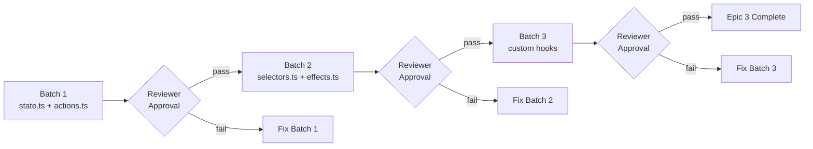
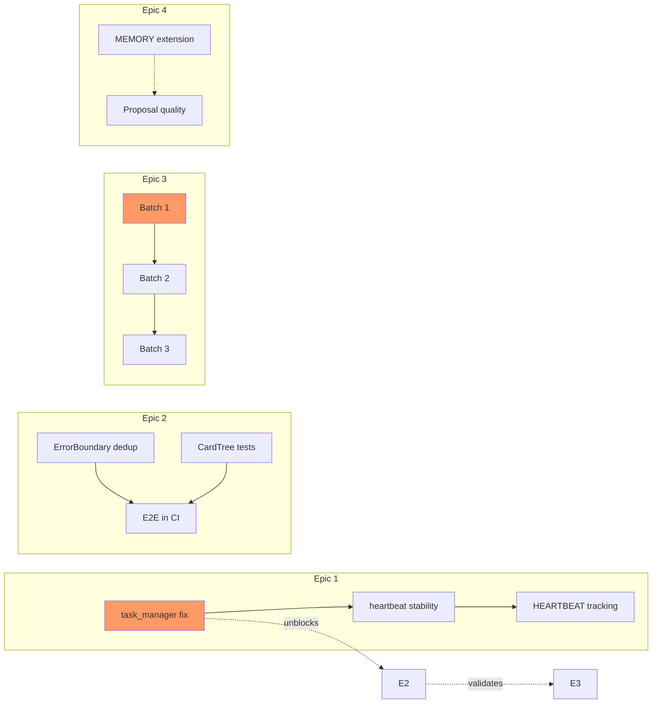

# Implementation Plan: vibex-architect-proposals-20260324_185417

**Project**: vibex-architect-proposals-20260324_185417  
**Architect**: Architect Agent  
**Date**: 2026-03-24  
**Status**: Draft

---

## 1. Overview

This implementation plan covers the 4 Epics from the Architect's proposals. Each Epic has dedicated projects in team-tasks. This document serves as the master tracking sheet.

### Epic-to-Project Mapping

| Epic | Project Name | Status |
|------|-------------|--------|
| Epic 1: 工具链止血 | vibex-epic1-toolchain-20260324 | active |
| Epic 2: 前端质量提升 | vibex-epic2-frontend-20260324 | active |
| Epic 3: 架构债务 | vibex-epic3-architecture-20260324 | active |
| Epic 4: AI Agent 治理 | (inline in Epic 1/2) | pending project creation |

---

## 2. Epic 1: 工具链止血 — Implementation Details

**Owner**: dev (P0 tasks), tester (verification), architect (review)

### 2.1 Sprint 0 Execution Order

```
[P0] task_manager.py 挂起修复
  → Dev: Add 5s timeout to all subprocess calls + deadlock detection
  → Tester: Write timeout regression tests
  → Reviewer: PR review + merge
  ↓ (unblocks everything else)
[P0] page.test.tsx 修复
  → Dev: Fix test flakiness, add retry logic
  → Tester: Validate test passes 3x consecutively
  → Reviewer: PR review + merge
  ↓
[P0] dedup 生产验证
  → Tester: Run dedup on production proposals, verify no false positives
  → Dev: Fix any edge cases found
  → Reviewer: Merge if clean
```

### 2.2 Sprint 1 Tasks

```
[P1] Heartbeat 幽灵任务清理
  → Dev: Add stale task detection (15 min threshold)
  → Coord: Verify heartbeat reports clean state

[P1] HEARTBEAT 话题追踪自动化
  → Dev: Add topic tracking to heartbeat reports
  → Coord: Verify no manual intervention needed
```

### 2.3 Verification Checklist

- [ ] `task_manager list` returns in < 5s under normal load
- [ ] `task_manager list` returns in < 5s with 50+ projects
- [ ] Duplicate claim attempt is rejected with clear error
- [ ] Heartbeat shows no ghost tasks for 3 consecutive cycles
- [ ] All timeout tests pass: `pytest tests/toolchain/test_timeout.py -v`

---

## 3. Epic 2: 前端质量提升 — Implementation Details

**Owner**: dev (code), tester (coverage), reviewer (accessibility)

### 3.1 Sprint 1 Tasks (Parallel with Epic 1 Sprint 1)

```
[P1] ErrorBoundary 去重
  → Dev: Create canonical ErrorBoundary with feature flag
  → Dev: Migrate one component at a time
  → Tester: Verify error handling still works per component
  → Reviewer: Validate no regression

[P1] CardTreeNode 单元测试
  → Dev: Add tests for all props and interactions
  → Tester: Ensure coverage ≥ 85%
  → Coverage report: `npm test -- --coverage`

[P1] E2E 纳入 CI
  → Dev: Add Playwright config to GitHub Actions
  → Dev: Write E2E for critical paths (CardTree create/edit/delete)
  → Tester: Verify CI passes

[P1] API 错误测试覆盖
  → Tester: Add mock tests for all API error codes
  → Tester: Validate error messages are user-friendly
```

### 3.2 Verification Checklist

- [ ] `npm test -- --grep CardTreeNode` — 100% pass
- [ ] Coverage report shows CardTreeNode ≥ 85%
- [ ] `npm run e2e` passes in CI
- [ ] ErrorBoundary deduplication: `find src -name "*ErrorBoundary*" | wc -l` → 1
- [ ] API error test coverage: all error codes covered

---

## 4. Epic 3: 架构债务 — Implementation Details (HIGH RISK)

**Owner**: architect (design), dev (implementation), tester (validation), reviewer (per-batch)

### 4.1 Batch Execution Protocol

⚠️ **CRITICAL**: Each batch is independently deployable and rollback-safe. Never skip batches.



### 4.2 Batch 1: state.ts + actions.ts Extraction

**Files Changed**:
- Create: `src/stores/confirmationStore/state.ts`
- Create: `src/stores/confirmationStore/actions.ts`
- Modify: `src/stores/confirmationStore/index.ts` (re-export)
- Keep: `src/hooks/useConfirmationStore.ts` (proxy layer)

**Migration Steps**:
1. Copy state slice to `state.ts` with type definitions
2. Copy actions to `actions.ts` with action creators
3. Update `index.ts` to re-export from new files
4. Verify all imports still resolve
5. Run full test suite
6. Create PR for architect review

**Acceptance Criteria**:
- [ ] `state.ts` < 100 lines
- [ ] `actions.ts` < 100 lines
- [ ] All existing tests pass
- [ ] `useConfirmationStore` proxy still works

### 4.3 Batch 2: selectors.ts + effects.ts

**Files Changed**:
- Create: `src/stores/confirmationStore/selectors.ts`
- Create: `src/stores/confirmationStore/effects.ts`
- Modify: `src/stores/confirmationStore/index.ts`

**Acceptance Criteria**:
- [ ] `selectors.ts` < 80 lines
- [ ] `effects.ts` < 80 lines
- [ ] All selectors have unit tests
- [ ] Effects handle async operations correctly

### 4.4 Batch 3: Custom Hooks

**Files Changed**:
- Create: `src/hooks/useConfirmation*.ts` (split from useConfirmationStore)

**Acceptance Criteria**:
- [ ] Each hook < 50 lines
- [ ] All hooks have unit tests
- [ ] No breaking changes to existing consumers

### 4.5 LocalStorage Migration

**Version**: 1.0 → 2.0

```typescript
// Migration script
function migrate(data: ConfirmationStoreV1): ConfirmationStoreV2 {
  return {
    ...data,
    version: '2.0',
    // New schema fields with defaults
    lastModified: data.lastModified || Date.now(),
  };
}
```

**Backward Compatibility**:
- [ ] App reads both v1 and v2 formats
- [ ] On first write after read, migrate to v2
- [ ] Log migration events for debugging

### 4.6 ADR Documentation

| ADR | Status | Actions |
|-----|--------|---------|
| ADR-001: ConfirmationStore Split Strategy | Draft | Complete decision context, publish to `/docs/adr/` |
| ADR-002: Error Type Standardization | Draft | Define ErrorType enum, review with team |

---

## 5. Epic 4: AI Agent 治理 — Implementation Details

**Owner**: All agents (participation), coord (tracking)

### 5.1 MEMORY.md Extension

**Current**: Each agent has individual SOUL.md + MEMORY.md  
**Goal**: Shared knowledge base with agent-specific overrides

**Proposed Structure**:
```
workspace-coord/
  SHARED_MEMORY.md        # Cross-agent knowledge (read by all)
agent-*/
  MEMORY.md              # Agent-specific overrides + notes
  SOUL.md                # Agent personality
```

**Actions**:
- [ ] Create `SHARED_MEMORY.md` with proposal format template
- [ ] Migrate cross-agent knowledge from individual MEMORY files
- [ ] Update HEARTBEAT.md to reference SHARED_MEMORY

### 5.2 Proposal Quality Checklist

Every proposal must include:

- [ ] Title (≤ 50 chars)
- [ ] Problem statement (What is broken/missing?)
- [ ] Proposed solution (How does it work?)
- [ ] Alternatives considered (What else did we try?)
- [ ] Impact assessment (What improves if we do this?)
- [ ] Risk assessment (What could go wrong?)
- [ ] Acceptance criteria (How do we know it's done?)

---

## 6. Resource Allocation

| Epic | Dev Days | Tester Days | Reviewer Days | Architect Days |
|------|----------|-------------|---------------|----------------|
| Epic 1 | 3 | 1 | 1 | 0.5 |
| Epic 2 | 4 | 2 | 1 | 0.5 |
| Epic 3 | 5 | 2 | 3 | 3 |
| Epic 4 | 0.5 | 0.5 | 0.5 | 1 |
| **Total** | **12.5** | **5.5** | **5.5** | **5** |

---

## 7. Dependency Graph



---

## 8. Success Metrics

| Metric | Baseline | Target | Measurement |
|--------|----------|--------|-------------|
| task_manager list latency | > 30s (stuck) | < 5s | `time python3 task_manager.py list` |
| Frontend test coverage | 0% (CardTree) | ≥ 85% | `npm test -- --coverage` |
| confirmationStore size | 461 lines | < 200 lines | `wc -l src/stores/confirmationStore/*` |
| Proposal format compliance | ~20% | 100% | Random audit of 5 proposals |
| Heartbeat ghost tasks | 3-5 per cycle | 0 | Heartbeat report scan |
