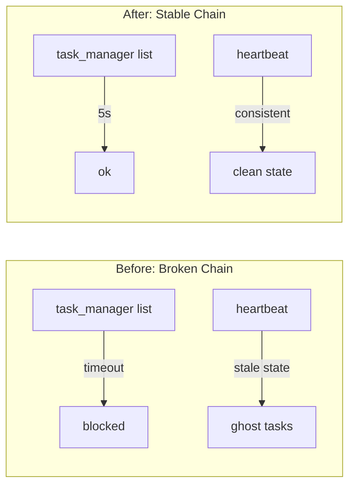
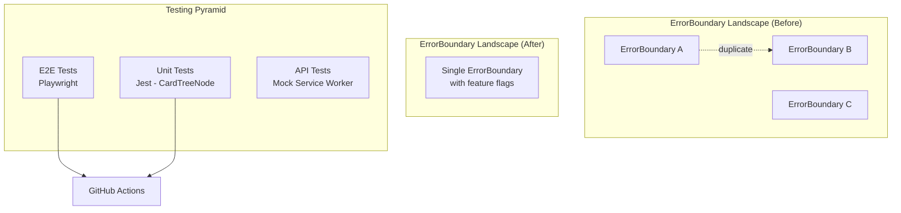
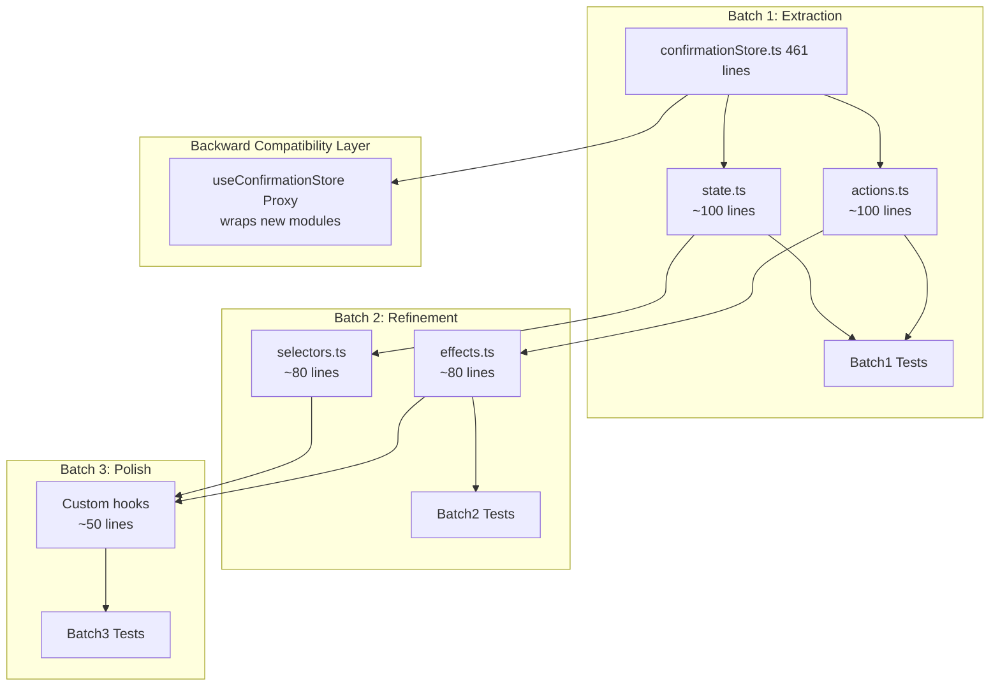
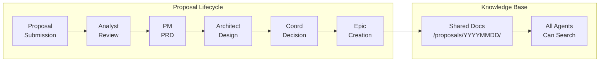
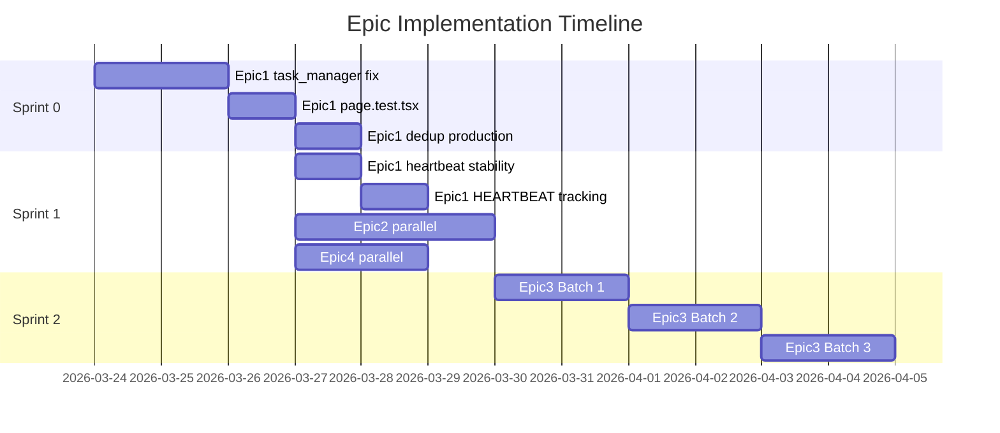

# Architecture Design: vibex-architect-proposals-20260324_185417

**Project**: vibex-architect-proposals-20260324_185417  
**Architect**: Architect Agent  
**Date**: 2026-03-24  
**Status**: In Progress  
**Depends On**: analysis.md (analyst), prd.md (pm)

---

## 1. Context & Scope

### 1.1 Background

This project captures the Architect agent's proposals from the 2026-03-24 proposal collection cycle. Three proposals were submitted covering toolchain stability, frontend quality, and architecture debt. After PM's PRD refinement and Epic clustering, these proposals map to 4 Epics spanning 3 Sprints.

### 1.2 Scope of This Document

This document provides:
- Architecture impact analysis for each Epic
- Technical implementation approach
- Data model changes
- API definitions where applicable
- Testing strategy

### 1.3 Out of Scope

- Individual Epic project architecture (each Epic has its own design doc)
- Dev/tester/reviewer specific implementation details

---

## 2. Epic Architecture Impact

### 2.1 Epic 1: Toolchain Hemostasis (Sprint 0)

**Goal**: Fix blocking toolchain issues to unlock all agents.



#### Technical Changes

| Component | Change | Risk |
|-----------|--------|------|
| `task_manager.py` | Add 5s timeout to all subprocess calls | Low |
| `task_manager.py` | Add deadlock detection (max 3 retries) | Low |
| `heartbeat/*.sh` | Add state snapshot consistency check | Low |
| `verify-fake-completion.sh` | Validate git commit exists before marking done | Low |

#### Data Model: Task State Machine

```
                    ┌──────────────────────────────────────┐
                    │                                      │
     ┌───────────────▼───────────────┐                   │
     │        pending                 │                   │
     └───────────────┬───────────────┘                   │
                     │ claim()                            │
     ┌───────────────▼───────────────┐                   │
     │        in_progress            │                   │
     └───────────────┬───────────────┘                   │
         ┌───────────┼───────────┐                       │
         │           │           │                       │
         ▼           ▼           ▼                       │
    ┌────────┐  ┌─────────┐  ┌─────────┐                │
    │  done  │  │ failed  │  │ blocked │                │
    └────────┘  └─────────┘  └─────────┘                │
```

**State Transition Rules**:
- `pending → in_progress`: Only when claimed by an agent
- `in_progress → done`: Must have git commit + verification passed
- `in_progress → failed`: Verification failed or uncaught exception
- `blocked → in_progress`: After blocker resolved
- Any state → `pending`: On explicit reset (coord only)

#### Verification Contract

```python
# task_manager.py contract
def claim(project, task_id) -> Task:
    # MUST return within 5 seconds
    # MUST validate git status before allowing claim
    # MUST prevent duplicate claims
    pass

def list() -> List[Task]:
    # MUST return within 5 seconds
    # MUST filter out stale in_progress (> 15 min without update)
    pass
```

### 2.2 Epic 2: Frontend Quality (Sprint 1)

**Goal**: Elevate frontend reliability through dedup, tests, and CI integration.



#### Component Deduplication Strategy

| Pattern | Before | After | Migration |
|---------|--------|-------|-----------|
| ErrorBoundary | 3 copies in codebase | 1 canonical + feature flags | Incremental, keep working copies until validated |
| CardTreeNode | No tests | 85%+ coverage | Add tests incrementally, never break working features |
| API Error Handling | Inline try/catch | Centralized error type | `ErrorType` enum in `@/types` |

#### Data Model: Frontend Test Results

```typescript
interface TestCoverage {
  component: string;
  statements: number;
  branches: number;
  functions: number;
  lines: number;
  threshold: number; // 85 for CardTreeNode
}

interface ErrorBoundary {
  id: string;
  location: string;
  fallback: ReactNode;
  onError: (error: Error, info: ErrorInfo) => void;
  isCanonical: boolean; // true = keep, false = deprecated
}
```

### 2.3 Epic 3: Architecture Debt (Sprint 2) ⚠️ HIGH RISK

**Goal**: Refactor confirmationStore (461 lines) into manageable modules.



#### Batch Execution Contract

| Batch | Deliverable | Regression Risk | Rollback Strategy |
|-------|-------------|-----------------|-------------------|
| 1 | `state.ts` + `actions.ts` extracted | Medium | Revert `useConfirmationStore` import path |
| 2 | `selectors.ts` + `effects.ts` | Low | Keep batch 1 stable |
| 3 | Custom hooks | Low | Hooks are additive |

**Non-Negotiable Requirements**:
- Each batch must pass all existing tests before moving to next
- `useConfirmationStore` proxy MUST remain functional throughout
- localStorage migration script must handle both old and new format
- Architect must review each batch PR before merge

#### ADR-001 & ADR-002

| ADR | Title | Status |
|-----|-------|--------|
| ADR-001 | ConfirmationStore Split Strategy | Draft → Proposed |
| ADR-002 | Error Type Standardization | Draft → Proposed |

### 2.4 Epic 4: AI Agent Governance (Sprint 1-2)

**Goal**: Improve agent collaboration through standardized proposal lifecycle and knowledge sharing.



#### Proposal Format Standard

```typescript
interface Proposal {
  id: string;           // P0-1, P1-2, etc.
  title: string;
  description: string;
  priority: 'P0' | 'P1' | 'P2' | 'P3';
  estimatedHours: 'S' | 'M' | 'L';
  riskLevel: 'Low' | 'Medium' | 'High';
  owner: AgentRole;
  status: 'draft' | 'submitted' | 'accepted' | 'rejected';
  epic?: string;
  acceptanceCriteria: string[];
}
```

---

## 3. Implementation Sequence



---

## 4. Testing Strategy

### 4.1 Toolchain Testing (Epic 1)

**Framework**: pytest + bash

| Test Case | Method | Pass Criteria |
|-----------|--------|---------------|
| `list` command response time | Timer | < 5000ms |
| `claim` prevents duplicate | State check | Only one agent per task |
| Deadlock detection | Timeout inject | Triggers after 3 retries |
| Heartbeat state consistency | Cross-check | All agents see same state |

```python
def test_list_under_5_seconds():
    start = time.time()
    result = subprocess.run(['python3', 'task_manager.py', 'list'], timeout=5)
    elapsed = time.time() - start
    assert elapsed < 5.0, f"list took {elapsed}s, expected < 5s"
    assert result.returncode == 0
```

### 4.2 Frontend Testing (Epic 2)

**Framework**: Jest + React Testing Library + Playwright

| Test Case | Framework | Pass Criteria |
|-----------|-----------|---------------|
| CardTreeNode renders | RTL | `expect(screen.getByText('...')).toBeInTheDocument()` |
| ErrorBoundary catches error | RTL | `expect(screen.getByText('fallback')).toBeInTheDocument()` |
| E2E: CardTree interaction | Playwright | No console errors, < 2s |
| Coverage threshold | Jest --coverage | Statements ≥ 85% |

### 4.3 Architecture Debt Testing (Epic 3)

**Framework**: Jest + Integration Tests

| Test Case | Method | Pass Criteria |
|-----------|--------|---------------|
| confirmationStore backward compat | Integration | Existing `useConfirmationStore` callers work |
| localStorage migration | Unit | Old format → new format, no data loss |
| Each batch standalone | Unit | Batch 1, 2, 3 pass independently |

```python
# Example migration test
def test_localStorage_migration():
    old_data = {"confirmations": [...], "version": "1.0"}
    migrated = migrate(old_data)
    assert migrated["version"] == "2.0"
    assert "confirmations" in migrated
    assert len(migrated["confirmations"]) == len(old_data["confirmations"])
```

---

## 5. Risk Register

| Risk | Epic | Probability | Impact | Mitigation |
|------|------|-------------|--------|------------|
| confirmationStore batch regression | Epic 3 | High | High | Proxy layer, incremental batches, full test suite per batch |
| ErrorBoundary dedup breaks existing error handling | Epic 2 | Medium | Medium | Feature flags, keep old copies until validated |
| task_manager timeout false positives | Epic 1 | Low | Low | Deadlock detection + retry logic |
| localStorage migration data loss | Epic 3 | Medium | High | Migration script with rollback, data validation |

---

## 6. Open Questions

| # | Question | Owner | Due |
|---|----------|-------|-----|
| 1 | ADR-002 ErrorType enum: should it replace all inline error types? | architect | 2026-03-27 |
| 2 | Epic 3 batch size: is 3 batches optimal or should we do 5 smaller batches? | architect | 2026-03-30 |
| 3 | Epic 4 MEMORY.md: should all agents update one shared MEMORY or maintain separate? | coord | 2026-03-27 |
