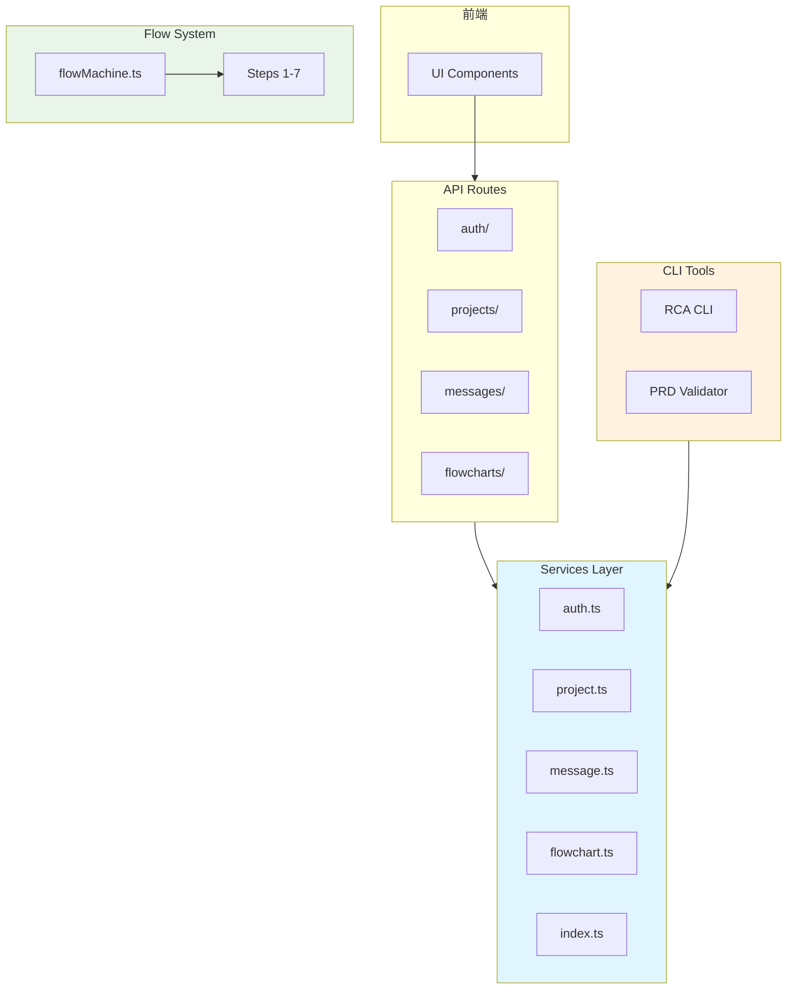
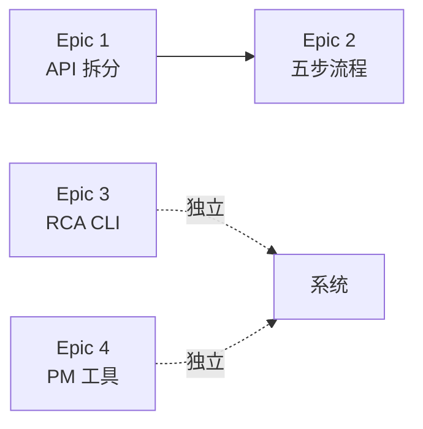

# Architecture: vibex-daily-proposals-20260319

**项目**: vibex-daily-proposals-20260319  
**版本**: 1.0  
**架构师**: Architect  
**日期**: 2026-03-19

---

## 1. Tech Stack

| 类别 | 技术选型 | 说明 |
|------|----------|------|
| API 架构 | Next.js API Routes | 按功能域拆分 |
| 服务层 | TypeScript Modules | 独立模块化 |
| CLI | Bash/Python | 跨平台支持 |
| 状态管理 | XState | 流程状态机 |
| 测试 | Jest + Playwright | 单元 + E2E |

---

## 2. Architecture Diagram



---

## 3. Epic 1: API 服务层拆分

### 3.1 服务模块结构

```
src/services/
├── index.ts              # 统一导出
├── auth.ts              # 认证服务
├── project.ts          # 项目服务
├── message.ts          # 消息服务
├── flowchart.ts        # 流程图服务
├── api.ts             # 兼容层 (保留)
└── types/
    ├── request.ts      # 请求类型
    └── response.ts     # 响应类型
```

### 3.2 兼容层设计

```typescript
// api.ts (兼容层)
import { auth, project, message, flowchart } from './';

export const api = {
  auth,
  project,
  message,
  flowchart,
  // 保留现有接口签名
};

export default api;
```

---

## 4. Epic 2: 首页五步流程重构

### 4.1 流程架构


### 4.2 状态机定义

```typescript
const flowMachine = createMachine({
  id: 'homepage-flow',
  initial: 'step1',
  states: {
    step1: { on: { NEXT: 'step2' } },
    step2: { on: { BACK: 'step1', NEXT: 'step3' } },
    step3: { on: { BACK: 'step2', NEXT: 'step4' } },
    step4: { on: { BACK: 'step3', NEXT: 'step5' } },
    step5: { on: { BACK: 'step4', NEXT: 'step6' } },
    step6: { on: { BACK: 'step5', NEXT: 'step7' } },
    step7: { on: { BACK: 'step6', DONE: 'complete' } },
  },
});
```

---

## 5. Epic 3: RCA CLI 工具

### 5.1 CLI 结构

```bash
rca/
├── rca.sh              # 主入口
├── lib/
│   ├── parser.sh       # 日志解析
│   ├── aggregator.sh   # 聚合逻辑
│   ├── detector.sh     # 模式检测
│   └── reporter.sh     # 报告生成
└── patterns/           # 异常模式库
```

### 5.2 使用方式

```bash
# 基本用法
./rca.sh --log-dir ./logs --date 2026-03-19 --severity error

# 输出 Markdown 报告
./rca.sh --analyze . --output report.md
```

---

## 6. Epic 4: PM 工具

### 6.1 PRD 验证工具

```bash
# 验证 PRD 格式
./validate-prd.sh docs/prd/sample.md

# 检查 expect() 格式
./check-expect.sh docs/prd/
```

### 6.2 模板结构

```
docs/templates/
├── prd-template.md         # PRD 标准模板
├── user-story-map.md        # 用户故事地图
└── requirements-checklist.md # 需求检查清单
```

---

## 7. 依赖关系



---

## 8. 实施计划

| Epic | 周期 | 关键里程碑 |
|------|------|------------|
| Epic 1 | Week 1-3 | auth.ts 拆分完成 |
| Epic 2 | Week 4-6 | 7 步流程支持 |
| Epic 3 | Week 1 | RCA CLI < 30s |
| Epic 4 | Week 2-3 | PRD 模板 100% |

---

## 9. 验收矩阵

| Epic | 验收标准 | 测试方式 |
|------|----------|----------|
| 1 | 5 个服务文件存在 | `test -f` |
| 1 | 测试覆盖率 ≥ 80% | Jest coverage |
| 2 | 7 步流程正常 | E2E 测试 |
| 3 | `--help` 退出码 0 | CLI 测试 |
| 4 | 模板文件存在 | `test -f` |

---

*Architecture - 2026-03-19*
