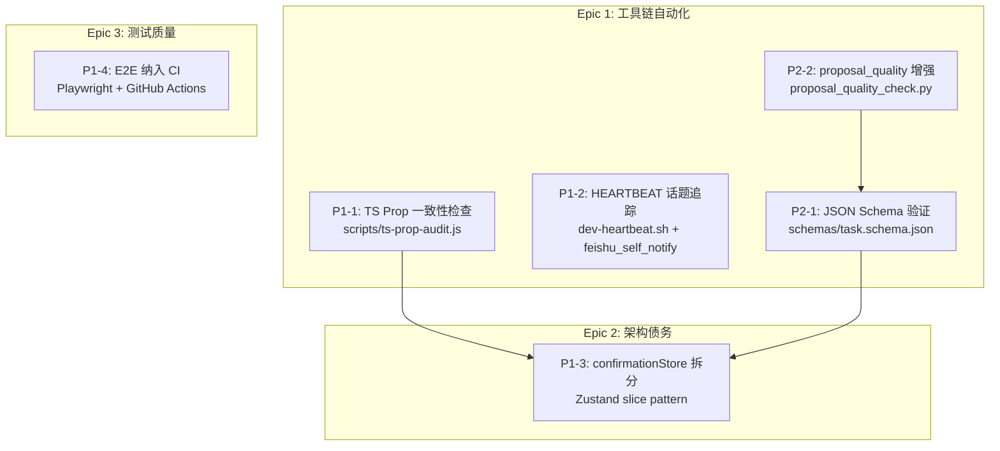
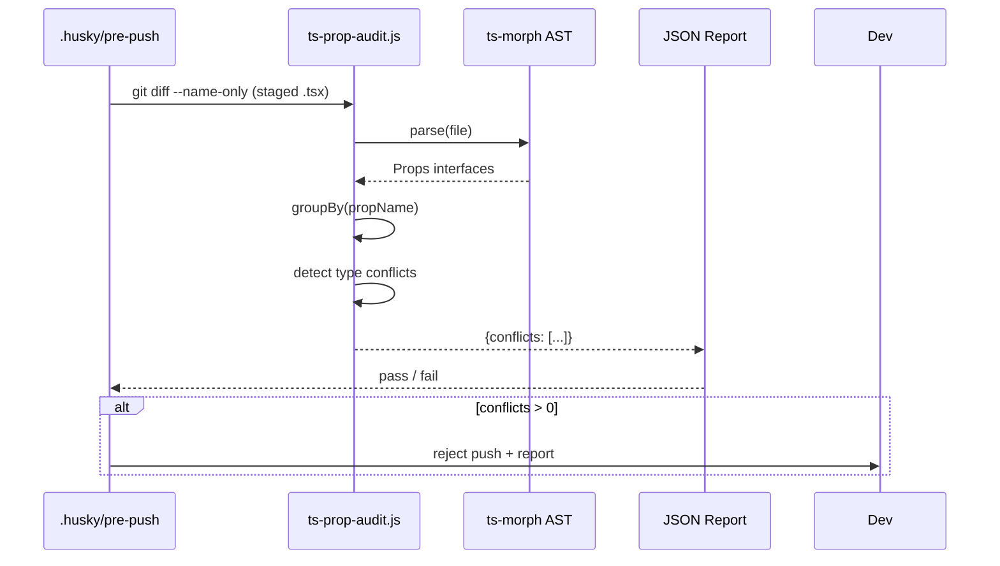
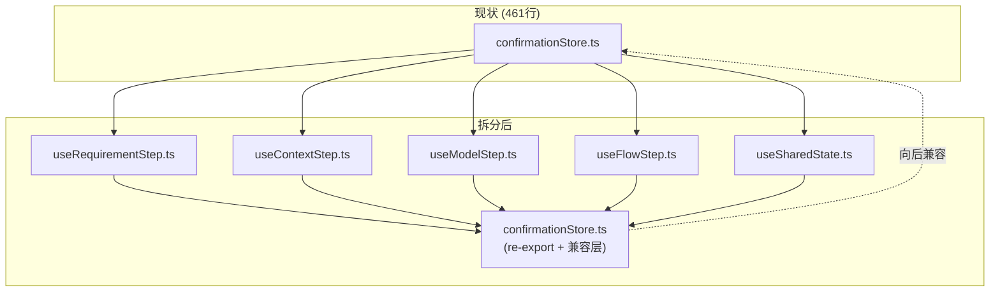

# Architecture: Dev Proposals — 20260324_185233

**项目**: vibex-dev-proposals-20260324_185233  
**版本**: v1.0  
**日期**: 2026-03-24  
**Architect**: architect agent  
**状态**: ✅ 设计完成

---

## 一、技术栈

| 层级 | 技术选型 | 理由 |
|------|---------|------|
| 单元测试 | Vitest + React Testing Library | 已有 Jest 基础，RTL 适合组件测试 |
| E2E 测试 | Playwright | 已有 9 个 E2E 测试，成熟稳定 |
| CI/CD | GitHub Actions | 已有 workflow 基础设施 |
| 状态管理 | Zustand slice pattern | confirmationStore 重构目标模式 |
| 提案质量 | Python (proposal_quality_check.py) | 现有工具扩展 |
| Schema 验证 | Python JSON Schema (jsonschema) | task_manager.py 已有 Python 环境 |
| 类型扫描 | TypeScript AST (ts-morph) | 比正则更精确，比 babel 更轻量 |

---

## 二、架构图

### 2.1 整体架构



### 2.2 P1-1: TS Prop 一致性检查架构



### 2.3 P1-3: confirmationStore 拆分架构



---

## 三、API 定义

### 3.1 P1-1: ts-prop-audit.js

```typescript
// scripts/ts-prop-audit.ts
interface PropConflict {
  file: string;
  propName: string;
  types: Array<{ type: string; location: string }>;
}

interface AuditReport {
  scanned: number;       // 扫描文件数
  conflicts: PropConflict[];
  duration: number;      // ms
}

declare function runAudit(files?: string[]): Promise<AuditReport>;
declare function emitReport(report: AuditReport, format: 'json' | 'text'): void;
```

### 3.2 P1-3: Zustand Slices

```typescript
// slices/useRequirementStep.ts
interface RequirementStepSlice {
  stepId: string;
  type: 'diagnostic' | 'pre-diagnostic' | 'manual';
  input: Record<string, unknown>;
  setInput: (key: string, value: unknown) => void;
  reset: () => void;
}

// slices/useContextStep.ts
interface ContextStepSlice {
  contextItems: ContextItem[];
  addContext: (item: ContextItem) => void;
  removeContext: (id: string) => void;
  reorder: (from: number, to: number) => void;
}

// slices/useModelStep.ts
interface ModelStepSlice {
  selectedModel: string;
  modelParams: Record<string, unknown>;
  setModel: (modelId: string, params?: Record<string, unknown>) => void;
}

// slices/useFlowStep.ts
interface FlowStepSlice {
  flows: Flow[];
  addFlow: (flow: Flow) => void;
  updateFlow: (id: string, patch: Partial<Flow>) => void;
  removeFlow: (id: string) => void;
}

// slices/useSharedState.ts
interface SharedStateSlice {
  isLoading: boolean;
  error: string | null;
  setLoading: (v: boolean) => void;
  setError: (e: string | null) => void;
}

// 兼容层: confirmationStore.ts
export const useConfirmationStore = create<RequirementStepSlice & ContextStepSlice & ModelStepSlice & FlowStepSlice & SharedStateSlice>()(
  (...a) => ({
    ...createRequirementStepSlice(...a),
    ...createContextStepSlice(...a),
    ...createModelStepSlice(...a),
    ...createFlowStepSlice(...a),
    ...createSharedStateSlice(...a),
  })
);
```

### 3.3 P2-1: JSON Schema

```json
// schemas/task.schema.json (draft-07)
{
  "$schema": "http://json-schema.org/draft-07/schema#",
  "type": "object",
  "required": ["id", "name", "agent", "status", "createdAt"],
  "properties": {
    "id": { "type": "string", "pattern": "^[a-z0-9-]+$" },
    "name": { "type": "string", "minLength": 1 },
    "agent": { "type": "string", "enum": ["dev", "analyst", "architect", "pm", "tester", "reviewer", "coord"] },
    "status": { "type": "string", "enum": ["pending", "ready", "in-progress", "done", "failed", "blocked", "terminated"] },
    "createdAt": { "type": "string", "format": "date-time" },
    "assignee": { "type": "string" },
    "dependsOn": { "type": "array", "items": { "type": "string" } },
    "phase": { "type": "string" },
    "priority": { "type": "string", "enum": ["P0", "P1", "P2", "P3"] },
    "estimate": { "type": "string" }
  }
}
```

---

## 四、数据模型

### 4.1 任务 JSON Schema（扩展）

```typescript
// schemas/task-extended.schema.json 扩展字段
interface Task {
  id: string;
  name: string;
  agent: Agent;
  status: TaskStatus;
  createdAt: string;
  updatedAt?: string;
  assignee?: string;
  dependsOn: string[];
  phase: string;
  priority?: Priority;
  estimate?: string;
  tags?: string[];
  metadata?: Record<string, unknown>;
}

type Agent = 'dev' | 'analyst' | 'architect' | 'pm' | 'tester' | 'reviewer' | 'coord';
type TaskStatus = 'pending' | 'ready' | 'in-progress' | 'done' | 'failed' | 'blocked' | 'terminated';
type Priority = 'P0' | 'P1' | 'P2' | 'P3';
```

---

## 五、测试策略

### 5.1 P1-1: TS Prop Audit

```typescript
// scripts/ts-prop-audit.test.ts
describe('ts-prop-audit', () => {
  it('detects type conflict in same file', async () => {
    const report = await runAudit(['test.fixture.tsx']);
    expect(report.conflicts).toHaveLength(1);
    expect(report.conflicts[0].propName).toBe('title');
  });

  it('passes when no conflicts', async () => {
    const report = await runAudit(['clean.component.tsx']);
    expect(report.conflicts).toHaveLength(0);
  });

  it('handles missing props gracefully', async () => {
    const report = await runAudit([]);
    expect(report.scanned).toBe(0);
  });
});
```

### 5.2 P1-3: Zustand Slices

```typescript
// slices/confirmationStore.test.ts
describe('confirmationStore slices', () => {
  it('useRequirementStep: setInput updates correctly', () => {
    const { result } = renderHook(() => useConfirmationStore());
    act(() => {
      useConfirmationStore.getState().setInput('title', 'Test');
    });
    expect(useConfirmationStore.getState().input.title).toBe('Test');
  });

  it('backward compatibility: useConfirmationStore unchanged API', () => {
    const store = useConfirmationStore.getState();
    expect(store.setInput).toBeDefined();
    expect(store.addContext).toBeDefined();
    expect(store.setModel).toBeDefined();
    expect(store.addFlow).toBeDefined();
  });
});
```

### 5.3 P1-4: E2E CI

```typescript
// playwright.config.ts (CI mode)
const config: PlaywrightTestConfig = {
  ...,
  use: {
    baseURL: process.env.CI ? 'http://localhost:3000' : 'http://localhost:5173',
  },
  retries: process.env.CI ? 2 : 0,
  reporter: process.env.CI ? [['github'], ['html']] : 'list',
};
```

### 5.4 覆盖率要求

| 提案 | 覆盖率目标 |
|------|-----------|
| P1-1 TS Prop Audit | > 80% (statement) |
| P1-3 confirmationStore | > 85% (branch) |
| P1-4 E2E | 9/9 tests pass in CI |

---

## 六、实施约束

### 6.1 P1-3 confirmationStore 拆分 — 关键约束

> **🔴 最高风险**：破坏性变更，必须分批 PR

1. **PR 批次规划**：
   - PR#1（基础）：创建 slices 目录 + useSharedState slice + 初始 re-export
   - PR#2（数据迁移）：迁移 useRequirementStep + useContextStep
   - PR#3（收尾）：迁移 useModelStep + useFlowStep + 清理原文件

2. **向后兼容要求**：每批 PR 后 `useConfirmationStore` API 完全不变
3. **快照测试**：re-export 层必须通过快照测试验证 API 兼容性
4. **回归测试**：每批 PR 需在 staging 验证所有消费组件功能不变

---

## 七、ADR

### ADR-001: Zustand Slice Pattern 作为 confirmationStore 拆分标准

**状态**: Accepted

**决策**：采用 Zustand slice pattern 替代大型单一 store。

**取舍**：
- ✅ 获得：模块化、可单独测试、按需加载
- ❌ 放弃：单一文件修改的便利性（需跨多个 slice 文件）
- ❌ 放弃：部分团队成员需学习曲线

---

### ADR-002: ts-morph 替代 babel-parser 做 TS AST 分析

**状态**: Accepted

**决策**：使用 ts-morph 而非自定义正则或 babel。

**取舍**：
- ✅ 获得：TypeScript-first API、类型安全、无需额外编译
- ❌ 放弃：仅支持 .ts/.tsx（不支持 .js/.jsx）

---

## 八、验收标准

| ID | 提案 | 验收条件 |
|----|------|---------|
| AC-1 | P1-1 TS Prop | `ts-prop-audit --report json` 输出冲突报告，CI pre-push 正确拦截 |
| AC-2 | P1-2 HEARTBEAT | 心跳领取任务后 thread ID 自动保存，reply-to 正常工作 |
| AC-3 | P1-3 Store | 461 行文件拆分 ≤ 5 个 slice 文件，`useConfirmationStore` API 零变更 |
| AC-4 | P1-4 E2E CI | Playwright 测试在 GitHub Actions 中通过率 100%，无 flaky retry > 1 |
| AC-5 | P2-1 Schema | `python -m task_manager validate task.json` 正确校验，无漏报 |
| AC-6 | P2-2 QC增强 | `proposal_quality_check.py --score` 输出 0-100 分和依赖图 |
