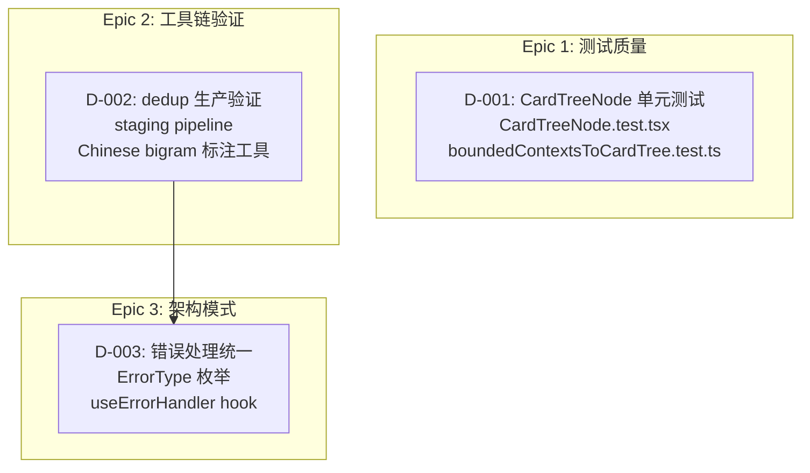
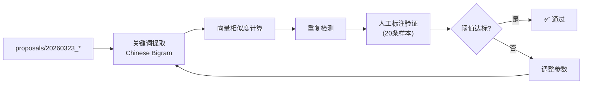
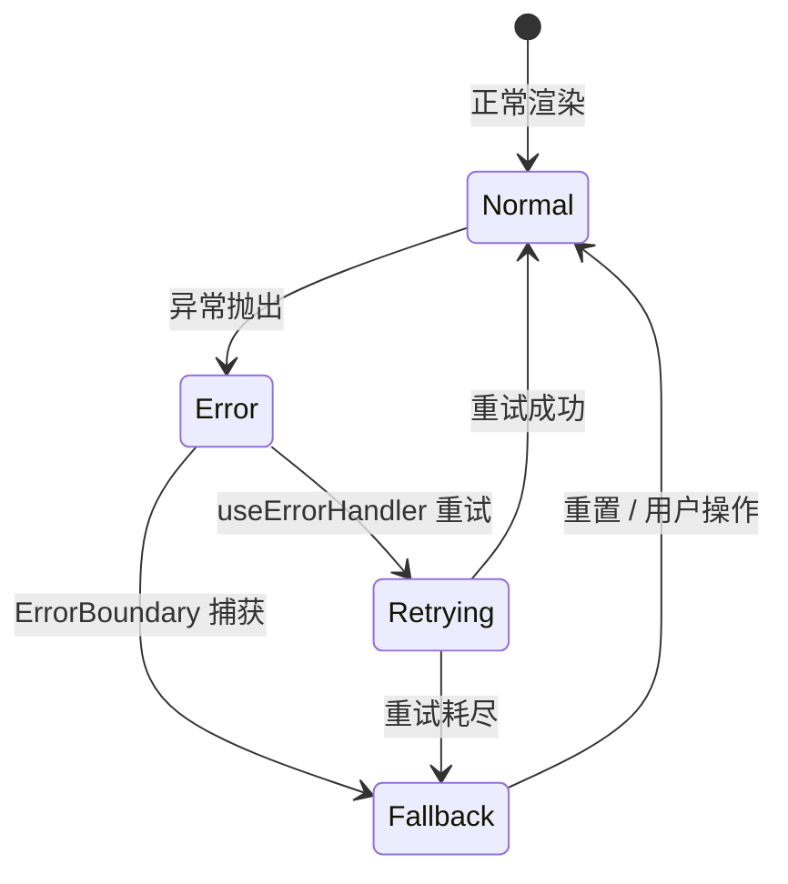
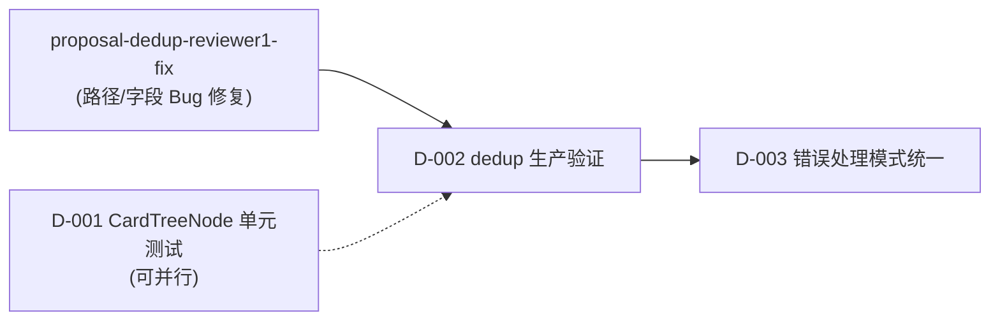

# Architecture: Dev Proposals — 20260324_185417

**项目**: vibex-dev-proposals-20260324_185417  
**版本**: v1.0  
**日期**: 2026-03-24  
**Architect**: architect agent  
**状态**: ✅ 设计完成

---

## 一、技术栈

| 层级 | 技术选型 | 理由 |
|------|---------|------|
| 单元测试 | Vitest + React Testing Library | 现有测试基础设施延续 |
| E2E 测试 | Playwright | 已有 9 个测试用例，稳定 |
| CI/CD | GitHub Actions | 已有 workflow |
| 错误处理 | React Error Boundary + 自定义 hook | 已有 CardTree Epic4 实践 |
| 提案去重 | Python + scikit-learn | 中文bigram特征提取已有基础 |

---

## 二、架构图

### 2.1 整体架构



### 2.2 D-002: dedup 生产验证流水线



### 2.3 D-003: 错误处理统一模式



---

## 三、API 定义

### 3.1 D-003: ErrorType 枚举 & useErrorHandler

```typescript
// types/error.ts
export enum ErrorType {
  NETWORK_ERROR = 'NETWORK_ERROR',
  TIMEOUT = 'TIMEOUT',
  PARSE_ERROR = 'PARSE_ERROR',
  UNKNOWN = 'UNKNOWN',
}

export interface ErrorContext {
  type: ErrorType;
  message: string;
  originalError?: Error;
  timestamp: number;
  retryable: boolean;
}

export interface RetryConfig {
  maxRetries: number;
  initialDelay: number;      // ms
  backoffMultiplier: number;
  maxDelay: number;          // ms
}

// hooks/useErrorHandler.ts
export interface UseErrorHandlerReturn {
  error: ErrorContext | null;
  isRetrying: boolean;
  handleError: (err: unknown, config?: Partial<RetryConfig>) => void;
  retry: () => void;
  clearError: () => void;
}

declare function useErrorHandler(options?: Partial<RetryConfig>): UseErrorHandlerReturn;
```

### 3.2 D-001: CardTreeNode 测试接口

```typescript
// components/CardTree/__tests__/CardTreeNode.test.tsx

describe('CardTreeNode', () => {
  describe('boundedContextsToCardTree', () => {
    it('handles empty contexts', () => {
      expect(boundedContextsToCardTree([])).toEqual({ nodes: [] });
    });

    it('converts single context correctly', () => {
      const result = boundedContextsToCardTree([mockContext]);
      expect(result.nodes).toHaveLength(1);
    });
  });

  describe('CardTreeNode rendering', () => {
    it('renders single child', () => {
      render(<CardTreeNode><TreeNode title="Test"/></CardTreeNode>);
      expect(screen.getByText('Test')).toBeTruthy();
    });
  });
});
```

### 3.3 D-002: dedup 验证报告

```python
# dedup_validation_report.json
{
  "run_id": "20260324_validation",
  "dataset": "proposals/20260323_*",
  "total_proposals": 50,
  "detected_duplicates": 12,
  "keywords": {
    "precision": 0.83,    # 人工标注: 10/12 正确
    "recall": 0.75,       # 人工标注: 9/12 命中
    "bigram_samples": [
      {"text": "中央区域画布展示", "predicted": ["中央", "区域", "画布", "展示"], "correct": true}
    ]
  },
  "status": "PASS"  # or "FAIL" if thresholds unmet
}
```

---

## 四、数据模型

```typescript
// ErrorState 统一降级 UI 数据模型
interface ErrorStateConfig {
  type: ErrorType;
  title: string;
  description: string;
  action?: {
    label: string;
    onClick: () => void;
  };
  retryable: boolean;
}

const ERROR_STATE_MAP: Record<ErrorType, ErrorStateConfig> = {
  [ErrorType.NETWORK_ERROR]: {
    type: ErrorType.NETWORK_ERROR,
    title: '网络连接失败',
    description: '请检查网络后重试',
    action: { label: '重试', onClick: () => {} },
    retryable: true,
  },
  [ErrorType.TIMEOUT]: {
    type: ErrorType.TIMEOUT,
    title: '请求超时',
    description: '服务器响应超时，请稍后重试',
    action: { label: '重试', onClick: () => {} },
    retryable: true,
  },
  [ErrorType.PARSE_ERROR]: {
    type: ErrorType.PARSE_ERROR,
    title: '数据解析失败',
    description: '服务器返回了无效的数据格式',
    retryable: false,
  },
  [ErrorType.UNKNOWN]: {
    type: ErrorType.UNKNOWN,
    title: '未知错误',
    description: '发生了一个意外错误',
    retryable: false,
  },
};
```

---

## 五、测试策略

### 5.1 D-001: CardTreeNode 单元测试

| 测试场景 | 工具 | 覆盖率目标 |
|---------|------|-----------|
| 转换函数 (boundedContextsToCardTree) | Vitest | 95% (statement) |
| 组件渲染 (CardTreeNode) | RTL + Vitest | 85% (branch) |
| 选中态交互 | RTL + userEvent | 90% (branch) |
| 边界情况 (空/超长文本) | Vitest | 100% |

```typescript
// 测试覆盖率命令
// npm run test:coverage CardTree --coverage
// 目标: branches ≥ 85%, statements ≥ 95%
```

### 5.2 D-002: dedup 生产验证

| 阶段 | 指标 | 目标 |
|------|------|------|
| 关键词提取 | Precision | ≥ 80% |
| 关键词提取 | Recall | ≥ 70% |
| 整体 dedup | F1 | ≥ 75% |
| E2E 回归 | 通过率 | 100% |

### 5.3 D-003: 错误处理

```typescript
describe('useErrorHandler', () => {
  it('classifies NETWORK_ERROR correctly', () => {
    const { result } = renderHook(() => useErrorHandler());
    act(() => {
      result.current.handleError(new TypeError('fetch failed'));
    });
    expect(result.current.error?.type).toBe(ErrorType.NETWORK_ERROR);
  });

  it('respects maxRetries config', () => {
    const { result } = renderHook(() => 
      useErrorHandler({ maxRetries: 2 })
    );
    // verify retry count limit
  });

  it('clears error on clearError', () => {
    const { result } = renderHook(() => useErrorHandler());
    act(() => result.current.clearError());
    expect(result.current.error).toBeNull();
  });
});
```

---

## 六、实施约束

### 6.1 D-003 迁移策略

> **关键原则**：向后兼容，不改变任何现有错误处理行为

1. **先行试点**：仅在 CardTree 组件中引入 `useErrorHandler`
2. **逐步推广**：确认无误后迁移 `useJsonTreeVisualization`
3. **降级兜底**：当 `useErrorHandler` 失效时，自动回退到原有错误处理逻辑
4. **ErrorBoundary 优先级**：边界错误（渲染崩溃）始终由 ErrorBoundary 处理

### 6.2 D-002 生产验证约束

1. **不影响生产**：验证只在 staging 环境执行，不修改生产数据
2. **人工标注标准**：由 tester 提供 20 条标准样本，每条需双审
3. **阈值门禁**：Precision < 80% 或 Recall < 70% 则验证失败，不允许合入

---

## 七、ADR

### ADR-001: 统一 ErrorType 枚举替代分散的错误字符串

**状态**: Accepted

**决策**：建立 `ErrorType` 枚举作为错误分类标准，替代散落在各组件的硬编码字符串。

**取舍**：
- ✅ 获得：类型安全、统一的降级 UI、一致的重试策略
- ❌ 放弃：新 ErrorType 需协调所有相关组件的修改
- ❌ 放弃：现有组件的 try-catch 逻辑需重写

---

### ADR-002: dedup 生产验证以人工标注为 ground truth

**状态**: Accepted

**决策**：使用 20 条人工标注样本作为 Chinese bigram 提取的评估标准，而非纯规则判定。

**取舍**：
- ✅ 获得：真实场景评估，消除自然语言歧义
- ❌ 放弃：人工标注成本（2h）
- ❌ 放弃：样本外的泛化能力仍存在不确定性

---

## 八、验收标准

| ID | 提案 | 验收条件 |
|----|------|---------|
| AC-1 | D-001 CardTreeNode 测试 | `npm run test CardTree --coverage` 通过，branch ≥ 85% |
| AC-2 | D-002 dedup 验证 | Precision ≥ 80%，Recall ≥ 70%，F1 ≥ 75% |
| AC-3 | D-003 ErrorType 枚举 | `ErrorType` 枚举通过 Architect 审批，4 种类型定义完整 |
| AC-4 | D-003 useErrorHandler | hook 单元测试通过率 100%，CardTree 迁移后功能不变 |
| AC-5 | D-003 回归 | CardTree + useJsonTreeVisualization 错误处理功能与迁移前完全一致 |
| AC-6 | D-003 代码量 | 错误处理相关代码行数减少 ≥ 30% |

---

## 九、依赖关系



> **关键依赖**：D-002 需等待 `proposal-dedup-reviewer1-fix` 完成，确保 dedup 路径/字段正确后再验证。

D-001 和 D-002 可并行执行，无依赖关系。
