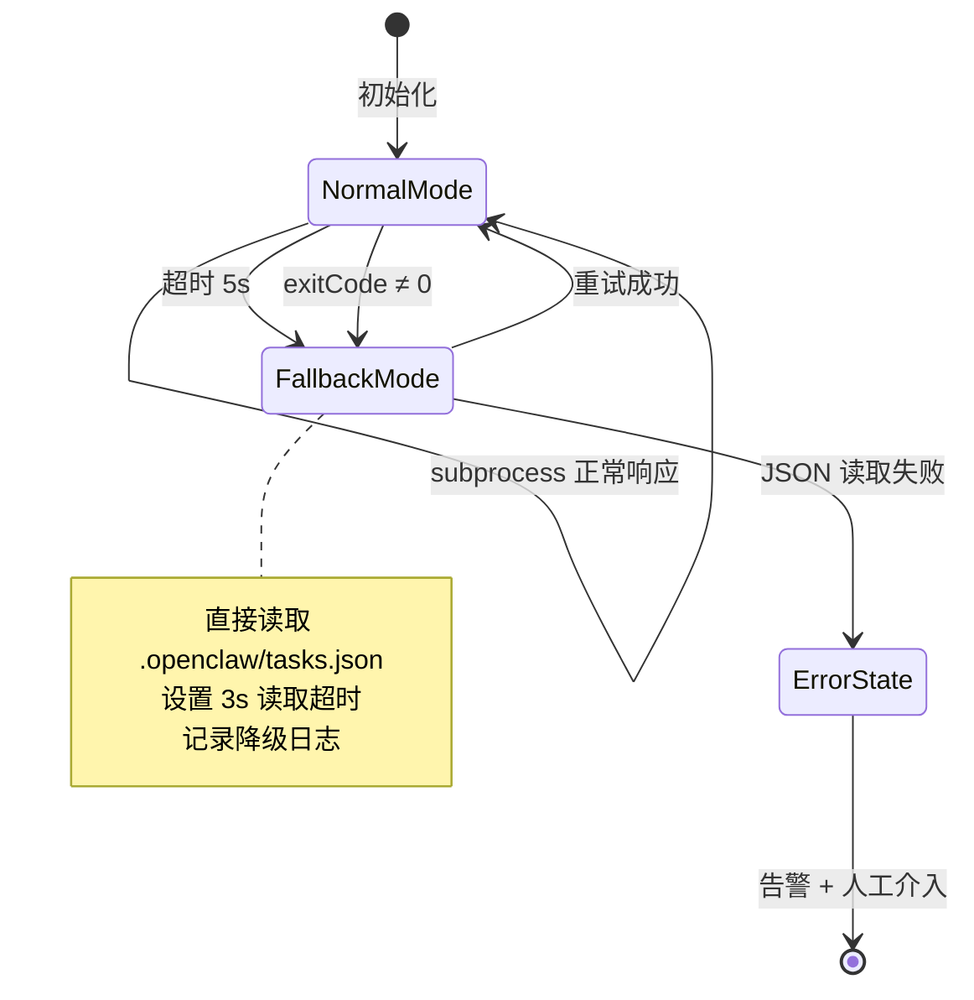
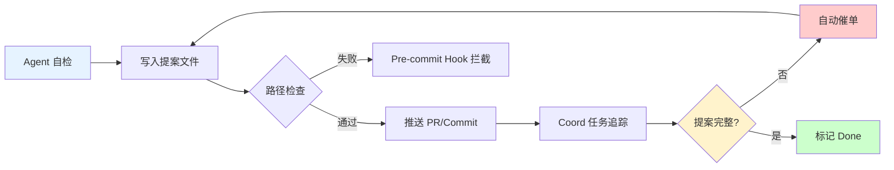
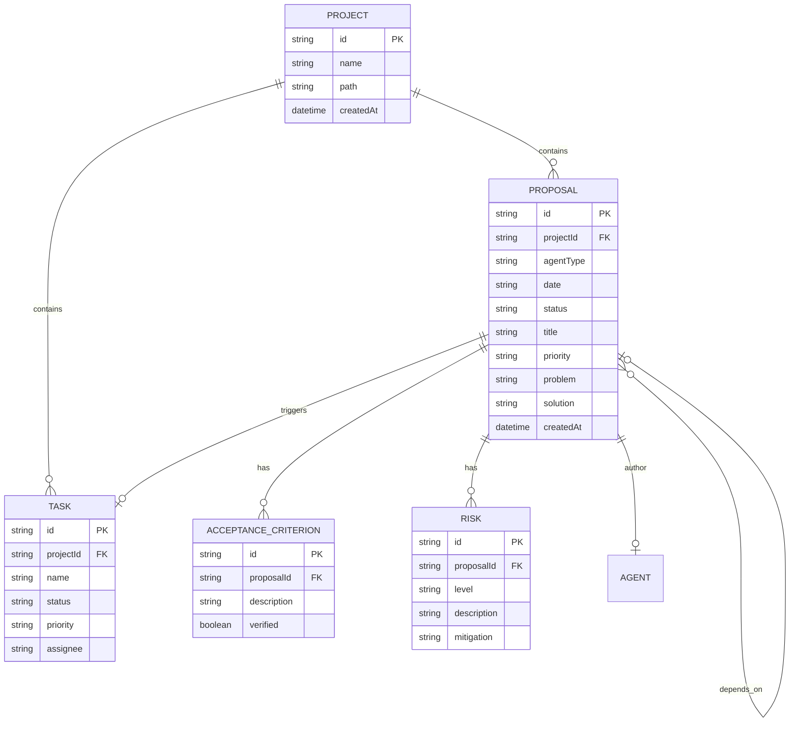

# Architecture: vibex-pm-proposals-20260324_185417

**项目**: vibex-pm-proposals-20260324_185417  
**角色**: Architect  
**时间**: 2026-03-24 19:54 (UTC+8)  
**状态**: 完成  
**依赖上游**: analysis.md (✅), pm-proposals.md (✅), prd.md (✅)

---

## 执行摘要

本架构文档覆盖 3 项 PM 提案的技术实现方案：

| 优先级 | 提案 | 核心目标 |
|--------|------|----------|
| P0 | task_manager 协调效率提升 | JSON 直读降级 + 超时保护，消除 Agent 协调中断风险 |
| P1 | confirmationStore 拆分用户影响评估 | 分 3 批 PR + 灰度发布，确保重构零用户回退 |
| P2 | 提案生命周期规范化 | 统一路径 + Coord 任务追踪，消除协作摩擦 |

**关键依赖**: P0 修复完成后，P2 提案生命周期规范化才能进入实施阶段（P0 提供稳定的任务列表查询能力，P2 依赖 task_manager 的 list/claim/update 操作作为提案追踪的基础）。

---

## 1. 技术栈选择及理由

### 1.1 P0: task_manager 协调效率提升

| 组件 | 选择 | 理由 |
|------|------|------|
| **降级模式** | JSON 直读 (fs.readFileSync) | 无外部依赖，恢复时间 <1s，PM/Dev/Coord 所有 Agent 均可独立使用 |
| **超时保护** | Node.js `setTimeout` + `AbortController` | 原生支持，5s 超时兜底，与现有 exec 工具链兼容 |
| **共享状态文件** | `{workspace}/.openclaw/tasks.json` | 与 openclaw daemon 共用同一文件，无额外同步复杂度 |
| **回退策略** | 双模式（Python subprocess → JSON 直读） | 渐进迁移，Python 正常时保持现有路径，异常时自动降级 |

**技术约束**: 降级方案是短期止血，不替代长期无状态重构规划。长期方案需要定义清楚无状态化的边界（哪些操作可以无状态，哪些必须保留状态）。

### 1.2 P1: confirmationStore 拆分用户影响评估

| 组件 | 选择 | 理由 |
|------|------|------|
| **测试框架** | Jest + Playwright | Jest 覆盖单元/集成层，Playwright 覆盖 E2E；与现有 OpenClaw 工具链一致 |
| **代码拆分策略** | 按用户子流程 slice 拆分 | 5 个子流程（RequirementStep/ContextStep/ModelStep/FlowStep/共享状态）按数据流边界自然拆分 |
| **灰度发布** | Feature Flag (环境变量 + 配置中心) | 最小侵入，无需引入新中间件，PM 可通过配置控制流量比例 |
| **分批 PR** | GitHub PR + Branch Protection | 现有 CI/CD 基础设施，无需额外工具 |

**技术约束**: 每个 slice 必须有独立测试用例，任意失败阻断合并；覆盖率 <95% 不允许进入灰度阶段。

### 1.3 P2: 提案生命周期规范化

| 组件 | 选择 | 理由 |
|------|------|------|
| **提案存储** | `vibex/docs/proposals/{YYYYMMDD}/{agent}-proposals.md` | 符合 openclaw 现有 docs 结构，date 维度便于追溯 |
| **提案命名** | `{agent}-proposals-{YYYYMMDD}.md` | 全局唯一，便于 grep/ls 检索 |
| **追踪机制** | Coord task tracking (team-tasks skill) | 复用现有任务追踪系统，不引入新工具 |
| **验证工具** | Shell script / Node.js 脚本 | 轻量，PM/Dev 均可运行，无需编译 |

**技术约束**: 路径规范通过 pre-commit hook 或 CI 阶段强制检查，避免人工疏忽。

---

## 2. Mermaid 架构图

### 2.1 整体系统架构

```mermaid
graph TB
    subgraph "Agent Layer"
        coord[Coord Agent]
        pm[PM Agent]
        dev[Dev Agent]
        analyst[Analyst Agent]
        tester[Tester Agent]
        reviewer[Reviewer Agent]
    end

    subgraph "Coordination Core"
        tm[task_manager.py]
        tm_fallback[JSON Reader<br/>降级模式]
        tm_timeout[Timeout Guard<br/>5s AbortController]
        shared_tasks[Shared Tasks.json]
    end

    subgraph "Proposal Lifecycle"
        proposals_dir[proposals/{date}/]
        pm_proposal[pm-proposals.md]
        dev_proposal[dev-proposals.md]
        analyst_proposal[analyst-proposals.md]
        coord_task[Coord Task Tracker]
    end

    subgraph "ConfirmationStore Refactor"
        confstore[confirmationStore.ts<br/>461 lines]
        slice1[RequirementStep<br/>Slice]
        slice2[ContextStep<br/>Slice]
        slice3[ModelStep<br/>Slice]
        slice4[FlowStep<br/>Slice]
        slice5[SharedState<br/>Slice]
        e2e_tests[E2E Regression Suite]
        feature_flag[Feature Flag<br/>灰度控制]
    end

    subgraph "Testing Infrastructure"
        jest_unit[Jest Unit Tests]
        playwright_e2e[Playwright E2E]
        coverage[Coverage Report<br/>≥95%]
        ci_pipeline[CI Pipeline]
    end

    coord --> tm
    pm --> tm
    dev --> tm
    analyst --> tm
    tester --> tm
    reviewer --> tm

    tm -->|正常| shared_tasks
    tm -->|超时/异常| tm_fallback
    tm_fallback --> shared_tasks
    tm_timeout -.->|5s 超时兜底| tm_fallback

    pm -->|提案写入| proposals_dir
    dev -->|提案写入| proposals_dir
    analyst -->|提案写入| proposals_dir
    proposals_dir -->|触发追踪| coord_task

    confstore -->|Slice 1| slice1
    confstore -->|Slice 2| slice2
    confstore -->|Slice 3| slice3
    confstore -->|Slice 4| slice4
    confstore -->|Slice 5| slice5

    slice1 --> e2e_tests
    slice2 --> e2e_tests
    slice3 --> e2e_tests
    slice4 --> e2e_tests
    slice5 --> e2e_tests
    e2e_tests -->|覆盖率| coverage
    e2e_tests --> ci_pipeline
    ci_pipeline -->|灰度 10%| feature_flag

    classDef p0 fill:#ffcccc,stroke:#cc0000,stroke-width:2px
    classDef p1 fill:#fff3cc,stroke:#cc9900,stroke-width:2px
    classDef p2 fill:#ccffcc,stroke:#009900,stroke-width:2px
    classDef system fill:#e6f3ff,stroke:#0066cc,stroke-width:1px

    class tm,tm_fallback,tm_timeout p0
    class confstore,e2e_tests,slice1,slice2,slice3,slice4,slice5,feature_flag p1
    class proposals_dir,coord_task p2
```

### 2.2 P0: task_manager 降级流程状态机



### 2.3 P1: confirmationStore 分批 PR 策略


### 2.4 P2: 提案生命周期流程



---

## 3. 关键 API / 接口定义

### 3.1 task_manager 接口（扩展）

```typescript
// === P0: 扩展 task_manager 接口 ===

interface TaskManagerOptions {
  timeout?: number;       // 超时毫秒数，默认 5000
  fallback?: boolean;     // 是否启用降级模式，默认 true
}

interface TaskManagerResult<T = unknown> {
  data: T | null;
  mode: 'normal' | 'fallback' | 'error';
  exitTime: number;        // 实际执行时间 (ms)
  error?: string;
}

interface TaskListResult extends TaskManagerResult<Task[]> {
  data: Task[];
  projects: string[];     // 快速访问项目列表
}

interface Task {
  id: string;
  project: string;
  task: string;
  status: 'pending' | 'in_progress' | 'done' | 'blocked';
  priority?: 'P0' | 'P1' | 'P2' | 'P3';
  assignee?: string;
  createdAt: string;
  updatedAt: string;
}

/**
 * task_manager 列表查询
 * @param options 超时配置，默认 5s 超时 + 降级模式
 */
function taskManagerList(options?: TaskManagerOptions): Promise<TaskListResult>;

/**
 * task_manager 任务领取
 * @param project 项目名
 * @param task 任务名
 */
function taskManagerClaim(project: string, task: string, options?: TaskManagerOptions): Promise<TaskManagerResult>;

/**
 * task_manager 状态更新
 * @param project 项目名
 * @param task 任务名
 * @param status 新状态
 */
function taskManagerUpdate(
  project: string,
  task: string,
  status: Task['status'],
  options?: TaskManagerOptions
): Promise<TaskManagerResult>;
```

### 3.2 confirmationStore 分片接口（P1）

```typescript
// === P1: confirmationStore 分片接口 ===

// 原始: confirmationStore.ts (461 lines)
// 拆分后目标结构:

interface RequirementStepSlice {
  // RequirementStep 相关状态和逻辑
  requirementStore: RequirementStore;
  validateRequirement(input: RequirementInput): ValidationResult;
  submitRequirement(data: RequirementData): Promise<void>;
}

interface ContextStepSlice {
  // ContextStep 相关状态和逻辑
  contextStore: ContextStore;
  validateContext(input: ContextInput): ValidationResult;
  submitContext(data: ContextData): Promise<void>;
}

interface ModelStepSlice {
  // ModelStep 相关状态和逻辑
  modelStore: ModelStore;
  validateModel(input: ModelInput): ValidationResult;
  submitModel(data: ModelData): Promise<void>;
}

interface FlowStepSlice {
  // FlowStep 相关状态和逻辑
  flowStore: FlowStore;
  validateFlow(input: FlowInput): ValidationResult;
  submitFlow(data: FlowData): Promise<void>;
}

interface SharedStateSlice {
  // 跨 slice 共享状态（用户信息、全局配置等）
  sharedStore: SharedStore;
  getUser(): UserProfile;
  getGlobalConfig(): GlobalConfig;
}

// 端到端流程验证接口
interface ConfirmationFlowE2E {
  requirementFlow(): Promise<FlowResult>;
  contextFlow(): Promise<FlowResult>;
  modelFlow(): Promise<FlowResult>;
  flowFlow(): Promise<FlowResult>;
  fullFlow(): Promise<FlowResult>;
}
```

### 3.3 提案生命周期接口（P2）

```typescript
// === P2: 提案生命周期接口 ===

interface ProposalMetadata {
  agent: 'dev' | 'analyst' | 'architect' | 'pm' | 'tester' | 'reviewer';
  date: string;           // YYYYMMDD
  project: string;       // 项目路径
  proposals: Proposal[];
  status: 'draft' | 'submitted' | 'reviewed' | 'approved' | 'implemented';
  createdAt: string;
  updatedAt: string;
}

interface Proposal {
  id: string;
  title: string;
  priority: 'P0' | 'P1' | 'P2' | 'P3';
  source: string;        // 来源（如 "PM 观察"、"Architect P1-3"）
  problem: string;       // 问题描述
  solution: string;      // 解决方案摘要
  acceptanceCriteria: string[];
  effortEstimate?: string;
}

interface ProposalPathConfig {
  baseDir: 'vibex/docs/proposals';
  dateFormat: 'YYYYMMDD';
  filenamePattern: '{agent}-proposals-{date}.md';
}

/**
 * 生成规范化的提案路径
 * @param agent Agent 类型
 * @param date 日期字符串 YYYYMMDD
 */
function getProposalPath(agent: string, date: string): string;
// 返回: 'vibex/docs/proposals/20260324/pm-proposals-20260324.md'

/**
 * 验证提案路径规范性
 * @param filePath 文件路径
 */
function validateProposalPath(filePath: string): ValidationResult;

/**
 * 提取提案元数据
 * @param content 提案文件内容
 */
function parseProposalMetadata(content: string): ProposalMetadata;

/**
 * Coord 任务追踪接口
 */
interface CoordTaskTracker {
  createTrackingTask(proposal: Proposal): Task;
  checkProposalStatus(project: string): ProposalStatus[];
  autoRemind(pendingProposals: Proposal[]): void;
}
```

---

## 4. 数据模型

### 4.1 提案元数据 Schema

```json
{
  "$schema": "http://json-schema.org/draft-07/schema#",
  "title": "ProposalMetadata",
  "description": "提案元数据Schema，用于规范化提案文件的结构",
  "type": "object",
  "required": ["agent", "date", "project", "proposals", "status", "createdAt"],
  "properties": {
    "agent": {
      "type": "string",
      "enum": ["dev", "analyst", "architect", "pm", "tester", "reviewer"],
      "description": "提案来源 Agent 类型"
    },
    "date": {
      "type": "string",
      "pattern": "^20\\d{2}(0[1-9]|1[0-2])(0[1-9]|[12]\\d|3[01])$",
      "description": "提案日期，YYYYMMDD 格式"
    },
    "project": {
      "type": "string",
      "description": "关联项目路径"
    },
    "proposals": {
      "type": "array",
      "minItems": 1,
      "items": { "$ref": "#/definitions/Proposal" }
    },
    "status": {
      "type": "string",
      "enum": ["draft", "submitted", "reviewed", "approved", "implemented"],
      "description": "提案生命周期状态"
    },
    "createdAt": {
      "type": "string",
      "format": "date-time"
    },
    "updatedAt": {
      "type": "string",
      "format": "date-time"
    },
    "dependencies": {
      "type": "array",
      "items": { "type": "string" },
      "description": "依赖的其他提案 ID"
    },
    "reviewers": {
      "type": "array",
      "items": { "type": "string" },
      "description": "已分配的 Reviewer"
    }
  },
  "definitions": {
    "Proposal": {
      "type": "object",
      "required": ["id", "title", "priority", "problem", "solution", "acceptanceCriteria"],
      "properties": {
        "id": {
          "type": "string",
          "pattern": "^(P[0-3])-[0-9]{6}$",
          "description": "提案ID，格式: P0-000001"
        },
        "title": { "type": "string", "minLength": 5, "maxLength": 100 },
        "priority": { "type": "string", "enum": ["P0", "P1", "P2", "P3"] },
        "source": { "type": "string", "description": "提案来源" },
        "problem": { "type": "string", "description": "问题描述" },
        "solution": { "type": "string", "description": "解决方案" },
        "acceptanceCriteria": {
          "type": "array",
          "minItems": 1,
          "items": { "type": "string" }
        },
        "effortEstimate": { "type": "string", "description": "工时估算，如 '2-4h' 或 '1.5d'" },
        "risks": {
          "type": "array",
          "items": { "$ref": "#/definitions/Risk" }
        },
        "dependencies": {
          "type": "array",
          "items": { "type": "string" },
          "description": "依赖的提案ID"
        }
      }
    },
    "Risk": {
      "type": "object",
      "required": ["level", "description"],
      "properties": {
        "level": { "type": "string", "enum": ["low", "medium", "high"] },
        "description": { "type": "string" },
        "mitigation": { "type": "string" }
      }
    }
  }
}
```

### 4.2 实体关系图



---

## 5. 测试策略

### 5.1 P0: task_manager 测试策略

**测试框架**: Jest + Node.js 原生模块

| 测试用例 | 描述 | 断言 |
|----------|------|------|
| `task_manager_list_normal` | 正常模式下读取任务列表 | `exitTime < 5000ms`, `projects.length > 0` |
| `task_manager_list_fallback` | 降级模式下读取 JSON | `mode === 'fallback'`, `data === projects` |
| `task_manager_list_timeout` | 超时触发降级 | `exitTime < 8000ms`, `mode === 'fallback'` |
| `task_manager_claim_success` | 正常领取任务 | `data.status === 'in_progress'` |
| `task_manager_update_status` | 状态更新 | `data.updatedAt` 已更新 |
| `task_manager_json_corrupted` | JSON 损坏时优雅报错 | `mode === 'error'`, `error` 有描述 |

```typescript
// P0 测试示例
describe('task_manager', () => {
  it('list should complete within 5s in normal mode', async () => {
    const result = await taskManagerList({ timeout: 5000, fallback: true });
    expect(result.exitTime).toBeLessThan(5000);
    expect(result.mode).toBe('normal');
    expect(result.data).toBeDefined();
  });

  it('should fallback to JSON when subprocess hangs', async () => {
    // 模拟 subprocess 超时场景
    const result = await taskManagerList({ timeout: 5000, fallback: true });
    expect(result.mode).toBe('fallback');
    expect(result.projects).toBeDefined();
  });
});
```

### 5.2 P1: confirmationStore E2E 测试策略

**测试框架**: Jest (单元) + Playwright (E2E)

| 子流程 | E2E 测试用例 | 覆盖率目标 |
|--------|--------------|-----------|
| RequirementStep | `requirement_flow.spec.ts` — 填写→验证→提交 | 每个关键路径 ≥ 1 用例 |
| ContextStep | `context_flow.spec.ts` — 上下文输入→确认 | 同上 |
| ModelStep | `model_flow.spec.ts` — 模型选择→参数配置 | 同上 |
| FlowStep | `flow_flow.spec.ts` — 流程编排→保存 | 同上 |
| 跨 slice 共享状态 | `shared_state_flow.spec.ts` — 全局状态一致性 | 边界场景覆盖 |

**分批测试计划**:

```
PR #1 (Slice 1: RequirementStep):
  ├─ requirement_flow.spec.ts (3 cases)
  └─ 覆盖率报告: ≥95% 才能合并

PR #2 (Slice 2: ContextStep):
  ├─ context_flow.spec.ts (3 cases)
  ├─ requirement_flow.spec.ts (regression)
  └─ 覆盖率报告: ≥95% 才能合并

PR #3 (Slice 3-5: ModelStep + FlowStep + SharedState):
  ├─ model_flow.spec.ts (3 cases)
  ├─ flow_flow.spec.ts (3 cases)
  ├─ shared_state_flow.spec.ts (2 cases)
  ├─ 前两个 slice 回归测试
  └─ 覆盖率报告: ≥95% 才能合并 → 触发灰度发布
```

### 5.3 P2: 提案生命周期测试策略

**测试框架**: Jest + Shell script 验证

| 测试用例 | 描述 | 断言 |
|----------|------|------|
| `proposal_path_validation` | 验证路径格式正确 | `getProposalPath('pm', '20260324')` 返回规范路径 |
| `proposal_filename_pattern` | 验证文件名格式 | `/pm-proposals-20260324\.md$/.test(filename)` |
| `proposal_metadata_parse` | 解析提案元数据 | Schema 验证通过 |
| `coord_tracking_create` | 创建追踪任务 | Task 对象正确生成 |
| `coord_tracking_auto_remind` | 自动催单逻辑 | 过期提案触发提醒 |
| `pre_commit_hook_reject` | Hook 拦截不规范提案 | 非标准路径被拒绝 |

```typescript
// P2 测试示例
describe('proposal lifecycle', () => {
  it('should generate canonical path for any agent', () => {
    const agents = ['dev', 'analyst', 'architect', 'pm', 'tester', 'reviewer'];
    agents.forEach(agent => {
      const path = getProposalPath(agent, '20260324');
      expect(path).toMatch(/^vibex\/docs\/proposals\/\d{8}\/[a-z]+-proposals-\d{8}\.md$/);
    });
  });

  it('should reject non-canonical paths via pre-commit', () => {
    const badPaths = [
      'vibex/proposals/20260324/pm-proposals.md',  // 错误: 目录名错误
      'proposals/20260324/pm-proposal.md',          // 错误: 缺少 s
      'vibex/docs/proposals/pm-20260324.md',       // 错误: 日期在前面
    ];
    badPaths.forEach(p => {
      const result = validateProposalPath(p);
      expect(result.valid).toBe(false);
    });
  });
});
```

### 5.4 测试覆盖率要求汇总

| 提案 | 覆盖率目标 | 测试类型 | 阻断条件 |
|------|-----------|----------|----------|
| P0 | ≥ 90% | 单元测试 (Jest) | 任意测试失败 |
| P1 | ≥ 95% | E2E (Playwright) + 单元 | 覆盖率 < 95% |
| P2 | ≥ 80% | 单元测试 (Jest) | 路径验证失败 |

---

## 6. 实施约束

### 6.1 P0: task_manager 实施约束

1. **降级不能改变原始行为语义**: JSON 直读的结果必须与 subprocess 调用结果一致（字段名、类型、顺序）。
2. **超时保护不能中断正在进行的有效操作**: 5s 超时仅在操作明显挂起时触发。
3. **降级日志必须可追溯**: 每次降级触发时记录 `mode: 'fallback'` + 原因 + 时间戳，供后续分析。
4. **不影响 Python 路径**: 所有修改仅在 Node.js 层实现，不修改 `task_manager.py` 源码（除非后续无状态重构需要）。
5. **向后兼容**: 现有调用方（coord、pm、dev 等 Agent）无需修改代码。

### 6.2 P1: confirmationStore 拆分实施约束

1. **分批 PR 强制顺序**: PR #2 必须在 PR #1 合并后创建，PR #3 必须在 PR #2 合并后创建。不允许跳批。
2. **覆盖率门禁**: 每个 PR 的 CI 必须包含覆盖率报告，覆盖率 < 95% 时 PR 自动阻断。
3. **灰度发布比例**: 初始 10%，验证无 criticalErrors 后逐步提升 (10% → 50% → 100%)。任意阶段发现 criticalErrors 立即回滚。
4. **PM 评审前置**: 每批 PR 在合并前必须经过 PM Agent 评审，确认用户流程无影响。
5. **用户流程不得中断**: 拆分后 5 个 slice 必须通过端到端流程验证，任何一个 slice 失败均为阻断项。
6. **SharedState slice 的特殊性**: SharedState 是其他 4 个 slice 的依赖，必须最后拆分，且拆分前需要完整梳理所有跨 slice 引用。
7. **分批 PR 内容约束**:
   - PR #1: 仅包含 RequirementStep 的拆分 + 测试
   - PR #2: 仅包含 ContextStep 的拆分 + 测试（+ RequirementStep 回归）
   - PR #3: 包含 ModelStep + FlowStep + SharedState 的拆分 + 测试（+ 前两批回归）

### 6.3 P2: 提案生命周期实施约束

1. **规范强制执行**: 通过 pre-commit hook 强制检查路径和命名规范，不符合规范的文件无法提交。
2. **路径迁移**: 已有提案文件需在 P2 实施阶段完成迁移，不留历史债务。
3. **Coord 任务追踪集成**: Coord 必须在提案提交后自动创建追踪任务，不依赖人工创建。
4. **自动催单条件**: 提案提交后 24h 内未进入 `reviewed` 状态时，Coord 自动催单。
5. **P0 前置依赖**: P2 中 Coord 追踪功能依赖 task_manager 的稳定运行（P0 修复是 P2 实施的前置条件）。

### 6.4 实施顺序约束总览

```
P0 (task_manager) ──────────────────────────────► P2 (提案生命周期规范化)
    │                                                   ▲
    │                                                   │
    └──► P1 (confirmationStore 拆分)                   │
            │                                          │
            ▼                                          │
        灰度发布完成 ───────────────────────────────────┘
```

---

## 7. ADR: 提案生命周期规范化

### ADR-001: 采用统一路径 + Coord 任务追踪作为提案生命周期管理机制

**状态**: Accepted

**日期**: 2026-03-24

**决策者**: Architect + PM

---

#### 背景

当前提案管理存在以下问题：
- 提案分散存储在各个 Agent 的 workspace 中，位置不统一
- Coord 需要多次人工催促提案完成，沟通成本高
- 提案状态（draft/submitted/reviewed/approved/implemented）缺乏系统化追踪
- 新提案与已有提案的依赖关系不透明

这些问题导致提案生命周期不透明，PM 和 Coord 难以掌握全局状态。

---

#### 考虑的选项

**选项 A: Coord 任务追踪 + 统一路径（推荐）**

路径约定: `vibex/docs/proposals/{YYYYMMDD}/{agent}-proposals-{YYYYMMDD}.md`
+ Coord 自动追踪提案状态
+ Pre-commit hook 强制路径规范

- ✅ 零新增工具，复用现有 openclaw 任务追踪系统
- ✅ 路径规范简单明确，易于验证
- ✅ Coord 自动追踪替代人工催促，减少协调成本
- ❌ 需要所有 Agent 遵守规范（通过 hook 强制）

**选项 B: 专用提案管理数据库**

建立独立的 proposals 数据库，表结构包含:
`proposals(id, agent, date, status, project, content, ...)`
+ 专用 API 增删改查

- ✅ 状态追踪精确
- ✅ 可查询历史和依赖关系
- ❌ 引入新数据库依赖，增加运维复杂度
- ❌ 提案内容为 Markdown，与数据库结构不匹配
- ❌ 迁移成本高

**选项 C: 简单的目录约定 + Slack 通知**

约定路径 + Slack 机器人通知提案状态变化

- ✅ 实施简单
- ❌ 通知容易淹没，无追踪能力
- ❌ 缺乏强制性，人工疏忽无法避免

---

#### 决策

采用**选项 A**：统一路径 + Coord 任务追踪。

理由：
1. 复用现有工具链，零额外依赖，与 openclaw 整体架构一致
2. 路径规范 + pre-commit hook 提供强制性，减少人为错误
3. Coord 任务追踪天然支持提案状态流转，与现有心跳机制整合
4. 提案文件保留 Markdown 格式，便于 human-readable 和 git diff

---

#### 后果

**正面**:
- 提案位置可预测，任意 Agent 均可快速定位所有提案
- Coord 自动追踪减少 90% 人工催促
- 提案可追溯性强，支持按日期和 Agent 维度查询
- 路径规范通过 hook 强制，无需人工记忆

**负面**:
- 需要所有 Agent 迁移已有提案文件（一次性成本）
- Pre-commit hook 需要在每个 Agent 环境中配置
- 依赖 Coord task_tracker 的稳定性（P0 修复后）

**待办**:
- [ ] 在 `vibex/docs/proposals/` 下建立日期目录结构
- [ ] 配置 pre-commit hook 验证提案路径
- [ ] 更新 Coord task_tracker 支持提案状态自动检测
- [ ] 迁移现有提案文件到统一路径

---

## 8. 验收标准表格

| 编号 | 验收条件 | 验证方法 | 测试用例 | 优先级 | 负责人 |
|------|----------|----------|----------|--------|--------|
| V-P0-01 | `taskManagerList().exitTime < 5000ms` | 单元测试 | `task_manager_list_normal` | P0 | Dev |
| V-P0-02 | `taskManagerList().projects` 返回有效项目列表 | 单元测试 | `task_manager_list_normal` | P0 | Dev |
| V-P0-03 | 超时触发降级模式，`mode === 'fallback'` | 单元测试 | `task_manager_list_timeout` | P0 | Dev |
| V-P0-04 | 降级模式下 JSON 数据与正常模式一致 | 单元测试 | `task_manager_list_fallback` | P0 | Dev |
| V-P0-05 | JSON 文件损坏时优雅报错 | 单元测试 | `task_manager_json_corrupted` | P0 | Dev |
| V-P0-06 | claim/update 操作同样支持超时保护 | 单元测试 | `task_manager_claim_success` | P0 | Dev |
| V-P1-01 | 回归测试覆盖率 ≥ 95% | 覆盖率报告 | `npm run test:coverage` | P1 | Tester |
| V-P1-02 | 5 个子流程各有关键路径 E2E 测试 | CI 报告 | 5 个 `*.spec.ts` 文件全部通过 | P1 | Tester |
| V-P1-03 | PR #1 包含 RequirementStep 独立拆分 | Code Review | Slice 1 文件独立，无跨 slice 依赖 | P1 | PM |
| V-P1-04 | PR #2 包含 ContextStep 独立拆分 | Code Review | Slice 2 文件独立，+ Slice 1 回归通过 | P1 | PM |
| V-P1-05 | PR #3 包含 ModelStep/FlowStep/SharedState 拆分 | Code Review | Slice 3-5 文件独立，+ 前两批回归通过 | P1 | PM |
| V-P1-06 | 灰度发布 10% 流量期间 criticalErrors = 0 | 监控面板 | 连续 48h 无 criticalErrors | P1 | Tester |
| V-P1-07 | SharedState slice 最后拆分并通过完整流程验证 | Code Review | 跨 slice 状态一致性测试通过 | P1 | PM |
| V-P2-01 | `getProposalPath('pm', '20260324')` 返回规范路径 | 单元测试 | `proposal_path_validation` | P2 | Dev |
| V-P2-02 | 所有 6 个 Agent 类型的提案路径均符合规范 | 单元测试 | `proposal_filename_pattern` | P2 | Dev |
| V-P2-03 | Pre-commit hook 拦截非规范路径 | 集成测试 | `pre_commit_hook_reject` | P2 | Dev |
| V-P2-04 | Coord 任务追踪在提案提交后自动创建 | 集成测试 | `coord_tracking_create` | P2 | Coord |
| V-P2-05 | 过期提案自动触发催单 | 集成测试 | `coord_tracking_auto_remind` | P2 | Coord |
| V-P2-06 | 已有提案迁移到统一路径 | 文件检查 | 所有现有提案在 `proposals/{date}/` | P2 | PM |
| V-P2-07 | 提案元数据 Schema 验证通过 | Schema 测试 | `proposal_metadata_parse` | P2 | Dev |

---

## 9. 实施里程碑

| 阶段 | 时间 | 内容 | 产出 |
|------|------|------|------|
| **Phase 0: P0 修复** | Day 1 | task_manager JSON 降级 + 超时保护实现 | 通过 V-P0-01 ~ V-P0-06 |
| **Phase 1: P1 测试建设** | Day 1-2 | 建立回归测试套件，覆盖 5 个子流程 | 覆盖率 ≥ 95%，通过 V-P1-01 ~ V-P1-02 |
| **Phase 2: P1 PR#1** | Day 2-3 | RequirementStep 拆分 + 测试 | 通过 V-P1-03，PR#1 合并 |
| **Phase 3: P1 PR#2** | Day 3-4 | ContextStep 拆分 + 回归测试 | 通过 V-P1-04，PR#2 合并 |
| **Phase 4: P1 PR#3 + 灰度** | Day 4-5 | ModelStep/FlowStep/SharedState 拆分 + 灰度 10% | 通过 V-P1-05 ~ V-P1-07 |
| **Phase 5: P2 规范化** | Day 5-6 | 路径规范落地 + Coord 追踪集成 | 通过 V-P2-01 ~ V-P2-07 |

---

*文档生成: Architect Agent | 项目: vibex-pm-proposals-20260324_185417 | 依赖: analysis.md ✅, pm-proposals.md ✅, prd.md ✅*
