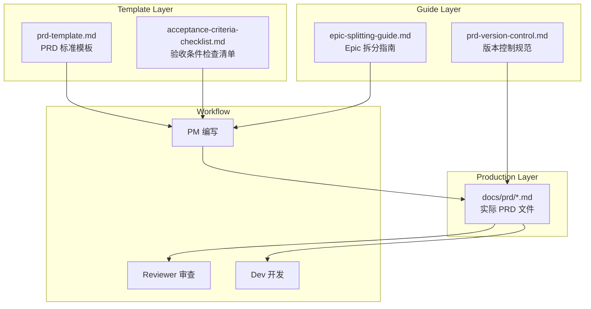
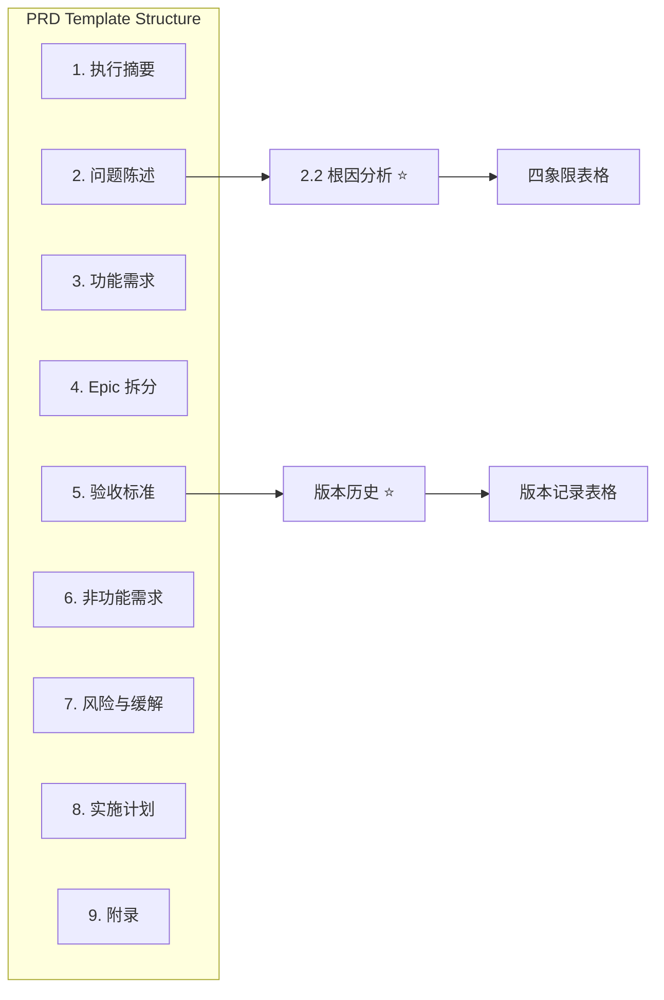
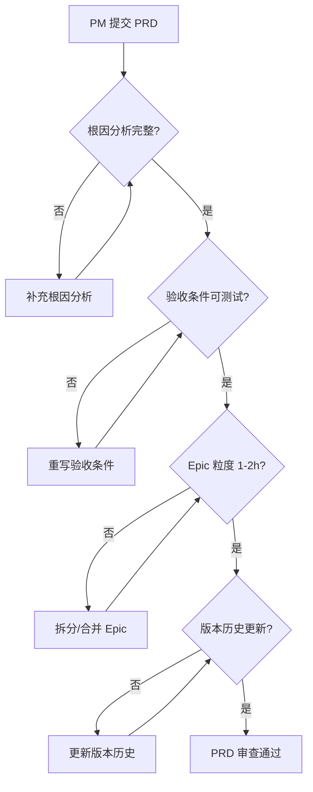
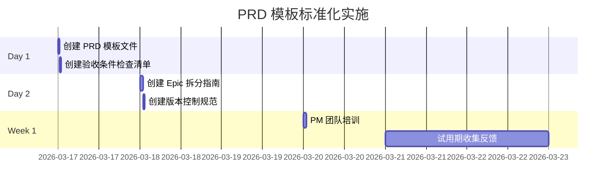

# PRD 模板标准化架构设计

**项目**: vibex-prd-template-standardization  
**架构师**: Architect Agent  
**日期**: 2026-03-17  
**状态**: ✅ 设计完成

---

## 一、技术栈

| 技术 | 用途 | 说明 |
|------|------|------|
| Markdown | 文档格式 | 已有标准 |
| YAML Front Matter | 元数据 | 可选增强 |
| Git | 版本控制 | 已有基础设施 |

---

## 二、架构图

### 2.1 文档体系架构



### 2.2 模板结构层次



### 2.3 验收条件检查流程



---

## 三、文件结构设计

### 3.1 目录结构

```
/root/.openclaw/vibex/docs/
├── templates/                          # 模板目录 (新建)
│   ├── prd-template.md                 # PRD 标准模板
│   └── acceptance-criteria-checklist.md # 验收条件检查清单
├── guides/                             # 指南目录 (新建)
│   ├── epic-splitting-guide.md         # Epic 拆分指南
│   └── prd-version-control.md          # PRD 版本控制规范
└── prd/                                # PRD 存放目录 (现有)
    └── [项目名]-prd.md
```

### 3.2 文件命名规范

| 文件类型 | 命名格式 | 示例 |
|----------|----------|------|
| PRD 文件 | `{项目名}-prd.md` | `vibex-api-fix-prd.md` |
| 模板文件 | `{类型}-template.md` | `prd-template.md` |
| 指南文件 | `{主题}-guide.md` | `epic-splitting-guide.md` |

---

## 四、模板格式定义

### 4.1 PRD 模板结构

```markdown
# PRD: {项目名称}

**项目**: {project-id}
**产品经理**: PM Agent
**日期**: YYYY-MM-DD
**版本**: 1.0
**状态**: Draft | Reviewing | Approved

---

## 1. 执行摘要

### 1.1 背景
{问题背景描述}

### 1.2 目标
| 指标 | 当前值 | 目标值 |
|------|--------|--------|
| {指标名} | {当前} | {目标} |

### 1.3 预期收益
- {收益点 1}
- {收益点 2}

---

## 2. 问题陈述

### 2.1 核心痛点
| 问题 | 当前状态 | 影响 |
|------|----------|------|

### 2.2 根因分析 ⭐
| 环节 | 问题 | 影响 | 解决方案 |
|------|------|------|----------|
| {定位} | {问题} | {影响} | {方案} |

---

## 3. 功能需求

### F1: {功能名称}
**描述**: {功能描述}
**验收标准**:
- [ ] AC-F1.1: {可测试条件，可写 expect()}
- [ ] AC-F1.2: {可测试条件}

---

## 4. Epic 拆分

| Epic ID | 名称 | 描述 | 工作量 | 负责人 |
|---------|------|------|--------|--------|
| E-001 | {名称} | {描述} | {1-2h} | {角色} |

---

## 5. 验收标准

### 5.1 成功标准
| ID | 标准 | 验证方法 |
|----|------|----------|

### 5.2 DoD
- [ ] 所有 Epic 验收标准通过
- [ ] 代码已合并
- [ ] 文档已更新

---

## 6. 非功能需求

### 6.1 性能
{性能要求}

### 6.2 安全
{安全要求}

---

## 7. 风险与缓解

| 风险 | 可能性 | 影响 | 缓解措施 |
|------|--------|------|----------|

---

## 8. 实施计划

| 阶段 | 时间 | 内容 |
|------|------|------|

---

## 9. 版本历史 ⭐

| 版本 | 日期 | 变更内容 | 作者 |
|------|------|----------|------|
| 1.0 | YYYY-MM-DD | 初始版本 | PM |

---

## 10. 附录

- 分析文档: `docs/{项目}/analysis.md`
- 架构文档: `docs/{项目}/architecture.md`
```

### 4.2 根因分析表格格式

**四象限格式**:

| 列名 | 说明 | 示例 |
|------|------|------|
| 环节 | 代码/系统定位 | `Backend API` |
| 问题 | 具体问题描述 | `未返回 mermaidCode 字段` |
| 影响 | 业务影响 | `前端无法渲染图表` |
| 解决方案 | 修复方向 | `添加 mermaidCode 到响应` |

**验证规则**:
- 每行必须四列完整
- 环节需具体到模块/文件
- 影响需描述业务后果

### 4.3 验收条件格式规范

**格式要求**:
```
AC-F{n}.{m}: {可测试描述}
```

**检查规则**:

| 规则 | 正确示例 | 错误示例 |
|------|----------|----------|
| 可写 expect() | `API 响应时间 < 200ms` | `优化性能` |
| 具体数值 | `Toast 显示 3 秒后消失` | `显示一段时间` |
| 明确行为 | `点击按钮显示 "成功"` | `提升用户体验` |
| 可自动化测试 | `grep 输出包含 "error"` | `代码质量好` |

---

## 五、检查清单设计

### 5.1 验收条件检查清单

```markdown
# 验收条件审查清单

## 使用说明
PRD 提交前，请逐项检查以下内容。

---

## 1. 根因分析

- [ ] **RC-001**: 根因分析表格存在
  - 验证方法: `grep "根因分析" {prd-file}`
  
- [ ] **RC-002**: 根因分析包含 ≥1 行内容
  - 验证方法: 表格行数 ≥ 2 (含表头)

- [ ] **RC-003**: 每行四列完整 (环节/问题/影响/解决方案)
  - 验证方法: 目视检查

---

## 2. 验收条件

- [ ] **AC-001**: 所有功能需求包含验收标准
  - 验证方法: 每个 `F{n}` 下有 `AC-F{n}.{m}`

- [ ] **AC-002**: 验收条件格式正确
  - 验证方法: `grep "AC-F" {prd-file}`

- [ ] **AC-003**: 无模糊词汇 ("优化"、"提升"、"改善")
  - 验证方法: `grep -E "优化|提升|改善" {prd-file}` 应为空

- [ ] **AC-004**: 每个验收条件可写 expect() 断言
  - 验证方法: 人工审查

---

## 3. Epic 拆分

- [ ] **EP-001**: Epic 表格存在
  - 验证方法: `grep "Epic ID" {prd-file}`

- [ ] **EP-002**: 每个 Epic 工时在 1-2h
  - 验证方法: 检查工作量列

- [ ] **EP-003**: Epic 有明确负责人
  - 验证方法: 负责人列不为空

---

## 4. 版本历史

- [ ] **VH-001**: 版本历史章节存在
  - 验证方法: `grep "版本历史" {prd-file}`

- [ ] **VH-002**: 版本历史包含初始版本记录
  - 验证方法: 表格行数 ≥ 2

---

## 5. 整体完整性

- [ ] **INT-001**: 包含执行摘要
- [ ] **INT-002**: 包含问题陈述
- [ ] **INT-003**: 包含非功能需求
- [ ] **INT-004**: 包含风险与缓解
- [ ] **INT-005**: 包含实施计划
```

---

## 六、Epic 拆分指南

### 6.1 粒度建议

| Epic 类型 | 工时范围 | 适用场景 |
|-----------|----------|----------|
| 小型 | 0.5-1h | 文档创建、配置修改 |
| 标准 | 1-2h | 单一功能开发 |
| 大型 | 2-4h | 复杂功能 (需拆分) |

### 6.2 拆分原则

1. **单一职责**: 每个 Epic 只做一件事
2. **可交付**: 每个 Epic 可独立测试
3. **可估算**: 工时在 1-2h 精度内

### 6.3 拆分示例

**原始需求** (过大):
```
E-001: 用户认证功能 (8h)
```

**拆分后**:
```
E-001: 登录页面 UI (1.5h)
E-002: 登录 API 集成 (2h) → 需继续拆分
E-002-a: 登录请求封装 (1h)
E-002-b: 登录状态管理 (1h)
E-003: 注册页面 UI (1.5h)
E-004: 注册 API 集成 (1h)
```

---

## 七、版本控制规范

### 7.1 版本号格式

```
{major}.{minor}

major: 重大变更 (需求方向改变)
minor: 小幅变更 (验收条件调整、Epic 拆分)
```

### 7.2 变更记录格式

| 版本 | 日期 | 变更内容 | 作者 |
|------|------|----------|------|
| 1.0 | 2026-03-17 | 初始版本 | PM |
| 1.1 | 2026-03-18 | 新增 F3 验收条件 | PM |

### 7.3 变更类型

| 类型 | 版本变更 | 示例 |
|------|----------|------|
| 新增功能 | minor | 新增 F3 |
| 删除功能 | minor | 删除 F2 |
| 需求转向 | major | 项目目标调整 |
| Epic 拆分 | minor | E-001 拆分为 E-001-a/b |

---

## 八、测试策略

### 8.1 模板验证

| 测试项 | 方法 | 预期结果 |
|--------|------|----------|
| Markdown 渲染 | 预览检查 | 无格式错误 |
| 章节完整 | grep 检查 | 所有章节存在 |
| 表格格式 | 目视检查 | 列对齐正确 |

### 8.2 流程验证

```bash
# 验证模板文件存在
test -f docs/templates/prd-template.md

# 验证根因分析章节
grep "根因分析" docs/templates/prd-template.md

# 验证版本历史章节
grep "版本历史" docs/templates/prd-template.md

# 验证检查清单项数
grep -c "\\[\\]" docs/templates/acceptance-criteria-checklist.md
```

---

## 九、迁移计划

### 9.1 实施步骤



### 9.2 回归测试

- 新 PRD 使用模板创建
- Reviewer 使用检查清单审查
- 收集 PM 使用反馈

---

## 十、验收标准

| ID | 验收标准 | 验证方法 |
|----|----------|----------|
| ARCH-001 | `docs/templates/prd-template.md` 存在 | `test -f` |
| ARCH-002 | 模板包含根因分析章节 | `grep "根因分析"` |
| ARCH-003 | 模板包含版本历史章节 | `grep "版本历史"` |
| ARCH-004 | 检查清单 ≥5 项 | `grep -c "\\[\\]"` |
| ARCH-005 | Epic 拆分指南存在 | `test -f` |
| ARCH-006 | 版本控制规范存在 | `test -f` |

---

## 十一、产出物清单

| 文件 | 位置 | 状态 |
|------|------|------|
| 架构文档 | `docs/vibex-prd-template-standardization/architecture.md` | ✅ 本文档 |
| PRD 模板 | `docs/templates/prd-template.md` | 📝 待创建 |
| 验收检查清单 | `docs/templates/acceptance-criteria-checklist.md` | 📝 待创建 |
| Epic 拆分指南 | `docs/guides/epic-splitting-guide.md` | 📝 待创建 |
| 版本控制规范 | `docs/guides/prd-version-control.md` | 📝 待创建 |

---

**完成时间**: 2026-03-17 10:28  
**架构师**: Architect Agent