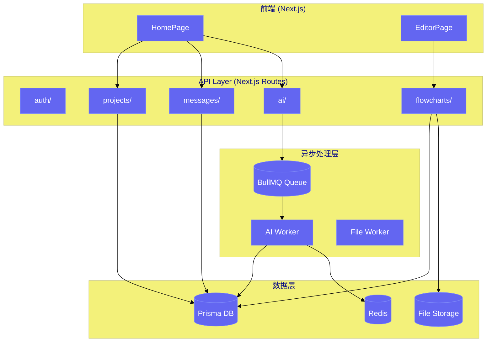
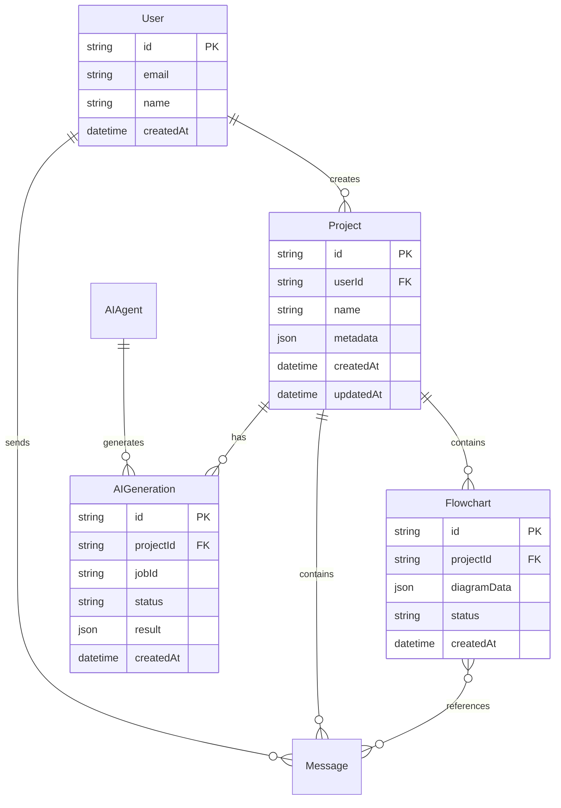

# 架构设计文档: API服务拆分

**项目**: vibex-proposal-api-split
**状态**: APPROVED
**版本**: v1.0
**日期**: 2026-03-19

---

## 1. Tech Stack

| 技术 | 选择 | 理由 |
|------|------|------|
| Next.js 13+ App Router | 原生使用 | 现有架构基础，API Routes 天然路由拆分 |
| TypeScript | 原生使用 | 全栈类型安全 |
| BullMQ + Redis | 异步队列 | AI/文件处理异步化，社区成熟 |
| @vibex/types | 新增 | 共享类型包，消除跨模块耦合 |
| Jest + Supertest | 测试框架 | 覆盖率高，生态成熟 |
| Playwright | E2E 测试 | 核心用户路径覆盖 |

**演进路线**:
- **Phase 1 (立即)**: Next.js API Routes 模块化 — 无需引入新服务
- **Phase 2 (中期)**: BullMQ 异步队列 + AI Worker
- **Phase 3 (长期)**: Cloudflare Workers 微服务化

---

## 2. Architecture Diagram



---

## 3. API Definitions

### 3.1 路由结构

```
src/app/api/
├── auth/
│   ├── route.ts           GET  /api/auth/status
│   ├── login/route.ts     POST /api/auth/login
│   └── logout/route.ts    POST /api/auth/logout
├── projects/
│   ├── route.ts           GET  /api/projects
│   │                      POST /api/projects
│   └── [id]/route.ts      GET  /api/projects/:id
│                           PUT  /api/projects/:id
│                           DELETE /api/projects/:id
├── messages/
│   ├── route.ts           GET  /api/messages
│   │                      POST /api/messages
│   └── [id]/route.ts      GET  /api/messages/:id
│                           PUT  /api/messages/:id
├── flowcharts/
│   ├── route.ts           GET  /api/flowcharts
│   │                      POST /api/flowcharts
│   └── [id]/route.ts      GET  /api/flowcharts/:id
│                           PUT  /api/flowcharts/:id
│                           DELETE /api/flowcharts/:id
└── ai/
    ├── generate/route.ts  POST /api/ai/generate → { jobId }
    └── status/route.ts    GET  /api/ai/status/:jobId
```

### 3.2 统一响应格式

```typescript
// lib/api-response.ts
export interface ApiResponse<T = unknown> {
  success: boolean;
  data?: T;
  error?: {
    code: string;
    message: string;
    details?: unknown;
  };
  meta: {
    timestamp: string;
    requestId: string;
  };
}

export const ErrorCodes = {
  UNAUTHORIZED: 'AUTH_001',
  FORBIDDEN: 'AUTH_002',
  NOT_FOUND: 'RES_001',
  VALIDATION_ERROR: 'VAL_001',
  INTERNAL_ERROR: 'SYS_001',
  SERVICE_UNAVAILABLE: 'SYS_002',
} as const;

// 使用示例: GET /api/projects
export async function GET(request: Request) {
  const projects = await prisma.project.findMany();
  return Response.json({
    success: true,
    data: projects,
    meta: { timestamp: new Date().toISOString(), requestId: crypto.randomUUID() }
  });
}
```

---

## 4. Data Model

### 4.1 核心实体



---

## 5. Testing Strategy

### 5.1 测试框架

| 测试类型 | 框架 | 覆盖率目标 | 关键指标 |
|----------|------|------------|----------|
| 单元测试 | Jest | 80% | 核心业务逻辑 |
| API 集成测试 | Supertest | 90% | 所有端点 |
| E2E 测试 | Playwright | 核心路径 | 5个关键场景 |

### 5.2 核心测试用例

```typescript
// __tests__/api/projects.test.ts
import request from 'supertest';
import { app } from '@/app';

describe('Projects API', () => {
  describe('GET /api/projects', () => {
    it('should return project list for authenticated user', async () => {
      const res = await request(app)
        .get('/api/projects')
        .set('Authorization', 'Bearer <token>');
      expect(res.status).toBe(200);
      expect(res.body.success).toBe(true);
      expect(Array.isArray(res.body.data)).toBe(true);
    });

    it('should return 401 for unauthenticated request', async () => {
      const res = await request(app).get('/api/projects');
      expect(res.status).toBe(401);
      expect(res.body.error.code).toBe('AUTH_001');
    });
  });

  describe('POST /api/projects', () => {
    it('should create project with valid data', async () => {
      const res = await request(app)
        .post('/api/projects')
        .set('Authorization', 'Bearer <token>')
        .send({ name: 'Test Project', metadata: {} });
      expect(res.status).toBe(201);
      expect(res.body.success).toBe(true);
      expect(res.body.data.id).toBeDefined();
    });

    it('should return 400 for invalid data', async () => {
      const res = await request(app)
        .post('/api/projects')
        .set('Authorization', 'Bearer <token>')
        .send({});
      expect(res.status).toBe(400);
      expect(res.body.error.code).toBe('VAL_001');
    });
  });
});

// __tests__/api/ai.test.ts
describe('AI API', () => {
  describe('POST /api/ai/generate', () => {
    it('should return jobId immediately', async () => {
      const res = await request(app)
        .post('/api/ai/generate')
        .set('Authorization', 'Bearer <token>')
        .send({ projectId: 'proj_123', prompt: '分析订单流程' });
      expect(res.status).toBe(202);
      expect(res.body.data.jobId).toBeDefined();
    });
  });

  describe('GET /api/ai/status/:jobId', () => {
    it('should return job status', async () => {
      const res = await request(app)
        .get('/api/ai/status/job_123')
        .set('Authorization', 'Bearer <token>');
      expect(res.status).toBe(200);
      expect(['pending', 'processing', 'completed', 'failed']).toContain(res.body.data.status);
    });
  });
});
```

### 5.3 回滚测试

```bash
# 回滚验证测试
describe('Rollback Scenarios', () => {
  it('should maintain backward compatibility during migration', async () => {
    // 旧客户端仍能访问 /api/projects (通过代理)
    const res = await request(app).get('/api/projects');
    expect(res.status).toBe(200);
  });
});
```

---

## 6. 实施计划

| 阶段 | 时间 | 内容 |
|------|------|------|
| Week 1 | API Router 重构 | 将 api.ts 拆分为独立 route 文件，统一错误处理 |
| Week 2 | 共享类型 | 创建 @vibex/types 包，提取公共 DTO |
| Week 3-4 | 异步处理 | 引入 BullMQ，AI 生成异步化 |

---

*Architecture Design - 2026-03-19*
