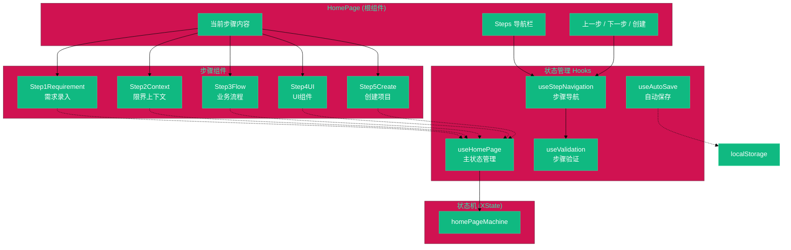
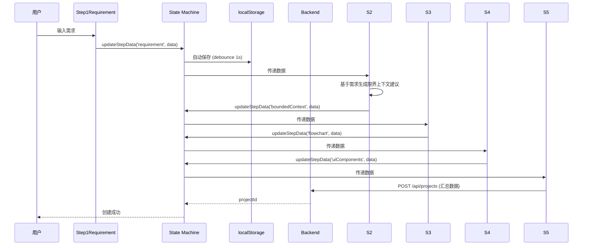
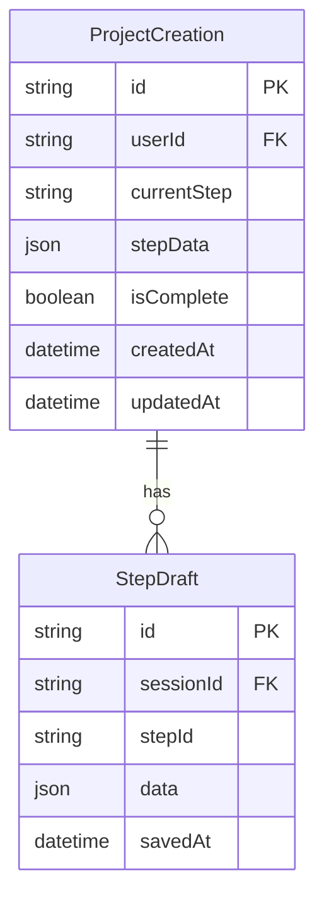

# 架构设计文档: 首页五步流程架构

**项目**: vibex-proposal-five-step-flow
**状态**: APPROVED
**版本**: v1.0
**日期**: 2026-03-19

---

## 1. Tech Stack

| 技术 | 选择 | 理由 |
|------|------|------|
| React 18 | 原生使用 | 现有前端框架 |
| XState | 原生使用 | 已有状态机，无需引入新库 |
| TypeScript | 原型使用 | 全栈类型安全 |
| Jest + Testing Library | 测试框架 | React 组件测试标准 |
| Playwright | E2E 测试 | 核心用户流程覆盖 |
| localStorage | 原生使用 | 本地草稿持久化，无需后端 |

**架构模式**: 组件化 + Hooks 驱动，步骤间通过共享状态解耦。

---

## 2. Architecture Diagram



### 2.1 数据流



---

## 3. API Definitions

### 3.1 步骤数据传递接口

```typescript
// types/steps.ts
export interface StepData {
  requirement?: {
    text: string;
    template?: string;
    keywords?: string[];
  };
  boundedContext?: {
    contexts: BoundedContext[];
    relationships: ContextRelationship[];
  };
  flowchart?: {
    nodes: FlowNode[];
    edges: FlowEdge[];
    metadata: FlowMetadata;
  };
  uiComponents?: {
    components: UIComponent[];
    layout: LayoutSpec;
  };
  project?: {
    name: string;
    description: string;
    settings: ProjectSettings;
  };
}

export interface HomePageState {
  currentStep: number;
  stepData: StepData;
  validation: Record<string, boolean>;
  isDirty: boolean;
}
```

### 3.2 创建项目 API

```typescript
// Step5Create.tsx → 调用
// POST /api/projects
interface CreateProjectRequest {
  name: string;
  description: string;
  requirement: StepData['requirement'];
  boundedContext: StepData['boundedContext'];
  flowchart: StepData['flowchart'];
  uiComponents: StepData['uiComponents'];
}

// Response
interface CreateProjectResponse {
  success: boolean;
  data: {
    projectId: string;
    projectUrl: string;
  };
}
```

---

## 4. Data Model

### 4.1 步骤状态实体



### 4.2 步骤验证规则

```typescript
// lib/step-validation.ts
export const stepValidationRules: Record<number, () => boolean> = {
  1: () => {
    const { requirement } = getStepData(1);
    return requirement?.text?.trim().length >= 10;
  },
  2: () => {
    const { boundedContext } = getStepData(2);
    return boundedContext?.contexts?.length > 0;
  },
  3: () => {
    const { flowchart } = getStepData(3);
    return flowchart?.nodes?.length >= 2;
  },
  4: () => {
    const { uiComponents } = getStepData(4);
    return uiComponents?.components?.length >= 1;
  },
  5: () => {
    const { project } = getStepData(5);
    return !!(project?.name?.trim());
  },
};
```

---

## 5. Testing Strategy

### 5.1 测试框架

| 测试类型 | 框架 | 覆盖率目标 |
|----------|------|------------|
| 组件测试 | Jest + Testing Library | 90% |
| Hooks 测试 | @testing-library/react-hooks | 85% |
| 状态机测试 | XState + Jest | 90% |
| E2E 测试 | Playwright | 核心路径 |

### 5.2 核心测试用例

```typescript
// __tests__/steps/Step1Requirement.test.tsx
describe('Step1Requirement', () => {
  it('should update requirement text', async () => {
    render(<Step1Requirement />);
    const textarea = screen.getByPlaceholderText('请输入需求描述');
    fireEvent.change(textarea, { target: { value: '新的用户登录功能' } });
    expect(screen.getByDisplayValue('新的用户登录功能')).toBeInTheDocument();
  });

  it('should show validation error when too short', () => {
    render(<Step1Requirement />);
    fireEvent.change(screen.getByPlaceholderText('请输入需求描述'), {
      target: { value: '短' }
    });
    expect(screen.getByText(/至少10个字符/i)).toBeInTheDocument();
  });
});

// __tests__/hooks/useStepNavigation.test.ts
describe('useStepNavigation', () => {
  it('should not allow proceeding without validation', async () => {
    const { result } = renderHook(() => useStepNavigation());
    
    // Step 1 has no data yet
    const canProceed = result.current.canProceed(2);
    expect(canProceed).toBe(false);
  });

  it('should allow proceeding when step is valid', async () => {
    const { result } = renderHook(() => useStepNavigation());
    
    // Set valid data for step 1
    act(() => {
      result.current.updateStepData('requirement', { text: '这是一个有效的需求描述文本' });
    });
    
    const canProceed = result.current.canProceed(2);
    expect(canProceed).toBe(true);
  });
});

// __tests__/steps/HomePage.test.tsx
describe('HomePage Five-Step Flow', () => {
  it('should render all 5 steps in navigation', () => {
    render(<HomePage />);
    expect(screen.getByText('需求录入')).toBeInTheDocument();
    expect(screen.getByText('限界上下文')).toBeInTheDocument();
    expect(screen.getByText('业务流程')).toBeInTheDocument();
    expect(screen.getByText('UI组件')).toBeInTheDocument();
    expect(screen.getByText('创建项目')).toBeInTheDocument();
  });

  it('should navigate through all 5 steps with valid data', async () => {
    render(<HomePage />);
    
    // Step 1 → 2
    fireEvent.change(screen.getByPlaceholderText('请输入需求描述'), {
      target: { value: '这是一个有效的需求描述文本' }
    });
    fireEvent.click(screen.getByRole('button', { name: /下一步/i }));
    await waitFor(() => expect(screen.getByText('限界上下文')).toBeInTheDocument());
    
    // Step 2 → 3
    fireEvent.click(screen.getByRole('button', { name: /选择上下文/i }));
    fireEvent.click(screen.getByRole('button', { name: /下一步/i }));
    await waitFor(() => expect(screen.getByText('业务流程')).toBeInTheDocument());
  });
});

// __tests__/hooks/useAutoSave.test.ts
describe('useAutoSave', () => {
  beforeEach(() => localStorage.clear());
  
  it('should save to localStorage after debounce', async () => {
    const { result } = renderHook(() => useAutoSave());
    
    act(() => {
      result.current.save({ requirement: { text: 'test' } });
    });
    
    // Should not save immediately
    expect(localStorage.getItem('homepage_draft')).toBeNull();
    
    // Wait for debounce (1s)
    await waitFor(() => {
      expect(localStorage.getItem('homepage_draft')).not.toBeNull();
    });
  });

  it('should restore draft on mount', () => {
    localStorage.setItem('homepage_draft', JSON.stringify({ requirement: { text: 'saved' } }));
    
    const { result } = renderHook(() => useAutoSave());
    
    expect(result.current.draft).toEqual({ requirement: { text: 'saved' } });
  });
});
```

### 5.3 E2E 测试场景

```typescript
// e2e/five-step-flow.spec.ts
test.describe('五步流程 E2E', () => {
  test('完整五步流程', async ({ page }) => {
    await page.goto('/');
    
    // Step 1
    await page.getByPlaceholderText('请输入需求描述').fill('订单管理系统需要支持多店铺');
    await page.getByRole('button', { name: '下一步' }).click();
    
    // Step 2
    await page.getByText('订单上下文').click();
    await page.getByRole('button', { name: '下一步' }).click();
    
    // Step 3
    await page.getByRole('button', { name: '添加节点' }).click();
    await page.getByRole('button', { name: '下一步' }).click();
    
    // Step 4
    await page.getByRole('button', { name: '添加组件' }).click();
    await page.getByRole('button', { name: '下一步' }).click();
    
    // Step 5
    await page.getByLabel('项目名称').fill('我的测试项目');
    await page.getByRole('button', { name: '创建项目' }).click();
    
    await expect(page.getByText('项目创建成功')).toBeVisible();
  });
});
```

---

## 6. 实施计划

| 天 | 内容 | 产出 |
|----|------|------|
| Day 1 | 定义 STEPS 常量，创建 Step1Requirement 组件，更新 useHomePage | 步骤 1 可用 |
| Day 2 | 创建 Step2Context 组件，实现数据流传递和验证逻辑 | 步骤 1-2 可用 |
| Day 3 | 集成测试、E2E 测试、性能测试 | 全链路测试通过 |
| Day 4 | Bug 修复、文档更新、部署上线 | 功能上线 |

---

*Architecture Design - 2026-03-19*
