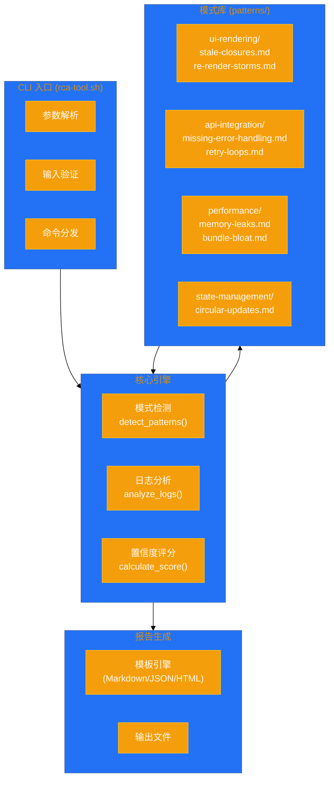

# 架构设计文档: RCA工具脚本化

**项目**: vibex-proposal-rca-tool
**状态**: APPROVED (Quick Win)
**版本**: v2.0
**日期**: 2026-03-19

---

## 1. Tech Stack

| 技术 | 选择 | 理由 |
|------|------|------|
| Bash 5.x | 原型扩展 | 零依赖，跨平台（Linux/macOS/WSL） |
| jq | JSON 处理 | Shell 原生 JSON 解析 |
| grep/sed/awk | 文本分析 | 已有，无需安装 |
| bats-core | 单元测试 | Bash 测试框架 |
| pandoc / markdown | 报告生成 | 格式转换可选 |

**无运行时依赖**: 所有依赖在 CI/CD 环境中已预装。

---

## 2. Architecture Diagram



---

## 3. API Definitions

### 3.1 CLI 接口

```bash
# rca-tool.sh <issue> <target-path> [options]

# 位置参数
<issue>          # 问题描述 (必需)
<target-path>    # 目标代码路径 (必需)

# 选项
-c, --category   # 模式类别: ui-rendering | api-integration | state-management | performance
-o, --output     # 输出文件路径
-f, --format     # 输出格式: markdown | json | html (default: markdown)
-v, --verbose    # 详细输出模式
--dry-run        # 仅分析，不生成报告
--config         # 自定义配置文件路径
-h, --help       # 显示帮助

# 示例
./rca-tool.sh "页面渲染失败" ./src/components/ -c ui-rendering -v
./rca-tool.sh "API 调用失败" ./src/api/ -c api-integration -o report.md
./rca-tool.sh "内存泄漏" ./src/ -c performance --dry-run
```

### 3.2 模式匹配输出格式

```bash
# JSON 输出结构 (--format json)
{
  "report": {
    "issue": "页面渲染失败",
    "targetPath": "./src/components/",
    "category": "ui-rendering",
    "timestamp": "2026-03-19T00:52:00Z",
    "patterns": [
      {
        "name": "stale-closures",
        "confidence": 85,
        "matches": [
          {
            "file": "Button.tsx",
            "line": 42,
            "snippet": "useEffect(() => { setCount(count + 1); }, [])",
            "explanation": "useEffect 依赖数组为空，但引用了外部变量 count"
          }
        ]
      }
    ],
    "summary": "检测到 1 个高置信度模式",
    "solutions": [
      "将 count 加入 useEffect 依赖数组",
      "使用 useCallback 包装 count 的更新函数"
    ]
  }
}
```

---

## 4. Data Model

### 4.1 模式定义结构

```bash
# patterns/ui-rendering/stale-closures.md
---
name: stale-closures
category: ui-rendering
severity: high
confidence: 85
signatures:
  - pattern: "useEffect\\([^)]*\\[[^\\]]*\\][^)]*\\){[^}]*\\b(count|value|data|item)\\b"
    description: "useEffect 依赖数组为空或缺少外部变量"
  - pattern: "setTimeout\\([^)]*\\b(count|value)\\b[^)]*\\)"
    description: "setTimeout 中引用了外部变量"
fix_suggestions:
  - "将外部变量加入依赖数组"
  - "使用 useRef 存储不变的值"
  - "使用 useCallback 包装函数"
references:
  - "https://react.dev/learn/removing-effect-dependencies"
```

### 4.2 模式分类

```
patterns/
├── ui-rendering/
│   ├── missing-dependencies.md      # useEffect 依赖缺失
│   ├── infinite-loops.md            # useEffect 无限循环
│   ├── re-render-storms.md          # 不必要的重渲染
│   └── missing-memo.md              # 缺少 React.memo
├── api-integration/
│   ├── missing-error-handling.md    # 缺少错误处理
│   ├── retry-loops.md               # 重试循环
│   └── timeout-misconfig.md         # 超时配置错误
├── state-management/
│   ├── stale-closures.md            # 闭包陷阱
│   ├── circular-updates.md          # 循环状态更新
│   └── improper-state-resets.md     # 状态重置不当
└── performance/
    ├── memory-leaks.md              # 内存泄漏
    ├── unnecessary-rerenders.md     # 不必要重渲染
    └── bundle-bloat.md              # 包体积过大
```

---

## 5. Testing Strategy

### 5.1 测试框架

| 测试类型 | 框架 | 覆盖率目标 |
|----------|------|------------|
| 单元测试 | bats-core | 90% |
| 集成测试 | bats + 真实代码库 | 5+ 场景 |
| 回归测试 | CI 自动运行 | 每次提交 |

### 5.2 核心测试用例

```bash
# tests/unit/patterns.test.sh
#!/usr/bin/env bats

load '../lib/patterns'

@test "detect_patterns returns empty for clean code" {
  mkdir -p /tmp/clean-project
  echo "const x = 1;" > /tmp/clean-project/test.js
  
  run detect_patterns "/tmp/clean-project" "ui-rendering"
  
  # Clean code should not trigger patterns
  [ "$status" -eq 0 ]
  
  rm -rf /tmp/clean-project
}

@test "detect_patterns finds stale closure" {
  mkdir -p /tmp/bad-project
  echo 'useEffect(() => { setCount(count + 1); }, []);' > /tmp/bad-project/Component.tsx
  
  run detect_patterns "/tmp/bad-project" "ui-rendering"
  
  echo "$output"
  [ "$status" -eq 0 ]
  [[ "$output" == *"stale-closures"* ]]
  
  rm -rf /tmp/bad-project
}

@test "calculate_confidence returns score between 0-100" {
  run calculate_confidence "stale-closures" 3
  [ "$status" -eq 0 ]
  [ "$output" -ge 0 ]
  [ "$output" -le 100 ]
}

# tests/integration/full-flow.test.sh
@test "Full RCA flow generates report" {
  run ./rca-tool.sh "rerender issue" ./src/ -c ui-rendering -o /tmp/rca-report.md
  
  [ "$status" -eq 0 ]
  [ -f "/tmp/rca-report.md" ]
  grep -q "问题摘要" /tmp/rca-report.md
  grep -q "根因分析" /tmp/rca-report.md
  grep -q "可能的解决方案" /tmp/rca-report.md
  
  rm -f /tmp/rca-report.md
}

@test "Dry run mode does not create report" {
  run ./rca-tool.sh "test" ./src/ -c api-integration --dry-run
  
  [ "$status" -eq 0 ]
  [ ! -f "rca-report-"*.md ]
}
```

### 5.3 回归测试配置

```bash
# .github/workflows/rca-tool-test.yml
name: RCA Tool Tests
on: [push, pull_request]

jobs:
  test:
    runs-on: ubuntu-latest
    steps:
      - uses: actions/checkout@v4
      - name: Run unit tests
        run: bats tests/unit/
      - name: Run integration tests
        run: bats tests/integration/
      - name: Test against real codebase
        run: |
          ./rca-tool.sh "memory leak" ./src/ -c performance -v
```

---

## 6. 实施计划

| 时间 | 内容 | 产出 |
|------|------|------|
| 上午 | 增强模式库 (新增 10+ 模式)，完善 CLI 参数解析 | 模式库扩充，CLI 增强 |
| 下午 | 改进报告模板，添加测试用例 | 报告质量提升，测试覆盖 |
| 晚间 | 文档完善，内部推广 | 用户手册，推广材料 |

**预计工期**: 1 人天

---

*Architecture Design - 2026-03-19*
