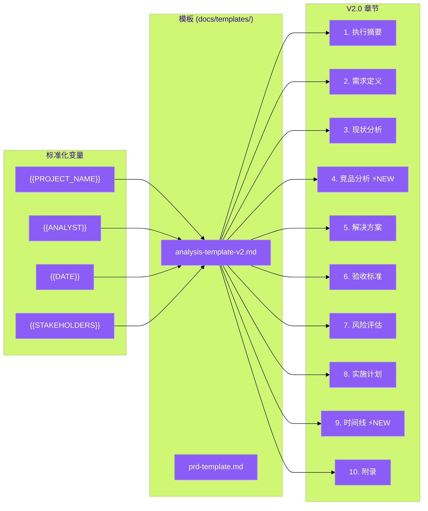

# 架构设计文档: 报告模板 V2.0

**项目**: vibex-proposal-report-template
**状态**: APPROVED (Already Implemented)
**版本**: v2.0
**日期**: 2026-03-19

---

## 1. Tech Stack

| 技术 | 选择 | 理由 |
|------|------|------|
| Markdown | 原生使用 | 零依赖，易于编辑和版本控制 |
| YAML Front Matter | 原型使用 | 元数据标准化 |
| Liquid / Handlebars | 可选增强 | 模板变量替换 |
| Figma → Markdown | 导出工具 | 设计稿转文档 |

**无需额外技术投入** — V2.0 模板已完成实现。

---

## 2. Template Architecture



---

## 3. Template Structure

### 3.1 完整章节清单

| # | 章节 | 状态 | 说明 |
|---|------|------|------|
| 1 | 执行摘要 | ✅ | 2-3 句话，项目背景+目标+价值 |
| 2 | 需求定义 | ✅ | 问题陈述、用户故事、验收条件 |
| 3 | 现状分析 | ✅ | 当前系统分析、痛点列表 |
| 4 | 竞品分析 | ✅ NEW | 竞品功能对比、差异化机会 |
| 5 | 解决方案 | ✅ | 技术方案、非技术方案 |
| 6 | 验收标准 | ✅ | 量化指标、可测试条件 |
| 7 | 风险评估 | ✅ | 概率×影响矩阵 |
| 8 | 实施计划 | ✅ | 里程碑、依赖项 |
| 9 | 时间线 | ✅ NEW | Gantt 图或里程碑时间表 |
| 10 | 附录 | ✅ | 参考资料、术语表 |

### 3.2 模板变量系统

```markdown
<!-- 建议的标准化变量 -->
| 变量 | 说明 | 示例 |
|------|------|------|
| {{PROJECT_NAME}} | 项目名称 | VibeX |
| {{PROJECT_VERSION}} | 版本号 | v2.0 |
| {{ANALYST}} | 分析师 | @xxx |
| {{DATE}} | 文档日期 | 2026-03-19 |
| {{STAKEHOLDERS}} | 干系人 | PM, Dev, Design |
| {{PRIORITY}} | 优先级 | P0/P1/P2/P3 |
| {{STATUS}} | 项目状态 | proposed/approved/in-progress |
```

### 3.3 竞品分析章节模板

```markdown
## 4. 竞品分析

### 4.1 竞品列表

| 竞品 | 定位 | 核心优势 | 核心劣势 |
|------|------|----------|----------|
| VibeX | AI 驱动的流程建模 | ... | ... |
| [竞品A] | ... | ... | ... |
| [竞品B] | ... | ... | ... |

### 4.2 功能矩阵

| 功能 | VibeX | 竞品A | 竞品B |
|------|:-----:|:-----:|:-----:|
| AI 生成流程图 | ✅ | ⚠️ | ❌ |
| 限界上下文建模 | ✅ | ❌ | ❌ |

### 4.3 差异化机会
...
```

### 3.4 风险矩阵章节模板

```markdown
## 7. 风险评估

### 7.1 风险矩阵

| 风险 | 概率 | 影响 | 评分 | 缓解措施 |
|------|:----:|:----:|:----:|----------|
| 技术可行性风险 | 中 | 高 | 6 | 原型验证 |
| 资源不足风险 | 高 | 中 | 6 | 优先级排序 |
| 范围蔓延风险 | 中 | 中 | 4 | 严格验收标准 |

> **评分说明**: 概率(1-3) × 影响(1-3)，≥6 为高风险
```

---

## 4. Data Model

### 4.1 模板元数据

```yaml
---
# analysis-template-v2.md Front Matter
template:
  name: analysis-template-v2
  version: "2.0"
  created: "2026-03-19"
  author: PM Team
  license: internal

chapters:
  - id: executive-summary
    required: true
    priority: P0
    min_words: 50
    max_words: 200
  - id: competitive-analysis
    required: true
    priority: P2
    min_words: 100
  - id: risk-assessment
    required: true
    priority: P1
    format: table

variables:
  - name: PROJECT_NAME
    type: string
    required: true
  - name: ANALYST
    type: user_mention
    required: true
  - name: DATE
    type: date
    required: true
---
```

---

## 5. Testing Strategy

### 5.1 验证规则

```typescript
// __tests__/template-validator.test.ts
describe('Analysis Template V2 Validator', () => {
  const validator = new TemplateValidator('docs/templates/analysis-template-v2.md');

  it('should require all P0 chapters', () => {
    const missing = validator.getMissingRequiredChapters(content);
    expect(missing).toEqual([]);
  });

  it('should detect incomplete risk matrix', () => {
    const risks = validator.parseRiskMatrix(content);
    expect(risks.length).toBeGreaterThan(0);
    risks.forEach(risk => {
      expect(risk).toHaveProperty('probability');
      expect(risk).toHaveProperty('impact');
      expect(risk).toHaveProperty('mitigation');
    });
  });

  it('should validate competitive analysis format', () => {
    const analysis = validator.parseCompetitiveAnalysis(content);
    expect(analysis.competitors).toHaveLength(0); // allow empty
    analysis.competitors.forEach(c => {
      expect(c).toHaveProperty('name');
      expect(c).toHaveProperty('strengths');
      expect(c).toHaveProperty('weaknesses');
    });
  });

  it('should enforce word count limits', () => {
    const violations = validator.checkWordCounts(content);
    violations.forEach(v => {
      console.log(`${v.chapter}: ${v.actual} words (max: ${v.max})`);
    });
    expect(violations).toHaveLength(0);
  });
});
```

### 5.2 模板完整性检查

```bash
# 模板完整性验证脚本
#!/bin/bash
check-template.sh <report-file.md>

# 检查项
# ✓ 所有 P0 章节存在
# ✓ 风险矩阵格式正确
# ✓ 时间线包含里程碑
# ✓ 变量已替换
# ✓ 无未填充的 TODO
```

---

## 6. 推广与版本管理

### 6.1 模板版本策略

```
docs/templates/
├── analysis-template-v1.md    # 旧版 (保留参考)
├── analysis-template-v2.md  # 当前版 ✅
└── analysis-template-v2.1.md # 补丁版 (未来)

# 版本更新日志
# v2.0 (2026-03-19)
#   - 初始版本，包含竞品分析和风险矩阵
# v2.1 (待定)
#   - 添加使用指南章节
#   - 标准化变量系统
```

### 6.2 推广计划

| 步骤 | 内容 | 负责人 | 时间 |
|------|------|--------|------|
| 1 | 在 #team-docs 发布 V2.0 模板 | PM | 即时 |
| 2 | 更新 docs/README.md 引用新模板 | PM | 即时 |
| 3 | 团队培训 (10min 讲解) | PM | 本周 |
| 4 | 设置提醒: 每次写报告使用 V2.0 | Team | 本周 |
| 5 | 收集反馈，持续迭代 | PM | 进行中 |

---

## 7. 总结

**架构决策**: 模板 V2.0 已实现，无需额外架构工作。

**已确认实现**:
- ✅ 10 个完整章节
- ✅ 竞品分析章节
- ✅ 风险矩阵章节
- ✅ 时间线章节
- ✅ 模板位置: `docs/templates/analysis-template-v2.md`

**后续行动** (非架构工作):
- [ ] 团队培训 (PM 执行)
- [ ] 文档 README 更新 (PM 执行)
- [ ] 使用反馈收集 (全员)

---

*Architecture Design - 2026-03-19*
