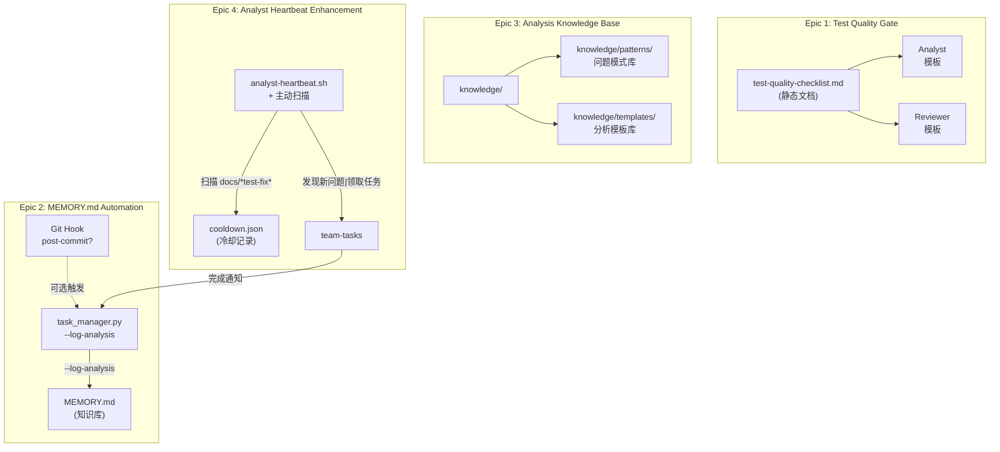
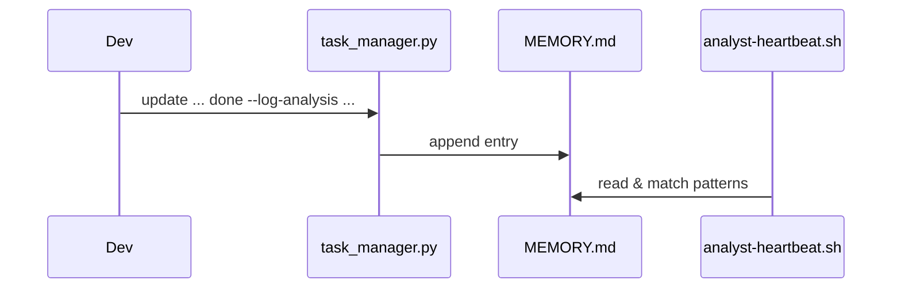

# Architecture: Agent 自进化工具集

**Project**: `vibex-proposals-20260322`  
**Architect**: architect  
**Date**: 2026-03-22  
**Status**: design-architecture

---

## 1. Context & Goals

### Problem Statement
VibeX Agent 团队存在 3 类系统性问题：
1. **测试隔离缺陷** — `beforeAll` 修改全局状态未恢复，导致测试泄漏
2. **知识断档** — MEMORY.md 8 天未更新，分析知识无法复用
3. **被动响应** — Analyst 心跳无法主动发现问题，依赖 coord 派发

### Objectives
| Goal | Target |
|------|--------|
| 测试隔离问题失败率 | 12 次/批次 → 0 |
| MEMORY.md 更新延迟 | 8 天 → < 1 天 |
| 问题首次响应时间 | > 60 分钟 → < 10 分钟 |

---

## 2. Tech Stack

| Component | Choice | Rationale |
|-----------|--------|-----------|
| Task automation | Bash + Python CLI | 最小侵入，Agent 工作流天然是 shell |
| Knowledge storage | Markdown + JSON | 人可读、Git 可追踪、grep 可检索 |
| Pattern matching | Glob + regex | 轻量，无额外依赖 |
| Cooldown tracking | JSON file | 持久化、跨重启生效 |
| Test framework | Jest | 已有基础设施 |

**No new dependencies** — all tools extend existing infra.

---

## 3. Architecture Diagram

### 3.1 Component Overview



### 3.2 File Structure

```
/root/.openclaw/
├── docs/
│   ├── test-quality-checklist.md          # Epic1 产出
│   └── knowledge/
│       ├── patterns/                      # Epic3 patterns/
│       │   ├── TEST_ISOLATION.md
│       │   ├── API_VERSION_MISMATCH.md
│       │   ├── ASYNC_STATE_LEAK.md
│       │   └── CONFIG_DRIFT.md
│       └── templates/                    # Epic3 templates/
│           ├── PROBLEM_ANALYSIS.md
│           ├── COMPETITOR_ANALYSIS.md
│           └── SCHEME_EVALUATION.md
├── vibex/
│   ├── skills/
│   │   └── team-tasks/
│   │       └── scripts/
│   │           └── task_manager.py       # Epic2 扩展
├── skills/
│   └── team-tasks/
│       ├── scripts/
│       │   ├── task_manager.py          # Epic2 修改
│       │   └── log_analysis.py          # Epic2 新增
│       └── heartbeat/
│           └── analyst-heartbeat.sh      # Epic4 增强
├── workspace-analyst/
│   ├── MEMORY.md                         # Epic2 目标
│   └── cooldown.json                     # Epic4 冷却
└── scripts/
    └── heartbeats/
        └── analyst-heartbeat.sh          # Epic4 增强
```

---

## 4. Epic-by-Epic Design

### Epic 1: Test Quality Gate

**Approach**: Static documentation + template integration.

#### `docs/test-quality-checklist.md` 结构

```markdown
# Test Quality Checklist

## 1. Global State Management
- [ ] beforeAll 修改全局状态 → 必须有对应的 afterAll 恢复
- [ ] 使用 jest.spyOn → 需调用 .mockRestore() 或 .mockReset()

## 2. Mock Isolation
- [ ] `jest.clearAllMocks()` — 清除调用记录，保留 mock 实现
- [ ] `jest.resetAllMocks()` — 清除调用记录 + 重置实现
- [ ] `jest.restoreAllMocks()` — 恢复原始实现（推荐）
- [ ] 禁止在 beforeEach 外部设置 mock

## 3. Module State Isolation
- [ ] 每个测试文件独立 setup/teardown
- [ ] 共享状态修改后必须恢复

## 4. Async Cleanup
- [ ] 未resolved 的 Promise 需在 afterAll 中 cancel
- [ ] setTimeout/setInterval 需在 afterAll 中 clear
```

#### 模板集成

| Agent | 集成方式 |
|-------|---------|
| Analyst | `skills/analysis-methods/SKILL.md` 引用检查清单 |
| Reviewer | `skills/code-review-checklist/SKILL.md` 引用检查清单 |
| Dev | `docs/vibex-backend-arch.md` 或 `CONTRIBUTING.md` 引用 |

**API**: 无（静态文档，仅需更新引用路径）

---

### Epic 2: MEMORY.md Automation

#### 4.1 `task_manager.py --log-analysis` 选项

**新增命令**:
```bash
python3 task_manager.py log-analysis <project> <task_id> --summary "<text>" [--key-finding "<text>"]
```

**实现位置**: `skills/team-tasks/scripts/log_analysis.py` (new file)

```python
# log_analysis.py
import os
import sys
from datetime import datetime
from pathlib import Path

def append_to_memory(project: str, task_id: str, summary: str, key_finding: str = "") -> None:
    memory_path = os.environ.get(
        "MEMORY_PATH",
        "/root/.openclaw/workspace-analyst/MEMORY.md"
    )
    
    entry = f"""
## [{datetime.now().strftime('%Y-%m-%d %H:%M')}] {project}/{task_id}

**Summary**: {summary}
**Key Finding**: {key_finding}
"""
    with open(memory_path, "a") as f:
        f.write(entry)
```

**task_manager.py 改动**: 在 `update` 子命令增加 `--log-analysis` 参数，解析后调用 `log_analysis.py`

#### 4.2 自动触发机制

**方案 A**: Git hook (`post-commit`) — 触发时机精确但需要仓库权限
**方案 B**: team-tasks 状态变更 → 发送事件 → analyst 心跳消费

**推荐方案 B**（无仓库权限依赖）:



**验证**: `stat MEMORY.md | grep Modify` — mtime 在任务完成后 1 分钟内更新

---

### Epic 3: Analysis Knowledge Base

#### 目录结构

```
knowledge/
├── patterns/          # 问题模式库
│   ├── _index.md      # 索引 + 使用说明
│   ├── TEST_ISOLATION.md
│   ├── API_VERSION_MISMATCH.md
│   ├── ASYNC_STATE_LEAK.md
│   └── CONFIG_DRIFT.md
└── templates/         # 分析模板库
    ├── _index.md      # 索引 + 使用说明
    ├── PROBLEM_ANALYSIS.md
    ├── COMPETITOR_ANALYSIS.md
    └── SCHEME_EVALUATION.md
```

#### Pattern 模板

```markdown
# Pattern: <模式名称>

## 触发条件
- 什么情况下会触发此模式

## 典型症状
- 错误信息 / 失败现象

## 根因分析
- 为什么会发生

## 修复方案
- 步骤 1
- 步骤 2

## 预防措施
- 如何避免再次发生
```

#### 最小填充计划（Epic 3.2）

| 模式 | 来源 |
|------|------|
| TEST_ISOLATION | homepageAPI.test.ts 泄漏问题 |
| API_VERSION_MISMATCH | DDD API 路由不匹配 |
| ASYNC_STATE_LEAK | ThemeWrapper 时序问题 |
| CONFIG_DRIFT | 架构文档与实现不一致 |

---

### Epic 4: Analyst Heartbeat Enhancement

#### 主动扫描逻辑

```bash
# analyst-heartbeat.sh 增强
SCAN_DIR="/root/.openclaw/vibex/docs"
COOLDOWN_FILE="/root/.openclaw/workspace-analyst/cooldown.json"

scan_for_new_issues() {
    local issues=$(find "$SCAN_DIR" -maxdepth 2 -type d -name "*test-fix*" -o -name "*bug*" | \
        while read dir; do
            # 检查是否有对应分析
            if [ ! -f "$dir/analysis.md" ] && [ ! -f "$dir/prd.md" ]; then
                # 检查冷却
                if ! is_cooled "$dir" "$COOLDOWN_FILE"; then
                    echo "$dir"
                fi
            fi
        done)
    
    for issue in $issues; do
        claim_and_analyze "$issue"
        set_cooldown "$issue" "$COOLDOWN_FILE"
    done
}

is_cooled() {
    local dir="$1"; local file="$2"
    # 读取 cooldown.json，检查是否 24h 内扫描过
}

set_cooldown() {
    local dir="$1"; local file="$2"
    # 写入 cooldown.json: { "path": timestamp }
}
```

#### Cooldown JSON 格式

```json
{
  "/root/.openclaw/vibex/docs/vibex-homepage-test-fix-20260321": 1710998400,
  "/root/.openclaw/vibex/docs/vibex-bug-fix-20260320": 1710912000
}
```

#### 冷却机制

| 策略 | 值 |
|------|-----|
| 冷却时间 | 24 小时 |
| 持久化 | JSON 文件（重启不丢失） |
| 清理 | 启动时清理 > 24h 条目 |

---

## 5. Testing Strategy

### 5.1 Test Framework
- **Epic 1, 3**: 文档验收测试（`fs.existsSync` + 内容检查）
- **Epic 2**: 单元测试（`log_analysis.py`）+ 集成测试（MEMORY.md 更新验证）
- **Epic 4**: Shell 脚本测试 + 模拟扫描场景

### 5.2 Coverage Targets

| Epic | 测试文件 | 覆盖率目标 |
|------|---------|-----------|
| Epic1 | `test-quality-checklist.test.js` | 100% (exists + content) |
| Epic2 | `test_log_analysis.py` | 100% line |
| Epic3 | `test_pattern_index.js` | 100% (all patterns listed) |
| Epic4 | `test_heartbeat_scan.sh` | 100% (path detection + cooldown) |

### 5.3 Core Test Cases

#### Epic 2: log_analysis

```python
# test_log_analysis.py
def test_append_entry(tmp_path, monkeypatch):
    monkeypatch.setenv("MEMORY_PATH", str(tmp_path / "MEMORY.md"))
    append_to_memory("test-project", "design-architecture", "Done", "Key finding")
    
    content = (tmp_path / "MEMORY.md").read_text()
    assert "test-project/design-architecture" in content
    assert "Done" in content
    assert "Key finding" in content
```

#### Epic 4: Cooldown

```bash
# test_heartbeat_scan.sh
test_cooldown_24h() {
    local dir="/tmp/test-issue"
    mkdir -p "$dir"
    set_cooldown "$dir" "$COOLDOWN_FILE"
    
    # 同一目录不应立即再次触发
    result=$(scan_for_new_issues)
    assert_empty "$result"  # 应该为空（冷却中）
}
```

---

## 6. Implementation Plan

### Phase 1: Epic1 + Epic3 (Day 1)
| Agent | Task | Output |
|-------|------|--------|
| dev | 创建 `docs/test-quality-checklist.md` | 清单文件 |
| analyst | 创建 `knowledge/patterns/` + `knowledge/templates/` | 目录 + 内容 |
| dev | 集成检查清单到模板 | 模板更新 |

### Phase 2: Epic2 (Day 2)
| Agent | Task | Output |
|-------|------|--------|
| dev | 实现 `log_analysis.py` + task_manager.py 扩展 | CLI 工具 |
| dev | 集成测试 + 验证 | 测试通过 |

### Phase 3: Epic4 (Day 3)
| Agent | Task | Output |
|-------|------|--------|
| dev | 修改 `analyst-heartbeat.sh` + cooldown 逻辑 | 增强脚本 |
| analyst | 验证主动扫描 + 冷却机制 | 实跑验证 |

---

## 7. Trade-offs

| Decision | Trade-off |
|----------|-----------|
| Markdown 存储 vs 数据库 | ✅ 人可读、Git 可追踪；⚠️ 全文检索慢（可接受，规模小） |
| JSON cooldown vs Redis | ✅ 无依赖；⚠️ 写入竞争（小规模可接受） |
| 主动扫描 vs webhook | ✅ 无需仓库 hooks；⚠️ 轮询延迟（分钟级可接受） |
| task_manager.py 扩展 vs 独立工具 | ✅ 统一入口；⚠️ task_manager.py 膨胀（需模块化拆分） |

---

## 8. Output Artifacts

| Artifact | Path |
|----------|------|
| 本文档 | `docs/vibex-proposals-20260322/architecture.md` |
| IMPLEMENTATION_PLAN | `docs/vibex-proposals-20260322/IMPLEMENTATION_PLAN.md` |
| AGENTS | `docs/vibex-proposals-20260322/AGENTS.md` |

---

## 9. Verification Checklist

- [ ] 4 Epic 全部有技术方案
- [ ] 无新增外部依赖
- [ ] 所有 API/CLI 有接口定义
- [ ] 测试策略覆盖全部 Epic
- [ ] 实现顺序无循环依赖
