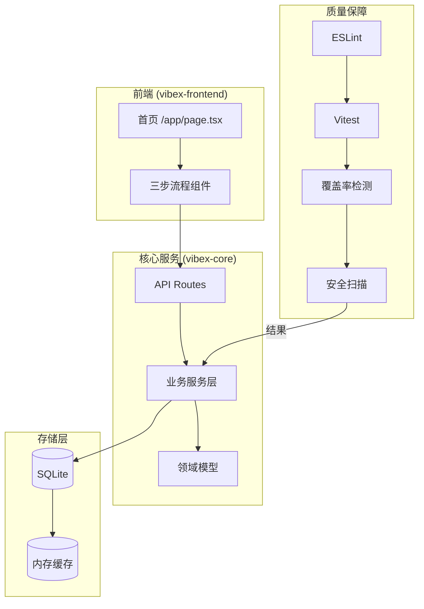
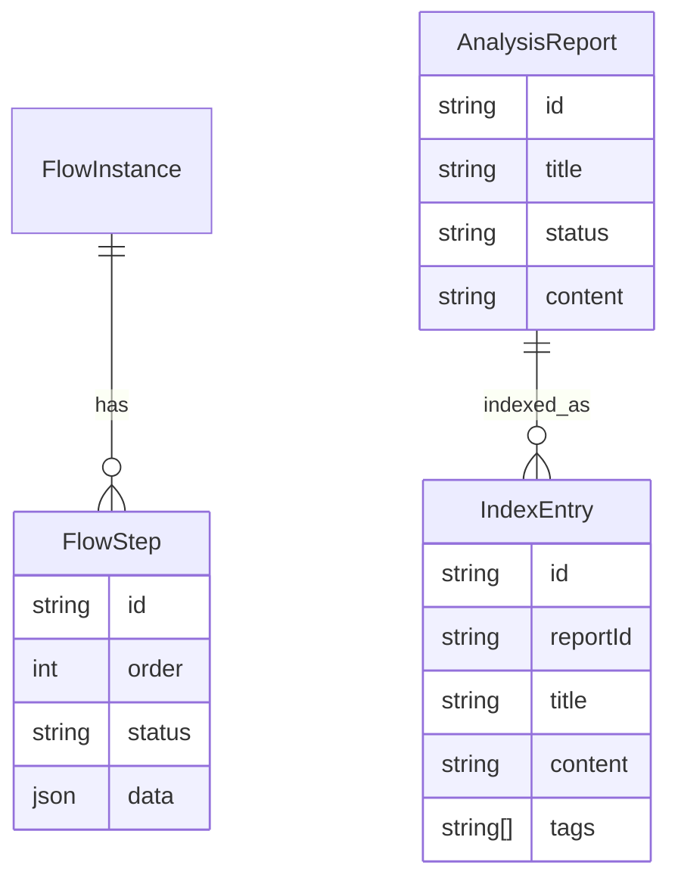

# Architecture: vibex-proposals-impl-20260318

**项目**: 提案实施 - 核心领域实现  
**架构师**: Architect Agent  
**日期**: 2026-03-18  
**版本**: 1.0

---

## 1. Tech Stack

| 类别 | 技术选型 | 理由 |
|------|----------|------|
| **运行时** | Node.js 20+ | 兼容现有 vibex 项目 |
| **测试框架** | Jest + Vitest | 覆盖率支持好，Vitest 用于 Vite 项目 |
| **Linter** | ESLint 9 + flat config | Next.js 15 兼容性 |
| **安全扫描** | npm audit + Snyk | 官方 + 第三方双重保障 |
| **覆盖率** | Vitest Coverage v8 | 与 Vite 深度集成 |
| **索引存储** | SQLite (better-sqlite3) | 轻量级，无需额外服务 |

---

## 2. Architecture Diagram



---

## 3. API Definitions

### 3.1 流程控制 API

```typescript
// POST /api/flow/start
interface StartFlowRequest {
  flowType: 'onboarding' | 'analysis' | 'export';
}

interface StartFlowResponse {
  flowId: string;
  step: number;
  expiresAt: string;
}

// POST /api/flow/:flowId/next
interface NextStepRequest {
  data: Record<string, any>;
}

interface NextStepResponse {
  step: number;
  completed: boolean;
  nextStepUrl?: string;
}
```

### 3.2 覆盖率 API

```typescript
// GET /api/coverage/report
interface CoverageReportResponse {
  line: number;
  branch: number;
  function: number;
  timestamp: string;
  trend: 'up' | 'down' | 'stable';
}

// POST /api/coverage/check
interface CoverageCheckRequest {
  thresholds: {
    lines: number;
    branches: number;
    functions: number;
  };
}

interface CoverageCheckResponse {
  passed: boolean;
  details: CoverageReportResponse;
}
```

### 3.3 索引搜索 API

```typescript
// GET /api/search
interface SearchRequest {
  q: string;
  filters?: {
    type?: string[];
    dateFrom?: string;
    dateTo?: string;
  };
  page?: number;
  limit?: number;
}

interface SearchResponse {
  results: SearchResult[];
  total: number;
  page: number;
}

interface SearchResult {
  id: string;
  title: string;
  snippet: string;
  type: string;
  score: number;
  createdAt: string;
}
```

### 3.4 安全扫描 API

```typescript
// GET /api/security/scan
interface SecurityScanResponse {
  vulnerabilities: Vulnerability[];
  scanDuration: number;
  scannedAt: string;
}

interface Vulnerability {
  id: string;
  severity: 'low' | 'medium' | 'high' | 'critical';
  package: string;
  fixAvailable: boolean;
  fixVersion?: string;
}
```

---

## 4. Data Model

### 4.1 核心实体

```typescript
// 流程实例
interface FlowInstance {
  id: string;
  type: 'onboarding' | 'analysis' | 'export';
  currentStep: number;
  totalSteps: number;
  data: Record<string, any>;
  status: 'active' | 'completed' | 'expired';
  startedAt: Date;
  completedAt?: Date;
  expiresAt: Date;
}

// 分析报告
interface AnalysisReport {
  id: string;
  title: string;
  type: 'full' | 'incremental' | 'delta';
  status: 'generating' | 'ready' | 'failed';
  content: string; // Markdown
  formats: ('pdf' | 'html' | 'markdown')[];
  generatedAt: Date;
  duration: number;
}

// 索引条目
interface IndexEntry {
  id: string;
  reportId: string;
  title: string;
  content: string;
  tags: string[];
  type: string;
  createdAt: Date;
  vector?: number[]; // 未来用于语义搜索
}
```

### 4.2 关系图



---

## 5. Testing Strategy

### 5.1 测试框架

| 层级 | 框架 | 覆盖率目标 |
|------|------|------------|
| 单元测试 | Vitest | > 80% |
| 集成测试 | Vitest + Supertest | > 60% |
| E2E | Playwright | 关键路径 |

### 5.2 核心测试用例示例

```typescript
// 1. 流程完整性测试
describe('Flow: 三步流程', () => {
  it('应完成全流程', async () => {
    const flow = await startFlow({ flowType: 'onboarding' });
    expect(flow.step).toBe(1);
    
    const step1 = await nextStep(flow.id, { name: 'test' });
    expect(step1.step).toBe(2);
    
    const step2 = await nextStep(flow.id, { preference: 'dev' });
    expect(step2.step).toBe(3);
    
    const step3 = await nextStep(flow.id, { confirm: true });
    expect(step3.completed).toBe(true);
  });

  it('应在超时后过期', async () => {
    const flow = await startFlow({ flowType: 'onboarding' });
    await advanceTime(30 * 60 * 1000); // 30分钟后
    const result = await nextStep(flow.id, {});
    expect(result.error).toContain('expired');
  });
});

// 2. 覆盖率门禁测试
describe('Coverage Gate', () => {
  it('应达到行覆盖率 >= 80%', async () => {
    const report = await getCoverageReport();
    expect(report.line).toBeGreaterThanOrEqual(80);
  });

  it('应达到分支覆盖率 >= 70%', async () => {
    const report = await getCoverageReport();
    expect(report.branch).toBeGreaterThanOrEqual(70);
  });
});

// 3. 索引搜索测试
describe('Search: 索引系统', () => {
  it('应在 500ms 内返回结果', async () => {
    const start = Date.now();
    const results = await search({ q: '测试' });
    const duration = Date.now() - start;
    expect(duration).toBeLessThan(500);
  });

  it('应支持多维度筛选', async () => {
    const results = await search({
      q: '分析',
      filters: { type: ['security'] }
    });
    results.forEach(r => {
      expect(r.type).toBe('security');
    });
  });
});

// 4. 安全扫描测试
describe('Security: 漏洞检测', () => {
  it('应修复所有高危漏洞', async () => {
    const scan = await runSecurityScan();
    const highSeverity = scan.vulnerabilities.filter(
      v => v.severity === 'high' || v.severity === 'critical'
    );
    expect(highSeverity).toHaveLength(0);
  });

  it('扫描应在 60s 内完成', async () => {
    const start = Date.now();
    await runSecurityScan();
    const duration = Date.now() - start;
    expect(duration).toBeLessThan(60000);
  });
});
```

### 5.3 CI 门禁配置

```yaml
# .github/workflows/quality-gate.yml
- name: Run Tests
  run: npm run test:ci

- name: Check Coverage
  run: npm run coverage:check

- name: Run Lint
  run: npm run lint

- name: Security Scan
  run: npm audit --audit-level=high
```

---

## 6. 实施路线图

| 阶段 | 功能 | 里程碑 |
|------|------|--------|
| Week 1 | F2 覆盖率提升 + F1 首页流程 | 覆盖率达标，流程可走通 |
| Week 2 | F4 Lint + F5 安全扫描 | CI 绿，漏洞清零 |
| Week 3 | F3 报告模板 + F6 索引系统 | 搜索响应达标 |

---

## 7. Trade-offs

| 决策 | 收益 | 代价 |
|------|------|------|
| SQLite 索引 | 零运维，快速 | 不适合超大规模 |
| Vitest | 快，Vite 集成 | 需迁移现有 Jest |
| npm audit | 官方免费 | 误报率较高 |

---

*Generated by Architect Agent - 2026-03-18*
