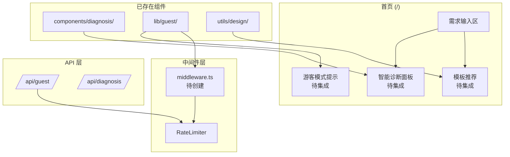
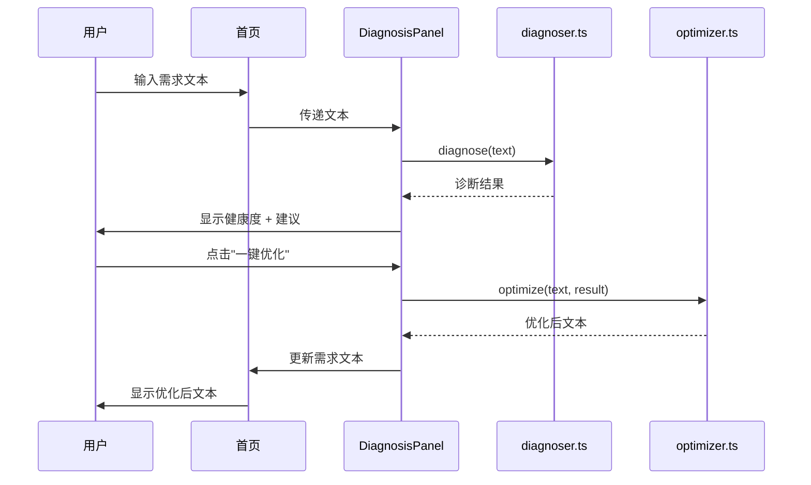
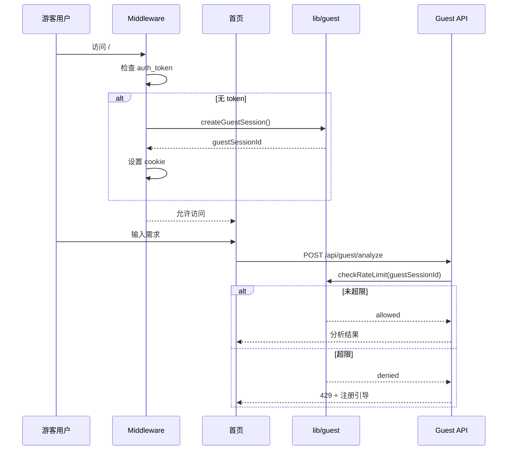
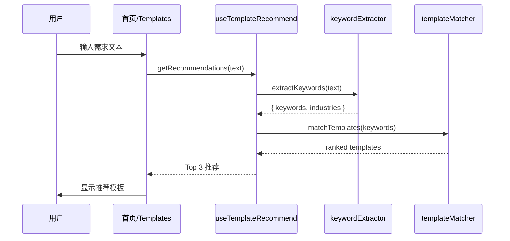

# 分析师提案落地实施架构设计

**项目**: vibex-proposals-impl  
**版本**: v1.0  
**日期**: 2026-03-13  
**架构师**: architect

---

## 1. Tech Stack

### 技术选型

| 组件 | 选择 | 版本 | 理由 |
|------|------|------|------|
| 框架 | Next.js | ^14.0.0 | 现有架构 |
| 状态管理 | Zustand | ^4.5.0 | 现有架构 |
| 路由守卫 | Next.js Middleware | ^14.0.0 | 边缘计算 |
| 诊断服务 | 自研 diagnoser | - | 已存在 |
| 模板推荐 | 自研 keywordExtractor | - | 已存在 |

---

## 2. Architecture Diagram

### 2.1 整体架构



### 2.2 智能诊断集成流程



### 2.3 游客模式集成流程



### 2.4 模板推荐集成流程



---

## 3. API Definitions

### 3.1 智能诊断集成

```typescript
// app/page.tsx (集成修改)
'use client'

import { useState } from 'react'
import DiagnosisPanel from '@/components/diagnosis/DiagnosisPanel'
import { diagnose, optimize } from '@/services/diagnosis'

export default function HomePage() {
  const [requirementText, setRequirementText] = useState('')
  const [diagnosisResult, setDiagnosisResult] = useState<DiagnosisResult | null>(null)

  const handleAnalyze = async (text: string) => {
    const result = await diagnose(text)
    setDiagnosisResult(result)
  }

  const handleOptimize = async () => {
    if (!diagnosisResult) return
    
    const optimizedText = await optimize(requirementText, diagnosisResult)
    setRequirementText(optimizedText)
  }

  return (
    <main className="home-page">
      {/* 需求输入 */}
      <textarea
        value={requirementText}
        onChange={(e) => setRequirementText(e.target.value)}
        placeholder="描述你的需求..."
      />

      {/* 智能诊断面板 - 新增 */}
      <DiagnosisPanel
        requirementText={requirementText}
        onAnalyze={handleAnalyze}
        onOptimize={handleOptimize}
        result={diagnosisResult}
      />

      <button onClick={handleGenerate}>开始设计</button>
    </main>
  )
}
```

```typescript
// components/diagnosis/DiagnosisPanel.tsx (增强)
'use client'

import { useState } from 'react'
import { RadarChart } from './RadarChart'
import { ScoreDisplay } from './ScoreDisplay'
import { SuggestionList } from './SuggestionList'

interface DiagnosisPanelProps {
  requirementText: string
  onAnalyze: (text: string) => void
  onOptimize: () => void
  result: DiagnosisResult | null
}

export function DiagnosisPanel({
  requirementText,
  onAnalyze,
  onOptimize,
  result,
}: DiagnosisPanelProps) {
  const [isAnalyzing, setIsAnalyzing] = useState(false)

  const handleAnalyze = async () => {
    if (requirementText.length < 10) return
    
    setIsAnalyzing(true)
    await onAnalyze(requirementText)
    setIsAnalyzing(false)
  }

  return (
    <div className="diagnosis-panel">
      <button 
        onClick={handleAnalyze}
        disabled={isAnalyzing || requirementText.length < 10}
      >
        {isAnalyzing ? '诊断中...' : '智能诊断'}
      </button>

      {result && (
        <>
          <ScoreDisplay score={result.healthScore} />
          <RadarChart dimensions={result.dimensions} />
          <SuggestionList suggestions={result.suggestions} />
          
          <button onClick={onOptimize}>
            一键优化
          </button>
        </>
      )}
    </div>
  )
}
```

### 3.2 游客模式集成

```typescript
// middleware.ts (新建)
import { NextResponse } from 'next/server'
import type { NextRequest } from 'next/server'
import { createGuestSession, isRateLimited } from '@/lib/guest'

const PUBLIC_PATHS = ['/', '/auth', '/api/guest', '/api/health']
const PROTECTED_PATHS = ['/dashboard', '/projects', '/settings']

export function middleware(request: NextRequest) {
  const { pathname } = request.nextUrl
  const authToken = request.cookies.get('auth_token')?.value

  // 公开路径
  if (PUBLIC_PATHS.some(p => pathname.startsWith(p))) {
    // 游客会话管理
    let guestSessionId = request.cookies.get('guest_session')?.value

    if (!guestSessionId && !authToken) {
      guestSessionId = createGuestSession()
      const response = NextResponse.next()
      response.cookies.set('guest_session', guestSessionId, {
        maxAge: 24 * 60 * 60,
        httpOnly: true,
        sameSite: 'lax',
      })
      return response
    }

    return NextResponse.next()
  }

  // 受保护路径
  if (PROTECTED_PATHS.some(p => pathname.startsWith(p))) {
    if (!authToken) {
      const url = new URL('/auth', request.url)
      url.searchParams.set('redirect', pathname)
      return NextResponse.redirect(url)
    }
  }

  return NextResponse.next()
}

export const config = {
  matcher: ['/((?!api|_next/static|_next/image|favicon.ico|public).*)'],
}
```

```typescript
// app/page.tsx (游客模式集成)
import { useGuestSession, isRateLimited, migrateGuestData } from '@/lib/guest'
import { useAuthStore } from '@/stores/auth'

export default function HomePage() {
  const { session, isActive } = useGuestSession()
  const { user } = useAuthStore()
  const isGuest = !user && isActive

  const handleGenerate = async () => {
    // 游客速率限制
    if (isGuest && session) {
      const limited = await isRateLimited(session.guestSessionId)
      if (limited) {
        setIsLoginDrawerOpen(true)
        return
      }
    }

    // 正常生成流程
    await generateContexts(requirementText)
  }

  const handleRegisterSuccess = async (newUser: User, token: string) => {
    // 迁移游客数据
    if (session?.guestSessionId) {
      await migrateGuestData(newUser.id, session.guestSessionId, {
        requirementText,
        boundedContexts,
      })
    }
    login(newUser, token)
  }

  return (
    <main>
      {/* 游客模式提示 */}
      {isGuest && (
        <div className="guest-banner">
          🎁 游客模式 - 注册后可保存进度
          <button onClick={() => setIsLoginDrawerOpen(true)}>
            立即注册
          </button>
        </div>
      )}

      {/* ... */}
    </main>
  )
}
```

### 3.3 模板推荐集成

```typescript
// hooks/useTemplateRecommend.ts (新建)
import { useMemo } from 'react'
import { extractKeywords } from '@/utils/design/keywordExtractor'
import { matchTemplates } from '@/utils/design/templateMatcher'
import { useTemplateStore } from '@/stores/templateStore'

interface TemplateRecommendation {
  template: Template
  score: number
  matchedKeywords: string[]
}

export function useTemplateRecommend() {
  const { templates } = useTemplateStore()

  const getRecommendations = useMemo(() => {
    return (text: string): TemplateRecommendation[] => {
      if (text.length < 10) return []

      // 提取关键词
      const { keywords, industries } = extractKeywords(text)

      // 匹配模板
      const matches = templates
        .map(template => {
          const result = matchTemplates(template, keywords, industries)
          return {
            template,
            score: result.score,
            matchedKeywords: result.matchedKeywords,
          }
        })
        .sort((a, b) => b.score - a.score)
        .slice(0, 3)

      return matches
    }
  }, [templates])

  return { getRecommendations }
}
```

```typescript
// app/page.tsx (模板推荐集成)
import { useTemplateRecommend } from '@/hooks/useTemplateRecommend'

export default function HomePage() {
  const { getRecommendations } = useTemplateRecommend()
  const [recommendations, setRecommendations] = useState<TemplateRecommendation[]>([])

  // 输入变化时更新推荐
  useEffect(() => {
    if (requirementText.length >= 10) {
      const recs = getRecommendations(requirementText)
      setRecommendations(recs)
    } else {
      setRecommendations([])
    }
  }, [requirementText, getRecommendations])

  const applyTemplate = (template: Template) => {
    setRequirementText(template.content)
    setRecommendations([])
  }

  return (
    <main>
      <textarea value={requirementText} onChange={...} />

      {/* 智能模板推荐 */}
      {recommendations.length > 0 && (
        <div className="template-recommendations">
          <h4>🎯 推荐模板</h4>
          <div className="recommendations-list">
            {recommendations.map(({ template, score, matchedKeywords }) => (
              <div key={template.id} className="recommendation-card">
                <div className="template-info">
                  <span className="name">{template.name}</span>
                  <span className="score">{Math.round(score * 100)}% 匹配</span>
                </div>
                <div className="matched-keywords">
                  {matchedKeywords.slice(0, 3).map(kw => (
                    <span key={kw} className="keyword">{kw}</span>
                  ))}
                </div>
                <button onClick={() => applyTemplate(template)}>
                  使用模板
                </button>
              </div>
            ))}
          </div>
        </div>
      )}

      <button onClick={handleGenerate}>开始设计</button>
    </main>
  )
}
```

---

## 4. Data Model

### 4.1 诊断结果结构

```typescript
interface DiagnosisResult {
  healthScore: number  // 0-100
  dimensions: {
    completeness: number  // 完整性
    clarity: number       // 清晰度
    feasibility: number   // 可行性
    specificity: number   // 具体性
  }
  suggestions: Suggestion[]
  analyzedAt: string
}

interface Suggestion {
  id: string
  type: 'missing' | 'unclear' | 'suggestion'
  message: string
  priority: 'high' | 'medium' | 'low'
}
```

### 4.2 游客会话结构

```typescript
interface GuestSession {
  guestSessionId: string
  createdAt: string
  lastAccessAt: string
  rateLimitCount: number
  data: {
    requirementText?: string
    boundedContexts?: BoundedContext[]
  }
}
```

### 4.3 模板推荐结构

```typescript
interface TemplateRecommendation {
  template: Template
  score: number  // 0-1
  matchedKeywords: string[]
  matchedIndustries: string[]
}
```

---

## 5. Testing Strategy

### 5.1 单元测试

```typescript
// __tests__/integration/diagnosis.test.ts
import { describe, it, expect } from 'vitest'
import { diagnose } from '@/services/diagnosis'

describe('Diagnosis Integration', () => {
  it('should analyze requirement text', async () => {
    const text = '电商系统需要用户注册、登录、商品管理功能'
    const result = await diagnose(text)
    
    expect(result.healthScore).toBeGreaterThan(50)
    expect(result.dimensions.completeness).toBeGreaterThan(0)
    expect(result.suggestions.length).toBeGreaterThan(0)
  })
})
```

### 5.2 E2E 测试

```typescript
// tests/e2e/proposals-impl.spec.ts
import { test, expect } from '@playwright/test'

test.describe('Proposals Implementation', () => {
  test('diagnosis panel should work on homepage', async ({ page }) => {
    await page.goto('/')
    
    // 输入需求
    await page.fill('textarea', '开发一个电商平台')
    
    // 点击诊断
    await page.click('button:has-text("智能诊断")')
    
    // 验证结果
    await expect(page.locator('.diagnosis-panel')).toBeVisible()
    await expect(page.locator('.health-score')).toBeVisible()
  })

  test('guest mode should work', async ({ page }) => {
    // 清除 cookies
    await page.context().clearCookies()
    
    await page.goto('/')
    
    // 验证游客提示
    await expect(page.locator('text=游客模式')).toBeVisible()
    
    // 输入需求
    await page.fill('textarea', '开发一个系统')
    await page.click('button:has-text("生成")')
    
    // 验证预览显示
    await expect(page.locator('.preview')).toBeVisible({ timeout: 10000 })
  })

  test('template recommendations should appear', async ({ page }) => {
    await page.goto('/')
    
    await page.fill('textarea', '电商系统需要用户管理和订单处理')
    
    // 等待推荐
    await expect(page.locator('.template-recommendations')).toBeVisible({ timeout: 2000 })
    
    // 验证推荐数量
    const recommendations = page.locator('.recommendation-card')
    await expect(recommendations).toHaveCount(3)
  })
})
```

---

## 6. 实施计划

### Phase 1: 智能诊断集成 (1d)

- [ ] 修改 app/page.tsx 集成 DiagnosisPanel
- [ ] 调整样式适配
- [ ] 测试验证

### Phase 2: 游客模式集成 (2d)

- [ ] 创建 middleware.ts
- [ ] 修改 app/page.tsx 集成游客逻辑
- [ ] 创建游客 API 端点
- [ ] 测试验证

### Phase 3: 模板推荐集成 (1d)

- [ ] 创建 useTemplateRecommend Hook
- [ ] 修改 app/page.tsx 集成推荐
- [ ] 测试验证

### Phase 4: 回归测试 (1d)

- [ ] E2E 测试
- [ ] 集成测试
- [ ] 性能测试

---

## 7. 验收标准

| 标准 | 指标 | 验证方式 |
|------|------|---------|
| 诊断面板显示 | 首页可见 | E2E 测试 |
| 健康度评分 | 0-100 分 | 单元测试 |
| 游客会话创建 | cookie 存在 | E2E 测试 |
| 速率限制 | 10次/分钟 | API 测试 |
| 模板推荐 | Top 3 显示 | E2E 测试 |

---

## 8. 风险评估

| 风险 | 等级 | 缓解措施 |
|------|------|---------|
| 样式冲突 | 低 | CSS Modules |
| 游客数据丢失 | 中 | localStorage 备份 |
| 模板推荐不准 | 低 | 用户可手动选择 |
| 回归问题 | 中 | 完整测试覆盖 |

---

## 9. 检查清单

- [x] 技术栈选型
- [x] 架构图 (整体 + 诊断流程 + 游客流程 + 模板推荐)
- [x] API 定义
- [x] 数据模型
- [x] 核心实现代码
- [x] 测试策略
- [x] 性能影响评估 (<100ms 延迟)
- [x] 风险评估

---

**产出物**: `docs/vibex-proposals-impl/architecture.md`