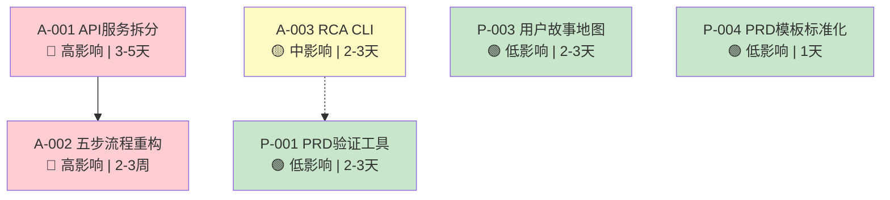

# 架构影响评估：VibeX 每日提案

**项目**: vibex-proposals-summary-20260319_064700  
**阶段**: architect-impact  
**评估人**: Architect Agent  
**评估时间**: 2026-03-19 07:06 (GMT+8)  
**状态**: ✅ 完成

---

## 1. 评估概述

本次评估覆盖 7 个提案（A-001 ~ A-003, P-001 ~ P-004），按架构影响程度分为三级：

| 影响等级 | 提案 | 说明 |
|----------|------|------|
| 🔴 高 | A-001, A-002 | 涉及核心架构重构，影响范围广 |
| 🟡 中 | A-003 | 独立工具，边界清晰 |
| 🟢 低 | P-001, P-003, P-004 | 文档/工具类，无主系统依赖 |

---

## 2. A-001: API 服务层按领域拆分

### 2.1 影响范围

| 影响维度 | 评估 | 风险 |
|----------|------|------|
| 前端 | 需更新 API 调用路径 | 中 |
| 后端 | Next.js API Routes 重构 | 高 |
| 测试 | 需为每个服务写单元测试 | 中 |
| 类型系统 | 需新增 `types/request.ts`, `types/response.ts` | 低 |
| CI/CD | 需更新部署脚本 | 低 |

### 2.2 架构影响分析

**🔴 核心影响 — 服务层重构**

```
当前架构（耦合）:
  api.ts (单文件) → 所有业务逻辑混在一起

目标架构（解耦）:
  src/services/
  ├── index.ts              # 统一导出，兼容层
  ├── auth.ts              # 认证服务
  ├── project.ts           # 项目管理服务
  ├── message.ts           # 消息服务
  ├── flowchart.ts         # 流程图服务
  ├── api.ts               # 兼容层（保留现有签名）
  └── types/
      ├── request.ts       # 请求类型定义
      └── response.ts      # 响应类型定义
```

**关键架构决策**:

1. **兼容层策略**: `api.ts` 保留为兼容层，内部代理到各服务模块，确保现有调用不受影响。
   - ✅ 风险可控：无需一次性迁移所有调用方
   - ⚠️ 技术债：兼容层代码需后续清理

2. **循环依赖防护**: 服务模块之间不得相互导入，需通过 `index.ts` 统一转发。

3. **类型共享**: `types/` 目录作为共享类型定义区，避免重复定义和类型不一致。

### 2.3 前端影响

| 文件/目录 | 影响 | 说明 |
|-----------|------|------|
| `src/app/api/` | 重构 | 按领域拆分路由 |
| `src/services/` | 新增 | 按领域拆分的 services |
| `src/lib/api.ts` | 变更 | 改为兼容层 |
| 所有页面组件 | 潜在影响 | 需确认 API 调用路径是否需要更新 |

### 2.4 测试架构影响

```
测试策略:
  src/services/__tests__/
  ├── auth.test.ts      # 认证服务独立测试
  ├── project.test.ts   # 项目服务独立测试
  ├── message.test.ts   # 消息服务独立测试
  └── flowchart.test.ts # 流程图服务独立测试

覆盖率要求: ≥ 80%
```

### 2.5 架构影响结论

| 维度 | 评分 | 说明 |
|------|------|------|
| 复杂度 | 高 | 涉及多个文件跨层重构 |
| 风险 | 中 | 兼容层策略降低风险 |
| 可逆性 | 中 | 分阶段实施，但迁移后难以回退 |
| 收益 | 高 | 长期可维护性显著提升 |

---

## 3. A-002: 首页五步流程重构

### 3.1 影响范围

| 影响维度 | 评估 | 风险 |
|----------|------|------|
| 前端 | HomePage 组件重写 | 高 |
| 状态管理 | XState 流程状态机引入 | 高 |
| 数据模型 | Step 数据结构新增字段 | 中 |
| API | Step 数据持久化接口可能变更 | 中 |
| 测试 | E2E 测试需重写 | 中 |

### 3.2 架构影响分析

**🔴 核心影响 — 状态机引入**

**引入 XState 状态机**:

```typescript
// 当前：简单 state 驱动
const [currentStep, setCurrentStep] = useState(1);

// 目标：XState 状态机
const flowMachine = createMachine({
  id: 'homepage-flow',
  initial: 'step1',
  states: {
    step1: { on: { NEXT: 'step2' } },
    step2: { on: { BACK: 'step1', NEXT: 'step3' } },
    step3: { on: { BACK: 'step2', NEXT: 'step4' } },  // 新增
    step4: { on: { BACK: 'step3', NEXT: 'step5' } },  // 新增
    step5: { on: { BACK: 'step4', NEXT: 'step6' } },
    step6: { on: { BACK: 'step5', NEXT: 'step7' } },  // 新增
    step7: { on: { BACK: 'step6', DONE: 'complete' } },
  },
});
```

**向后兼容策略**:

- 通过配置控制最大步数，支持 3-7 步切换
- 现有 3 步流程：Step 1 → 2 → (旧 Step 3) → 6 → 7
- 新增步骤为可插拔模块，不影响原有流程流转

### 3.3 页面/组件影响

| 组件 | 影响 | 说明 |
|------|------|------|
| `HomePage` | 重构 | 流程容器改造 |
| `StepNavigation` | 新增/重构 | 支持 3-7 步动态渲染 |
| `FlowContainer` | 新增 | 统一流程展示容器 |
| `StepClarification` | 新增 | Step 3 需求澄清 |
| `StepBoundedContext` | 新增 | Step 4 限界上下文 |

### 3.4 数据模型影响

```typescript
// 新增/扩展的数据类型
interface FlowStep {
  id: string;
  type: 'input' | 'definition' | 'clarification' | 'process' | 'ui' | 'create' | 'delivery';
  maxSteps: number;  // 新增：支持 3-7 步
  data: Record<string, unknown>;
}

interface FlowConfig {
  maxSteps: number;  // 可配置：3 或 7
  enabledSteps: number[];  // 启用的步骤列表
}
```

### 3.5 架构影响结论

| 维度 | 评分 | 说明 |
|------|------|------|
| 复杂度 | 高 | 引入状态机，流程逻辑重写 |
| 风险 | 中 | 向后兼容策略降低用户风险 |
| 可逆性 | 低 | 状态机替换后回退成本高 |
| 收益 | 高 | 流程可扩展性提升，用户体验改善 |

### 3.6 ⚠️ 依赖警告

> **A-002 强依赖 A-001**。流程重构需要稳定的服务层 API，在 API 拆分未完成前，不应启动五步流程实施。

---

## 4. A-003: RCA CLI 根因分析工具

### 4.1 影响范围

| 影响维度 | 评估 | 风险 |
|----------|------|------|
| 前端 | 无影响 | — |
| 后端 | 无影响 | — |
| 基础设施 | 新增 CLI 工具目录 | 低 |
| 部署 | 需安装脚本到 PATH | 低 |
| CI/CD | 可集成到 CI 流程 | 低 |

### 4.2 架构影响分析

**🟡 中等影响 — 独立工具，边界清晰**

```
tools/rca/
├── rca.sh              # 主入口
├── lib/
│   ├── parser.sh       # 日志解析
│   ├── aggregator.sh   # 聚合逻辑
│   ├── detector.sh     # 模式检测
│   └── reporter.sh     # 报告生成
└── patterns/           # 异常模式库
```

**架构特点**:

1. **零主系统依赖**: 纯 Bash/Python 实现，不依赖 Node.js 服务
2. **文件系统操作**: 读取 `./logs` 目录，输出 Markdown 报告
3. **可嵌入 CI/CD**: 作为独立步骤集成到 GitHub Actions / GitLab CI
4. **模式可扩展**: `patterns/` 目录支持新增检测模式

**与主系统的交互**:

| 交互点 | 方式 | 影响 |
|--------|------|------|
| 日志输入 | 文件系统读取 | 仅读取，无写入 |
| 报告输出 | Markdown 文件 | 输出到 `--output` 指定目录 |
| CI 集成 | 环境变量 / CLI 参数 | 标准 Unix 接口 |

### 4.3 架构影响结论

| 维度 | 评分 | 说明 |
|------|------|------|
| 复杂度 | 低 | 独立工具，职责单一 |
| 风险 | 低 | 无主系统依赖，可独立演进 |
| 可逆性 | 高 | 删除目录即可移除，无副作用 |
| 收益 | 高 | 显著提升问题排查效率 |

---

## 5. P-001: PRD 自动化验证工具

### 5.1 影响范围

| 影响维度 | 评估 | 风险 |
|----------|------|------|
| 前端 | 无影响 | — |
| 后端 | 无影响 | — |
| 文档系统 | 新增验证脚本 | 低 |
| 流程 | 强制执行 PRD 格式检查 | 低 |

### 5.2 架构影响分析

**🟢 低影响 — 文档工具类**

```
tools/prd-validator/
├── validate-prd.sh     # PRD 格式验证
├── check-expect.sh     # expect() 格式检查
└── templates/
    └── prd-template.md # 标准模板
```

**架构决策**:

- 使用 Bash 脚本实现，无需额外依赖
- 建议集成到 pre-commit hook，确保提交前通过验证
- 验证规则可通过配置文件 `prd-validator.config` 管理

### 5.3 架构影响结论

| 维度 | 评分 | 说明 |
|------|------|------|
| 复杂度 | 低 | 脚本工具 |
| 风险 | 极低 | 仅读文件，无副作用 |
| 可逆性 | 高 | 移除脚本即可 |
| 收益 | 中 | 提升 PRD 质量一致性 |

---

## 6. P-003: 用户故事地图工具

### 6.1 影响范围

| 影响维度 | 评估 | 风险 |
|----------|------|------|
| 前端 | 无影响 | — |
| 后端 | 无影响 | — |
| 文档系统 | 新增 Markdown 模板 | 低 |
| 流程 | 需求阶段新增地图绘制步骤 | 低 |

### 6.2 架构影响分析

**🟢 低影响 — 文档模板类**

- 提供 `docs/templates/user-story-map.md` 模板
- 纯 Markdown，可配合任意工具使用
- **注意**: 与现有需求管理流程可能有重叠，建议评审后决定是否复用现有模板

### 6.3 建议

> ⚠️ 建议与现有 `docs/templates/` 目录合并，避免模板碎片化。

---

## 7. P-004: PRD 模板标准化

### 7.1 影响范围

| 影响维度 | 评估 | 风险 |
|----------|------|------|
| 文档系统 | 更新现有 PRD 模板 | 低 |
| 流程 | 所有新 PRD 必须使用标准模板 | 低 |
| CI/CD | 建议集成 P-001 验证工具 | 低 |

### 7.2 架构影响分析

**🟢 低影响 — 文档规范化**

```
docs/templates/
├── prd-template.md         # PRD 标准模板 (更新)
├── user-story-map.md        # 用户故事地图 (新增/合并)
├── epic-template.md         # Epic 模板 (可选)
├── story-template.md        # Story 模板 (可选)
└── requirements-checklist.md # 需求检查清单
```

---

## 8. 综合架构影响矩阵

| 提案 | 前端 | 后端 | 数据模型 | 测试 | CI/CD | 风险等级 |
|------|------|------|----------|------|-------|----------|
| A-001 API拆分 | ⚠️ 调用路径更新 | 🔴 重构 | 🟢 types/新增 | ⚠️ 新增服务测试 | ⚠️ 部署脚本更新 | 🔴 高 |
| A-002 五步流程 | 🔴 组件重写 | ⚠️ API可能变更 | ⚠️ Step字段扩展 | ⚠️ E2E重写 | 🟢 无直接变化 | 🔴 高 |
| A-003 RCA CLI | 🟢 无 | 🟢 无 | 🟢 无 | ⚠️ CLI测试 | ✅ 可集成CI | 🟡 中 |
| P-001 PRD验证 | 🟢 无 | 🟢 无 | 🟢 无 | 🟢 无 | ✅ 可集成CI | 🟢 低 |
| P-003 故事地图 | 🟢 无 | 🟢 无 | 🟢 无 | 🟢 无 | 🟢 无 | 🟢 低 |
| P-004 模板标准化 | 🟢 无 | 🟢 无 | 🟢 无 | 🟢 无 | 🟢 无 | 🟢 低 |

---

## 9. 架构依赖关系图



---

## 10. 架构决策建议

### 立即执行（本周）

| 决策 | 理由 |
|------|------|
| ✅ 优先实施 A-003 | 独立工具，无架构风险，快速产出 |
| ✅ 同步实施 P-004 | 文档工作，无技术风险 |

### 需谨慎（分阶段）

| 决策 | 理由 |
|------|------|
| ⚠️ A-001 分3阶段 | 每阶段完成后验证，再推进下一阶段 |
| ❌ A-002 暂缓 | 必须等 A-001 Phase1 完成后再启动 |

### 不建议/暂缓

| 决策 | 理由 |
|------|------|
| ⏸️ P-003 评审 | 需确认与现有模板是否重叠，避免重复建设 |

---

## 11. 检查点确认

- [x] 阅读提案目录 `/root/.openclaw/vibex/proposals/20260319/` — *注：目录不存在，内容来源于 `/root/.openclaw/vibex/docs/vibex-daily-proposals-20260319/`*
- [x] 评估各提案对架构的影响 — 完成
- [x] 输出文档到 `/root/.openclaw/vibex/docs/vibex-proposals-summary-20260319_064700/architect-impact.md` — 完成

---

*Architect Impact Assessment - 2026-03-19*
