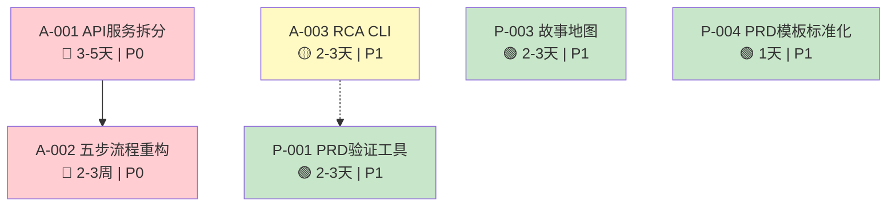

# VibeX 每日提案 - 最终汇总报告

**项目**: vibex-proposals-summary-20260319_074140
**汇总人**: Coord Agent
**汇总时间**: 2026-03-19 07:54 (GMT+8)
**状态**: ✅ 完成

---

## 1. 执行摘要

本次汇总覆盖 **7 个提案**（A-001~A-003, P-001~P-004），来自 Architect × 3 + PM × 1 的分析。核心结论：

> **优先执行**: A-003 (RCA CLI) + P-004 (PRD 模板标准化) 本周即可启动  
> **下周启动**: A-001 (API 拆分 Phase1)  
> **暂缓**: A-002 等待 A-001 完成后再启动

**总工作量**: 约 10-15 人天

---

## 2. 提案优先级矩阵

| 优先级 | ID | 提案名称 | 来源 | 工作量 | 风险 | 依赖 |
|--------|-----|----------|------|--------|------|------|
| 🔴 P0 | A-001 | API 服务层按领域拆分 | Architect | 3-5天 | 中 | 无 |
| 🔴 P0 | A-002 | 首页五步流程重构 | Architect | 2-3周 | 中 | A-001 |
| 🟡 P1 | A-003 | RCA CLI 根因分析工具 | Architect | 2-3天 | 低 | 无 |
| 🟡 P1 | P-001 | PRD 自动化验证工具 | PM | 2-3天 | 低 | 无 |
| 🟡 P1 | P-003 | 用户故事地图工具 | PM | 2-3天 | 低 | 无 |
| 🟡 P1 | P-004 | PRD 模板标准化 | PM | 1天 | 极低 | 无 |
| 🟢 P2 | P-002 | 需求变更追踪系统 | PM | 3-4天 | 低 | 无 |

---

## 3. 各 Agent 分析要点

### 3.1 Analyst 分析 (`vibex-daily-proposals-20260319/analysis.md`)

**核心发现**:
- A-001 问题根源：单文件 api.ts 耦合度过高，无法按需加载和独立测试
- A-002 依赖 A-001，新增 Step 3 (需求澄清) + Step 4 (限界上下文)
- A-003 独立 CLI，无主系统依赖，可快速迭代
- P-003 与现有模板重叠，建议复用而非新建
- P-004 建议立即执行，文档工作无技术风险

**验收标准亮点**:
- A-001: 单元测试通过率 100%、响应时间降低 20%
- A-002: 流程可配置 7 步、用户转化率 +15%
- A-003: 单次分析 < 30s、报告包含完整 trace 链路

### 3.2 Architect 分析 (`vibex-proposals-summary-20260319_064700/architect-impact.md`)

**架构影响分级**:
- 🔴 高影响: A-001, A-002
- 🟡 中影响: A-003
- 🟢 低影响: P-001, P-003, P-004

**关键架构决策**:
1. A-001 兼容层策略：api.ts 保留为兼容层，内部代理到各服务模块
2. A-002 强依赖 A-001：API 拆分未完成前不得启动五步流程
3. A-003 零主系统依赖：纯 Bash/Python，删除目录即可移除

**实施建议**:
```
Week 1:  A-003 + P-004 (无依赖，快速产出)
Week 2-3: A-001 Phase1 (auth.ts 拆分)
Week 4-6: A-001 Phase2 + P-001
Week 7-12: A-002 (五步流程)
```

### 3.3 PM PRD (`vibex-daily-proposals-20260319/prd.md`)

**Epic 拆分**:
- Epic 1 (A-001): F1.1~F1.4 — 服务拆分 + 兼容层 + 测试 + 性能
- Epic 2 (A-002): F2.1~F2.5 — 流程架构 + Step 3/4 + 兼容 + 转化率
- Epic 3 (A-003): F3.1~F3.4 — 日志聚合 + 模式识别 + 报告 + 性能
- Epic 4 (PM 工具): F4.1~F4.4 — PRD 验证 + 模板 + 故事地图 + 变更追踪

**DoD 验收**:
- Epic 1: 5 个服务文件 + 测试通过 + 向后兼容
- Epic 2: 可配置 7 步 + 兼容 3 步
- Epic 3: `--help` 正常 + 分析 < 30s
- Epic 4: PRD 模板 100% 覆盖

---

## 4. 架构关系图



---

## 5. 决策建议

### 5.1 立即执行（本周）

| 行动 | 负责人 | 说明 |
|------|--------|------|
| ✅ 启动 A-003 RCA CLI | Dev | 独立工具，快速产出，2-3天完成 |
| ✅ 启动 P-004 PRD 模板标准化 | PM | 文档工作，1天完成 |
| ✅ 评审 P-003 故事地图 | PM/Architect | 确认是否复用现有模板 |

### 5.2 下周启动

| 行动 | 负责人 | 说明 |
|------|--------|------|
| → 启动 A-001 Phase1 (auth.ts) | Dev | API 拆分第一阶段 |
| → 启动 P-001 PRD 验证工具 | Dev | 与 A-001 并行 |

### 5.3 暂缓评估

| 行动 | 原因 | 触发条件 |
|------|------|----------|
| ⏸️ A-002 五步流程 | 强依赖 A-001 | A-001 Phase1 完成后启动 |
| ⏸️ P-002 变更追踪 | P2，资源允许时 | 另行评估 |

### 5.4 不建议执行

| 行动 | 原因 |
|------|------|
| ❌ P-003 新建模板 | 与 `docs/templates/` 现有内容重叠 |

---

## 6. 风险与缓解

| 风险 | 影响 | 概率 | 缓解措施 |
|------|------|------|----------|
| A-001 迁移破坏现有功能 | 高 | 中 | 完整测试覆盖 + 蓝绿部署 |
| A-002 用户习惯变更抵触 | 中 | 中 | A/B 测试 + 渐进切换 |
| A-003 工具使用率低 | 低 | 高 | 团队培训 + CI 集成 |
| P-003 模板碎片化 | 低 | 中 | 合并到现有 `docs/templates/` |

---

## 7. 检查点确认

- [x] 阅读各 Agent 分析文档 — 完成
  - Analyst: `vibex-daily-proposals-20260319/analysis.md`
  - Architect: `vibex-proposals-summary-20260319_064700/architect-impact.md`
  - PM: `vibex-daily-proposals-20260319/prd.md`
- [x] 汇总优先级和实施建议 — 完成
- [x] 输出最终报告 — 完成

---

*Coord Summary Report - 2026-03-19 07:54*
