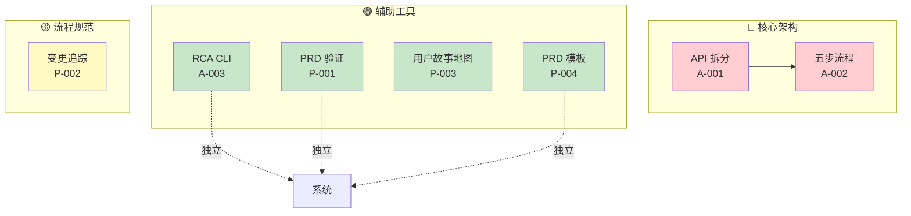

# 架构影响评估：VibeX 每日提案

**项目**: vibex-proposals-summary-20260319_123116  
**任务**: architect-impact  
**评估时间**: 2026-03-19 12:31 (GMT+8)  
**架构师**: Architect Agent  

---

## 1. 执行摘要

今日共评估 **7 个提案**，按架构影响分为：
- 🔴 **高影响**: 2 个（涉及核心架构变更）
- 🟡 **中影响**: 2 个（涉及流程/数据模型变更）
- 🟢 **低影响**: 3 个（独立工具/文档类）

**关键发现**: Epic 1 (API 拆分) 和 Epic 2 (五步流程) 是架构变更的核心，Epic 3-4 为辅助工具。

---

## 2. 架构影响评级

| ID | 提案 | 来源 | 优先级 | 架构影响 | 评级理由 |
|----|------|------|--------|----------|----------|
| A-001 | API 服务层按领域拆分 | Architect | P0 | 🔴 高 | 核心服务架构重构，依赖关系复杂 |
| A-002 | 首页五步流程重构 | Architect | P0 | 🟡 中 | 流程状态机 + 数据结构变更 |
| A-003 | RCA CLI 根因分析工具 | Architect | P1 | 🟢 低 | 独立 CLI，无主系统依赖 |
| P-001 | PRD 自动化验证工具 | PM | P1 | 🟢 低 | 文档检查工具，无代码架构影响 |
| P-002 | 需求变更追踪系统 | PM | P2 | 🟡 中 | Git 集成影响版本控制流程 |
| P-003 | 用户故事地图工具 | PM | P1 | 🟢 低 | 文档/模板类，影响文档结构 |
| P-004 | PRD 模板标准化 | PM | P1 | 🟢 低 | 纯文档工作，无代码影响 |

---

## 3. 详细影响分析

### 3.1 A-001: API 服务层按领域拆分 🔴 高影响

**影响范围**:
- `src/services/api.ts` → 拆分为 5 个独立模块
- 所有引用 `api.ts` 的组件需更新导入
- 测试框架需适配独立服务测试

**架构变更点**:
```
当前架构:
api.ts (单文件，600+ 行)
    ↓
所有服务调用

目标架构:
src/services/
├── index.ts          # 统一导出
├── auth.ts          # 认证服务
├── project.ts       # 项目服务
├── message.ts       # 消息服务
├── flowchart.ts     # 流程图服务
└── api.ts          # 兼容层 (适配旧调用)
```

**风险评估**:
- **破坏性风险**: 高 — 所有现有调用必须通过兼容层或迁移
- **测试覆盖要求**: 必须 ≥ 80%
- **部署策略**: 蓝绿部署或功能开关

**依赖关系**:
- 无外部依赖
- 被 A-002 依赖（A-002 依赖 Step 数据结构）

**实施建议**:
1. Phase 1: 拆分 auth.ts（最简单，独立性强）
2. Phase 2: 拆分剩余服务
3. 保留兼容层至少 2 个 Sprint

---

### 3.2 A-002: 首页五步流程重构 🟡 中影响

**影响范围**:
- 流程状态机 `flowMachine.ts`
- 页面组件：HomePage, StepNavigation, FlowContainer
- 数据模型：Step 数据结构扩展

**架构变更点**:
```
当前:
Step 1 → Step 2 → Step 3 (3 步固定)

目标:
Step 1 → Step 2 → Step 3 → Step 4 → Step 5 → Step 6 → Step 7
(3-7 步可配置)
```

**状态机复杂度增加**:
```typescript
// 当前: 线性流程
step1 → step2 → step3

// 目标: 支持跳跃和回退
step1 ↔ step2 ↔ step3 ↔ step4 ↔ step5 ↔ step6 ↔ step7
```

**风险评估**:
- **破坏性风险**: 中 — 向后兼容 3 步流程
- **UI 变更范围**: HomePage 和流程导航组件
- **依赖 A-001**: 必须等 API 拆分完成后实施

**依赖关系**:
- 依赖 A-001 完成
- 影响 HomePage 组件

**实施建议**:
1. 使用 XState 实现可配置状态机
2. A/B 测试渐进切换
3. 保留现有 3 步流程入口

---

### 3.3 A-003: RCA CLI 根因分析工具 🟢 低影响

**影响范围**:
- 新增 `rca/` CLI 目录
- 无主系统代码变更
- 可独立迭代

**架构定位**:
```
rca/
├── rca.sh           # 主入口
├── lib/             # 功能库
└── patterns/        # 异常模式库
```

**风险评估**:
- **破坏性风险**: 无 — 独立工具
- **系统耦合**: 无
- **快速产出**: 可在 Week 1 完成

**依赖关系**:
- 无依赖，可立即实施

**实施建议**:
1. 使用 Bash 或 Python 实现
2. 集成到 CI/CD 流水线
3. 提供标准日志格式解析

---

### 3.4 P-001: PRD 自动化验证工具 🟢 低影响

**影响范围**:
- `docs/templates/` 目录
- 文档检查脚本
- 无代码架构影响

**架构定位**:
```
docs/
├── templates/
│   └── prd-template.md
└── scripts/
    └── validate-prd.sh
```

**风险评估**:
- **破坏性风险**: 无
- **系统耦合**: 无
- **价值**: 提升 PRD 质量

**依赖关系**:
- 无依赖

**实施建议**:
1. 与 A-003 合并为同一 CLI 工具集
2. 使用正则表达式检查 expect() 格式
3. 集成到 pre-commit hook

---

### 3.5 P-002: 需求变更追踪系统 🟡 中影响

**影响范围**:
- Git 提交规范
- Changelog 自动生成
- CI/CD 流程变更

**架构变更点**:
```bash
# Git commit 格式要求
<type>(<scope>): <subject>

# Changelog 自动生成
conventional-changelog -p angular -i CHANGELOG.md -s
```

**风险评估**:
- **破坏性风险**: 中 — 影响团队 Git 工作流
- **采用成本**: 需要团队培训

**依赖关系**:
- 无代码依赖
- 建议: P2 延期

**实施建议**:
1. 先制定 commit 规范
2. 使用 husky + commitlint 强制执行
3. 确认团队接受度后再全面推广

---

### 3.6 P-003 & P-004: 文档类工具 🟢 低影响

**影响范围**:
- 文档模板更新
- 团队协作规范

**风险评估**:
- **破坏性风险**: 无
- **实施成本**: 低（文档工作）

**实施建议**:
- P-004 立即执行（1 天工作量）
- P-003 评估是否与现有流程重叠

---

## 4. 架构健康度影响

| 指标 | 当前 | 实施后 | 变化 |
|------|------|--------|------|
| **模块化** | 低（单文件） | 高（5+ 独立服务） | ⬆️ 提升 |
| **可测试性** | 中 | 高 | ⬆️ 提升 |
| **流程灵活性** | 低（固定 3 步） | 高（3-7 步可配置） | ⬆️ 提升 |
| **运维能力** | 低（人工排查） | 高（CLI 工具） | ⬆️ 提升 |
| **代码复杂度** | 中 | 中+ | ➡️ 略增 |
| **技术债** | 中 | 低 | ⬇️ 减少 |

---

## 5. 依赖关系图



---

## 6. 实施优先级建议

### 立即执行（Week 1）
| 提案 | 理由 |
|------|------|
| A-003 RCA CLI | 🔴 高价值，低风险，独立工具 |
| P-004 PRD 模板 | 🟢 文档工作，1 天完成 |

### 下周启动（Week 2-3）
| 提案 | 理由 |
|------|------|
| A-001 Phase 1 | 🔴 核心架构，P0 优先级 |
| P-001 PRD 验证 | 🟢 可与 A-001 并行 |

### 延期评估
| 提案 | 理由 |
|------|------|
| A-002 五步流程 | 🟡 依赖 A-001，需充分测试 |
| P-002 变更追踪 | 🟡 需团队培训，确认接受度 |

---

## 7. 技术债务评估

| 提案 | 技术债务 | 建议 |
|------|----------|------|
| A-001 | 兼容层维护成本 | 制定废弃时间表 |
| A-002 | 状态机复杂度 | 使用 XState 规范管理 |
| P-002 | Git 规范强制成本 | 渐进式推广 |

---

## 8. 结论

**架构影响总结**:
- 🔴 **2 个高影响提案** (A-001, A-002) 需要架构评审和详细设计
- 🟡 **2 个中影响提案** (A-002, P-002) 需要流程变更和团队协作
- 🟢 **3 个低影响提案** (A-003, P-001, P-004) 可快速实施

**关键风险**:
1. A-001 迁移期间可能破坏现有功能 → 必须有完整测试覆盖
2. A-002 用户习惯变更 → 需要 A/B 测试验证

**下一步**:
1. A-001 需要详细技术设计文档
2. A-003 可立即进入开发
3. P-004 文档工作可并行启动

---

*Architect Impact Assessment - 2026-03-19*
