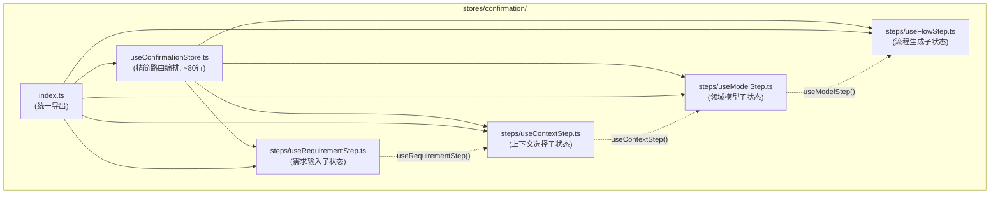
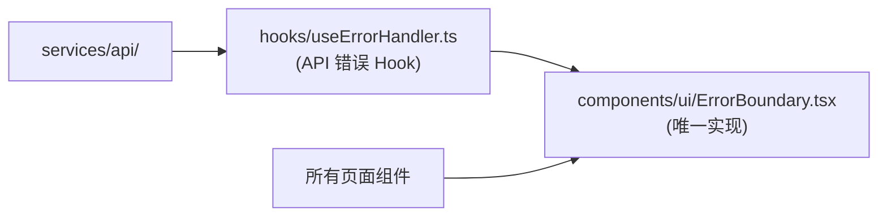
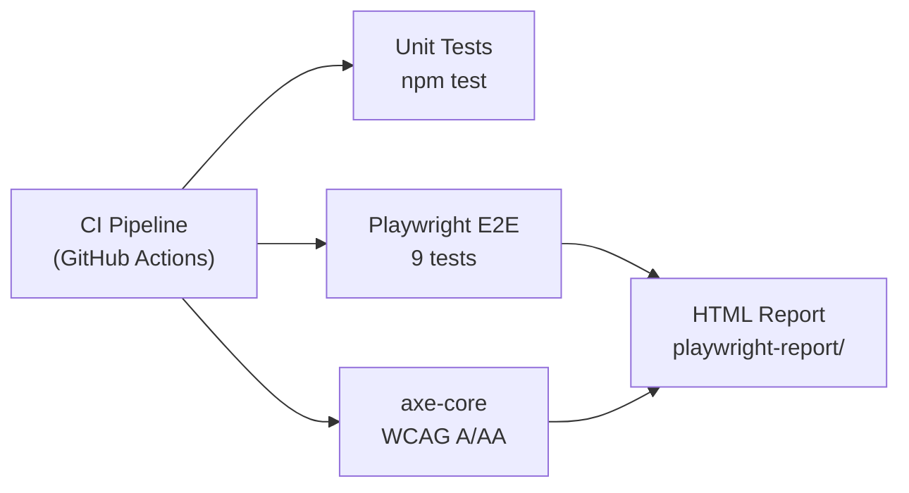

# 系统架构设计 — 提案汇总项目

**项目**: vibex-proposals-summary-20260324_0958  
**作者**: Architect Agent  
**时间**: 2026-03-24 11:10 (Asia/Shanghai)  
**状态**: Proposed

---

## 1. 架构概览

本设计针对本次提案汇总涉及的架构变更，覆盖以下核心领域：
- 状态管理重构（confirmationStore slice pattern）
- 错误处理统一（ErrorBoundary + useErrorHandler）
- 共享类型基础设施（packages/types）
- CI/CD 增强（E2E + Accessibility）

---

## 2. 目标架构

### 2.1 状态管理：confirmationStore Slice Pattern

**现状**: 单一 `stores/confirmationStore.ts`（461行）承担所有子流程状态

**目标**: Zustand slice pattern 渐进式拆分



**API 兼容性保证**:
```typescript
// 向后兼容：主 Store API 不变
const store = useConfirmationStore()
store.requirement // 仍然可用
store.setRequirement // 仍然可用

// 新增：独立 step hooks
const reqStep = useRequirementStep()
const ctxStep = useContextStep()
```

**localStorage 兼容性**: snapshot 格式保持 `confirmation_snapshot_v1`，新增 slice 独立序列化

---

### 2.2 错误处理统一

**目标**: 统一的 ErrorBoundary + useErrorHandler



**ErrorType 枚举**:
```typescript
// types/errors.ts
export enum ErrorType {
  NETWORK = 'NETWORK',
  UNAUTHORIZED = 'UNAUTHORIZED',    // 401
  FORBIDDEN = 'FORBIDDEN',          // 403
  NOT_FOUND = 'NOT_FOUND',          // 404
  VALIDATION = 'VALIDATION',        // 422
  SERVER = 'SERVER',                // 500
  TIMEOUT = 'TIMEOUT',
  CANCELLED = 'CANCELLED',
  UNKNOWN = 'UNKNOWN'
}
```

**useErrorHandler hook**:
```typescript
// hooks/useErrorHandler.ts
export function useErrorHandler() {
  return {
    handle: (error: Error) => ErrorType.UNKNOWN,
    handleApi: (response: ApiResponse) => ErrorType,
    toUserMessage: (type: ErrorType) => i18nKey
  }
}
```

---

### 2.3 共享类型包

**目标**: `packages/types/` workspace 包

```
packages/
└── types/
    ├── src/
    │   ├── api.ts          # API 请求/响应类型
    │   │   ├── ApiRequest
    │   │   ├── ApiResponse<T>
    │   │   ├── ApiError
    │   │   └── endpoints/*
    │   ├── domain.ts      # 领域实体类型
    │   │   ├── Project
    │   │   ├── Requirement
    │   │   ├── DomainModel
    │   │   └── Context
    │   ├── store.ts       # Store 类型
    │   │   ├── ConfirmationState
    │   │   └── StepState
    │   ├── index.ts
    │   └── api-extractor.ts  # 从后端 OpenAPI 生成
    ├── package.json
    ├── tsconfig.json
    └── README.md
```

**同步策略**:
- 短期：手动同步 + CI lint 检查（`tsc --noEmit` 跨包）
- 长期：OpenAPI codegen（需后端 API 文档化）

---

### 2.4 E2E + Accessibility CI



**CI 容器需求**:
- Chromium browser for Playwright
- `npm run test:e2e` in CI environment

---

## 3. 接口定义

### 3.1 confirmationStore 新增 API

```typescript
// stores/confirmation/index.ts

// 主 Store（保持原 API）
export interface ConfirmationStore {
  requirement: string
  contextId: string | null
  model: DomainModel | null
  flow: FlowChart | null
  setRequirement: (req: string) => void
  setContextId: (id: string) => void
  setModel: (model: DomainModel) => void
  setFlow: (flow: FlowChart) => void
  reset: () => void
}

// Step hooks（新增）
export function useRequirementStep(): RequirementStepState
export function useContextStep(): ContextStepState
export function useModelStep(): ModelStepState
export function useFlowStep(): FlowStepState
```

### 3.2 ErrorType API

```typescript
// types/errors.ts

export enum ErrorType {
  NETWORK = 'NETWORK',
  UNAUTHORIZED = 'UNAUTHORIZED',
  FORBIDDEN = 'FORBIDDEN',
  NOT_FOUND = 'NOT_FOUND',
  VALIDATION = 'VALIDATION',
  SERVER = 'SERVER',
  TIMEOUT = 'TIMEOUT',
  CANCELLED = 'CANCELLED',
  UNKNOWN = 'UNKNOWN'
}

export interface ApiError {
  type: ErrorType
  code: number
  message: string
  details?: Record<string, unknown>
}
```

---

## 4. 数据模型

### 4.1 Confirmation State Slice

```typescript
// stores/confirmation/steps/types.ts

export interface RequirementStepState {
  value: string
  isValid: boolean
  validationErrors: string[]
  setValue: (v: string) => void
  validate: () => boolean
}

export interface ContextStepState {
  selectedId: string | null
  availableContexts: Context[]
  isLoading: boolean
  select: (id: string) => void
}

export interface ModelStepState {
  model: DomainModel | null
  isDirty: boolean
  update: (patch: Partial<DomainModel>) => void
  save: () => Promise<void>
}

export interface FlowStepState {
  flow: FlowChart | null
  isGenerating: boolean
  generate: () => Promise<void>
  cancel: () => void
}
```

---

## 5. 性能评估

| 变更点 | 性能影响 | 评估 |
|--------|---------|------|
| confirmationStore 拆分 | ✅ 正面 | 减少不必要的 re-render，按需订阅 |
| ErrorBoundary 统一 | ✅ 正面 | 减少重复边界，错误处理更高效 |
| 共享类型包 | ✅ 正面 | 类型检查提前发现错误 |
| React Query 迁移 | ✅ 正面 | 减少重复请求，提升响应速度 |
| E2E CI | ⚠️ 负面 | CI 时间 +5-10min |
| Landing Page 集成 | ✅ 正面 | 减少重复组件 |

**整体预期**: 性能收益 > 成本

---

## 6. 技术约束

1. **向后兼容**: 所有重构必须保持现有 API 不变
2. **零破坏性**: localStorage 中的快照必须可读取
3. **增量迁移**: confirmationStore 拆分必须渐进式，不可一次性全部重写
4. **类型安全**: packages/types 必须通过 `tsc --strict` 检查
