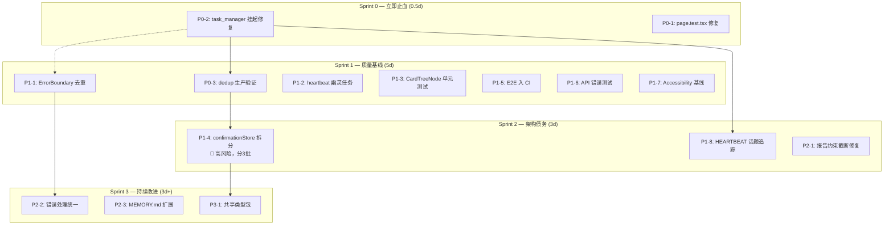

# 架构文档：VibeX 提案汇总执行计划

**项目**: vibex-proposals-summary-20260324_185417  
**日期**: 2026-03-24  
**角色**: architect  
**状态**: Proposed

---

## 1. 背景与约束

### 1.1 项目目标
执行 21 条跨 Agent 自检提案（P0×3, P1×8, P2×7, P3×3），覆盖工具链止血、前端质量、架构债务、AI 治理四大领域，3 周内完成所有 P0/P1 项。

### 1.2 硬约束
- **向后兼容**: confirmationStore 拆分保持原有 API 不变
- **CI 通过率 ≥ 95%**: 所有变更必须通过 CI
- **task_manager 响应 ≤ 5s**: 不得引入新的性能问题
- **分批 PR**: confirmationStore 拆分最多分 3 个 PR（高破坏性）
- **现有技术栈**: Next.js + Zustand + React Query + Playwright

### 1.3 已知风险
| 风险 | 等级 | 缓解策略 |
|------|------|----------|
| confirmationStore 拆分引发回归 | 🔴 High | 分 3 批 PR，每批独立可回滚 |
| task_manager 死锁/循环依赖 | 🔴 High | 添加超时装饰器 + 降级方案 |
| dedup bigram 误判提案 | 🟡 Medium | 人工标注验证 + 可配置阈值 |
| E2E flaky 导致 CI 误报 | 🟡 Medium | retry 机制 + flaky 标记 |

---

## 2. 系统架构

> 本项目是执行型项目而非新建系统，架构重点在于**任务编排**与**风险管控**，而非技术选型。



### 2.1 关键技术决策

#### ADR-001: confirmationStore 拆分策略

**决策**: 使用 Zustand slice pattern 分 3 批渐进拆分。

**理由**:
- 461 行 store 直接重构风险过高
- slice pattern 可保持原有 API 不变
- 分批可独立回滚，不影响主分支

**拆分边界**:
```
Batch 1: requirementStep 相关状态 → useRequirementStep
Batch 2: snapshotHistory 相关状态 → useSnapshotHistory
Batch 3: 剩余状态清理 + 统一导出
```

**回滚策略**: 每批次独立 PR，main 分支受保护，reviewer-push 双重验证。

#### ADR-002: E2E CI 集成策略

**决策**: 使用 GitHub Actions + Playwright，单独 job 运行。

**理由**:
- 不影响现有 build/test job
- flaky tests 通过 retry (3次) + 标记机制缓解
- 测试报告上传 GitHub Artifacts

**配置**:
```yaml
e2e:
  runs-on: ubuntu-latest
  steps:
    - uses: actions/checkout@v4
    - run: npm ci
    - run: npx playwright install --with-deps
    - run: npm run test:e2e -- --retry=3
    - uses: actions/upload-artifact@v4
      if: always()
```

#### ADR-003: dedup 生产验证策略

**决策**: staging 环境 + 人工抽样验证 bigram 边界。

**理由**:
- Chinese bigram 边界未在真实数据上验证
- 配置阈值可调，支持热更新
- 关键提案保留人工审核环节

**阈值**:
```python
SIMILARITY_THRESHOLD = 0.75  # 可配置
MIN_KEYWORD_OVERLAP = 2
```

---

## 3. 接口约定

### 3.1 confirmationStore 拆分后导出

```typescript
// 原有 API（保持不变）
export const useConfirmationStore = create<ConfirmationState>()

// 新增 slice hooks
export const useRequirementStep = create<RequirementStepState>()
export const useSnapshotHistory = create<SnapshotHistoryState>()

// 迁移指南：逐个组件替换
// 组件A: useConfirmationStore.getState().requirementStep
//   → useRequirementStep.getState()
// 组件B: useConfirmationStore.getState().snapshotHistory
//   → useSnapshotHistory.getState()
```

### 3.2 task_manager 响应约束

```python
# 所有文件 IO 操作添加超时
@timeout(5)  # seconds
def read_json(filepath):
    ...

@timeout(5)
def write_json(filepath, data):
    ...

# 全局超时装饰器
def timeout(seconds):
    def decorator(func):
        @wraps(func)
        def wrapper(*args, **kwargs):
            result = timeout_command(f"{seconds}", func, *args, **kwargs)
            return result
        return wrapper
    return decorator
```

### 3.3 E2E 测试报告格式

```typescript
// 标准测试报告接口
interface E2EReport {
  total: number
  passed: number
  failed: number
  flaky: number
  duration: number  // ms
  artifacts: string[]  // 截图/视频路径
}
```

---

## 4. 数据模型（无新增）

> 本项目为执行型项目，不涉及新数据模型。所有变更在现有代码库内完成。

---

## 5. 测试策略

### 5.1 覆盖范围

| 阶段 | 框架 | 覆盖率目标 |
|------|------|-----------|
| 工具链修复 | pytest | N/A (脚本) |
| 前端质量 | Jest + Playwright | CardTreeNode ≥ 85% |
| 架构变更 | Jest + E2E | confirmationStore 每批次 ≥ 90% |
| Accessibility | jest-axe | confirm + flow 页面 |

### 5.2 关键测试用例

```typescript
// P1-3: CardTreeNode 单元测试
describe('CardTreeNode', () => {
  it('正常渲染单个节点', () => {
    expect(render(<CardTreeNode><TreeNode/></CardTreeNode>)).toHaveLength(1)
  })
  it('空 children 渲染空状态', () => {
    expect(screen.getByText('No items')).toBeInTheDocument()
  })
  it('多层级嵌套正确展开', async () => {
    fireEvent.click(screen.getByRole('button', { name: /expand/i }))
    expect(await screen.findByText('Level 2')).toBeInTheDocument()
  })
})

// P1-7: Accessibility 基线
describe('Accessibility', () => {
  it('confirm 页面无 WCAG 违规', async () => {
    const results = await axe(container)
    expect(results).toHaveNoViolations()
  })
})

// P0-2: task_manager 响应时间
describe('task_manager', () => {
  it('list 命令 5s 内完成', async () => {
    const start = Date.now()
    exec('python3 task_manager.py list')
    expect(Date.now() - start).toBeLessThan(5000)
  })
})
```

### 5.3 回归保护

| 变更类型 | 保护机制 |
|----------|----------|
| confirmationStore 拆分 | 每批次 E2E 全量回归 + snapshot |
| task_manager 修复 | 集成测试覆盖所有子命令 |
| dedup 验证 | staging 预跑 + 人工审核 |
| E2E 入 CI | flaky retry (3次) + 结果记录 |

---

## 6. 风险登记册

| ID | 风险 | 概率 | 影响 | 等级 | 缓解措施 | 残余风险 |
|----|------|------|------|------|----------|----------|
| R1 | confirmationStore 拆分引发回归 | 高 | 高 | 🔴 | 分3批PR + 每批独立回滚 | 🟡 中 |
| R2 | task_manager 新超时引入边界问题 | 中 | 高 | 🔴 | 覆盖测试 + staging 验证 | 🟢 低 |
| R3 | dedup bigram 误判丢失提案 | 中 | 中 | 🟡 | 人工审核 + 可配置阈值 | 🟢 低 |
| R4 | E2E flaky 影响 CI 稳定性 | 中 | 中 | 🟡 | retry 机制 + flaky 标记 | 🟢 低 |
| R5 | 多 P1 并行执行资源冲突 | 中 | 中 | 🟡 | 协调 dev 工作节奏 | 🟢 低 |
| R6 | ErrorBoundary 去重丢失功能 | 低 | 中 | 🟢 | 保留两套功能，清理重复 | 🟢 低 |

---

## 7. 验收标准

### 7.1 Sprint 0 完成标准
- [ ] task_manager.py list/claim 响应 ≤ 5s
- [ ] page.test.tsx 0 个过时测试失败
- [ ] CI 通过率 ≥ 95%

### 7.2 Sprint 1 完成标准
- [ ] dedup.run('proposals/20260323') 召回率 ≥ 70%，精确率 ≥ 80%
- [ ] ErrorBoundary 统一到 components/ui/ErrorBoundary.tsx
- [ ] heartbeat 扫描无误报（无未提交项目的误报）
- [ ] CardTreeNode 测试覆盖率 ≥ 85%
- [ ] E2E 纳入 CI 正常运行（报告上传成功）
- [ ] API 错误边界测试 100% 覆盖
- [ ] confirm + flow 页面 Accessibility 无违规

### 7.3 Sprint 2 完成标准
- [ ] confirmationStore 拆分完成 3/3 批次
- [ ] 每批次 PR 独立可回滚
- [ ] HEARTBEAT 话题追踪脚本可用
- [ ] 报告约束截断问题修复

### 7.4 Sprint 3 完成标准
- [ ] 错误处理模式统一
- [ ] MEMORY.md 失败模式库扩展 ≥ 10 条
- [ ] 共享类型包可发布

---

## 8. ADR 索引

| ADR | 标题 | 状态 |
|-----|------|------|
| ADR-001 | confirmationStore 拆分策略 | Proposed |
| ADR-002 | E2E CI 集成策略 | Proposed |
| ADR-003 | dedup 生产验证策略 | Proposed |
