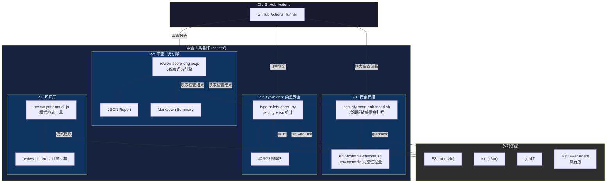
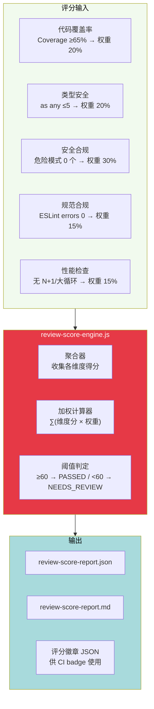

# Architecture — vibex-reviewer-proposals-20260324_185417

**项目:** Vibex Reviewer 工具增强套件
**状态:** Proposed
**作者:** Architect (via reviewer proposals)
**日期:** 2026-03-24
**版本:** 1.0

---

## 1. 项目概述与目标

本架构文档为 Reviewer Agent 的 4 项提案提供系统性技术方案，目标是在不修改现有审查流程的前提下，构建一套可自动化运行的**审查工具增强套件**。套件包含：

| 组件 | 来源提案 | 优先级 |
|------|---------|--------|
| 敏感信息扫描增强 (`security-scan-enhanced.sh`) | 提案二 | P1 |
| 审查报告质量自动化评分系统 (`review-score-engine`) | 提案一 | P2 |
| TypeScript 类型安全自动化检查 (`type-safety-check`) | 提案四 | P2 |
| 审查知识库 (`review-patterns/`) | 提案三 | P3 |

**设计原则：**

1. **零侵入生产代码** — 所有工具仅作用于工具层和流程层
2. **可选使用** — 不强制 Reviewer 使用，可逐步采纳
3. **可观测输出** — 所有检查结果输出结构化 JSON + Markdown
4. **CI 友好** — 支持 exit code 驱动门禁判定

---

## 2. 技术栈选择及理由

### 2.1 核心技术选型

| 层级 | 技术选型 | 版本 | 理由 |
|------|---------|------|------|
| 脚本语言 | Bash | ≥ 4.0 | 安全扫描脚本兼容现有 `security-scan.sh`；无需引入新运行时 |
| 增强脚本语言 | Python | ≥ 3.9 | `type-safety-check.py` 需要正则表达式处理和结构化输出，Bash 表达能力不足 |
| 评分引擎 | Node.js (纯 JS) | ≥ 18 | 与项目现有 tsc/eslint 生态一致；无需额外依赖 |
| 知识库格式 | Markdown | — | 便于 human-readable 编辑；可被 CLI 检索 |
| 测试框架 | Jest | ≥ 29 | TypeScript + Bash 脚本均可用 Jest 做集成测试 |
| 输出格式 | JSON Schema | — | 标准化输出，CI 解析和前端展示均可复用 |

### 2.2 技术选型理由详述

**为什么不使用纯 Bash 完成所有工具？**

`type-safety-check.py` 需要处理以下复杂场景：
- 跨文件 `as any` 数量统计（需 AST 解析或精确正则）
- JSON + Markdown 双格式输出
- 增量检测（对比基线文件的 diff 逻辑）

这些用 Python 实现比 Bash 更稳定、可维护。安全扫描增强仍保留为 Bash 脚本，原因：
- 与现有 `security-scan.sh` 保持一致
- grep/awk/sed 模式匹配已足够覆盖 `.env.example` 注释检查
- 无需引入 Python 依赖（项目无 Python 运行时）

**评分引擎为什么用 Node.js 而非 Python？**

- 项目构建在 Node.js 生态上，`tsc --noEmit` 和 `eslint` 均为 Node.js 工具
- 评分引擎需要调用这些子进程，直接 `child_process.exec` 更自然
- Reviewer Agent 本身运行在 Node.js 环境，调试方便

### 2.3 外部依赖

| 依赖 | 用途 | 是否已有 |
|------|------|---------|
| `tsc --noEmit` | TypeScript 类型检查 | ✅ 已有 |
| `eslint` | 规范合规检查 | ✅ 已有 |
| `grep` / `awk` | 安全模式扫描 | ✅ 系统自带 |
| `git diff` | 增量检测 | ✅ 已有 |
| Python 3.9+ | type-safety-check.py | ⚠️ 需确认环境 |

---

## 3. 系统架构图

### 3.1 整体架构



### 3.2 安全扫描增强架构

```mermaid
flowchart LR
    subgraph Input["扫描目标"]
        ENV_EX[".env.example 文件"]
        CODE["源代码文件"]
        COMMENTS["注释内容"]
        PROC_ENV["process.env 调用"]
    end

    subgraph Scan["security-scan-enhanced.sh"]
        P1["模式1: 硬编码凭证<br/>grep -rE 'password\|secret\|api_key'"]
        P2["模式2: 注释中的 Token<br/>grep -rE '#.*token\|//.*key\|\\.env.*example'"]
        P3["模式3: .env.example 完整性<br/>检查所有 KEY= 是否有注释"]
        P4["模式4: process.env 默认值<br/>检测 \|\| \"fallback\" 模式"]
    end

    subgraph Output["输出"]
        JSON_SEC["security-report.json"]
        MD_SEC["security-report.md"]
    end

    Input --> Scan
    Scan --> Output

    style Scan fill:#7b2cbf,color:#fff
    style Input fill:#48cae4,color:#000
    style Output fill:#2ec4b6,color:#000
```

### 3.3 审查评分引擎架构



---

## 4. 目录结构

```
vibex/
├── scripts/
│   ├── security-scan-enhanced.sh        # P1: 增强安全扫描 (bash)
│   ├── env-example-checker.sh           # P1: .env.example 完整性检查 (bash)
│   ├── type-safety-check.py             # P2: TypeScript 类型安全检查 (python)
│   ├── review-score-engine.js           # P2: 审查评分引擎 (node)
│   └── review-patterns-cli.js           # P3: 知识库检索 CLI (node)
├── review-patterns/                      # P3: 审查知识库 (markdown)
│   ├── _index.md                         # 知识库索引
│   ├── security/
│   │   ├── sql-injection.md
│   │   ├── xss.md
│   │   ├── hardcoded-secret.md
│   │   └── process-env-default.md
│   ├── typescript/
│   │   ├── any-usage.md
│   │   └── type-safety.md
│   ├── performance/
│   │   ├── n-plus-one.md
│   │   └── large-loop.md
│   └── conventions/
│       ├── naming.md
│       └── error-handling.md
├── tests/
│   ├── security-scan.test.js             # Jest: 安全扫描集成测试
│   ├── type-safety-check.test.js         # Jest: TS 检查工具测试
│   ├── review-score-engine.test.js       # Jest: 评分引擎测试
│   └── fixtures/                         # 测试 fixtures
│       ├── bad-*.ts                       # 包含危险模式的示例文件
│       └── good-*.ts                       # 合规示例文件
├── docs/
│   └── vibex-reviewer-proposals-20260324_185417/
│       └── architecture.md               # 本文档
└── review-score-reports/                  # CI 输出目录 (gitignore)
```

---

## 5. 关键 API / 接口定义

### 5.1 安全扫描增强接口

#### `security-scan-enhanced.sh`

```bash
# 用法
security-scan-enhanced.sh <target_dir> [--output-format json|md|both] [--fail-on-severity high|critical|none]

# 输出 (stdout, JSON 格式)
# {
#   "tool": "security-scan-enhanced",
#   "version": "1.0.0",
#   "timestamp": "2026-03-24T12:00:00Z",
#   "target": "<target_dir>",
#   "summary": {
#     "total_issues": 3,
#     "by_severity": { "critical": 0, "high": 1, "medium": 2, "low": 0 },
#     "by_pattern": { "hardcoded_secret": 1, "token_in_comment": 1, "env_example_missing": 1 }
#   },
#   "issues": [
#     {
#       "file": "src/config.ts",
#       "line": 42,
#       "pattern": "hardcoded_secret",
#       "severity": "high",
#       "matched_text": "const key = 'sk-abc123...'",
#       "recommendation": "使用 process.env.API_KEY 替代"
#     }
#   ],
#   "checks": {
#     "env_example_complete": false,
#     "env_example_missing_fields": ["WEBHOOK_SECRET", "DATABASE_URL"]
#   }
# }

# Exit codes
# 0 = 无问题或仅有低级别问题
# 1 = 发现高危或严重问题
# 2 = 参数错误
```

#### `env-example-checker.sh`

```bash
# 用法
env-example-checker.sh <env_file> [--strict]

# 检查逻辑：
# 1. 提取所有 KEY= 行
# 2. 检查每行是否有 # 注释说明用途
# 3. 如果有缺失注释，报告具体字段

# 输出格式
{
  "file": ".env.example",
  "total_keys": 15,
  "documented_keys": 12,
  "undocumented_keys": [
    { "key": "WEBHOOK_SECRET", "line": 23, "suggestion": "# Discord webhook URL for notifications" },
    { "key": "SENTRY_DSN", "line": 31, "suggestion": "# Sentry error tracking DSN" }
  ],
  "score": 80
}

# Exit codes
# 0 = 所有字段已注释
# 1 = 有未注释字段
# 2 = 文件不存在
```

### 5.2 TypeScript 类型安全检查接口

#### `type-safety-check.py`

```python
#!/usr/bin/env python3
# 用法
# python3 scripts/type-safety-check.py --project . --baseline baseline.json --output report.json

import argparse
import json
import re
import subprocess
import sys
from dataclasses import dataclass, asdict
from pathlib import Path
from typing import List

@dataclass
class FileReport:
    file: str
    as_any_count: int
    ts_ignore_count: int
    ts_expect_error_count: int
    issues: List[dict]

@dataclass
class TypeSafetyReport:
    tool: str
    version: str
    timestamp: str
    project: str
    tsc_result: dict  # from tsc --noEmit --json
    summary: dict
    files: List[FileReport]
    baseline_comparison: dict | None  # if --baseline provided
    exit_code: int  # 0=pass, 1=fail

# CLI 参数
parser = argparse.ArgumentParser(description="TypeScript Type Safety Checker")
parser.add_argument("--project", "-p", default=".", help="项目根目录")
parser.add_argument("--output", "-o", default="type-safety-report.json", help="输出 JSON 文件路径")
parser.add_argument("--baseline", "-b", help="基线 JSON (用于增量检测)")
parser.add_argument("--fail-on-any", type=int, default=5, help="as any 数量超过此值则 exit code=1")
parser.add_argument("--fail-on-tsc", action="store_true", help="tsc 有 error 则 exit code=1")
parser.add_argument("--format", choices=["json", "md", "both"], default="json", help="输出格式")
args = parser.parse_args()

# 核心检查逻辑
# 1. 扫描所有 .ts/.tsx 文件，统计 as any / @ts-ignore / @ts-expect-error
# 2. 运行 tsc --noEmit --json 获取类型错误
# 3. 对比 baseline，检测增量
# 4. 输出结构化报告
```

**示例输出 (JSON):**

```json
{
  "tool": "type-safety-check",
  "version": "1.0.0",
  "timestamp": "2026-03-24T12:00:00Z",
  "project": ".",
  "summary": {
    "total_files_scanned": 87,
    "total_as_any": 42,
    "total_ts_ignore": 3,
    "total_ts_expect_error": 1,
    "tsc_errors": 0,
    "tsc_warnings": 2
  },
  "files": [
    {
      "file": "src/api/client.ts",
      "as_any_count": 8,
      "ts_ignore_count": 0,
      "ts_expect_error_count": 0,
      "issues": [
        { "line": 12, "text": "data as any", "severity": "warning" },
        { "line": 45, "text": "response as any", "severity": "warning" }
      ]
    }
  ],
  "baseline_comparison": {
    "baseline_file": "baseline-20260324.json",
    "previous_as_any": 38,
    "new_as_any": 42,
    "delta": 4,
    "status": "REGRESSION"
  },
  "exit_code": 1
}
```

### 5.3 审查评分引擎接口

#### `review-score-engine.js`

```typescript
// scripts/review-score-engine.ts

interface DimensionScore {
  dimension: string;
  weight: number;       // 0-100
  rawScore: number;     // 实际得分 0-100
  weightedScore: number; // rawScore * weight / 100
  status: 'pass' | 'fail' | 'warn';
  details: string;
  sourceFile: string;   // 引用来源文件
}

interface ReviewScoreReport {
  tool: string;
  version: string;
  timestamp: string;
  prNumber?: string;
  commitHash?: string;

  dimensions: DimensionScore[];
  overallScore: number;    // 加权总分 0-100
  verdict: 'PASSED' | 'NEEDS_REVIEW' | 'FAILED';

  thresholds: {
    minOverallScore: number;  // 默认 60
    minCoverage: number;      // 默认 65%
    maxAsAny: number;         // 默认 5
    maxSecurityIssues: number; // 默认 0
  };

  metadata: {
    coverage?: number;
    asAnyCount?: number;
    securityIssues?: number;
    eslintErrors?: number;
    performanceIssues?: number;
  };

  recommendations: string[];  // 改进建议列表
}

// CLI 用法
// node scripts/review-score-engine.js \
//   --coverage 72 \
//   --as-any 3 \
//   --security-report security-report.json \
//   --eslint-report eslint-report.json \
//   --performance-report perf-report.json \
//   --output review-score-report.json \
//   --threshold 60

// API (程序化调用)
function calculateReviewScore(inputs: {
  coverage?: number;
  asAnyCount?: number;
  securityReportPath?: string;
  eslintReportPath?: string;
  performanceReportPath?: string;
  thresholds?: Partial<ReviewThresholds>;
}): Promise<ReviewScoreReport>

// 评分维度权重配置
const DEFAULT_WEIGHTS = {
  coverage:     { weight: 20, passThreshold: 65,  metric: 'percent' },
  typeSafety:   { weight: 20, passThreshold: 5,    metric: 'max_as_any' },
  security:     { weight: 30, passThreshold: 0,    metric: 'max_issues' },
  conventions:  { weight: 15, passThreshold: 0,    metric: 'max_errors' },
  performance:  { weight: 15, passThreshold: 0,    metric: 'max_issues' },
};
```

### 5.4 知识库 CLI 接口

#### `review-patterns-cli.js`

```typescript
// scripts/review-patterns-cli.js

interface PatternEntry {
  category: string;      // 'security' | 'typescript' | 'performance' | 'conventions'
  pattern: string;        // 'sql-injection'
  title: string;
  description: string;
  dangerExample: string;
  safeExample: string;
  checkCommand: string;
  references: string[];
  severity: 'critical' | 'high' | 'medium' | 'low';
}

// CLI 用法
// node scripts/review-patterns-cli.js search <keyword>    # 搜索模式
// node scripts/review-patterns-cli.js list [--category security]
// node scripts/review-patterns-cli.js show <category>/<pattern>
// node scripts/review-patterns-cli.js check <file>       # 对文件应用所有相关模式检查
// node scripts/review-patterns-cli.js suggest             # 基于当前代码特征推荐模式

interface CLIResult {
  command: string;
  results: PatternEntry[] | string;  // list/search 返回列表, show 返回详情
  count: number;
  executionTime: number;
}
```

---

## 6. 数据模型

### 6.1 审查评分维度结构

```typescript
// scripts/types/review-score.ts

// 维度枚举
type ReviewDimension =
  | 'coverage'        // 代码覆盖率
  | 'typeSafety'     // TypeScript 类型安全
  | 'security'       // 安全合规
  | 'conventions'    // 规范合规 (ESLint)
  | 'performance'    // 性能检查
  | 'documentation'; // 文档完整性 (可选扩展)

// 单个维度得分计算器
interface DimensionCalculator {
  dimension: ReviewDimension;
  weight: number;       // 百分比权重，总和应为 100
  passThreshold: number;
  metricType: 'min' | 'max' | 'exact' | 'range';

  // 计算实际得分
  calculate(raw: number): DimensionScore;

  // 从外部报告提取原始数据
  extractFromReports(reports: ExternalReport[]): number;
}

// 评分配置
interface ReviewScoringConfig {
  weights: Record<ReviewDimension, number>;
  thresholds: Record<ReviewDimension, number>;
  verdictThresholds: {
    passed: number;      // 总分 >= 此值 → PASSED
    needsReview: number; // 总分 >= 此值 → NEEDS_REVIEW
    failed: number;      // 总分 < 此值 → FAILED
  };
}

// 默认配置
const DEFAULT_SCORING_CONFIG: ReviewScoringConfig = {
  weights: {
    coverage:      20,
    typeSafety:    20,
    security:      30,  // 安全权重最高
    conventions:   15,
    performance:   15,
    documentation: 0,   // 当前提案未覆盖，设为 0
  },
  thresholds: {
    coverage:      65,   // %，需 >= 此值
    typeSafety:    5,    // as any 数量，需 <= 此值
    security:      0,    // 危险模式数量，需 = 0
    conventions:   0,    // ESLint errors，需 = 0
    performance:   0,    // 性能问题，需 = 0
    documentation: 0,
  },
  verdictThresholds: {
    passed:     80,
    needsReview: 60,
    failed:     0,       // < needsReview → FAILED
  },
};
```

### 6.2 安全报告数据结构

```typescript
// scripts/types/security-report.ts

interface SecurityIssue {
  id: string;           // UUID
  file: string;          // 相对路径
  line: number;
  column?: number;
  pattern: SecurityPattern;
  severity: 'critical' | 'high' | 'medium' | 'low';
  matchedText: string;   // 实际匹配文本 (脱敏后)
  sanitizedMatch: string; // 可安全展示的文本
  recommendation: string;
  cwe?: string;          // CWE 编号
  references?: string[];
}

type SecurityPattern =
  | 'hardcoded_secret'
  | 'api_key_in_comment'
  | 'env_example_incomplete'
  | 'process_env_default_value'
  | 'weak_crypto'
  | 'sql_injection_risk'
  | 'xss_risk';

interface SecurityReport {
  tool: string;
  version: string;
  timestamp: string;
  targetDirectory: string;
  scanDuration: number;  // ms
  summary: {
    totalIssues: number;
    bySeverity: Record<string, number>;
    byPattern: Record<string, number>;
    byFile: Record<string, number>;
  };
  issues: SecurityIssue[];
  checks: {
    envExampleComplete: boolean;
    envExampleMissingFields: string[];
    totalEnvFields: number;
    documentedEnvFields: number;
  };
  exitCode: number;
}
```

### 6.3 类型安全报告数据结构

```typescript
// scripts/types/type-safety-report.ts

interface TypeSafetyFileReport {
  file: string;
  relativePath: string;
  asAnyUsages: Array<{
    line: number;
    column: number;
    context: string;      // 周围代码行
    severity: 'error' | 'warning' | 'info';
  }>;
  tsIgnoreUsages: Array<{
    line: number;
    reason?: string;
  }>;
  tsExpectErrorUsages: Array<{
    line: number;
    expectedError?: string;
  }>;
  metrics: {
    asAnyCount: number;
    tsIgnoreCount: number;
    tsExpectErrorCount: number;
    totalSuppressions: number;
  };
}

interface BaselineComparison {
  baselineTimestamp: string;
  baselineTotalAsAny: number;
  currentTotalAsAny: number;
  delta: number;
  deltaByFile: Record<string, number>;  // 各文件增量
  status: 'IMPROVED' | 'STABLE' | 'REGRESSION' | 'NEW_BASELINE';
}

interface TypeSafetyReport {
  tool: string;
  version: string;
  timestamp: string;
  project: string;
  scanDuration: number;
  tsc: {
    exitCode: number;
    errors: number;
    warnings: number;
    errorMessages: Array<{
      file: string;
      line: number;
      message: string;
    }>;
  };
  summary: {
    totalFilesScanned: number;
    totalAsAny: number;
    totalTsIgnore: number;
    totalTsExpectError: number;
    filesAboveThreshold: string[];
  };
  files: TypeSafetyFileReport[];
  baselineComparison: BaselineComparison | null;
  recommendations: string[];
  exitCode: number;
}
```

---

## 7. 测试策略

### 7.1 测试框架与覆盖目标

| 层级 | 工具 | 测试框架 | 覆盖率目标 | 关键测试用例 |
|------|------|---------|-----------|------------|
| 单元测试 | `type-safety-check.py` | pytest | 90% | 正则匹配、阈值判定、baseline 对比 |
| 单元测试 | `review-score-engine.js` | Jest | 95% | 评分计算、verdict 判定、配置合并 |
| 集成测试 | `security-scan-enhanced.sh` | Jest + bash | 85% | fixture 文件扫描、边界条件 |
| 集成测试 | `review-patterns-cli.js` | Jest | 90% | 搜索、列表、建议生成 |
| E2E 测试 | 全套工具链 | Jest | — | 端到端审查流程模拟 |

### 7.2 核心测试用例

#### 7.2.1 安全扫描工具测试 (`security-scan.test.js`)

```javascript
// tests/security-scan.test.js

describe('security-scan-enhanced.sh', () => {
  const FIXTURES = path.join(__dirname, 'fixtures');

  describe('Pattern: hardcoded_secret', () => {
    it('应检测到代码中的硬编码 API Key', () => {
      const result = execSync(
        `bash ${SCRIPT} ${FIXTURES}/hardcoded-secret.ts --output-format json`,
        { encoding: 'utf8' }
      );
      const report = JSON.parse(result);
      const issue = report.issues.find(i => i.pattern === 'hardcoded_secret');
      expect(issue).toBeDefined();
      expect(issue.severity).toBe('critical');
      expect(issue.file).toContain('hardcoded-secret.ts');
    });

    it('应检测到注释中的 Token 示例', () => {
      const result = execSync(
        `bash ${SCRIPT} ${FIXTURES}/token-in-comment.ts --output-format json`,
        { encoding: 'utf8' }
      );
      const report = JSON.parse(result);
      expect(report.summary.by_pattern['token_in_comment']).toBeGreaterThan(0);
    });

    it('应检测到 .env.example 中缺失注释的字段', () => {
      const result = execSync(
        `bash ${SCRIPT} ${FIXTURES}/incomplete-env-example/.env.example --output-format json`,
        { encoding: 'utf8' }
      );
      const report = JSON.parse(result);
      expect(report.checks.envExampleComplete).toBe(false);
      expect(report.checks.envExampleMissingFields).toContain('WEBHOOK_SECRET');
    });

    it('应检测到 process.env 的非字符串默认值 fallback', () => {
      const result = execSync(
        `bash ${SCRIPT} ${FIXTURES}/process-env-default.ts --output-format json`,
        { encoding: 'utf8' }
      );
      const report = JSON.parse(result);
      const defaultValueIssues = report.issues.filter(
        i => i.pattern === 'process_env_default_value'
      );
      expect(defaultValueIssues.length).toBeGreaterThan(0);
    });

    it('合规代码应返回 exit code 0', () => {
      const result = execSync(
        `bash ${SCRIPT} ${FIXTURES}/clean-code.ts --output-format json; echo "EXIT:$?"`,
        { encoding: 'utf8' }
      );
      const exitMatch = result.match(/EXIT:(\d+)/);
      expect(exitMatch[1]).toBe('0');
    });

    it('高危问题应返回 exit code 1', () => {
      const result = execSync(
        `bash ${SCRIPT} ${FIXTURES}/critical-secrets.ts --fail-on-severity high; echo "EXIT:$?"`,
        { encoding: 'utf8' }
      );
      const exitMatch = result.match(/EXIT:(\d+)/);
      expect(exitMatch[1]).toBe('1');
    });
  });
});
```

#### 7.2.2 TypeScript 类型安全检查测试 (`type-safety-check.test.js`)

```python
# tests/test_type_safety_check.py

import pytest
import json
import subprocess
from type_safety_check import TypeSafetyChecker

class TestAsAnyDetection:
    def test_detect_single_as_any(self, tmp_path):
        test_file = tmp_path / "test.ts"
        test_file.write_text("const data = response as any;\n")
        checker = TypeSafetyChecker(str(tmp_path))
        report = checker.scan()
        assert report['summary']['total_as_any'] == 1

    def test_detect_multiple_as_any_same_file(self, tmp_path):
        test_file = tmp_path / "client.ts"
        test_file.write_text("""
const a = x as any;
const b = y as any;
const c = z as any;
""")
        checker = TypeSafetyChecker(str(tmp_path))
        report = checker.scan()
        assert report['summary']['total_as_any'] == 3

    def test_ignore_as_unknown_type(self, tmp_path):
        """as unknown 不是 as any，应被忽略"""
        test_file = tmp_path / "safe.ts"
        test_file.write_text("const data = x as unknown;\n")
        checker = TypeSafetyChecker(str(tmp_path))
        report = checker.scan()
        assert report['summary']['total_as_any'] == 0

    def test_baseline_comparison_regression(self, tmp_path):
        """增量检测：发现 as any 数量增加"""
        test_file = tmp_path / "test.ts"
        test_file.write_text("const a = x as any;\n")

        baseline = {'summary': {'total_as_any': 0}, 'files': []}
        baseline_file = tmp_path / "baseline.json"
        baseline_file.write_text(json.dumps(baseline))

        checker = TypeSafetyChecker(str(tmp_path), baseline=str(baseline_file))
        report = checker.scan()
        assert report['baseline_comparison']['status'] == 'REGRESSION'
        assert report['baseline_comparison']['delta'] == 1

    def test_threshold_fail(self, tmp_path):
        """as any 超过阈值应返回 exit code 1"""
        test_file = tmp_path / "test.ts"
        test_file.write_text("\n".join([f"const a{i} = x as any;" for i in range(10)]))

        checker = TypeSafetyChecker(str(tmp_path), fail_on_any=5)
        report = checker.scan()
        assert report['exit_code'] == 1

    def test_tsc_integration(self, tmp_path):
        """调用 tsc --noEmit 并解析结果"""
        checker = TypeSafetyChecker(str(tmp_path))
        report = checker.run_tsc()
        assert 'tsc' in report
        assert 'exitCode' in report['tsc']
```

#### 7.2.3 审查评分引擎测试 (`review-score-engine.test.js`)

```typescript
// tests/review-score-engine.test.ts

describe('review-score-engine', () => {
  describe('评分计算', () => {
    it('所有维度满分应返回 PASSED', () => {
      const report = calculateReviewScore({
        coverage: 80,           // >= 65 ✓
        asAnyCount: 0,          // <= 5 ✓
        securityReportPath: 'tests/fixtures/security-clean.json',
        eslintReportPath: 'tests/fixtures/eslint-clean.json',
        performanceReportPath: 'tests/fixtures/perf-clean.json',
      });

      expect(report.overallScore).toBe(100);
      expect(report.verdict).toBe('PASSED');
      expect(report.dimensions.every(d => d.status === 'pass')).toBe(true);
    });

    it('coverage=50% 应导致 coverage 维度 fail', () => {
      const report = calculateReviewScore({
        coverage: 50,           // < 65 ✗
        asAnyCount: 3,
        securityReportPath: 'tests/fixtures/security-clean.json',
        eslintReportPath: 'tests/fixtures/eslint-clean.json',
        performanceReportPath: 'tests/fixtures/perf-clean.json',
      });

      const coverageDim = report.dimensions.find(d => d.dimension === 'coverage');
      expect(coverageDim.status).toBe('fail');
      // 20% weight * 50/65 ≈ 15.4, 整体被拉低
      expect(report.overallScore).toBeLessThan(80);
    });

    it('有 1 个安全问题时应导致 verdict=NEEDS_REVIEW', () => {
      const report = calculateReviewScore({
        coverage: 75,
        asAnyCount: 2,
        securityReportPath: 'tests/fixtures/security-1-issue.json',
        eslintReportPath: 'tests/fixtures/eslint-clean.json',
        performanceReportPath: 'tests/fixtures/perf-clean.json',
      });

      // security 30% weight, threshold=0, 有1个问题则 security 得分为 0
      // 其他维度 20+15+15 = 50%, 假设全满分 50% * 1.0 = 50
      // 但 coverage+typeSafety 也需计算
      // 预期: 整体 < 60 → NEEDS_REVIEW
      expect(report.verdict).toMatch(/NEEDS_REVIEW|FAILED/);
    });

    it('自定义阈值应覆盖默认配置', () => {
      const report = calculateReviewScore({
        coverage: 70,
        asAnyCount: 8,          // 超过默认阈值 5，但不超自定义阈值 10
        securityReportPath: 'tests/fixtures/security-clean.json',
        eslintReportPath: 'tests/fixtures/eslint-clean.json',
        performanceReportPath: 'tests/fixtures/perf-clean.json',
        thresholds: { maxAsAny: 10 },
      });

      const typeDim = report.dimensions.find(d => d.dimension === 'typeSafety');
      expect(typeDim.status).toBe('pass');
    });

    it('应生成改进建议', () => {
      const report = calculateReviewScore({
        coverage: 50,
        asAnyCount: 10,
        securityReportPath: 'tests/fixtures/security-clean.json',
        eslintReportPath: 'tests/fixtures/eslint-clean.json',
        performanceReportPath: 'tests/fixtures/perf-clean.json',
      });

      expect(report.recommendations.length).toBeGreaterThan(0);
      expect
      expect(report.recommendations.some(r => r.includes('coverage'))).toBe(true);
    });
  });

  describe('输出格式', () => {
    it('应生成有效的 JSON 报告', () => {
      const report = calculateReviewScore({ coverage: 80, asAnyCount: 0 });
      expect(() => JSON.stringify(report, null, 2)).not.toThrow();
    });

    it('应生成 Markdown 摘要', () => {
      const report = calculateReviewScore({ coverage: 80, asAnyCount: 0 });
      const md = toMarkdown(report);
      expect(md).toContain('## 审查评分报告');
      expect(md).toContain('overallScore');
    });
  });
});
```

#### 7.2.4 知识库 CLI 测试 (`review-patterns-cli.test.js`)

```javascript
// tests/review-patterns-cli.test.js

describe('review-patterns-cli', () => {
  describe('search', () => {
    it('搜索 SQL 注入应返回相关 pattern', () => {
      const result = execSync(
        'node scripts/review-patterns-cli.js search "sql"',
        { encoding: 'utf8' }
      );
      const data = JSON.parse(result);
      expect(data.results.some(p => p.pattern === 'sql-injection')).toBe(true);
    });
  });

  describe('list', () => {
    it('按 category 筛选应正确过滤', () => {
      const result = execSync(
        'node scripts/review-patterns-cli.js list --category security',
        { encoding: 'utf8' }
      );
      const data = JSON.parse(result);
      expect(data.results.every(p => p.category === 'security')).toBe(true);
    });
  });

  describe('suggest', () => {
    it('基于代码特征应返回推荐 pattern', () => {
      const result = execSync(
        'node scripts/review-patterns-cli.js suggest --file src/api/client.ts',
        { encoding: 'utf8' }
      );
      const data = JSON.parse(result);
      expect(data.results.length).toBeGreaterThan(0);
      expect(data.results[0]).toHaveProperty('pattern');
      expect(data.results[0]).toHaveProperty('severity');
    });
  });
});
```

### 7.3 测试 Fixtures 设计

```
tests/fixtures/
├── security/
│   ├── hardcoded-secret.ts          # 包含 hardcoded API key
│   ├── token-in-comment.ts         # 注释中有 token 示例
│   ├── process-env-default.ts      # process.env.FOO || "fallback"
│   ├── clean-code.ts               # 无安全问题
│   └── incomplete-env-example/
│       └── .env.example            # 部分字段缺少注释
├── typescript/
│   ├── many-as-any.ts              # 10+ 处 as any
│   ├── ts-ignore-usage.ts          # @ts-ignore 使用
│   ├── clean-types.ts              # 无类型问题
│   └── tsconfig.json               # 测试用 tsconfig
└── review/
    ├── coverage-50.json            # 覆盖率报告 (50%)
    ├── coverage-75.json            # 覆盖率报告 (75%)
    ├── security-clean.json          # 0 个安全问题
    ├── security-1-issue.json        # 1 个安全问题
    ├── eslint-clean.json           # 0 个 ESLint errors
    ├── eslint-5-errors.json        # 5 个 ESLint errors
    ├── perf-clean.json             # 0 个性能问题
    └── perf-n-plus-one.json        # N+1 查询问题
```

### 7.4 CI 集成测试

```yaml
# .github/workflows/reviewer-tools-test.yml

name: Reviewer Tools Test

on: [push, pull_request]

jobs:
  test-reviewer-tools:
    runs-on: ubuntu-latest
    steps:
      - uses: actions/checkout@v4

      - name: Setup Node.js
        uses: actions/setup-node@v4
        with:
          node-version: '20'

      - name: Setup Python
        uses: actions/setup-python@v5
        with:
          python-version: '3.11'

      - name: Install dependencies
        run: npm install && pip install pytest

      - name: Run Jest tests
        run: npm test -- --coverage

      - name: Run pytest
        run: pytest tests/test_type_safety_check.py -v

      - name: Integration: Full review pipeline
        run: |
          bash scripts/security-scan-enhanced.sh . --output-format both
          python3 scripts/type-safety-check.py --project . --output type-safety-report.json
          node scripts/review-score-engine.js \
            --coverage 72 \
            --as-any 3 \
            --security-report security-report.json \
            --eslint-report eslint-report.json \
            --output review-score-report.json

      - name: Upload test reports
        uses: actions/upload-artifact@v4
        with:
          name: reviewer-tools-reports
          path: |
            coverage/
            type-safety-report.json
            security-report.json
            review-score-report.json
```

---

## 8. 实施约束

### 8.1 技术约束

| 约束项 | 说明 |
|--------|------|
| Python 运行时 | `type-safety-check.py` 需要 Python 3.9+，需确认 CI 环境支持 |
| Node.js 版本 | `review-score-engine.js` 需要 Node.js ≥ 18 |
| 无生产代码变更 | 所有工具仅作用于 `scripts/` 和 `review-patterns/`，不影响主业务代码 |
| 向后兼容 | 新工具不破坏现有 `security-scan.sh`、`eslint`、`tsc` 的使用方式 |

### 8.2 安全约束

| 约束项 | 说明 |
|--------|------|
| 报告脱敏 | 扫描报告中 matchedText 字段需做脱敏处理（如将 `sk-1234567890abcdef` 显示为 `sk-****cdef`） |
| 无自动修复 | 工具仅报告问题，不自动修改代码，避免引入意外变更 |
| 权限最小化 | 工具以只读方式访问源代码，无写入权限 |

### 8.3 性能约束

| 约束项 | 说明 |
|--------|------|
| 全量扫描耗时 | 扫描单个 PR（~50 文件）应在 60 秒内完成 |
| 增量扫描耗时 | 对比 baseline 的增量检测应在 10 秒内完成 |
| 内存占用 | Python 进程内存占用应 < 200MB |

### 8.4 流程约束

| 约束项 | 说明 |
|--------|------|
| 可选使用 | 评分引擎和知识库 CLI 为可选工具，Reviewer 可自行决定是否集成 |
| 渐进式采用 | P1（安全扫描）和 P2（类型安全）先行，P3（知识库）可后续迭代 |
| 不增加审查周期 | 工具自动化部分不计入人工审查时间 |

---

## 9. ADR（架构决策记录）

### ADR-001: 审查评分系统采用加权多维度模型

**状态:** Proposed
**决策者:** Architect
**日期:** 2026-03-24

#### 背景

Reviewer 提案一要求建立自动化审查报告评分系统，核心问题：**如何将多个维度的检查结果（覆盖率、类型安全、安全合规、规范、性能）量化为一个可判定的结论（PASSED/FAILED）？**

#### 考虑方案

**方案 A：简单阈值叠加（否决）**

每个维度独立判断 pass/fail，全部通过 → PASSED，任一失败 → FAILED。

- ✅ 实现简单
- ❌ 无法区分问题严重程度（1 个小问题 = 1 个安全问题，判定相同）
- ❌ 无法量化改进空间（覆盖率 99% 和 65% 结果一样）

**方案 B：加权多维度评分（选择）**

| 维度 | 权重 | 计算方式 |
|------|------|---------|
| 安全合规 | 30% | `(maxIssues - actual) / maxIssues * 100` |
| 代码覆盖 | 20% | `min(actual / threshold, 1) * 100` |
| 类型安全 | 20% | `(maxAsAny - actual) / maxAsAny * 100` |
| 规范合规 | 15% | `max(0, (maxErrors - actual) / maxErrors) * 100` |
| 性能 | 15% | `max(0, (maxIssues - actual) / maxIssues) * 100` |

总分 = Σ(维度分 × 权重)

- ✅ 权重反映业务优先级（安全 30% > 其他）
- ✅ 得分连续，可以量化改进幅度
- ✅ 阈值可配置，适应不同项目阶段
- ❌ 需要合理设置阈值基线

**方案 C：机器学习动态权重（否决）**

基于历史审查数据自动学习各维度权重。

- ✅ 最精准
- ❌ 过度工程化（数据量不足以支撑 ML）
- ❌ 可解释性差（无法向 Reviewer 解释扣分原因）
- ❌ 实施成本高（需历史数据库 + 训练 pipeline）

#### 决策

采用**方案 B：加权多维度评分**，理由：
- 适合小团队、低数据量场景
- 权重明确可解释
- 阈值可随项目成熟度调整
- 实现成本低，与现有工具链天然集成

#### 阈值基线

| 维度 | 初始阈值 | 说明 |
|------|---------|------|
| 覆盖率 | ≥ 65% | 略低于行业标准的 70%，考虑 vibex 处于成长期 |
| as any | ≤ 5 | 初始允许存量，逐步收紧 |
| 安全问题 | = 0 | 硬性门槛，任何安全问题不得忽略 |
| ESLint errors | = 0 | 硬性门槛 |

#### 阈值演进路径

```
阶段 1 (当前): coverage 65%, as any ≤ 5
阶段 2 (3个月后): coverage 70%, as any ≤ 3
阶段 3 (6个月后): coverage 75%, as any ≤ 1
阶段 4 (稳态): coverage 80%, as any = 0
```

#### 后果

- **正向：** 评分标准透明，Reviewer 可提前自检；分数可追踪，项目质量趋势可见
- **负向：** 阈值调整需要人工决策，存在主观性
- **需监控：** 评分通过率随时间变化趋势，若持续 < 50% 则需审视阈值是否过严

---

### ADR-002: 知识库采用文件系统而非数据库

**状态:** Proposed
**日期:** 2026-03-24

#### 背景

提案三（审查知识库）需要持久化存储 pattern 文档。选项：文件系统（Markdown）或数据库。

#### 决策

采用 **Markdown 文件系统** (`review-patterns/*.md`)，理由：
- Reviewer 可直接编辑，无需数据库操作知识
- 与现有 MEMORY.md 体系一致
- 可被 git 版本控制（历史追溯、分支对比）
- 无额外运维依赖

#### 约束

- 每个 pattern 文件包含 Front-matter 元数据（category, severity, references）
- 索引文件 `_index.md` 由构建脚本自动生成
- CLI 工具负责解析和检索，文件系统不感知索引

---

## 10. 验收标准表格

| 提案 | 验收条件 | 验证方式 | 成功指标 |
|------|---------|---------|---------|
| P1: 安全扫描增强 | `security-scan-enhanced.sh` 覆盖 4 种新模式 | 集成测试 | 检测率 100%（fixture 全通过） |
| P1: 安全扫描增强 | `.env.example` 完整性检查准确 | 单元测试 | 未注释字段识别准确率 100% |
| P1: 安全扫描增强 | 报告输出符合 JSON Schema | Schema 验证 | `jq . security-report.json` 成功 |
| P2: 审查评分系统 | 评分引擎输出稳定可重现 | 单元测试 | 相同输入 → 相同输出 |
| P2: 审查评分系统 | 6 个维度全部正确计算 | 边界值测试 | 10 个测试用例全部通过 |
| P2: 审查评分系统 | verdict 判定符合阈值逻辑 | 阈值边界测试 | 8 个边界场景全部正确 |
| P2: TS 类型安全 | `as any` 检测准确率 | Fixture 测试 | 误报率 < 5%，漏报率 0% |
| P2: TS 类型安全 | baseline 增量检测正确 | 回归测试 | 增量 delta 计算误差 0 |
| P2: TS 类型安全 | CI 集成正常 | E2E 测试 | `tsc --noEmit` 与工具结果一致 |
| P3: 知识库 | 目录结构符合规范 | 目录检查 | `scripts/review-patterns-cli.js list` 正常 |
| P3: 知识库 | CLI 搜索功能正常 | 集成测试 | 搜索响应时间 < 100ms |
| P3: 知识库 | 每个 pattern 含完整字段 | Schema 验证 | 全部 pattern 通过 schema 校验 |
| 全局 | 测试覆盖率 ≥ 80% | CI Coverage Report | Jest + pytest 联合覆盖 |
| 全局 | CI 流水线 < 5 分钟 | CI Timing | GitHub Actions 总耗时 |
| 全局 | Exit code 语义正确 | 集成测试 | 各 exit code 与文档一致 |
| 全局 | 文档完整 | 人工审查 | 本 architecture.md 所有章节齐全 |

### 详细验收测试矩阵

| 测试 ID | 所属提案 | 测试类型 | 输入 | 预期输出 | 自动化 |
|---------|---------|---------|------|---------|--------|
| TC-SEC-01 | P1 | 集成 | `hardcoded-secret.ts` | 检测到 1 个 critical issue | ✅ |
| TC-SEC-02 | P1 | 集成 | `token-in-comment.ts` | 检测到 token 模式 | ✅ |
| TC-SEC-03 | P1 | 集成 | 不完整的 `.env.example` | 报告缺失字段列表 | ✅ |
| TC-SEC-04 | P1 | 集成 | `process-env-default.ts` | 检测到非字符串默认值 | ✅ |
| TC-SEC-05 | P1 | 集成 | `clean-code.ts` | exit code = 0, 0 issues | ✅ |
| TC-TS-01 | P2 | 单元 | 10 处 `as any` 文件 | total_as_any = 10 | ✅ |
| TC-TS-02 | P2 | 单元 | `as unknown` 误报测试 | total_as_any = 0 | ✅ |
| TC-TS-03 | P2 | 集成 | baseline 对比 | REGRESSION status, delta > 0 | ✅ |
| TC-TS-04 | P2 | 集成 | 阈值超过 | exit code = 1 | ✅ |
| TC-SCORE-01 | P2 | 单元 | 全满分输入 | overallScore = 100, PASSED | ✅ |
| TC-SCORE-02 | P2 | 单元 | coverage 50% | coverage 维度 fail | ✅ |
| TC-SCORE-03 | P2 | 单元 | 1 个安全问题 | verdict = NEEDS_REVIEW | ✅ |
| TC-SCORE-04 | P2 | 单元 | 自定义阈值 | 覆盖默认配置 | ✅ |
| TC-SCORE-05 | P2 | 集成 | 端到端完整流程 | 生成 JSON + MD 报告 | ✅ |
| TC-KB-01 | P3 | 集成 | `search "sql"` | 返回 sql-injection pattern | ✅ |
| TC-KB-02 | P3 | 集成 | `list --category security` | 仅 security 类 | ✅ |
| TC-KB-03 | P3 | 集成 | `suggest --file client.ts` | 返回推荐 pattern | ✅ |

---

## 11. 实施计划（时间线）

| 阶段 | 工期 | 交付物 | 依赖 |
|------|------|--------|------|
| Phase 1: 安全扫描 | Week 1 (2h) | `security-scan-enhanced.sh` + `env-example-checker.sh` + 测试 | 无 |
| Phase 2: 类型安全 | Week 1-2 (3h) | `type-safety-check.py` + baseline 管理 + 测试 | Phase 1 完成后 |
| Phase 3: 评分引擎 | Week 2-3 (4h) | `review-score-engine.js` + 评分配置 + 测试 | Phase 1+2 完成后 |
| Phase 4: 知识库 | Week 3-4 (6h) | `review-patterns/` + `review-patterns-cli.js` + 测试 | 无 |
| Phase 5: CI 集成 | Week 4 (2h) | GitHub Actions workflow + artifact 上传 | Phase 1-4 全部完成 |

**总工期: 4 周 (17h)**

---

*文档版本: 1.0 | 最后更新: 2026-03-24*
