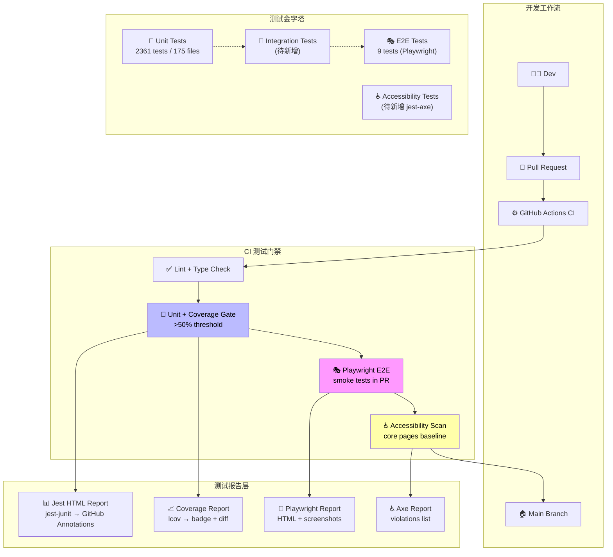
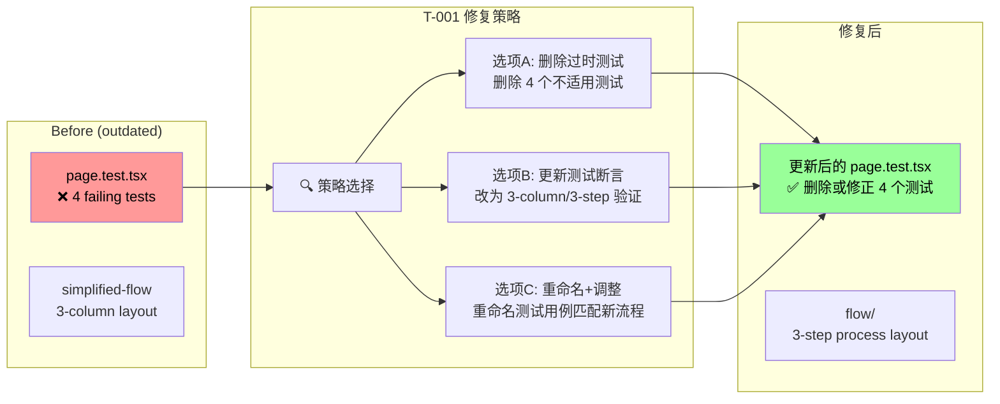
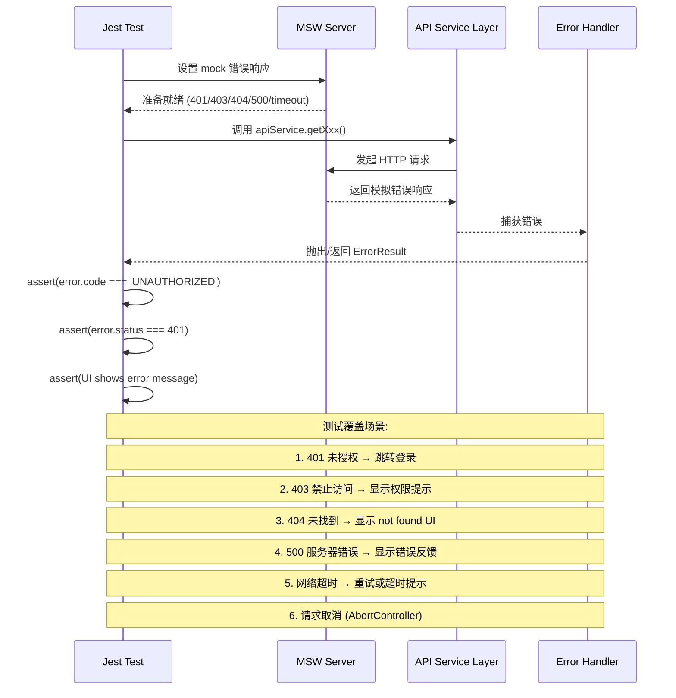
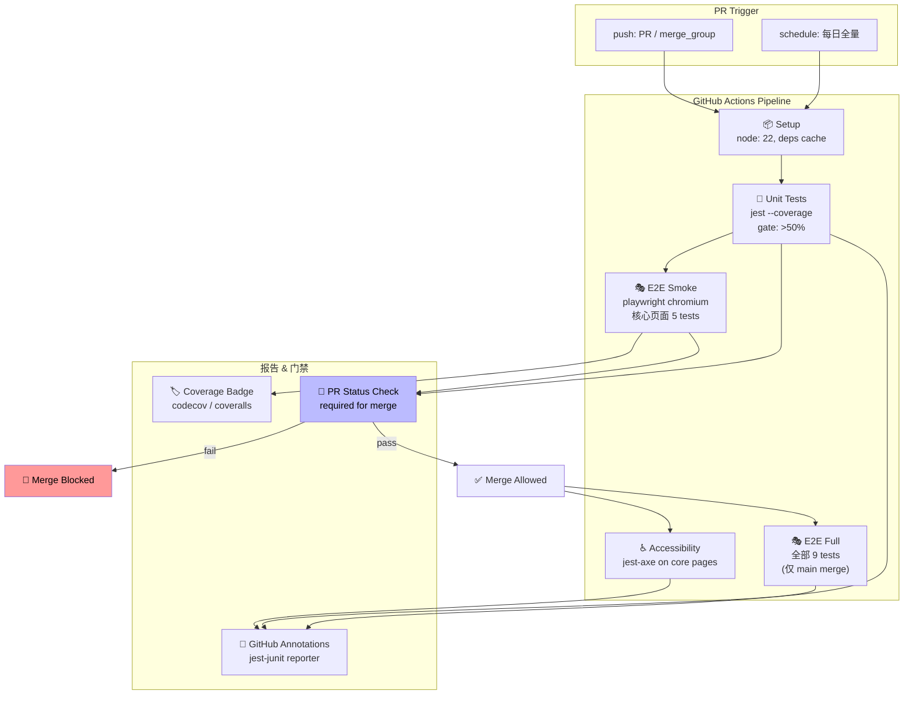
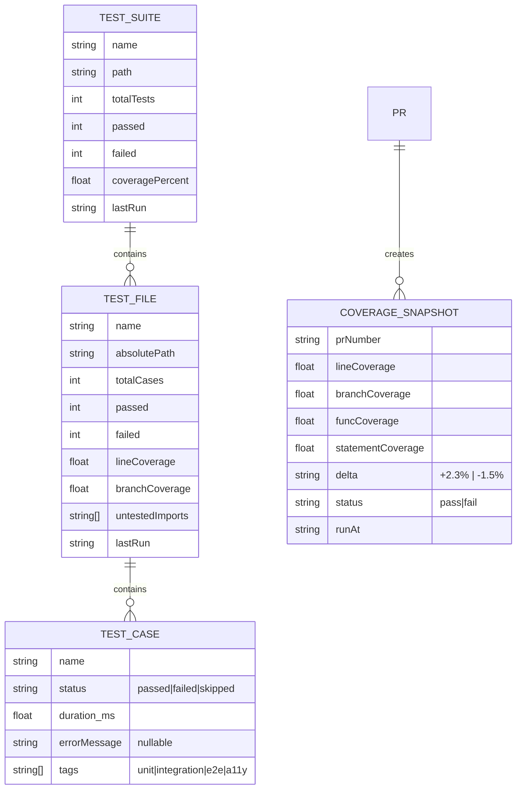

# 架构设计: VibeX 测试质量提升工程

**项目**: vibex-tester-proposals-20260324_185417
**版本**: 1.0
**日期**: 2026-03-24
**作者**: Architect Agent
**状态**: Proposed
**基于提案**: `/vibex/proposals/20260324/tester-proposals-20260324.md`

---

## 0. 执行摘要

本架构文档响应 tester agent 提交的 2026-03-24 自检报告，旨在系统化提升 VibeX 前端项目的测试质量。核心问题包括：4 个预存测试失败（T-001 P0）导致测试可信度持续受损、E2E 测试游离于 CI 之外（P1）、API 错误处理测试不完整（P1）、无 Accessibility 基线（P1）。本架构提出分阶段改进方案，目标覆盖率从 ~36% 提升至 >50%，并建立 CI 强制执行的测试门禁。

---

## 1. Tech Stack（技术栈选型）

### 1.1 当前测试技术栈

| 组件 | 当前版本 | 用途 |
|------|----------|------|
| **Jest** | ^30.2.0 | 单元测试与集成测试框架 |
| **React Testing Library** | ^16.3.2 | React 组件行为测试 |
| **Jest DOM** | ^6.9.1 | DOM 断言增强 |
| **User Event** | ^14.5.2 | 模拟真实用户交互 |
| **Playwright** | ^1.58.2 | E2E 浏览器自动化测试 |
| **MSW (Mock Service Worker)** | ^2.12.10 | API Mock 与服务拦截 |
| **Babel Jest** | ^30.2.0 | JSX/TS 编译转换 |
| **jest-environment-jsdom** | ^30.2.0 | JSDOM 测试环境 |

### 1.2 新增技术选型

| 组件 | 推荐版本 | 用途 | 选型理由 |
|------|----------|------|----------|
| **jest-axe** | ^3.5.0 | Accessibility 自动化检测 | 轻量集成 jest，无额外 CI 负担 |
| **@axe-core/playwright** | ^4.10.0 | Playwright E2E Accessibility | 与 Playwright 现有版本兼容 |
| **jest-junit** | ^13.2.0 | JUnit XML 测试报告 | 兼容 GitHub Actions、GitLab CI |
| **playwright-chromium** | ^1.58.2 | E2E 浏览器驱动 | 使用已有 Playwright 版本，避免冲突 |
| **Coverage Gate Action** | GitHub Action | 覆盖率门禁 | 开源、轻量、无需额外依赖 |

### 1.3 技术选型对比

#### jest-axe vs @axe-core/react

| 维度 | jest-axe | @axe-core/react |
|------|----------|-----------------|
| 集成方式 | Jest 断言 | React Component wrapper |
| CI 友好度 | ⭐⭐⭐⭐⭐ 直接在测试中 assert | ⭐⭐⭐ 需额外渲染 wrapper |
| 维护状态 | 活跃 (F.Khan 维护) | 活跃 (Deque Labs) |
| 规则集 | WCAG 2.1 A/AA | WCAG 2.1 A/AA + 最佳实践 |
| **推荐** | **✅ 方案 A** | 方案 B |

**结论**: 采用 **jest-axe**，集成成本最低，与现有 Jest 测试风格一致。

#### E2E CI 集成方案

| 方案 | 工具 | 优点 | 缺点 | 推荐度 |
|------|------|------|------|--------|
| **A: Playwright on GitHub Actions** | `@playwright/test` + `playwright-chromium` | 原生支持、并行执行 | 需配置 GitHub Actions secret | ⭐⭐⭐⭐⭐ |
| B: Cypress + GitHub Actions | Cypress | 生态成熟 | 需重写现有 9 个测试 | ⭐⭐⭐ |
| C: Puppeteer + CI | Puppeteer | 轻量 | 需重新实现 E2E 测试 | ⭐⭐ |

**结论**: 采用 **方案 A**，复用现有 Playwright 测试资产，仅需 CI 配置。

---

## 2. Architecture Diagram（Mermaid 架构图）

### 2.1 整体测试架构



### 2.2 T-001 修复：预存失败重构方案



### 2.3 API 错误处理测试架构（对应 T-002）



### 2.4 E2E CI 集成架构（对应 T-003）



---

## 3. Key API / 接口定义

### 3.1 测试工具层 API

#### `src/test-utils/api-mock.ts` — API Mock 工厂

```typescript
// 新增 / 扩展
interface MockErrorConfig {
  status: 401 | 403 | 404 | 500 | 502 | 503 | 504;
  delay?: number;          // 模拟网络延迟 (ms)，默认 100-500 随机
  errorCode?: string;      // 业务错误码
  message?: string;        // 错误消息
}

interface MockSuccessConfig {
  data: unknown;
  delay?: number;
}

/**
 * MSW handler 工厂：根据错误配置生成标准化的错误响应
 * 用于 T-002 API 错误处理测试
 */
export function createErrorHandler(
  method: 'GET' | 'POST' | 'PUT' | 'DELETE',
  url: string,
  config: MockErrorConfig
): HttpHandler;

export function createSuccessHandler(
  method: 'GET' | 'POST' | 'PUT' | 'DELETE',
  url: string,
  config: MockSuccessConfig
): HttpHandler;

/**
 * 网络超时模拟 (T-002 场景5)
 */
export function createTimeoutHandler(
  method: 'GET' | 'POST',
  url: string
): HttpHandler;

/**
 * 请求取消模拟 (T-002 场景6: AbortController)
 */
export function createCancelledHandler(
  method: 'GET' | 'POST',
  url: string
): HttpHandler;

/**
 * 一键启动/关闭 MSW 服务
 */
export async function setupMockServer(): Promise<void>;
export async function teardownMockServer(): Promise<void>;
```

#### `src/test-utils/a11y-checker.ts` — Accessibility 快速检查

```typescript
// 新增
import type { AxeResults } from 'axe-core';

/**
 * 对给定 React 组件执行 axe-core accessibility 扫描
 * 用于 T-005 Accessibility 基线建立
 */
export async function runA11yCheck(
  ui: RenderResult,        // React Testing Library 的 render 结果
  context?: AxeRunnableContext  // 可选：限定扫描范围
): Promise<AxeResults>;

/**
 * 在 Playwright E2E 中执行 accessibility 扫描
 * 用于 T-005 E2E 场景
 */
export async function runPlaywrightA11yCheck(
  page: Page
): Promise<AxeResults>;

/**
 * 预设：核心页面列表（用于建立基线）
 */
export const CORE_PAGES: string[] = [
  '/confirm',
  '/flow',
  '/dashboard',
  '/login',
  '/settings'
];

/**
 * WCAG 合规性断言辅助函数
 * assertA11yPass(ui, { standard: 'WCAG2AA' })
 */
export async function assertA11yPass(
  ui: RenderResult,
  options?: { standard?: 'WCAG2A' | 'WCAG2AA'; verbose?: boolean }
): Promise<void>;
```

#### `src/test-utils/test-data.ts` — 测试数据工厂（对应 T-004）

```typescript
// 扩展现有 mock 数据，提升真实性
export interface MockUser {
  id: string;
  name: string;
  email: string;
  role: 'admin' | 'member' | 'viewer';
  avatar?: string;
}

/**
 * 生成符合业务规则的测试用户数据
 * 替代硬编码的 mock user 对象
 */
export function createMockUser(overrides?: Partial<MockUser>): MockUser;

export function createMockUsers(count: number): MockUser[];

export interface MockProject {
  id: string;
  name: string;
  status: 'active' | 'archived' | 'draft';
  ownerId: string;
  members: string[];
  createdAt: string;
  updatedAt: string;
}

export function createMockProject(overrides?: Partial<MockProject>): MockProject;
```

### 3.2 服务层错误处理接口

#### `src/services/api.ts` — API 错误类型定义

```typescript
// 新增错误类型枚举（T-002 核心类型）
export enum ApiErrorCode {
  UNAUTHORIZED        = 'UNAUTHORIZED',         // 401
  FORBIDDEN           = 'FORBIDDEN',            // 403
  NOT_FOUND           = 'NOT_FOUND',            // 404
  SERVER_ERROR        = 'SERVER_ERROR',         // 500
  BAD_GATEWAY         = 'BAD_GATEWAY',          // 502
  SERVICE_UNAVAILABLE = 'SERVICE_UNAVAILABLE',  // 503
  TIMEOUT             = 'TIMEOUT',              // 网络超时
  NETWORK_ERROR       = 'NETWORK_ERROR',        // 网络断开
  CANCELLED           = 'CANCELLED',            // AbortController 取消
  UNKNOWN             = 'UNKNOWN'
}

export interface ApiError {
  code: ApiErrorCode;
  status: number;
  message: string;
  details?: Record<string, unknown>;
  timestamp: string;
}

/**
 * API 层统一错误处理签名
 * 需要为每个服务方法补充完整的错误处理测试
 */
export interface ApiService<T> {
  get(id: string): Promise<T>;
  list(params?: QueryParams): Promise<PaginatedResult<T>>;
  create(data: Partial<T>): Promise<T>;
  update(id: string, data: Partial<T>): Promise<T>;
  delete(id: string): Promise<void>;
}

// 测试覆盖要求：每个服务方法 × 每个错误码 = 完整覆盖矩阵
```

---

## 4. Data Model（数据模型）

### 4.1 测试覆盖率数据模型



### 4.2 测试结果报告数据模型

```typescript
// src/types/test-report.ts

export interface TestSuiteReport {
  name: string;
  path: string;
  duration: number;           // ms
  status: 'passed' | 'failed' | 'skipped';
  testCount: {
    total: number;
    passed: number;
    failed: number;
    skipped: number;
    todo: number;
  };
  coverage?: CoverageSummary;
  timestamp: string;
}

export interface CoverageSummary {
  lines: { total: number; covered: number; pct: number };
  statements: { total: number; covered: number; pct: number };
  functions: { total: number; covered: number; pct: number };
  branches: { total: number; covered: number; pct: number };
  uncoveredLines?: number[];  // 用于 PR 评论标注
}

export interface PRCoverageGate {
  prNumber: number;
  baseline: CoverageSummary;    // main 分支基准
  current: CoverageSummary;     // PR 分支当前
  delta: CoverageSummary;       // 变化量
  pass: boolean;
  requiredPct: number;          // 默认 50%
  messages: string[];           // gate 结果消息
}

export interface A11yViolation {
  id: string;
  impact: 'critical' | 'serious' | 'moderate' | 'minor';
  description: string;
  helpUrl: string;
  nodes: { selector: string; html: string }[];
  wcagCriterion: string;
}

export interface A11yReport {
  pageUrl: string;
  timestamp: string;
  violations: A11yViolation[];
  passCount: number;
  totalNodes: number;
  violationsByImpact: Record<string, number>;
}
```

### 4.3 E2E 测试报告数据模型

```typescript
export interface E2ETestReport {
  runId: string;
  browser: 'chromium' | 'firefox' | 'webkit';
  headless: boolean;
  startedAt: string;
  completedAt: string;
  duration: number;
  tests: E2ETestResult[];
  summary: {
    total: number;
    passed: number;
    failed: number;
    flaky: number;
  };
  screenshots?: { testName: string; path: string; takenOn: 'failure' | 'always' }[];
  videos?: { testName: string; path: string }[];
}

export interface E2ETestResult {
  title: string[];
  status: 'passed' | 'failed' | 'skipped' | 'timedOut';
  duration: number;
  error?: { message: string; stack?: string };
  retries: number;
  attachments?: { name: string; path: string; contentType: string }[];
}
```

---

## 5. Testing Strategy（测试策略）

### 5.1 分层测试策略总览

| 层级 | 工具 | 目标数量 | 覆盖率目标 | CI 门禁 | 对应提案问题 |
|------|------|----------|-----------|---------|-------------|
| **Unit** | Jest + RTL | 2400+ tests | >50% | ✅ 是 | T-002 API 错误处理 |
| **Integration** | Jest + MSW | 50+ tests | >40% | ✅ 是 | T-004 Mock 数据质量 |
| **E2E Smoke** | Playwright | 5 tests | N/A | ✅ 是 | T-003 E2E CI 集成 |
| **E2E Full** | Playwright | 9 tests | N/A | ❌ 否(仅main) | T-003 |
| **Accessibility** | jest-axe + @axe-core/playwright | 15 tests | N/A | ✅ 是 | T-005 |

### 5.2 T-001 修复策略：预存失败清零

**根因**: `simplified-flow` 重构后布局从 5 栏 → 3 步流程，但 `page.test.tsx` 中 4 个测试用例仍断言 5 栏和导航结构。

**修复方案** — 采用选项 B（更新测试断言）+ 选项 C（重命名匹配新流程）混合策略：

```
修复步骤:
1. 读取 page.test.tsx，定位 4 个失败测试
2. 分析每个测试对应的功能:
   - three-column layout  →  改为 three-step flow layout
   - navigation           →  更新导航项断言（移除旧流程入口）
   - five process steps   →  更新为 three process steps
   - basic elements       →  更新选择器（删除旧栏位元素）
3. 使用 getByRole/ByLabel 更新查询选择器
4. 同步更新 snapshot（如使用）
5. 运行 jest 验证全部通过
6. 提交 PR，附带 diff 说明
```

**验收标准**:
- `jest` 运行后，page.test.tsx 全部通过（4 → 0 failures）
- `jest --coverage` 整体通过率保持 99.96%+

### 5.3 T-002 实施策略：API 错误处理测试矩阵

**目标**: 为 `src/services/api.ts` 的每个方法补充错误边界测试。

**测试矩阵** (6 场景 × N 服务方法):

```
场景\方法  get()    list()   create()  update()  delete()
---------------------------------------------------------------
401 未授权   ✅       ✅        ✅        ✅        ✅
403 禁止     ✅       ✅        ✅        ✅        ✅
404 未找到   ✅       ✅        ✅        ✅        ✅
500 服务错   ✅       ✅        ✅        ✅        ✅
网络超时     ✅       ✅        -        -        -
请求取消     ✅       ✅        -        -        -
```

**测试用例示例** (`src/services/api.error.test.ts`):

```typescript
import { setupMockServer, createErrorHandler } from '@/test-utils/api-mock';
import { ApiErrorCode } from '@/services/api';

describe('API Error Handling', () => {
  let server: setupServer;

  beforeAll(() => {
    server = setupServer();
  });

  afterAll(() => {
    server.close();
  });

  describe('get() - 401 Unauthorized', () => {
    it('should throw ApiError with code UNAUTHORIZED on 401', async () => {
      server.use(
        createErrorHandler('GET', '/api/v1/project/:id', {
          status: 401,
          errorCode: 'UNAUTHORIZED',
          message: 'Invalid or expired token'
        })
      );

      await expect(apiService.get('project-1')).rejects.toMatchObject({
        code: ApiErrorCode.UNAUTHORIZED,
        status: 401
      });
    });
  });

  describe('get() - Network Timeout', () => {
    it('should throw ApiError with code TIMEOUT on request timeout', async () => {
      server.use(
        createTimeoutHandler('GET', '/api/v1/project/:id')
      );

      await expect(apiService.get('project-1')).rejects.toMatchObject({
        code: ApiErrorCode.TIMEOUT
      });
    });
  });

  describe('list() - Request Cancellation', () => {
    it('should handle AbortController cancellation gracefully', async () => {
      const controller = new AbortController();
      controller.abort();

      await expect(
        apiService.list({ signal: controller.signal })
      ).rejects.toMatchObject({
        code: ApiErrorCode.CANCELLED
      });
    });
  });
});
```

### 5.4 T-003 实施策略：Playwright E2E CI 集成

**GitHub Actions Workflow** (`.github/workflows/e2e.yml`):

```yaml
name: E2E Tests

on:
  pull_request:
    paths-ignore:
      - '**.md'
      - 'docs/**'
  push:
    branches: [main]

jobs:
  # Smoke tests: 在每个 PR 中运行（5 个核心测试，快速 ~3min）
  e2e-smoke:
    runs-on: ubuntu-latest
    if: github.event_name == 'pull_request'
    steps:
      - uses: actions/checkout@v4
      - uses: actions/setup-node@v4
        with:
          node-version: '22'
          cache: 'pnpm'
      - run: pnpm install --frozen-lockfile
      - run: pnpm playwright install chromium --with-deps
      - name: Run smoke tests
        run: pnpm playwright test tests/e2e/smoke/*.spec.ts
        env:
          BASE_URL: ${{ secrets.STAGING_URL }}
      - uses: actions/upload-artifact@v4
        if: failure()
        with:
          name: playwright-report-smoke
          path: playwright-report/

  # Full tests: 仅在 main 分支合并时运行（全部 9 个测试）
  e2e-full:
    runs-on: ubuntu-latest
    if: github.event_name == 'push' && github.ref == 'refs/heads/main'
    steps:
      - uses: actions/checkout@v4
      - uses: actions/setup-node@v4
        with:
          node-version: '22'
          cache: 'pnpm'
      - run: pnpm install --frozen-lockfile
      - run: pnpm playwright install --with-deps
      - run: pnpm playwright test
      - uses: actions/upload-artifact@v4
        with:
          name: playwright-report-full
          path: playwright-report/
```

**Smoke 测试子集** (5 个核心测试, 对应关键用户路径):

```typescript
// tests/e2e/smoke/user-flows.spec.ts
const SMOKE_TESTS = [
  'login.spec.ts',          // 登录流程
  'project-create.spec.ts', // 创建项目
  'dashboard-load.spec.ts', // Dashboard 加载
  'navigation.spec.ts',     // 全局导航
  'basic-interaction.spec.ts' // 基础交互
];
```

### 5.5 T-005 实施策略：Accessibility 测试基线

**核心页面 Accessibility 测试** (`src/__tests__/a11y/`):

```typescript
// src/__tests__/a11y/core-pages.test.tsx
import { assertA11yPass, CORE_PAGES } from '@/test-utils/a11y-checker';
import { renderApp } from '@/test-utils/render';

describe('Accessibility Baseline - Core Pages', () => {
  for (const pagePath of CORE_PAGES) {
    describe(`/${pagePath}`, () => {
      it(`should pass WCAG 2.1 AA standards`, async () => {
        const result = renderApp({ initialPath: `/${pagePath}` });
        await waitForLoading();

        await assertA11yPass(result, { standard: 'WCAG2AA' });
      });
    });
  }
});
```

**Playwright Accessibility 测试** (E2E 层):

```typescript
// tests/e2e/a11y.spec.ts
import { test, expect } from '@playwright/test';
import AxeBuilder from '@axe-core/playwright';

test.describe('Accessibility E2E', () => {
  const corePages = ['/confirm', '/flow', '/dashboard'];

  for (const page of corePages) {
    test(`${page} should have no critical accessibility violations`, async ({ page: pw }) => {
      await pw.goto(page);

      const results = await new AxeBuilder({ page })
        .withTags(['wcag2a', 'wcag2aa'])
        .analyze();

      const criticalViolations = results.violations
        .filter(v => v.impact === 'critical' || v.impact === 'serious');

      expect.soft(criticalViolations, `${page} critical violations`).toHaveLength(0);

      if (criticalViolations.length > 0) {
        console.log('Violations:', JSON.stringify(criticalViolations, null, 2));
      }
    });
  }
});
```

### 5.6 覆盖率门禁策略

**覆盖率基线建立**:

```yaml
# .github/workflows/test.yml (补充)
- name: Check Coverage
  run: |
    pnpm jest --coverage --coverageReporters="lcov" "text-summary"
    node scripts/coverage-gate.js --threshold=50
  env:
    COVERAGE_THRESHOLD: 50
    COVERAGE_BASELINE_FILE: coverage/baseline.json
```

**覆盖率门禁规则**:

| 指标 | 当前值 | 基线目标 | 冲刺目标 (4周) |
|------|--------|----------|---------------|
| 文件覆盖率 | ~36% (175/481) | >50% | >60% |
| 行覆盖率 | - | >50% | >60% |
| 分支覆盖率 | - | >40% | >50% |
| 函数覆盖率 | - | >50% | >60% |
| E2E 覆盖率 | 0% (不在CI) | 100% smoke | 100% full |

---

## 6. Implementation Constraints（实施约束）

### 6.1 硬约束

1. **不破坏现有测试通过率**: 所有修改必须保证 `jest` 整体通过率 ≥ 99.96%
2. **向后兼容**: MSW 升级必须兼容现有 2361 个测试，不能改变已有 mock 行为
3. **CI 时间预算**: PR 门禁总时长 ≤ 10 分钟（单元测试 5min + E2E smoke 3min + a11y 2min）
4. **Playwright 浏览器限制**: 仅使用 chromium，避免 Firefox/WebKit 额外 CI 负载

### 6.2 技术债务约束

1. **渐进式覆盖率提升**: 不允许为了提高覆盖率而添加无效测试（assert 1=1 类）
2. **测试独立性**: 每个测试必须独立运行，不依赖执行顺序或共享状态
3. **Mock 真实性**: T-004 要求所有 mock 数据必须反映真实业务规则，禁止硬编码随机字符串

### 6.3 组织约束

1. **PR 必须包含测试**: 所有功能 PR 必须包含对应测试，否则 CI 失败
2. **T-001 优先于其他**: T-001（P0）必须在 T-002/003/005 之前完成，消除预存失败的持续干扰
3. **覆盖率 diff 审查**: 当 PR 覆盖率下降 >1% 时，必须由 reviewer 人工审批

---

## 7. ADR（架构决策记录）

### ADR-001: 采用 jest-axe 作为 Accessibility 测试工具

**状态**: Proposed

**背景**:
VibeX 项目目前没有任何 WCAG 合规性自动化检测（对应 T-005）。需要在不显著增加 CI 负担的前提下，建立 Accessibility 测试基线。

**选项**:

- **选项 A: jest-axe** — 在现有 Jest 测试中集成 axe-core，通过 `expect.extend` 断言
- **选项 B: @axe-core/react** — 在 React 组件中嵌入 `<A11y>` wrapper 组件
- **选项 C: Playwright + @axe-core/playwright** — 在 E2E 层做 accessibility 扫描
- **选项 D: Lighthouse CI** — 独立运行 lighthouse accessibility audit

**决策**: 采用 **选项 A + 选项 C 混合策略**

- Jest 层（单元/集成）: 使用 `jest-axe`，覆盖核心组件渲染场景
- E2E 层: 使用 `@axe-core/playwright`，覆盖真实浏览器交互场景

**理由**:
1. `jest-axe` 与现有 Jest 测试风格一致，无需改变测试文件结构
2. Playwright E2E 测试已存在，添加 axe 扫描成本极低（每测试 <500ms）
3. Lighthouse CI 需要独立的 HTTP server，增加 CI 配置复杂度
4. 两层覆盖互补：单元层快速反馈，E2E 层真实环境验证

**后果**:
- ✅ 统一的 accessibility 测试语言（WCAG 2.1 AA 标准集）
- ✅ 每个 PR 的核心页面自动检测 violation
- ⚠️ 新增 ~15 个测试用例，jest 运行时间 +30s（可接受）
- ⚠️ 需要为 `CORE_PAGES` 列表维护更新（新增页面时自动纳入）

---

### ADR-002: E2E 测试采用 PR smoke + main full 分级策略

**状态**: Proposed

**背景**:
VibeX 有 9 个 Playwright E2E 测试，但游离于 CI 之外（T-003）。需要将其纳入 CI，但全部运行成本高（~10-15min），会影响开发体验。

**选项**:

- **选项 A: 每个 PR 运行全部 9 个 E2E 测试** — 最大保障但 PR 等待时间过长
- **选项 B: 每个 PR 运行 5 个 smoke 测试，main 分支运行全部 9 个** — 平衡速度与覆盖
- **选项 C: 仅在 main 合并时运行，PR 仅运行单元测试** — 风险高，regression 延迟暴露

**决策**: 采用 **选项 B**

**理由**:
1. 5 个 smoke 测试覆盖最关键用户路径（登录、创建项目、导航、Dashboard、基础交互）
2. PR 反馈时间控制在 3 分钟内，不影响开发流
3. main 分支全量运行确保 release 质量
4. GitHub Actions `if: github.event_name == 'pull_request'` 天然支持分级

**后果**:
- ✅ PR CI 时间从 ~0min → ~3min（可接受增量）
- ✅ 关键功能回归在 PR 阶段即可发现
- ⚠️ smoke 未覆盖的 4 个测试仅在 main 运行时覆盖，PR 存在盲区
- ⚠️ 需要维护 smoke 列表与 full 列表的同步

---

### ADR-003: 覆盖率门禁阈值与渐进提升路径

**状态**: Proposed

**背景**:
当前文件覆盖率 ~36%，目标 >50%。需要制定合理的覆盖率门槛策略，既能推动改进，又不至于阻断正常开发。

**决策**:
- PR 门禁阈值: **50%**（4 周内可达）
- 季度目标: **60%**（覆盖核心业务逻辑）
- 关键路径: **70%**（用户旅程关键节点）

**理由**:
1. 50% 阈值是 Industry Standard (ISTQB) 最低建议
2. 过高的阈值（如 80%）会导致团队绕过测试设计原则（添加无效测试）
3. 分阶段目标提供可见的进度感

**后果**:
- ✅ 建立量化质量标准，PR 门禁有据可依
- ⚠️ 需要维护 baseline.json，当项目规模变化时动态调整
- ⚠️ 新增文件初期可能拉低覆盖率，需制定豁免规则（如 `*.d.ts`）

---

## 8. 验收标准表格

| ID | 验收项 | 成功条件 | 验证方法 | 对应提案项 | 优先级 | 预估工时 |
|----|--------|----------|----------|-----------|--------|---------|
| AC-01 | T-001 修复完成 | `jest page.test.tsx` 0 failures | `jest --testPathPattern=page.test.tsx` | T-001 | P0 | 1h |
| AC-02 | 整体测试通过率 | ≥ 99.96% | `jest --silent` | T-001 | P0 | 验证 |
| AC-03 | API 错误处理测试 | 6 场景 × 5 方法 = 30 个新测试用例 | `jest --testPathPattern=api.error` | T-002 | P1 | 2h |
| AC-04 | API 401/403 覆盖 | 每个服务方法有 401 和 403 测试 | Jest coverage report | T-002 | P1 | 0.5h |
| AC-05 | E2E CI smoke 集成 | PR 触发 5 个 Playwright smoke 测试 | GitHub Actions logs | T-003 | P1 | 1h |
| AC-06 | E2E CI full 集成 | main 合并触发全部 9 个 Playwright 测试 | GitHub Actions logs | T-003 | P1 | 1h |
| AC-07 | Coverage Gate | 覆盖率 <50% 时 PR merge 被阻止 | PR merge 尝试 | T-003 | P1 | 1h |
| AC-08 | 文件覆盖率提升 | >50% (当前 ~36%) | `jest --coverage` lcov | 全局 | P1 | 持续 |
| AC-09 | Accessibility 基线 | 5 个核心页面有 jest-axe 测试 | `jest --testPathPattern=a11y` | T-005 | P1 | 2h |
| AC-10 | E2E Accessibility | Playwright + @axe-core 对 3 页面扫描 | `playwright test a11y.spec.ts` | T-005 | P1 | 1h |
| AC-11 | Mock 数据工厂 | 统一使用 test-data 工厂生成 mock | `grep -r "createMockUser"` | T-004 | P2 | 2h |
| AC-12 | 测试报告通知 | 失败时自动通知到 #test 频道 | Slack webhook logs | 全局 | P2 | 1h |

---

## 9. 实施路线图

### Phase 1: 紧急修复（P0，第 1 周）

```
Day 1: 修复 T-001
  ├── 定位 page.test.tsx 4 个失败测试
  ├── 分析 simplified-flow 重构影响
  ├── 更新或删除过时测试
  └── 验证: jest page.test.tsx → 0 failures

Day 2-3: 建立覆盖率基线
  ├── 配置 jest-junit 输出
  ├── 建立 baseline.json
  └── 验证: coverage-gate 脚本可用
```

### Phase 2: CI 集成（P1，第 2-3 周）

```
Week 2: E2E CI 集成
  ├── 创建 .github/workflows/e2e.yml
  ├── 配置 Playwright chromium
  ├── 定义 smoke 测试子集 (5 tests)
  └── 验证: PR 触发 smoke，main 触发 full

Week 3: Coverage Gate + A11y
  ├── 集成 jest-axe
  ├── 创建 a11y/core-pages.test.tsx
  ├── 配置覆盖率门禁脚本
  └── 验证: PR <50% 覆盖率被阻止
```

### Phase 3: 质量提升（P2，第 4+ 周）

```
Week 4+: 持续改进
  ├── T-002: API 错误处理测试矩阵
  ├── T-004: Mock 数据工厂化
  └── T-006: 测试报告自动化通知
```

---

## 10. 风险与缓解

| 风险 | 影响 | 概率 | 缓解措施 |
|------|------|------|---------|
| T-001 修复引入新失败 | 高 | 中 | 修复前先备份，先验证再提交 |
| 覆盖率提升速率不及预期 | 中 | 中 | 分阶段目标（50% → 60%），允许临时豁免 |
| E2E CI flaky tests | 高 | 高 | Playwright retry + flaky 标记 + 独立 job |
| MSW 升级 breaking change | 中 | 低 | 先在 CI 环境测试，不更新现有 mock |
| Playwright 浏览器兼容性问题 | 低 | 低 | 仅用 chromium，避免多浏览器维护成本 |

---

*Architect Agent | 2026-03-24*
