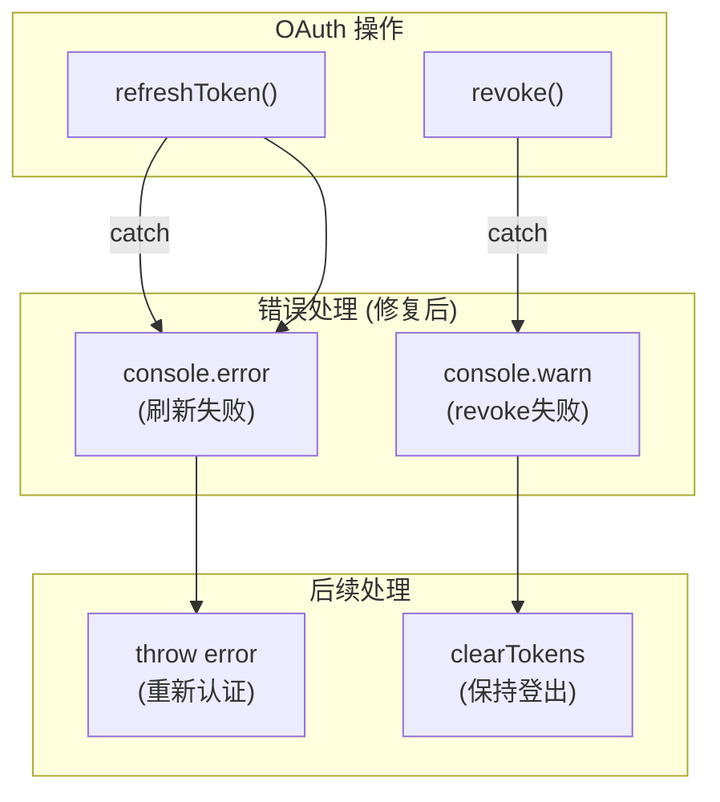

# 架构设计: OAuth 安全修复

**项目**: vibex-secure-storage-fix  
**架构师**: Architect Agent  
**日期**: 2026-03-20

---

## 1. 问题分析

| 问题 | 空 catch 块导致 OAuth 错误被静默吞掉 |
|------|------|
| 影响 1 | 刷新 token 失败时用户无感知 → 认证静默失效 |
| 影响 2 | revoke 失败可能导致 token 泄露 |
| 根因文件 | `src/lib/auth/oauth.ts` |

---

## 2. 修复方案

### 2.1 刷新 token 错误处理

```typescript
// 当前代码（有漏洞）
async refreshToken(): Promise<void> {
  try {
    // ... 刷新逻辑
  } catch (error) {
    // 空 catch — 错误被吞掉
  }
}

// 修复后
async refreshToken(): Promise<void> {
  try {
    // ... 刷新逻辑
  } catch (error) {
    console.error('[OAuth] Token refresh failed:', {
      provider: this.provider,
      error: error instanceof Error ? error.message : String(error),
      timestamp: new Date().toISOString(),
    });
    // 业务逻辑不变：刷新失败后用户需要重新登录
    throw error; // 重新抛出，让上层处理
  }
}
```

### 2.2 revoke 错误处理

```typescript
// 当前代码（有漏洞）
async revoke(): Promise<void> {
  try {
    // ... revoke 逻辑
  } catch (error) {
    // 空 catch — 错误被忽略
  }
}

// 修复后
async revoke(): Promise<void> {
  try {
    // ... revoke 逻辑
  } catch (error) {
    console.warn('[OAuth] Token revoke failed (登出不阻塞):', {
      provider: this.provider,
      error: error instanceof Error ? error.message : String(error),
      timestamp: new Date().toISOString(),
    });
    // 注意：revoke 失败不阻止登出流程（用户体验优先）
    // 但记录日志以便安全审计
  }
  // 继续执行登出（不清除本地状态，保持在未登录态）
  await this.clearTokens();
  return;
}
```

---

## 3. 架构图



---

## 4. 测试策略

```typescript
// __tests__/oauth.test.ts

describe('OAuth Error Handling', () => {
  it('F1.1: refreshToken catches and logs errors', async () => {
    const oauth = new OAuthProvider('google');
    const consoleSpy = vi.spyOn(console, 'error').mockImplementation(() => {});
    
    // mock fetch 抛出错误
    global.fetch = vi.fn().mockRejectedValue(new Error('Network error'));
    
    await expect(oauth.refreshToken()).rejects.toThrow();
    expect(consoleSpy).toHaveBeenCalledWith(
      '[OAuth] Token refresh failed:',
      expect.objectContaining({
        provider: 'google',
        error: expect.any(String),
      })
    );
    
    consoleSpy.mockRestore();
  });

  it('F1.2: revoke logs warnings but does not block logout', async () => {
    const oauth = new OAuthProvider('google');
    const consoleSpy = vi.spyOn(console, 'warn').mockImplementation(() => {});
    
    global.fetch = vi.fn().mockRejectedValue(new Error('Network error'));
    
    // revoke 不应抛出
    await expect(oauth.revoke()).resolves.not.toThrow();
    expect(consoleSpy).toHaveBeenCalledWith(
      '[OAuth] Token revoke failed',
      expect.objectContaining({ provider: 'google' })
    );
    
    consoleSpy.mockRestore();
  });
});
```

---

## 5. 安全审计日志（可选增强）

```typescript
// 如果需要更严格的安全日志
async refreshToken(): Promise<void> {
  try {
    // ...
  } catch (error) {
    const auditLog = {
      event: 'OAUTH_REFRESH_FAILED',
      provider: this.provider,
      errorMessage: error instanceof Error ? error.message : 'Unknown',
      userId: this.userId,
      ip: req?.headers?.['x-forwarded-for'],
      timestamp: new Date().toISOString(),
    };
    
    // 如果有审计日志服务
    if (auditLogger) {
      await auditLogger.log(auditLog);
    }
    
    console.error('[OAuth] Token refresh failed:', auditLog);
    throw error;
  }
}
```

---

## 6. 实施计划

```
Step 1: 定位 oauth.ts 中的空 catch 块（2个）
Step 2: 添加 console.error 到 refreshToken catch 块
Step 3: 添加 console.warn 到 revoke catch 块
Step 4: 添加单元测试
Step 5: npm run build 验证
```

**工作量**: 0.5 天

---

*Generated by: Architect Agent*
