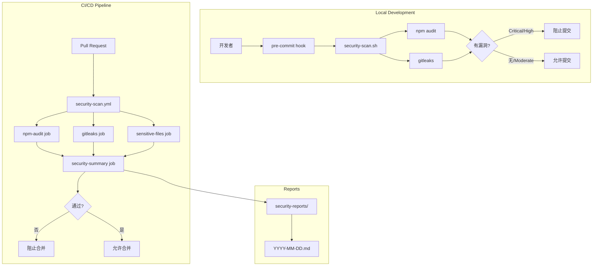
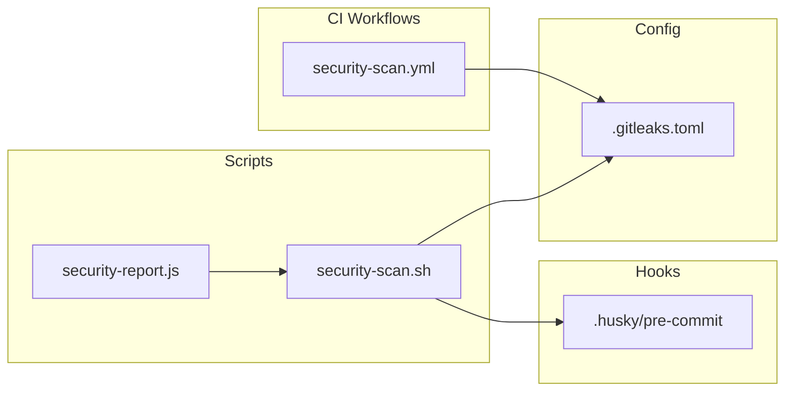
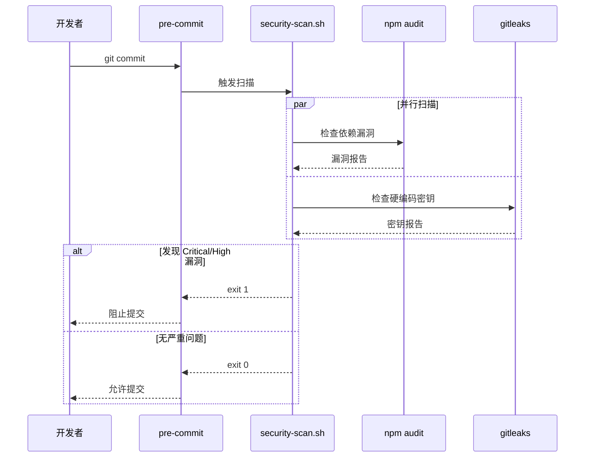
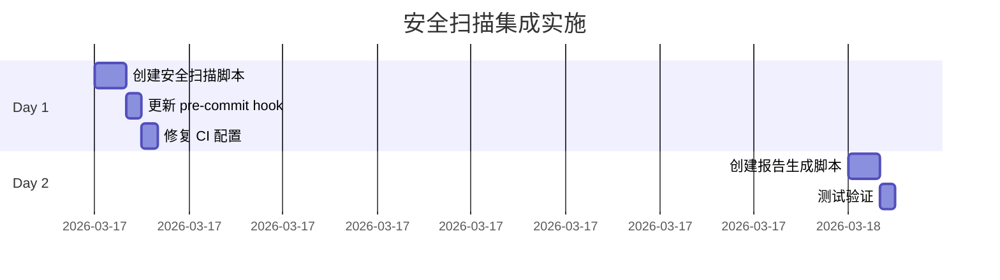

# 安全漏洞自动检测集成架构设计

**项目**: vibex-security-auto-detect  
**架构师**: Architect Agent  
**日期**: 2026-03-17  
**状态**: ✅ 设计完成

---

## 一、技术栈

| 技术 | 版本 | 用途 |
|------|------|------|
| npm audit | 内置 | 依赖漏洞扫描 |
| gitleaks | v8.x | 硬编码密钥检测 |
| GitHub Actions | - | CI 安全扫描 |
| husky | v8.x | Git hooks 管理 |
| shell script | bash | 本地扫描脚本 |

---

## 二、架构图

### 2.1 安全扫描流水线



### 2.2 组件依赖关系



### 2.3 扫描流程详解



---

## 三、核心组件设计

### 3.1 本地安全扫描脚本

**文件**: `scripts/security-scan.sh`

```bash
#!/bin/bash
# security-scan.sh - 安全漏洞扫描脚本
#
# 用法:
#   ./scripts/security-scan.sh           # 基本扫描
#   ./scripts/security-scan.sh --fix     # 自动修复
#   ./scripts/security-scan.sh --report  # 生成报告

set -e

# 颜色定义
RED='\033[0;31m'
GREEN='\033[0;32m'
YELLOW='\033[1;33m'
NC='\033[0m' # No Color

# 严重级别阈值
BLOCK_LEVEL="critical"  # critical/high 阻塞
WARN_LEVEL="moderate"   # moderate/low 警告

# 解析参数
FIX_MODE=false
REPORT_MODE=false
OUTPUT_FILE=""

while [[ $# -gt 0 ]]; do
    case $1 in
        --fix)
            FIX_MODE=true
            shift
            ;;
        --report)
            REPORT_MODE=true
            shift
            ;;
        --output)
            OUTPUT_FILE="$2"
            shift 2
            ;;
        *)
            echo "未知参数: $1"
            exit 1
            ;;
    esac
done

echo "🔍 开始安全扫描..."

# 1. npm audit
run_npm_audit() {
    echo ""
    echo "📦 检查依赖漏洞..."
    
    if [ "$FIX_MODE" = true ]; then
        npm audit fix
    fi
    
    # 获取漏洞统计
    AUDIT_OUTPUT=$(npm audit --json 2>/dev/null || echo '{}')
    CRITICAL=$(echo "$AUDIT_OUTPUT" | jq '.metadata.vulnerabilities.critical // 0')
    HIGH=$(echo "$AUDIT_OUTPUT" | jq '.metadata.vulnerabilities.high // 0')
    MODERATE=$(echo "$AUDIT_OUTPUT" | jq '.metadata.vulnerabilities.moderate // 0')
    LOW=$(echo "$AUDIT_OUTPUT" | jq '.metadata.vulnerabilities.low // 0')
    
    echo "  Critical: $CRITICAL"
    echo "  High: $HIGH"
    echo "  Moderate: $MODERATE"
    echo "  Low: $LOW"
    
    # 阻塞条件
    if [ "$CRITICAL" -gt 0 ] || [ "$HIGH" -gt 0 ]; then
        echo -e "${RED}❌ 发现 Critical/High 漏洞，请修复后再提交${NC}"
        return 1
    elif [ "$MODERATE" -gt 0 ]; then
        echo -e "${YELLOW}⚠️ 发现 Moderate 漏洞${NC}"
    else
        echo -e "${GREEN}✅ 依赖安全${NC}"
    fi
    
    return 0
}

# 2. gitleaks
run_gitleaks() {
    echo ""
    echo "🔐 检查硬编码密钥..."
    
    if ! command -v gitleaks &> /dev/null; then
        echo -e "${YELLOW}⚠️ gitleaks 未安装，跳过密钥检测${NC}"
        echo "安装: npm install -g gitleaks"
        return 0
    fi
    
    if gitleaks detect --source . --config .gitleaks.toml --no-git; then
        echo -e "${GREEN}✅ 未发现硬编码密钥${NC}"
        return 0
    else
        echo -e "${RED}❌ 发现硬编码密钥，请检查代码${NC}"
        return 1
    fi
}

# 3. 敏感文件检查
run_sensitive_files_check() {
    echo ""
    echo "📁 检查敏感文件..."
    
    # 检查 .env 文件
    SENSITIVE=$(git ls-files 2>/dev/null | grep -E '^\.env$' | grep -v '.env.example' || true)
    
    if [ -n "$SENSITIVE" ]; then
        echo -e "${RED}❌ 发现敏感 .env 文件被追踪:${NC}"
        echo "$SENSITIVE"
        return 1
    fi
    
    echo -e "${GREEN}✅ 未发现敏感文件${NC}"
    return 0
}

# 执行扫描
EXIT_CODE=0

run_npm_audit || EXIT_CODE=1
run_gitleaks || EXIT_CODE=1
run_sensitive_files_check || EXIT_CODE=1

# 生成报告
if [ "$REPORT_MODE" = true ]; then
    REPORT_DIR="security-reports"
    mkdir -p "$REPORT_DIR"
    REPORT_FILE="$REPORT_DIR/$(date +%Y-%m-%d).md"
    
    {
        echo "# 安全扫描报告"
        echo ""
        echo "**日期**: $(date '+%Y-%m-%d %H:%M:%S')"
        echo ""
        echo "## 漏洞统计"
        echo ""
        echo "| 级别 | 数量 |"
        echo "|------|------|"
        echo "| Critical | $CRITICAL |"
        echo "| High | $HIGH |"
        echo "| Moderate | $MODERATE |"
        echo "| Low | $LOW |"
        echo ""
        echo "## 扫描结果"
        echo ""
        if [ $EXIT_CODE -eq 0 ]; then
            echo "✅ 通过"
        else
            echo "❌ 需要修复"
        fi
    } > "$REPORT_FILE"
    
    echo ""
    echo "📄 报告已保存到: $REPORT_FILE"
fi

exit $EXIT_CODE
```

### 3.2 Pre-commit Hook 增强

**文件**: `.husky/pre-commit`

```bash
#!/usr/bin/env sh
. "$(dirname -- "$0")/_/husky.sh"

echo "🔒 执行 pre-commit 安全检查..."

# 运行安全扫描
./scripts/security-scan.sh

# 如果安全扫描失败，阻止提交
if [ $? -ne 0 ]; then
    echo ""
    echo "❌ 安全检查未通过，请修复后再提交"
    echo "💡 紧急情况可使用: git commit --no-verify"
    exit 1
fi

echo "✅ 安全检查通过"
```

### 3.3 CI Workflow 修复

**文件**: `.github/workflows/security-scan.yml` (修改)

```yaml
name: Security Scan

on:
  push:
    branches: [main, develop]
  pull_request:
    branches: [main, develop]

jobs:
  # F4.1: npm audit 集成
  npm-audit:
    runs-on: ubuntu-latest
    steps:
      - uses: actions/checkout@v4
      - uses: actions/setup-node@v4
        with:
          node-version: '20'
          cache: 'npm'
      - run: npm ci
      
      - name: Run npm audit
        id: audit
        run: |
          # 获取漏洞统计
          AUDIT_JSON=$(npm audit --json 2>/dev/null || echo '{}')
          CRITICAL=$(echo "$AUDIT_JSON" | jq '.metadata.vulnerabilities.critical // 0')
          HIGH=$(echo "$AUDIT_JSON" | jq '.metadata.vulnerabilities.high // 0')
          
          echo "critical=$CRITICAL" >> $GITHUB_OUTPUT
          echo "high=$HIGH" >> $GITHUB_OUTPUT
          
          # Critical/High 阻塞
          if [ "$CRITICAL" -gt 0 ] || [ "$HIGH" -gt 0 ]; then
            echo "❌ Found Critical/High vulnerabilities"
            npm audit
            exit 1
          fi
          
          # Moderate/Low 仅警告
          npm audit --audit-level=moderate || true

  # F4.2: 硬编码密钥检测
  gitleaks:
    runs-on: ubuntu-latest
    steps:
      - uses: actions/checkout@v4
        with:
          fetch-depth: 0
      - name: Run gitleaks
        uses: gitleaks/gitleaks-action@v2
        with:
          config-path: .gitleaks.toml

  # F4.3: 敏感文件检查
  sensitive-files:
    runs-on: ubuntu-latest
    steps:
      - uses: actions/checkout@v4
      - name: Check for sensitive files
        run: |
          SENSITIVE_FILES=$(git ls-files | grep -E '^\.env$' || true)
          if [ -n "$SENSITIVE_FILES" ]; then
            echo "❌ Found sensitive .env files:"
            echo "$SENSITIVE_FILES"
            exit 1
          fi
          echo "✅ No sensitive files detected"

  # F4.4: 安全扫描汇总
  security-summary:
    needs: [npm-audit, gitleaks, sensitive-files]
    runs-on: ubuntu-latest
    if: always()
    steps:
      - uses: actions/checkout@v4
      
      - name: Generate Security Report
        run: |
          mkdir -p security-reports
          {
            echo "# Security Scan Report"
            echo ""
            echo "**Date**: $(date '+%Y-%m-%d %H:%M:%S')"
            echo ""
            echo "## Scan Results"
            echo ""
            echo "| Check | Status |"
            echo "|-------|--------|"
            echo "| npm audit | ${{ needs.npm-audit.result }} |"
            echo "| gitleaks | ${{ needs.gitleaks.result }} |"
            echo "| sensitive-files | ${{ needs.sensitive-files.result }} |"
          } > security-reports/$(date +%Y-%m-%d).md
      
      - name: Upload Report
        uses: actions/upload-artifact@v4
        with:
          name: security-report
          path: security-reports/
      
      - name: Check Overall Status
        run: |
          if [ "${{ needs.npm-audit.result }}" = "failure" ] || \
             [ "${{ needs.gitleaks.result }}" = "failure" ] || \
             [ "${{ needs.sensitive-files.result }}" = "failure" ]; then
            echo "❌ Security scan failed"
            exit 1
          fi
          echo "✅ All security checks passed"
```

---

## 四、接口定义

### 4.1 扫描脚本接口

```bash
# 命令行接口
./scripts/security-scan.sh [OPTIONS]

OPTIONS:
  --fix       自动修复可修复的漏洞
  --report    生成安全报告
  --output    指定报告输出路径

EXIT CODES:
  0   扫描通过
  1   发现 Critical/High 漏洞
  2   脚本执行错误
```

### 4.2 报告格式

```markdown
# 安全扫描报告

**日期**: YYYY-MM-DD HH:MM:SS

## 漏洞统计

| 级别 | 数量 |
|------|------|
| Critical | N |
| High | N |
| Moderate | N |
| Low | N |

## 详细信息

[漏洞详情...]

## 扫描结果

✅ 通过 / ❌ 需要修复
```

---

## 五、测试策略

### 5.1 单元测试

| 测试项 | 方法 | 预期结果 |
|--------|------|----------|
| 脚本可执行 | `test -x scripts/security-scan.sh` | true |
| 参数解析 | `./scripts/security-scan.sh --help` | 显示帮助 |
| 漏洞检测 | 模拟有漏洞的 package.json | 返回非零 |

### 5.2 集成测试

```bash
# 测试 pre-commit hook
echo "HARDCODED_SECRET=abc123" > test.txt
git add test.txt
git commit -m "test"
# 预期: 被 hook 阻止

# 测试 CI 阻塞
# 创建 PR，检查 workflow 是否正确执行
```

### 5.3 验证命令

```bash
# 验证脚本存在
test -f scripts/security-scan.sh && chmod +x scripts/security-scan.sh

# 验证 pre-commit hook
grep "security-scan.sh" .husky/pre-commit

# 验证 CI 配置
grep -v "continue-on-error: true" .github/workflows/security-scan.yml | grep "exit 1"
```

---

## 六、部署计划

### 6.1 阶段划分



### 6.2 回滚方案

| 问题 | 回滚措施 |
|------|----------|
| 脚本执行失败 | 使用 `git commit --no-verify` 跳过 |
| CI 阻塞误报 | 临时添加 `continue-on-error: true` |
| gitleaks 未安装 | 脚本自动跳过密钥检测 |

---

## 七、验收标准

| ID | 验收标准 | 验证方法 |
|----|----------|----------|
| ARCH-001 | `scripts/security-scan.sh` 存在且可执行 | `test -x` |
| ARCH-002 | pre-commit hook 包含安全扫描 | `grep` |
| ARCH-003 | CI 无 `continue-on-error` (critical/high) | 文件检查 |
| ARCH-004 | 安全报告正确生成 | 运行脚本 |
| ARCH-005 | Critical/High 漏洞阻塞提交 | 模拟测试 |

---

## 八、产出物清单

| 文件 | 位置 | 状态 |
|------|------|------|
| 架构文档 | `docs/vibex-security-auto-detect/architecture.md` | ✅ 本文档 |
| 扫描脚本 | `scripts/security-scan.sh` | 📝 待创建 |
| pre-commit hook | `.husky/pre-commit` | 📝 待更新 |
| CI workflow | `.github/workflows/security-scan.yml` | 📝 待修改 |

---

**完成时间**: 2026-03-17 12:32  
**架构师**: Architect Agent