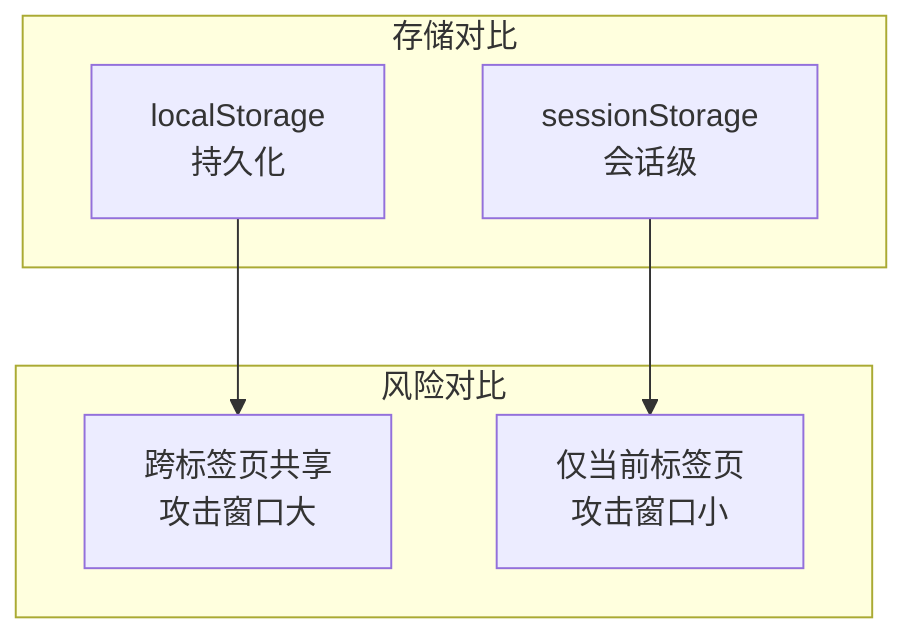

# Architecture: Auth Token 安全迁移

**项目**: vibex-xss-token-security  
**版本**: 1.0  
**架构师**: Architect  
**日期**: 2026-03-19

---

## 1. 问题概述

将认证令牌从 localStorage 迁移到 sessionStorage，消除 XSS 攻击风险。

---

## 2. 安全风险

```
攻击向量:
1. XSS 注入恶意脚本
2. document.cookie/localStorage 读取
3. 令牌传输到攻击者服务器
```

---

## 3. 架构图



---

## 4. 变更范围

| 模块 | 影响 | 说明 |
|------|------|------|
| auth.ts | 需修改 | 存储 API 变更 |
| useAuth hook | 需检查 | 依赖 localStorage |
| 登录组件 | 需测试 | 登录后验证 |

---

## 5. 实现变更

```typescript
// Before
localStorage.setItem('auth_token', token);
localStorage.getItem('auth_token');

// After
sessionStorage.setItem('auth_token', token);
sessionStorage.getItem('auth_token');
```

---

## 6. 验收标准

| 标准 | 验证方式 |
|------|----------|
| 令牌存储在 sessionStorage | DevTools 检查 |
| 页面刷新后令牌保持 | F5 刷新 |
| 关闭标签页后令牌清除 | 关闭重开 |
| 登录流程正常 | E2E 测试 |

---

## 7. 工作量

**1天**

---

*Architecture - 2026-03-19*
