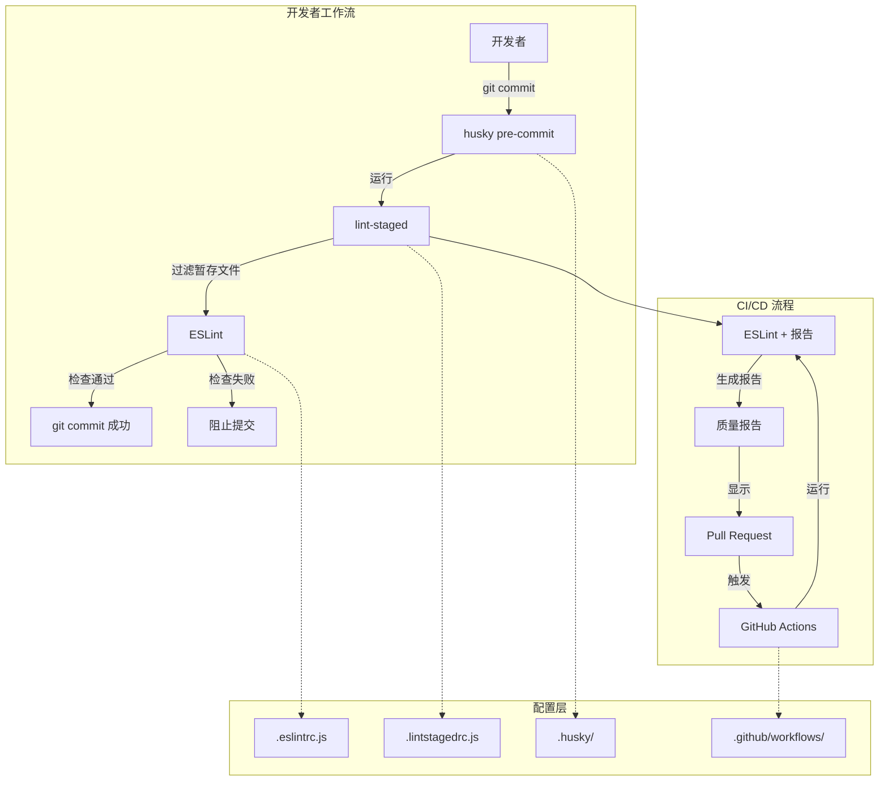
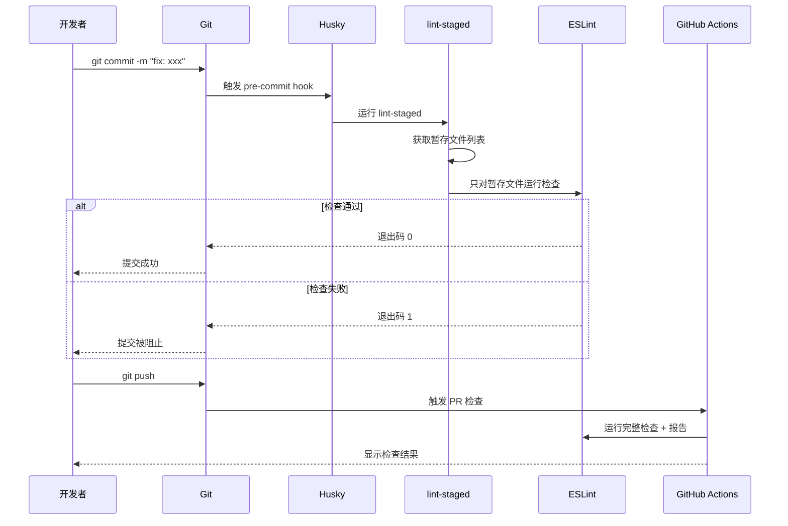
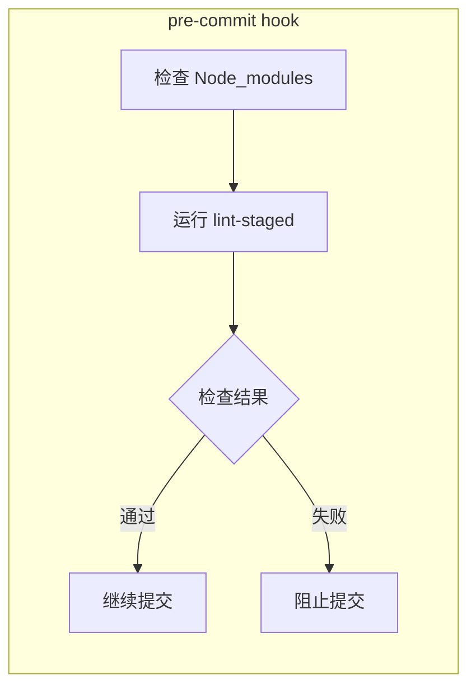

# VibeX 代码质量自动化 - 架构设计文档

**项目**: vibex-code-quality  
**架构师**: Dev Agent  
**日期**: 2026-03-06  
**版本**: 1.0  

---

## 1. 概述

### 1.1 项目背景

VibeX 代码质量自动化项目旨在为前端项目（vibex-frontend）构建完整的代码质量检查体系，通过自动化的 linting、pre-commit  hooks 和 CI 集成，确保代码符合安全规范和最佳实践。

### 1.2 目标

- **安全性**: 集成 ESLint 安全规则，检测 XSS、代码注入、敏感信息泄露等安全问题
- **效率**: 通过 lint-staged 只检查暂存文件，pre-commit 检查时间 < 10s
- **可维护性**: 配置集中管理，规则清晰可调
- **可视化**: 生成质量报告，支持 CI/CD 集成

---

## 2. 技术栈

| 技术 | 版本 | 选择理由 |
|-----|------|---------|
| ESLint | 9.x | 最新的 ESLint 主版本，支持 flat config |
| eslint-plugin-security | latest | 安全规则检测 |
| eslint-plugin-react | latest | React 最佳实践 |
| eslint-plugin-react-hooks | latest | React Hooks 规则 |
| eslint-plugin-jsx-a11y | latest | JSX 可访问性规则 |
| husky | 9.x | Git hooks 管理 |
| lint-staged | latest | 只检查暂存文件 |
| GitHub Actions | - | CI/CD 集成 |

---

## 3. 架构设计

### 3.1 系统架构图



### 3.2 组件交互流程



### 3.3 配置文件结构

```
vibex-frontend/
├── .eslintrc.js              # ESLint 主配置
├── .eslintignore             # 忽略文件
├── .husky/
│   ├── pre-commit            # pre-commit hook
│   └── commit-msg            # commit-msg hook (可选)
├── .lintstagedrc.js          # lint-staged 配置
├── .github/
│   └── workflows/
│       └── code-quality.yml  # CI 工作流
└── reports/
    └── lint/                 # 报告输出目录
        └── report.json       # JSON 格式报告
```

---

## 4. 核心模块设计

### 4.1 ESLint 配置模块

#### 4.1.1 安全规则集

| 规则 ID | 描述 | 级别 |
|---------|------|------|
| security/detect-object-injection | 检测潜在对象注入 | error |
| security/detect-non-literal-regexp | 检测非字面量正则 | error |
| security/detect-non-literal-fs-filename | 检测非字面量文件系统操作 | error |
| security/detect-unsafe-regex | 检测不安全正则 | error |
| security/detect-possible-timing-attacks | 检测时序攻击 | warn |

#### 4.1.2 React 规则集

| 规则 ID | 描述 | 级别 |
|---------|------|------|
| react/prop-types | 检查 PropTypes | error |
| react-hooks/rules-of-hooks | Hooks 使用规则 | error |
| react-hooks/exhaustive-deps | 依赖完整性检查 | warn |
| react/jsx-uses-react | 避免未使用的 React | error |
| react/jsx-uses-vars | 避免未使用的变量 | error |

#### 4.1.3 JSX 可访问性规则集

| 规则 ID | 描述 | 级别 |
|---------|------|------|
| jsx-a11y/alt-text | 图片 alt 文本 | error |
| jsx-a11y/click-events-have-key-events | 点击事件键盘支持 | warn |
| jsx-a11y/no-static-element-interactions | 静态元素交互 | warn |

#### 4.1.4 TypeScript 规则集

使用 `eslint-config-standard-with-typescript` 作为基础配置。

### 4.2 Husky Hook 模块



**pre-commit 脚本内容**:
```bash
#!/bin/sh
. "$(dirname "$0")/_/husky.sh"

npx lint-staged
```

### 4.3 lint-staged 配置模块

```mermaid
graph LR
    subgraph "lint-staged 流程"
        A[Git 暂存文件] --> B{文件类型}
        B -->|*.{ts,tsx}| C[ESLint --fix]
        B -->|*.{js,jsx}| D[ESLint --fix]
        B -->|*.{css,scss}| E[StyleLint --fix]
        C --> F[重新暂存已修复文件]
        D --> F
        E --> F
    end
```

### 4.4 CI 集成模块mermaid
graph TB
    subgraph "Git

```Hub Actions Workflow"
        TR[trigger: pull_request] --> CK[Checkout]
        CK --> SN[Setup Node]
        SN --> NI[npm install]
        NI --> L[Run ESLint]
        L --> |生成报告| GR[生成 JSON 报告]
        GR --> AN[Annotate PR]
        AN --> |失败| F[PR 检查失败]
        AN --> |成功| S[PR 检查通过]
    end
```

---

## 5. 数据流设计

### 5.1 Pre-commit 数据流

```
开发者 commit
    ↓
Git 触发 .husky/pre-commit
    ↓
lint-staged 读取 .lintstagedrc.js
    ↓
lint-staged 获取 git diff --cached --name-only
    ↓
过滤出暂存的 .ts/.tsx/.js/.jsx 文件
    ↓
对每个文件运行 ESLint
    ↓
ESLint 输出检查结果
    ↓
lint-staged:
  - 检查通过: 退出码 0 → 提交成功
  - 检查失败: 退出码 1 → 阻止提交
```

### 5.2 CI 检查数据流

```
PR 创建/更新
    ↓
GitHub Actions 触发
    ↓
Checkout 代码
    ↓
安装依赖 (npm ci)
    ↓
运行 ESLint (完整检查)
    ↓
生成 JSON 报告 → reports/lint/report.json
    ↓
PR Annotation (显示错误)
    ↓
检查结果:
  - 全部通过: PR 可合并
  - 有错误: PR 阻塞
```

---

## 6. 验收标准

### 6.1 ESLint 配置验收

| 验收项 | 标准 |
|--------|------|
| 配置文件存在 | `.eslintrc.js` 存在 |
| 插件加载 | 包含 security, react, react-hooks, jsx-a11y |
| 安全规则 | `security/detect-object-injection` = error |
| React 规则 | `react/prop-types` = error |

### 6.2 Husky 配置验收

| 验收项 | 标准 |
|--------|------|
| Hook 文件存在 | `.husky/pre-commit` 存在 |
| Hook 可执行 | 文件具有执行权限 |
| Hook 内容 | 包含 `lint-staged` 调用 |

### 6.3 lint-staged 配置验收

| 验收项 | 标准 |
|--------|------|
| 配置文件存在 | `.lintstagedrc.js` 存在 |
| 文件类型覆盖 | 包含 `*.{ts,tsx,js,jsx}` |
| 执行命令 | 包含 `eslint` |

### 6.4 CI 集成验收

| 验收项 | 标准 |
|--------|------|
| Workflow 文件存在 | `.github/workflows/code-quality.yml` 存在 |
| 触发条件 | `on: pull_request` |
| Job 定义 | 包含 `lint` job |

### 6.5 性能验收

| 验收项 | 标准 |
|--------|------|
| pre-commit 检查时间 | < 10s |
| ESLint 缓存 | 启用缓存机制 |

---

## 7. 风险与缓解

| 风险 | 影响 | 缓解措施 |
|-----|------|---------|
| 检查时间过长 | 中 | 使用 lint-staged + ESLint 缓存 |
| 规则过于严格 | 中 | 可配置警告级别，默认 warn |
| CI 时间增加 | 低 | 仅在 PR 中运行，不阻塞 push |
| Hook 跳过滥用 | 低 | 提供 --no-verify 选项但不推荐使用 |

---

## 8. 实施计划

| 阶段 | 任务 | 工作量 |
|------|------|-------|
| Phase 1 | ESLint 安全规则配置 | 2h |
| Phase 2 | Husky pre-commit hook | 1h |
| Phase 3 | lint-staged 配置 | 1h |
| Phase 4 | GitHub Actions CI | 1h |
| Phase 5 | 报告生成与验证 | 1h |

---

*文档创建完成于 2026-03-06 21:46 (Asia/Shanghai)*
