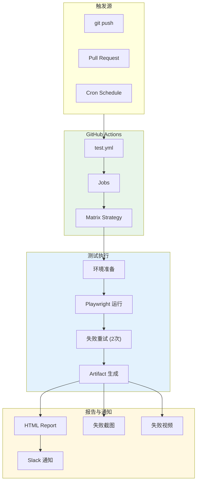
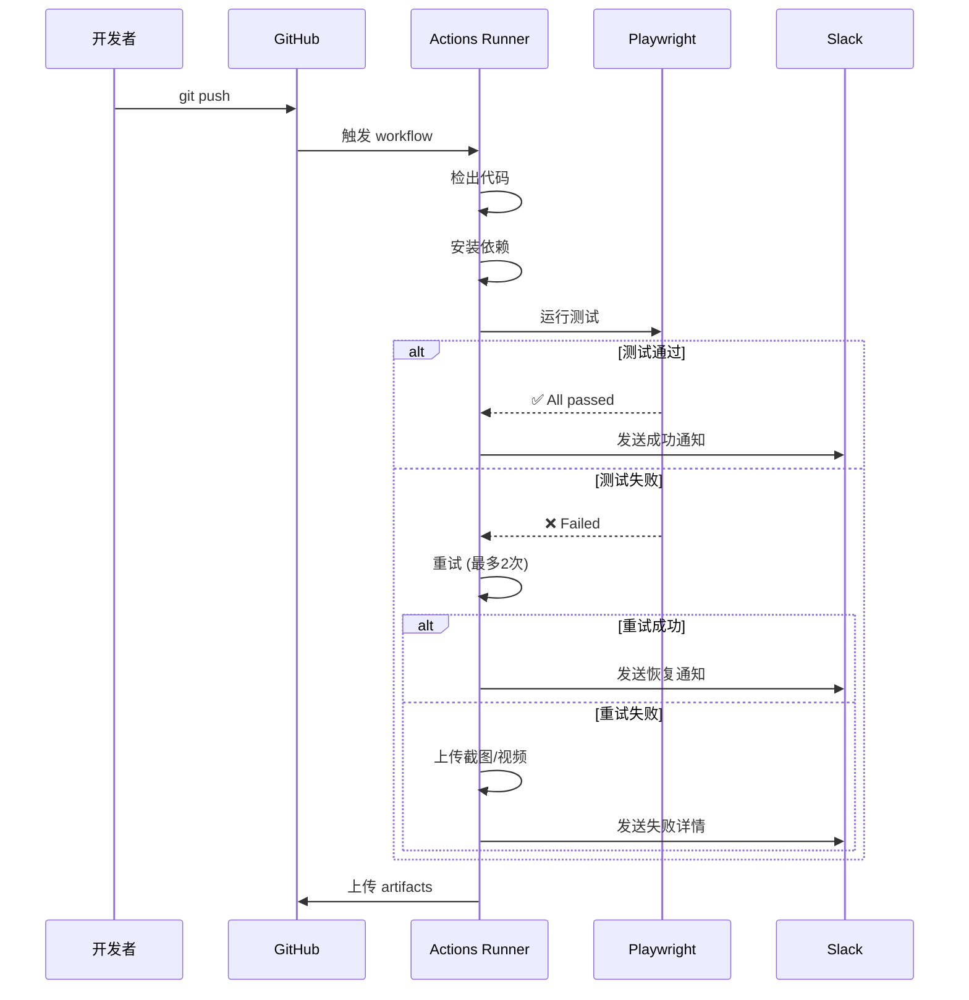
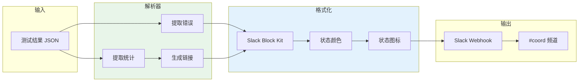

# 架构设计: E2E 测试自动化增强

**项目**: vibex-e2e-automation  
**架构师**: Architect Agent  
**版本**: 1.0  
**日期**: 2026-03-14

---

## 1. 技术栈

| 技术 | 版本 | 用途 | 选择理由 |
|------|------|------|----------|
| GitHub Actions | - | CI/CD 平台 | 原生集成，免费额度充足 |
| Playwright | 1.40+ | E2E 测试框架 | 已有 35+ 测试文件 |
| Slack Webhook | - | 通知渠道 | 团队已使用 Slack |
| Actions Artifacts | - | 结果存储 | 原生支持，免费存储 |

---

## 2. 架构图

### 2.1 系统架构



### 2.2 数据流



### 2.3 通知架构



---

## 3. API 定义

### 3.1 Workflow 配置

```yaml
# .github/workflows/e2e-tests.yml
name: E2E Tests

on:
  push:
    branches: [main, develop]
  pull_request:
    branches: [main]
  schedule:
    - cron: '0 2 * * *'  # 每日 02:00 UTC
  workflow_dispatch:

jobs:
  test:
    runs-on: ubuntu-latest
    timeout-minutes: 30
    
    strategy:
      fail-fast: false
      matrix:
        shard: [1/4, 2/4, 3/4, 4/4]
    
    steps:
      - uses: actions/checkout@v4
      
      - name: Setup Node.js
        uses: actions/setup-node@v4
        with:
          node-version: '20'
          cache: 'pnpm'
      
      - name: Install dependencies
        run: pnpm install --frozen-lockfile
      
      - name: Install Playwright browsers
        run: pnpm exec playwright install --with-deps chromium
      
      - name: Run Playwright tests
        run: pnpm exec playwright test --shard=${{ matrix.shard }}
        env:
          CI: true
        continue-on-error: true
      
      - name: Retry failed tests
        if: failure()
        run: pnpm exec playwright test --last-failed
        continue-on-error: true
      
      - name: Upload test results
        if: always()
        uses: actions/upload-artifact@v4
        with:
          name: playwright-report-${{ matrix.shard }}
          path: |
            playwright-report/
            test-results/
            screenshots/
          retention-days: 7
      
      - name: Notify Slack
        if: always()
        run: node scripts/notify-slack.js
        env:
          SLACK_WEBHOOK_URL: ${{ secrets.SLACK_WEBHOOK_URL }}
```

### 3.2 通知脚本接口

```typescript
// scripts/notify-slack.ts

interface TestResult {
  passed: number
  failed: number
  skipped: number
  duration: number
  failures: Failure[]
}

interface Failure {
  test: string
  file: string
  error: string
  screenshot?: string
  video?: string
}

interface SlackMessage {
  blocks: Block[]
  text: string
}

function buildSlackMessage(result: TestResult): SlackMessage
function sendToSlack(webhookUrl: string, message: SlackMessage): Promise<void>
function formatTestReport(result: TestResult): string
```

### 3.3 Playwright 配置

```typescript
// playwright.config.ts 扩展
export default defineConfig({
  // 现有配置...
  
  // 新增: 失败重试
  retries: 2,
  
  // 新增: 失败时截图和视频
  use: {
    screenshot: 'only-on-failure',
    video: 'retain-on-failure',
    trace: 'on-first-retry',
  },
  
  // 新增: 报告器
  reporter: [
    ['html', { open: 'never' }],
    ['json', { outputFile: 'test-results/results.json' }],
  ],
})
```

---

## 4. 数据模型

### 4.1 测试结果模型

```typescript
// types/test-result.ts

interface TestResult {
  runId: string           // GitHub Actions Run ID
  status: 'success' | 'failure' | 'cancelled'
  stats: {
    total: number
    passed: number
    failed: number
    skipped: number
    duration: number      // 毫秒
  }
  failures: Failure[]
  metadata: {
    branch: string
    commit: string
    author: string
    timestamp: string
    shard?: string
  }
}

interface Failure {
  testName: string
  suite: string
  file: string
  line: number
  error: string
  stack?: string
  screenshot?: string     // artifact 路径
  video?: string          // artifact 路径
}

interface NotificationPayload {
  channel: string
  username: string
  icon_emoji: string
  blocks: SlackBlock[]
  text: string
}
```

### 4.2 Slack Block Kit 结构

```typescript
// Slack 通知块
const successBlock = {
  type: 'header',
  text: { type: 'plain_text', text: '✅ E2E Tests Passed' }
}

const failureBlock = {
  type: 'header',
  text: { type: 'plain_text', text: '❌ E2E Tests Failed' }
}

const statsBlock = {
  type: 'section',
  fields: [
    { type: 'mrkdwn', text: `*Passed:*\n${passed}` },
    { type: 'mrkdwn', text: `*Failed:*\n${failed}` },
    { type: 'mrkdwn', text: `*Duration:*\n${duration}` },
    { type: 'mrkdwn', text: `*Branch:*\n${branch}` },
  ]
}
```

---

## 5. 模块划分

### 5.1 文件结构

```
.github/
└── workflows/
    └── e2e-tests.yml          # GitHub Actions workflow

scripts/
├── notify-slack.ts            # Slack 通知脚本
├── parse-results.ts           # 结果解析
└── format-report.ts           # 报告格式化

playwright.config.ts           # Playwright 配置扩展

types/
└── test-result.ts             # 类型定义
```

### 5.2 模块职责

| 模块 | 职责 | 类型 |
|------|------|------|
| e2e-tests.yml | CI/CD 流程定义 | 配置 |
| notify-slack.ts | Slack 通知发送 | 脚本 |
| parse-results.ts | JSON 结果解析 | 工具 |
| format-report.ts | 报告格式化 | 工具 |
| playwright.config.ts | 测试配置 | 配置 |

---

## 6. 核心实现

### 6.1 Slack 通知脚本

```typescript
// scripts/notify-slack.ts
import { parseResults } from './parse-results'
import { formatReport } from './format-report'

const SLACK_WEBHOOK = process.env.SLACK_WEBHOOK_URL!
const GITHUB_RUN_ID = process.env.GITHUB_RUN_ID!
const GITHUB_REPO = process.env.GITHUB_REPOSITORY!
const GITHUB_BRANCH = process.env.GITHUB_REF_NAME!
const GITHUB_ACTOR = process.env.GITHUB_ACTOR!

async function main() {
  // 解析测试结果
  const result = await parseResults('test-results/results.json')
  
  // 构建消息
  const message = {
    channel: '#coord',
    username: 'E2E Test Bot',
    icon_emoji: result.stats.failed > 0 ? ':x:' : ':white_check_mark:',
    text: `E2E Tests ${result.stats.failed > 0 ? 'Failed' : 'Passed'}`,
    blocks: [
      // 状态头
      {
        type: 'header',
        text: {
          type: 'plain_text',
          text: result.stats.failed > 0 
            ? '❌ E2E Tests Failed' 
            : '✅ E2E Tests Passed'
        }
      },
      // 统计信息
      {
        type: 'section',
        fields: [
          { type: 'mrkdwn', text: `*Passed:*\n${result.stats.passed}` },
          { type: 'mrkdwn', text: `*Failed:*\n${result.stats.failed}` },
          { type: 'mrkdwn', text: `*Duration:*\n${formatDuration(result.stats.duration)}` },
          { type: 'mrkdwn', text: `*Branch:*\n${GITHUB_BRANCH}` },
        ]
      },
      // 详情链接
      {
        type: 'actions',
        elements: [
          {
            type: 'button',
            text: { type: 'plain_text', text: 'View Report' },
            url: `https://github.com/${GITHUB_REPO}/actions/runs/${GITHUB_RUN_ID}`
          }
        ]
      }
    ]
  }
  
  // 发送通知
  await fetch(SLACK_WEBHOOK, {
    method: 'POST',
    headers: { 'Content-Type': 'application/json' },
    body: JSON.stringify(message)
  })
  
  console.log('Notification sent')
}

function formatDuration(ms: number): string {
  const minutes = Math.floor(ms / 60000)
  const seconds = Math.floor((ms % 60000) / 1000)
  return `${minutes}m ${seconds}s`
}

main().catch(console.error)
```

### 6.2 结果解析器

```typescript
// scripts/parse-results.ts
import { readFileSync } from 'fs'
import { TestResult, Failure } from '../types/test-result'

export function parseResults(jsonPath: string): TestResult {
  const raw = JSON.parse(readFileSync(jsonPath, 'utf-8'))
  
  const stats = {
    total: raw.stats.total,
    passed: raw.stats.passed,
    failed: raw.stats.failed,
    skipped: raw.stats.skipped,
    duration: raw.stats.duration,
  }
  
  const failures: Failure[] = raw.suites
    .flatMap((suite: any) => suite.specs)
    .filter((spec: any) => spec.status === 'failed')
    .map((spec: any) => ({
      testName: spec.title,
      suite: spec.suite,
      file: spec.file,
      line: spec.line,
      error: spec.error?.message || 'Unknown error',
      stack: spec.error?.stack,
      screenshot: spec.screenshot,
      video: spec.video,
    }))
  
  return {
    runId: process.env.GITHUB_RUN_ID!,
    status: stats.failed > 0 ? 'failure' : 'success',
    stats,
    failures,
    metadata: {
      branch: process.env.GITHUB_REF_NAME!,
      commit: process.env.GITHUB_SHA!,
      author: process.env.GITHUB_ACTOR!,
      timestamp: new Date().toISOString(),
    }
  }
}
```

---

## 7. 测试策略

### 7.1 单元测试

```typescript
// __tests__/scripts/notify-slack.test.ts
describe('Slack Notification', () => {
  it('builds success message', () => {
    const result = { stats: { passed: 10, failed: 0 }, failures: [] }
    const message = buildSlackMessage(result as any)
    
    expect(message.icon_emoji).toBe(':white_check_mark:')
    expect(message.blocks[0].text.text).toContain('Passed')
  })
  
  it('includes failure details', () => {
    const result = {
      stats: { passed: 5, failed: 2 },
      failures: [{ testName: 'test 1', error: 'error' }]
    }
    const message = buildSlackMessage(result as any)
    
    expect(message.icon_emoji).toBe(':x:')
    expect(message.blocks).toHaveLength(4) // header + stats + failures + actions
  })
})
```

### 7.2 集成测试

```bash
# 验证 workflow 语法
actionlint .github/workflows/e2e-tests.yml

# 验证 Slack webhook
curl -X POST $SLACK_WEBHOOK_URL \
  -H 'Content-Type: application/json' \
  -d '{"text":"Test notification"}'
```

### 7.3 覆盖率目标

| 模块 | 覆盖率目标 |
|------|-----------|
| notify-slack.ts | 80% |
| parse-results.ts | 90% |
| format-report.ts | 85% |

---

## 8. 性能与资源

### 8.1 资源消耗

| 指标 | 预估值 |
|------|--------|
| Runner 时间 | ~15 分钟/次 |
| Artifact 大小 | ~50 MB |
| Slack 调用 | 1 次/运行 |

### 8.2 优化策略

| 策略 | 收益 |
|------|------|
| Matrix 分片 | 并行执行，时间 ↓ 60% |
| 缓存依赖 | 安装时间 ↓ 40% |
| 增量测试 | 仅运行变更测试 |

---

## 9. 风险评估

| 风险 | 概率 | 影响 | 缓解措施 |
|------|------|------|----------|
| Slack 限流 | 低 | 中 | 消息压缩，失败汇总 |
| Artifact 过大 | 中 | 低 | 仅保留失败截图/视频 |
| 测试不稳定 | 高 | 中 | 重试机制 + Flaky 标记 |

---

## 10. 实施计划

| 阶段 | 内容 | 工时 |
|------|------|------|
| Phase 1 | Workflow 配置 | 2h |
| Phase 2 | Playwright 配置扩展 | 1h |
| Phase 3 | Slack 通知脚本 | 2h |
| Phase 4 | 测试验证 | 1h |

**总工时**: 6h (0.75 天)

---

## 11. 检查清单

- [x] 技术栈选型 (GitHub Actions + Playwright + Slack)
- [x] 架构图 (系统架构 + 数据流 + 通知架构)
- [x] API 定义 (Workflow + 脚本接口)
- [x] 数据模型 (TestResult + SlackBlock)
- [x] 核心实现 (notify-slack.ts + parse-results.ts)
- [x] 测试策略 (单元 + 集成)
- [x] 性能与资源评估
- [x] 风险评估

---

**产出物**: `docs/vibex-e2e-automation/architecture.md`