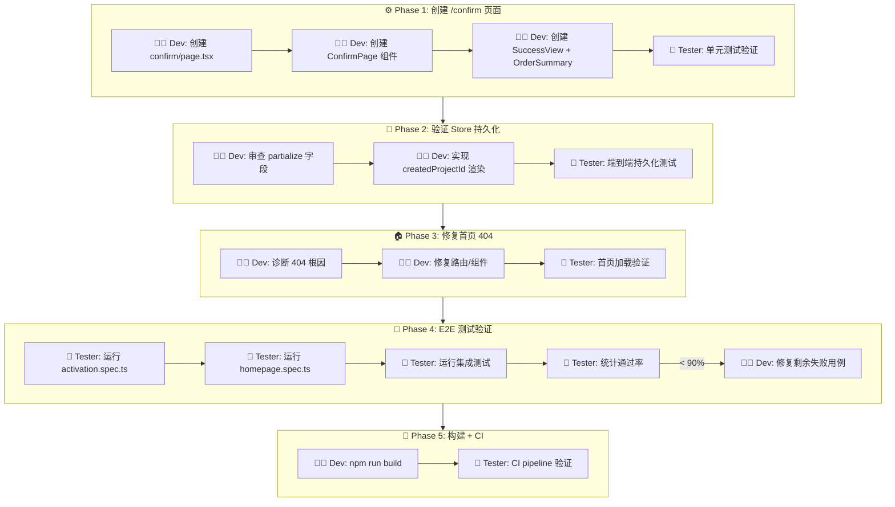
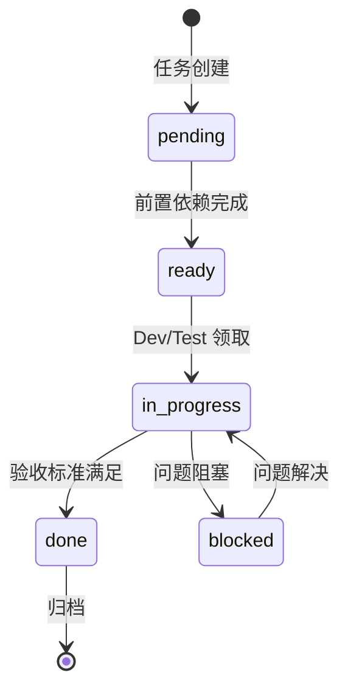

# AGENTS.md — Agent 职责与任务流转定义

**项目**: vibex-e2e-failures-20260323
**Architect**: architect
**日期**: 2026-03-23
**状态**: ✅ 完成

---

## 1. Agent 职责矩阵

| Agent | 职责 | 任务 | 产出物 |
|-------|------|------|--------|
| **dev** | 页面创建 + 构建验证 | Phase 1, 2, 3, 5 | `/confirm` 页面, 首页修复, 构建通过 |
| **tester** | 测试验证 + 问题定位 | Phase 2, 4 | E2E 测试报告, 通过率验证 |
| **reviewer** | 代码审查 | 贯穿 | 审查通过 |
| **pm** | 进度追踪 | 贯穿 | 验收确认 |
| **analyst** | — | — | — |
| **architect** | 架构设计 | Phase 0 | 本文档 |

---

## 2. 任务流转图



---

## 3. 状态机定义

### 3.1 任务状态流转



---

## 4. 验收标准（expect 断言格式）

| ID | Given | When | Then |
|----|-------|------|------|
| AC-1 | Dev server on port 3000 | GET `/` | expect(status).toBe(200) |
| AC-2 | Dev server on port 3000 | GET `/confirm` | expect(status).toBe(200) |
| AC-3 | /confirm page loaded | page content | expect(body.textContent).not.toContain('404') |
| AC-4 | Store has createdProjectId | navigate to /confirm | expect(page.locator('[data-testid="project-id"]').textContent()).toBeTruthy() |
| AC-5 | After `npm run build` | exit code | expect(code).toBe(0) |
| AC-6 | Playwright suite | results | expect(passed/total).toBeGreaterThanOrEqual(0.9) |
| AC-7 | localStorage with state | refresh page | expect(store.state).toEqual(previousState) |

---

## 5. 文件变更清单

### 新增文件
```
src/app/confirm/
├── page.tsx                           # 路由入口
src/components/confirm/
├── ConfirmPage.tsx                    # 主组件
├── SuccessView.tsx                    # 成功视图
└── OrderSummary.tsx                   # 订单摘要
```

### 修改文件（预计）
```
src/app/page.tsx                       # 首页修复（如需）
src/app/page.test.tsx                  # 测试更新
vibex-fronted/playwright.config.ts     # 可能更新
```

---

## 6. 测试文件清单

| 测试文件 | 测试目标 | 预期结果 |
|---------|---------|---------|
| `activation.spec.ts` | /confirm 路由和流程 | ✅ 通过 |
| `homepage.spec.ts` | 首页加载 | ✅ 通过 |
| `confirmation-progress-persist.spec.ts` | Store 持久化 | ✅ 通过 |
| `integrated-preview.spec.ts` | 集成流程 | ✅ 通过 |
| `confirmationStore.test.ts` | Store 单元测试 | ✅ 通过 |

---

**AGENTS.md 完成**: 2026-03-23 08:40 (Asia/Shanghai)
