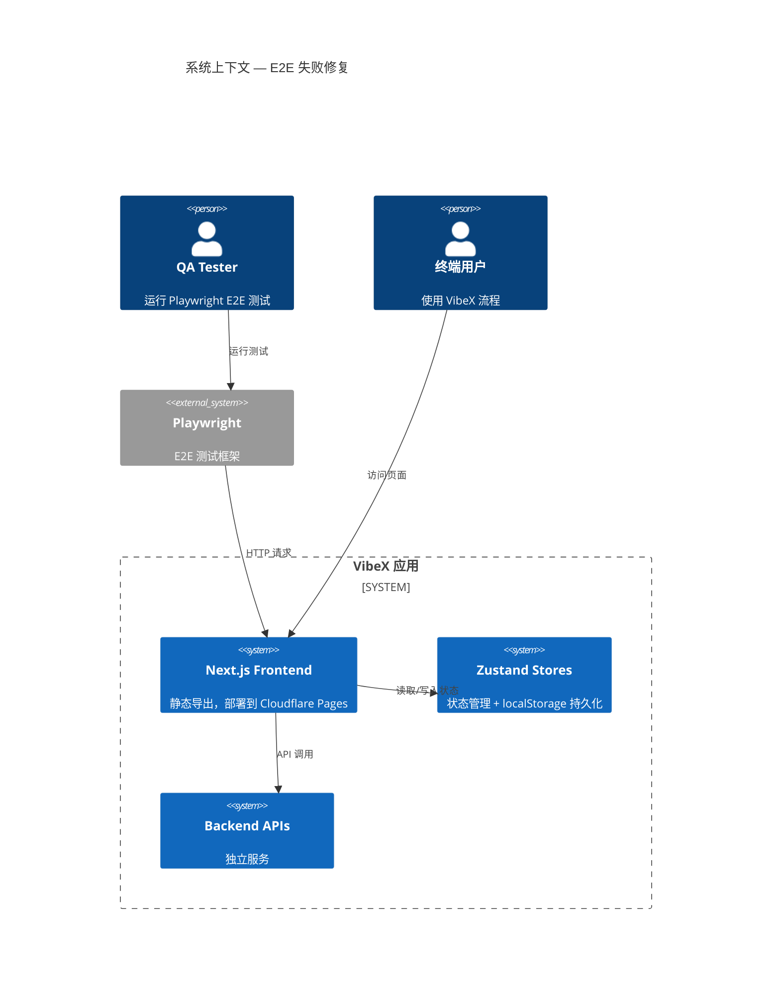
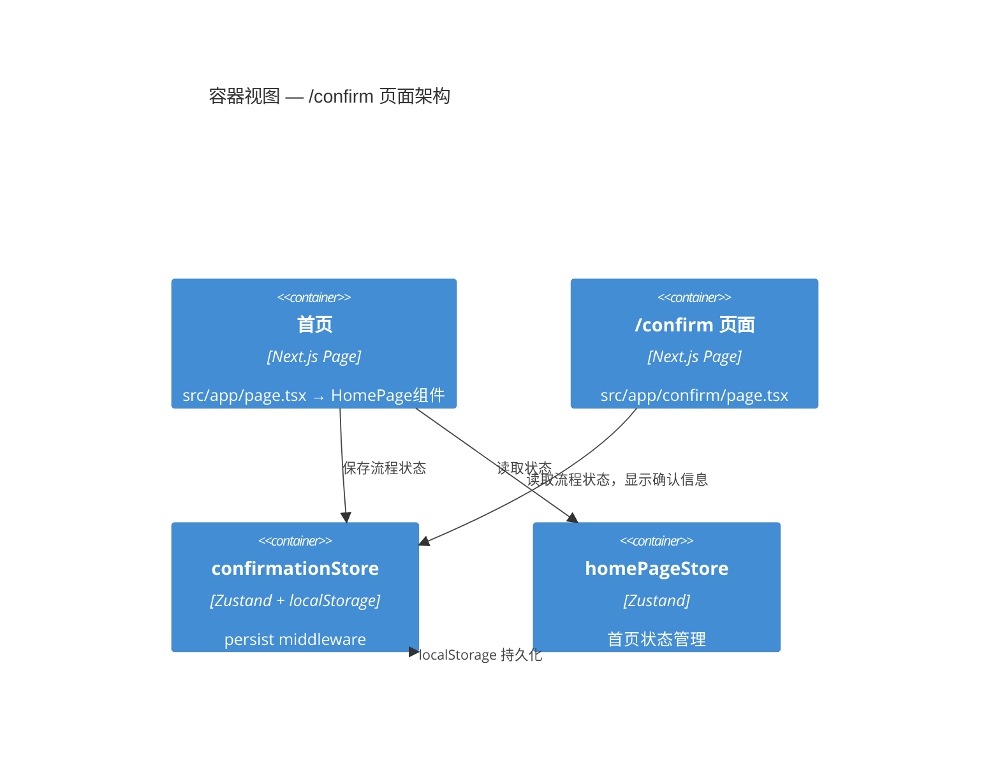
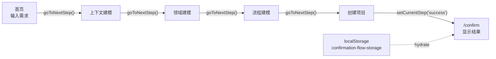

# Architecture: vibex-e2e-failures-20260323 — E2E 测试失败修复

**项目**: vibex-e2e-failures-20260323
**阶段**: design-architecture
**Architect**: architect
**日期**: 2026-03-23
**状态**: ✅ 完成

---

## 1. Tech Stack

### 1.1 选型总览

| 层次 | 技术 | 版本 | 选型理由 |
|------|------|------|---------|
| **框架** | Next.js | 14.x | 现有技术栈，保持一致 |
| **部署模式** | `output: 'export'` | — | 保持不变，MVP 阶段最优 |
| **状态持久化** | Zustand + localStorage | 4.x | confirmationStore 已使用 |
| **测试** | Playwright | 1.x | 现有测试基础设施 |
| **页面组件** | React (TypeScript) | 18.x | 现有技术栈 |

### 1.2 技术决策

**Q: 为什么保持 `output: 'export'`？**
> 改动最小，风险可控。`/confirm` 作为静态页面完全可行，状态通过 `localStorage` + Zustand persist 跨页面保持。后续如需服务端逻辑，再评估 SSR 迁移。

**Q: 为什么不用 SSR？**
> 工作量与风险不成比例。E2E 失败的根本问题是页面缺失，而非架构限制。

**Q: confirmationStore 是否已满足持久化需求？**
> 是。Store 使用 `zustand/middleware` 的 `persist` + `localStorage`，已在 `partialize` 中保留关键字段（currentStep, requirementText, boundedContexts, domainModels, businessFlow 等）。`/confirm` 页面访问时 store 已通过 hydration 恢复。

---

## 2. Architecture Diagram





---

## 3. API Definitions

> 注：本项目为页面修复，无新增 API。以下为现有 API 依赖声明。

### 3.1 页面依赖

| 页面 | 路由 | 状态依赖 | API 依赖 |
|------|------|---------|---------|
| 首页 | `/` | `homePageStore` | — |
| /confirm | `/confirm` | `confirmationStore` (orderId, email, step) | — |
| /design | `/design` | `designStore` | `/api/ddd/*` |
| /domain | `/domain` | `modelSlice` | `/api/business-domain` |

### 3.2 /confirm 页面接口契约

```typescript
// confirmationStore 中 /confirm 页面使用的字段
interface ConfirmPageContract {
  // 必须从 store 中可读取的字段
  currentStep: 'input' | 'context' | 'model' | 'clarification' | 'flow' | 'success';
  requirementText: string;
  boundedContexts: BoundedContext[];
  domainModels: DomainModel[];
  businessFlow: BusinessFlow;
  createdProjectId: string | null;

  // hydration 完成标志（渲染 guard）
  _hasHydrated: boolean;
}
```

---

## 4. Data Model

### 4.1 /confirm 页面数据流



### 4.2 持久化字段清单（confirmationStore partialize）

| 字段 | 类型 | 说明 | 页面使用 |
|------|------|------|---------|
| `currentStep` | `ConfirmationStep` | 当前步骤 | /confirm 渲染分支 |
| `stepHistory` | `ConfirmationStep[]` | 步骤历史 | 导航 |
| `requirementText` | `string` | 需求文本 | /confirm 显示摘要 |
| `boundedContexts` | `BoundedContext[]` | 限界上下文 | /confirm 显示上下文 |
| `selectedContextIds` | `string[]` | 选中的上下文 ID | 页面状态 |
| `contextMermaidCode` | `string` | 上下文 Mermaid 图 | /confirm 显示 |
| `domainModels` | `DomainModel[]` | 领域模型 | /confirm 显示模型摘要 |
| `modelMermaidCode` | `string` | 模型 Mermaid 图 | /confirm 显示 |
| `businessFlow` | `BusinessFlow` | 业务流程 | /confirm 显示流程 |
| `flowMermaidCode` | `string` | 流程 Mermaid 图 | /confirm 显示 |
| `createdProjectId` | `string \| null` | 创建的项目 ID | /confirm 显示项目信息 |

---

## 5. Module Design

### 5.1 新增文件

```
src/app/
├── confirm/
│   └── page.tsx              # /confirm 页面 (新增)
src/components/
├── confirm/
│   ├── ConfirmPage.tsx        # 确认页主组件 (新增)
│   ├── OrderSummary.tsx       # 订单摘要组件 (新增)
│   ├── StepIndicator.tsx      # 步骤指示器 (复用/适配)
│   └── SuccessView.tsx        # 成功视图 (新增)
```

### 5.2 /confirm/page.tsx 设计

```typescript
// src/app/confirm/page.tsx
'use client';

import { useEffect } from 'react';
import { useConfirmationStore } from '@/stores/confirmationStore';
import { ConfirmPage } from '@/components/confirm/ConfirmPage';

export default function ConfirmRoute() {
  const _hasHydrated = useConfirmationStore((s) => s._hasHydrated);

  // Guard: 等待 store hydration 完成再渲染
  if (!_hasHydrated) {
    return (
      <div data-testid="confirm-loading">
        <p>Loading...</p>
      </div>
    );
  }

  return <ConfirmPage />;
}
```

### 5.3 ConfirmPage 组件结构

```typescript
// src/components/confirm/ConfirmPage.tsx
'use client';

export function ConfirmPage() {
  const currentStep = useConfirmationStore((s) => s.currentStep);
  const createdProjectId = useConfirmationStore((s) => s.createdProjectId);

  // Step-based rendering
  if (currentStep === 'success') {
    return <SuccessView projectId={createdProjectId} />;
  }

  // Fallback: show order summary with context
  return (
    <div data-testid="confirm-page" className="confirm-container">
      <StepIndicator currentStep={currentStep} />
      <OrderSummary />
      <Link href="/" data-testid="back-to-home">
        返回首页
      </Link>
    </div>
  );
}
```

---

## 6. Performance Considerations

| 关注点 | 现状 | 评估 |
|-------|------|------|
| **构建时间** | `output: 'export'` 静态导出 | ✅ 无变化，预计 < 5 分钟 |
| **页面加载** | 首页 404 → 修复后正常 | ✅ 预期 < 2s (Lighthouse > 80) |
| **localStorage hydration** | confirmationStore 已实现 | ✅ 无额外性能影响 |
| **E2E 测试时间** | ~60s timeout | ✅ 预计减少到 < 30s (无 404 重试) |

---

## 7. Trade-offs

| 决策点 | 本方案 (静态导出) | SSR 方案 | 选择 |
|-------|-----------------|---------|------|
| 改动范围 | 1 个新页面 | 修改部署 + 路由 | ✅ 最小 |
| 风险 | 低 | 中（部署配置变更）| ✅ 低风险 |
| 功能限制 | `/confirm` 无服务端逻辑 | 支持动态服务端逻辑 | 当前需求已满足 |
| 后续迁移 | SSR 迁移 P2 | — | 预留评估接口 |

---

## 8. Open Decisions

- **确认页面 UI 设计细节**：PRD 中仅定义了最低要求（订单摘要、状态、返回链接），具体 UI 由 Dev 在实现阶段决定
- **如果 `currentStep !== 'success'` 时如何展示**：降级显示当前步骤摘要，而非 404
- **SSR 迁移时机**：当确认流程需要服务端数据（如真实订单信息）时再评估

---

**架构文档完成**: 2026-03-23 08:35 (Asia/Shanghai)
