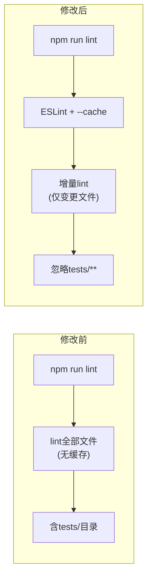

# 架构设计: ESLint 性能优化

**项目**: vibex-eslint-perf-fix  
**架构师**: Architect Agent  
**日期**: 2026-03-20

---

## 1. 问题分析

| 指标 | 当前值 | 目标值 |
|------|--------|--------|
| `npm run lint` 耗时 | ~65s | < 20s（第二次） |
| ESLint 缓存 | ❌ 未启用 | ✅ 启用 |
| 测试目录检查 | ⚠️ 部分检查 | ❌ 完全排除 |

**瓶颈根因**:
1. 每次运行重新lint全部文件，无缓存
2. `tests/e2e/` 和 `tests/unit/` 目录仍被检查

---

## 2. 架构变更



**变更文件**:
- `package.json` — lint script 添加 `--cache`
- `.eslintrc.*` 或 `eslint.config.mjs` — 添加 `ignores` 或 `--ignore-pattern`
- `tsconfig.json` (如需) — 调整 include/exclude

---

## 3. 实现方案

### 3.1 修改 package.json

```json
{
  "scripts": {
    "lint": "next lint --cache --cache-location node_modules/.cache/eslint/ --ignore-pattern 'tests/**' --ignore-pattern 'e2e/**'"
  }
}
```

### 3.2 ESLint 配置 (eslint.config.mjs)

```javascript
import { dirname } from "path";
import { fileURLToPath } from "url";
import { FlatCompat } from "@eslint/eslintrc";

const __filename = fileURLToPath(import.meta.url);
const __dirname = dirname(__filename);
const compat = new FlatCompat({
  baseDirectory: __dirname,
});

const eslintConfig = [
  ...compat.extends("next/core-web-vitals"),
  {
    ignores: [
      "tests/**",        // Playwright E2E
      "e2e/**",          // E2E tests
      "node_modules/**",
      ".next/**",
      "dist/**",
      "out/**",
    ],
  },
];

export default eslintConfig;
```

### 3.3 CI 环境额外配置

```yaml
# .github/workflows/lint.yml (如使用 GitHub Actions)
- name: Run ESLint
  run: npm run lint
  env:
    # 缓存 node_modules/.cache/eslint/ 在 CI 中通常不持久
    # 但第二次运行可通过 --cache 加速
```

---

## 4. 测试策略

| 测试类型 | 工具 | 验收标准 |
|----------|------|----------|
| Lint 检查 | `npm run lint` | 退出码 0，无 error |
| 缓存生效 | 连续两次运行 | 第二次 < 20s |
| 测试目录排除 | `npm run lint` 输出 | 无 tests/ 相关警告 |

```bash
# 验证脚本
npm run lint  # 第一次，无缓存
npm run lint  # 第二次，应 < 20s
npm run lint 2>&1 | grep -c "tests/"  # 应为 0
```

---

## 5. 技术决策

| 决策点 | 选项 | 选择 | 理由 |
|--------|------|------|------|
| 缓存位置 | `node_modules/.cache/eslint/` | ✅ | 符合 npm 惯例，CI 可清理 |
| 忽略方式 | `--ignore-pattern` + `ignores` | ✅ | 双重保险，CLI+config |
| 缓存策略 | 文件级（默认） | ✅ | 无需额外配置 |

---

## 6. 实施步骤

```
Step 1: 修改 package.json lint script (1行)
Step 2: 修改 eslint.config.mjs ignores 数组
Step 3: 验证缓存: npm run lint × 2
Step 4: 验证无 tests/ 警告
Step 5: CI 验证
```

**工作量**: 0.5 天（极低复杂度）

---

*Generated by: Architect Agent*
