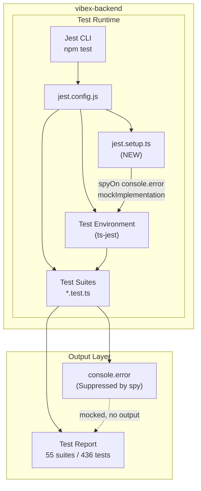

# Architecture: vibex-jest-esm-fix

> **Project Goal**: Fix Jest test output noise by silencing `console.error` during test runs
> **Analyst Conclusion**: ✅ Tests all pass — the problem is `console.error` noise, not actual test failures

---

## 1. Architecture Overview

This is a **minimal surgical change** — no new services, no new data models, no architectural pattern shift. The entire fix is contained within the Jest test runner configuration layer.



**Key insight**: The change hooks into Jest's `setupFilesAfterEnv` lifecycle — a standard Jest extensibility point. No business logic is touched.

---

## 2. Module Structure

### 2.1 New Files

| File | Purpose | Location |
|------|---------|----------|
| `jest.setup.ts` | Global console.error mock, runs after test env init | `vibex-backend/jest.setup.ts` |

### 2.2 Modified Files

| File | Change | Delta |
|------|--------|-------|
| `jest.config.js` | Add `setupFilesAfterEnv` entry | +1 line |

### 2.3 No Changes To

- `src/**/*.ts` — business logic untouched
- `*.test.ts` — test files untouched
- `package.json` — no new dependencies

---

## 3. Interface Definitions

### 3.1 jest.setup.ts Contract

```typescript
// jest.setup.ts
// Runs AFTER test environment is set up (setupFilesAfterEnv)
// Mocking console.error at this point ensures:
const handleError = jest.spyOn(console, 'error').mockImplementation(() => {});
// 1. All test files inherit the mock
// 2. Error handling tests still work (mock returns undefined, not throws)
// 3. No additional imports needed in test files
```

**Interface behavior**:
- `console.error` calls → silently dropped (noop)
- `console.error.mock.calls` → still tracked (useful for debugging)
- Other `console` methods → unaffected
- Reset: `jest.restoreAllMocks()` or `jest.clearAllMocks()` in afterEach

### 3.2 jest.config.js Delta

```javascript
module.exports = {
  // ... existing config ...
  setupFilesAfterEnv: ['<rootDir>/jest.setup.ts'],  // NEW
};
```

**Jest lifecycle order** (for context):
1. `setupFiles` — runs before test environment (DOM/node)
2. Test environment installed
3. `setupFilesAfterEnv` ← **our hook** — runs after env, before tests
4. Test files execute

---

## 4. Data Model

No data model changes. This is a pure configuration change.

---

## 5. Technical Decisions

### Decision 1: `setupFilesAfterEnv` vs `setupFiles`

| Option | Used | Reason |
|--------|------|--------|
| `setupFiles` | ❌ | Runs before test environment — not suitable for `jest.spyOn` which needs `jest` global |
| `setupFilesAfterEnv` | ✅ | Runs after env + jest globals available — correct hook |

### Decision 2: `mockImplementation(() => {})` vs `mockImplementation(jest.fn())`

| Option | Used | Reason |
|--------|------|--------|
| `mockImplementation(() => {})` | ✅ | Simplest no-op, zero overhead |
| `mockImplementation(jest.fn())` | ❌ | Adds unnecessary indirection |

### Decision 3: Global vs per-test mock

| Option | Used | Reason |
|--------|------|--------|
| Global in setup file | ✅ | All 436 tests benefit automatically, DRY |
| Per-file mock | ❌ | 55 test files × duplicated mock = maintenance burden |

### Decision 4: No new dependency

This project adds **zero** dependencies. The `jest` global is already available.

---

## 6. Risk Assessment

| Risk | Likelihood | Impact | Mitigation |
|------|-----------|--------|------------|
| `console.error` mock breaks tests that assert on console output | **Very Low** | High | Test grep validation catches this |
| `jest.spyOn` not available in test environment | **Impossible** | High | ts-jest preset guarantees jest global |
| Setup file syntax error breaks all tests | Low | High | `npm test -- --listTests` validates first |
| CI environment differs from local | Low | Medium | No env-specific config; standard Jest |

---

## 7. Epic 2: ESM Readiness (Documentation Only)

No code changes — purely documentation. See `CONFIG_COMPARISON.md` for details.

**Key findings for future migration**:
- Current: CommonJS via `ts-jest` (no `"type": "module"`)
- Target: ESM via `ts-jest/presets/default-esm` + `.mjs` handling
- Estimated effort: 1-2 person-days
- Risk: Medium — broad config surface area
