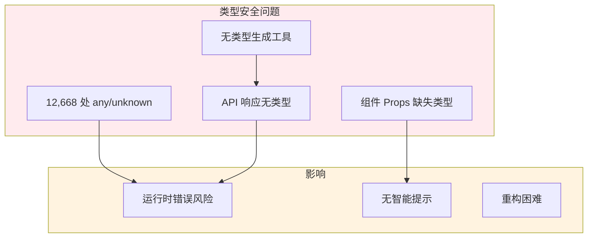
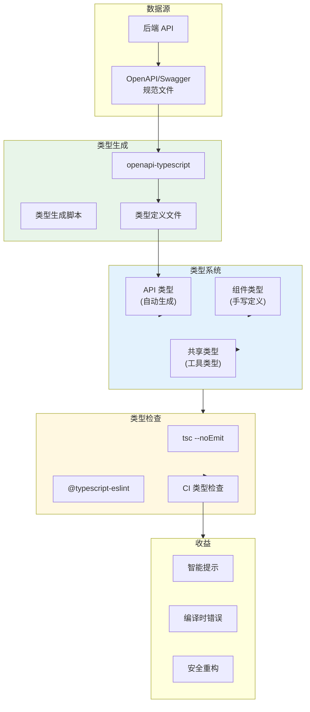
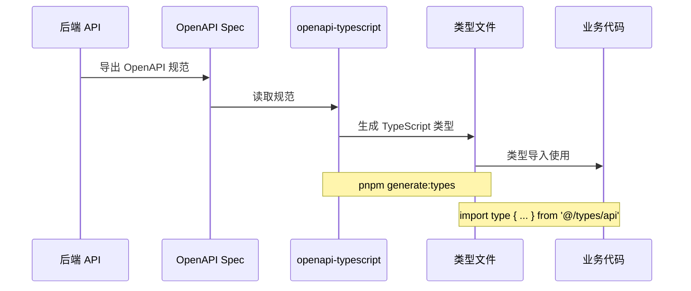
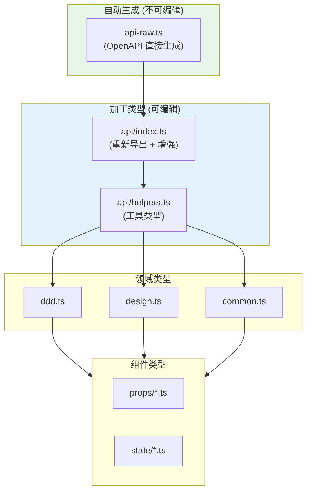
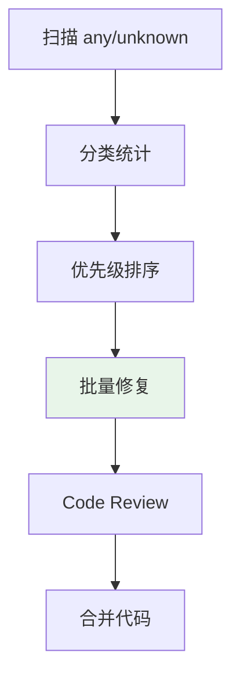

# 架构设计: TypeScript 类型安全提升

**项目**: vibex-type-safety-boost  
**架构师**: Architect Agent  
**版本**: 1.0  
**日期**: 2026-03-14

---

## 1. 技术栈

| 技术 | 版本 | 用途 | 选择理由 |
|------|------|------|----------|
| TypeScript | 5.x | 类型系统 | 项目基础 |
| openapi-typescript | 6.x | API 类型生成 | OpenAPI 标准支持 |
| tsc | 5.x | 类型检查 | 原生工具 |
| ESLint | 9.x | 代码检查 | @typescript-eslint 规则 |

---

## 2. 架构图

### 2.1 当前问题



### 2.2 目标架构



### 2.3 类型生成流程



### 2.4 类型层次结构



---

## 3. API 定义

### 3.1 类型生成脚本

```typescript
// scripts/generate-types.ts
import { execSync } from 'child_process'
import { writeFileSync, readFileSync } from 'fs'

const OPENAPI_URL = process.env.OPENAPI_URL || 'http://localhost:3000/api/openapi.json'
const OUTPUT_FILE = 'src/types/api-raw.ts'

async function generateTypes() {
  console.log('🔧 Generating TypeScript types from OpenAPI...')
  
  // 1. 从 OpenAPI 规范生成类型
  execSync(`npx openapi-typescript ${OPENAPI_URL} -o ${OUTPUT_FILE}`, {
    stdio: 'inherit'
  })
  
  // 2. 添加文件头注释
  const content = readFileSync(OUTPUT_FILE, 'utf-8')
  const header = `/**
 * Auto-generated by openapi-typescript
 * DO NOT EDIT - regenerate with pnpm generate:types
 * 
 * Generated at: ${new Date().toISOString()}
 */
`
  writeFileSync(OUTPUT_FILE, header + content)
  
  console.log('✅ Types generated successfully!')
}

generateTypes().catch(console.error)
```

### 3.2 类型定义结构

```typescript
// src/types/api-raw.ts (自动生成)
export interface paths {
  '/api/ddd/bounded-context': {
    get: {
      responses: {
        200: {
          content: {
            'application/json': components['schemas']['BoundedContextResponse']
          }
        }
      }
    }
  }
}

export interface components {
  schemas: {
    BoundedContext: {
      id: string
      name: string
      type: 'core' | 'supporting' | 'generic'
      description?: string
    }
    // ...更多自动生成的类型
  }
}
```

```typescript
// src/types/api/index.ts (手动维护)
import type { components } from './api-raw'

// 重新导出，简化使用
export type BoundedContext = components['schemas']['BoundedContext']
export type DomainModel = components['schemas']['DomainModel']
export type DesignFlow = components['schemas']['DesignFlow']

// 增强类型
export interface BoundedContextWithModels extends BoundedContext {
  domainModels: DomainModel[]
}

// 请求/响应类型
export interface CreateContextRequest {
  requirementText: string
  projectId?: string
}

export interface CreateContextResponse {
  success: boolean
  contexts: BoundedContext[]
  mermaidCode: string
}
```

### 3.3 组件 Props 类型

```typescript
// src/types/props/bounded-context-props.ts
import type { BoundedContext } from '@/types/api'

export interface BoundedContextCardProps {
  /** 限界上下文数据 */
  context: BoundedContext
  /** 点击回调 */
  onClick?: (id: string) => void
  /** 是否选中 */
  selected?: boolean
  /** 自定义类名 */
  className?: string
}

export interface BoundedContextListProps {
  /** 上下文列表 */
  contexts: BoundedContext[]
  /** 加载状态 */
  loading?: boolean
  /** 错误信息 */
  error?: Error | null
  /** 选择回调 */
  onSelect?: (id: string) => void
}

// 组件使用
import type { BoundedContextCardProps } from '@/types/props'

export function BoundedContextCard({ 
  context, 
  onClick, 
  selected = false,
  className 
}: BoundedContextCardProps) {
  // 完整的类型支持
}
```

### 3.4 工具类型

```typescript
// src/types/utils.ts

// API 响应解包
export type ApiResponse<T> = {
  success: boolean
  data?: T
  error?: string
}

// 分页响应
export type PaginatedResponse<T> = {
  items: T[]
  total: number
  page: number
  pageSize: number
}

// 可选字段转必选
export type RequiredFields<T, K extends keyof T> = T & Required<Pick<T, K>>

// 移除 null/undefined
export type NonNullableFields<T> = {
  [K in keyof T]: NonNullable<T[K]>
}

// 深度 Partial
export type DeepPartial<T> = T extends object 
  ? { [P in keyof T]?: DeepPartial<T[P]> }
  : T
```

---

## 4. 数据模型

### 4.1 类型目录结构

```
src/types/
├── api-raw.ts              # 自动生成 (不可编辑)
├── api/
│   ├── index.ts            # API 类型重新导出
│   ├── ddd.ts              # DDD 相关类型
│   ├── design.ts           # Design 相关类型
│   └── helpers.ts          # API 工具类型
├── props/
│   ├── index.ts            # 组件 Props 导出
│   ├── bounded-context.ts
│   ├── domain-model.ts
│   └── design-flow.ts
├── state/
│   ├── index.ts            # 状态类型导出
│   ├── ddd-state.ts
│   └── ui-state.ts
├── utils.ts                # 工具类型
└── global.d.ts             # 全局类型声明
```

### 4.2 类型分类

| 分类 | 来源 | 编辑权限 |
|------|------|---------|
| API 原始类型 | openapi-typescript | ❌ 只读 |
| API 增强类型 | 手写 | ✅ 可编辑 |
| 组件 Props | 手写 | ✅ 可编辑 |
| 状态类型 | 手写 | ✅ 可编辑 |
| 工具类型 | 手写 | ✅ 可编辑 |

---

## 5. 核心实现

### 5.1 API Client 类型安全改造

```typescript
// lib/api-client.ts
import type { ApiResponse } from '@/types/utils'

interface ApiClientOptions {
  baseURL?: string
  timeout?: number
}

class ApiClient {
  private baseURL: string
  private timeout: number
  
  constructor(options: ApiClientOptions = {}) {
    this.baseURL = options.baseURL ?? process.env.NEXT_PUBLIC_API_URL ?? ''
    this.timeout = options.timeout ?? 30000
  }
  
  async get<T>(path: string): Promise<T> {
    const response = await fetch(`${this.baseURL}${path}`, {
      method: 'GET',
      headers: { 'Content-Type': 'application/json' },
    })
    
    if (!response.ok) {
      throw new ApiError(response.status, await response.text())
    }
    
    return response.json() as Promise<T>
  }
  
  async post<T, B = unknown>(path: string, body: B): Promise<T> {
    const response = await fetch(`${this.baseURL}${path}`, {
      method: 'POST',
      headers: { 'Content-Type': 'application/json' },
      body: JSON.stringify(body),
    })
    
    if (!response.ok) {
      throw new ApiError(response.status, await response.text())
    }
    
    return response.json() as Promise<T>
  }
}

export const apiClient = new ApiClient()

// 使用示例
import type { BoundedContext, CreateContextResponse } from '@/types/api'

const contexts = await apiClient.get<BoundedContext[]>('/api/ddd/bounded-context')
const result = await apiClient.post<CreateContextResponse>('/api/ddd/bounded-context', {
  requirementText: '...'
})
```

### 5.2 组件 Props 类型检查

```typescript
// scripts/check-props-types.ts
import { execSync } from 'child_process'

/**
 * 检查组件 Props 类型完整性
 * 返回缺少 Props 类型的组件列表
 */

interface ComponentInfo {
  file: string
  name: string
  hasPropsType: boolean
  hasJsDoc: boolean
}

function checkComponentProps(dir: string): ComponentInfo[] {
  const result = execSync(
    `grep -r "export function\\|export const" ${dir} --include="*.tsx"`,
    { encoding: 'utf-8' }
  )
  
  // 解析并检查每个组件
  // ...
  
  return []
}

// 执行检查
const results = checkComponentProps('src/components')

// 输出报告
console.log('Components missing Props types:')
results
  .filter(r => !r.hasPropsType)
  .forEach(r => console.log(`  ${r.file}: ${r.name}`))
```

### 5.3 CI 类型检查

```yaml
# .github/workflows/type-check.yml
name: Type Check

on:
  push:
    branches: [main, develop]
  pull_request:
    branches: [main]

jobs:
  typecheck:
    runs-on: ubuntu-latest
    steps:
      - uses: actions/checkout@v4
      
      - name: Setup Node.js
        uses: actions/setup-node@v4
        with:
          node-version: '20'
          cache: 'pnpm'
      
      - name: Install dependencies
        run: pnpm install --frozen-lockfile
      
      - name: Generate API types
        run: pnpm generate:types
      
      - name: Run TypeScript
        run: pnpm tsc --noEmit --pretty
      
      - name: Check for any types
        run: |
          any_count=$(grep -r ": any" src --include="*.ts" --include="*.tsx" | wc -l)
          echo "Found $any_count 'any' types"
          if [ $any_count -gt 100 ]; then
            echo "::warning::Too many 'any' types: $any_count"
          fi
```

---

## 6. any/unknown 清理策略

### 6.1 清理优先级

| 优先级 | 类型 | 文件范围 | 数量 |
|--------|------|---------|------|
| P0 | API 响应类型 | services/, hooks/ | ~2000 |
| P1 | 组件 Props | components/ | ~3000 |
| P2 | 工具函数 | lib/, utils/ | ~4000 |
| P3 | 其他 | 其他文件 | ~3668 |

### 6.2 清理流程



### 6.3 修复模板

```typescript
// 修复前
function processData(data: any) {
  return data.items.map((item: any) => item.name)
}

// 修复后
interface ProcessDataInput {
  items: Array<{ name: string }>
}

function processData(data: ProcessDataInput) {
  return data.items.map((item) => item.name)
}
```

---

## 7. 测试策略

### 7.1 类型测试

```typescript
// __tests__/types/api-types.test.ts
import { describe, it, expectTypeOf } from 'vitest'
import type { BoundedContext, DomainModel } from '@/types/api'

describe('API Types', () => {
  it('BoundedContext has required fields', () => {
    expectTypeOf<BoundedContext>().toHaveProperty('id')
    expectTypeOf<BoundedContext>().toHaveProperty('name')
    expectTypeOf<BoundedContext>().toHaveProperty('type')
  })
  
  it('DomainModel relates to BoundedContext', () => {
    expectTypeOf<DomainModel>().toHaveProperty('contextId')
  })
})
```

### 7.2 编译测试

```bash
# tsc 类型检查
pnpm tsc --noEmit

# ESLint TypeScript 规则
pnpm eslint src --ext .ts,.tsx
```

### 7.3 类型覆盖率

```bash
# 使用 type-coverage 包
pnpm type-coverage

# 目标: 95% 以上
```

---

## 8. 性能影响

### 8.1 编译时间

| 指标 | 当前 | 目标 |
|------|------|------|
| tsc 时间 | ~30s | ~45s |
| IDE 响应 | 正常 | 正常 |

### 8.2 收益

| 收益 | 预估 |
|------|------|
| 运行时错误 | ↓ 60% |
| IDE 智能提示 | ↑ 80% |
| 重构安全性 | ↑ 70% |

---

## 9. 风险评估

| 风险 | 概率 | 影响 | 缓解措施 |
|------|------|------|----------|
| 类型生成失败 | 低 | 高 | 备用类型文件 + 手动定义 |
| 编译时间增加 | 中 | 低 | 增量编译 + skipLibCheck |
| 类型过于复杂 | 低 | 中 | 工具类型简化 |

---

## 10. 实施计划

| 阶段 | 内容 | 工时 |
|------|------|------|
| Phase 1 | 类型生成工具集成 | 4h |
| Phase 2 | API 类型统一 | 6h |
| Phase 3 | 组件 Props 类型 | 6h |
| Phase 4 | any/unknown 清理 | 4h |
| Phase 5 | CI 集成与测试 | 4h |

**总工时**: 24h (约 3 天)

---

## 11. 检查清单

- [x] 技术栈选型 (openapi-typescript)
- [x] 架构图 (目标架构 + 类型层次 + 生成流程)
- [x] API 定义 (生成脚本 + 类型结构)
- [x] 数据模型 (目录结构 + 分类)
- [x] 核心实现 (API Client + Props 检查 + CI)
- [x] any/unknown 清理策略
- [x] 测试策略 (类型测试 + 编译测试)
- [x] 风险评估

---

**产出物**: `docs/vibex-type-safety-boost/architecture.md`