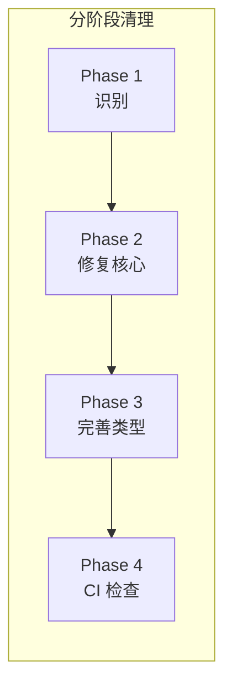

# Architecture: 类型安全清理

**项目**: vibex-type-safety-cleanup  
**版本**: 1.0  
**架构师**: Architect  
**日期**: 2026-03-19

---

## 1. 问题概述

清理代码中的 `as any` 类型断言，提升 TypeScript 类型安全。

---

## 2. 风险分析

```typescript
// 危险示例
const data = response.data as any;  // 静默类型丢失
data.foo.bar;  // 运行时可能报错

// 安全做法
const data = response.data as KnownType;
if (data?.foo?.bar) { ... }
```

---

## 3. 架构图



---

## 4. 实施策略

| 阶段 | 任务 | 目标 |
|------|------|------|
| Phase1 | 识别所有 as any | 建立清单 |
| Phase2 | 修复关键路径 | 核心逻辑 |
| Phase3 | 完善类型定义 | 类型补全 |
| Phase4 | 添加 CI 检查 | 防止新增 |

---

## 5. ESLint 规则

```json
{
  "@typescript-eslint/no-explicit-any": "error",
  "@typescript-eslint/no-unsafe-assignment": "error",
  "@typescript-eslint/no-unsafe-call": "error",
  "@typescript-eslint/no-unsafe-member-access": "error",
  "@typescript-eslint/no-unsafe-return": "error"
}
```

---

## 6. 优先级清单

| 模块 | as any 数量 | 优先级 |
|------|-------------|--------|
| components/ | 高 | P0 |
| hooks/ | 中 | P1 |
| utils/ | 低 | P2 |
| api/ | 中 | P1 |

---

## 7. 验收标准

| 标准 | 验证方式 |
|------|----------|
| as any 使用 < 10 | grep 检查 |
| 类型检查通过 | npm run type-check |
| 运行时无类型错误 | 测试通过 |

---

## 8. 工作量

**2天**

---

*Architecture - 2026-03-19*
