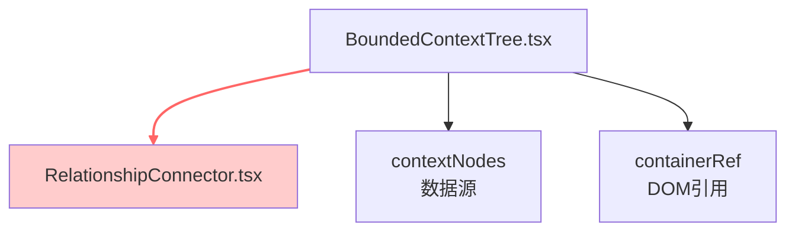

# Architecture: canvas-bc-card-line-removal

**Agent**: architect
**Date**: 2026-04-02
**Project**: canvas-bc-card-line-removal
**Status**: ✅ 完成

---

## 1. 问题概述

删除 `BoundedContextTree`（上下文树）卡片之间的 SVG 贝塞尔曲线连线（`RelationshipConnector`），简化 UI、减少视觉干扰。

**影响范围**: 仅 `BoundedContextTree.tsx` 中的一个组件引用 + `RelationshipConnector.tsx` 文件本身。

---

## 2. 技术栈

| 层级 | 技术 | 版本 | 选型理由 |
|------|------|------|----------|
| 框架 | React | 18.x | 现有前端框架 |
| 语言 | TypeScript | 5.x | 现有项目规范 |
| 样式 | CSS Modules | - | 现有样式方案 |
| 测试 | Vitest + gstack browse | - | 现有测试框架 + 强制验证工具 |

**无新增依赖** — 纯注释式改动。

---

## 3. 架构影响分析

### 3.1 组件关系



### 3.2 移除影响

| 影响项 | 评估 | 说明 |
|--------|------|------|
| 功能破坏 | **无** | RelationshipConnector 纯展示组件，无状态/逻辑副作用 |
| 样式冲突 | **无** | 移除后无残留 CSS |
| 数据流 | **无** | contextNodes 仍正常传递，组件不再消费 |
| 依赖引用 | **1处** | BoundedContextTree.tsx 第 15 行 import + 第 600 行使用 |
| 性能 | **正向** | 减少 SVG 渲染节点 |

### 3.3 决策

**方案**: 注释掉组件引用（而非删除文件）

**理由**:
1. 改动最小（可逆）
2. 保留 RelationshipConnector.tsx 文件以备未来恢复
3. 仅影响展示层，无副作用
4. 工时 < 0.5h

---

## 4. 数据模型

无数据模型变更。

---

## 5. API 定义

无新增 API。

**待移除的 Props 接口**（RelationshipConnectorProps）:

```typescript
interface RelationshipConnectorProps {
  nodes: ContextNode[];      // 节点数据（移除后不再传入）
  containerRef: RefObject<HTMLElement | null>; // DOM 引用（移除后不再传入）
}
```

移除后 `BoundedContextTree.tsx` 的 props 和状态不变。

---

## 6. 文件变更清单

| 文件 | 变更类型 | 变更说明 |
|------|----------|----------|
| `src/components/canvas/BoundedContextTree.tsx` | 修改 | 注释 import + JSX 组件引用 |
| `src/components/canvas/edges/RelationshipConnector.tsx` | 无变更 | 保留文件（可恢复） |

---

## 7. 测试策略

### 7.1 测试框架

- **Vitest**（现有单元测试框架）
- **gstack browse**（强制要求，headless 浏览器验证）

### 7.2 测试用例

#### TC-1: 组件注释验证（静态检查）

```typescript
// vitest tests/canvas/bc-card-line-removal.spec.ts
import { describe, it, expect } from 'vitest';
import { readFileSync } from 'fs';
import { resolve } from 'path';

describe('E1: RelationshipConnector 注释验证', () => {
  it('F1.1: RelationshipConnector 已注释或移除', () => {
    const content = readFileSync(
      resolve(__dirname, '../../src/components/canvas/BoundedContextTree.tsx'),
      'utf-8'
    );
    // 验证 <RelationshipConnector 不在有效 JSX 中
    const activeConnector = content.match(/[^/]<RelationshipConnector/);
    expect(activeConnector).toBeNull();
  });

  it('F1.2: contextNodes 状态仍存在（无破坏）', () => {
    const content = readFileSync(
      resolve(__dirname, '../../src/components/canvas/BoundedContextTree.tsx'),
      'utf-8'
    );
    expect(content).toMatch(/contextNodes/);
  });
});
```

#### TC-2: UI 无连线验证（gstack browse）

```bash
# 步骤 1: 启动开发服务器
# 步骤 2: 用 gstack 打开 canvas 页，展开上下文树
# 步骤 3: 验证无 SVG path 连线

script:
  - name: "验证上下文树无连线"
    steps:
      - goto: "http://localhost:3000/canvas"
      - wait: 1000
      - click: "展开上下文树按钮"
      - wait: 1000
      - snapshot: "验证无贝塞尔曲线 SVG"
      # 预期: contextNodeList 内无 path[d] 贝塞尔曲线
```

#### TC-3: 回归验证（gstack browse）

```bash
script:
  - name: "验证卡片拖拽功能正常"
    steps:
      - click: "第一个上下文卡片"
      - assert: "卡片被选中（高亮）"
      - drag: "@card -> 向下移动 50px"
      - assert: "卡片位置更新"
      - assert: "无控制台错误"
```

### 7.3 覆盖率要求

- 静态检查: 100%（2 个断言）
- UI 验证: 截图对比（before/after）
- 回归: 拖拽功能正常

---

## 8. 风险评估

| 风险 | 概率 | 影响 | 缓解 |
|------|------|------|------|
| 误删其他 import | 低 | 中 | 仅注释 RelationshipConnector 一行 |
| 影响其他组件 | 极低 | 高 | RelationshipConnector 仅在 BoundedContextTree 中使用 |
| 未来恢复困难 | 低 | 低 | 文件未删除，随时可恢复 |

---

## 9. 验收标准

- [ ] `BoundedContextTree.tsx` 中 `<RelationshipConnector` 不在有效 JSX 中
- [ ] gstack 截图验证：展开上下文树后，contextNodeList 内无 SVG path 连线
- [ ] gstack 回归测试：卡片拖拽功能正常
- [ ] 无新增 TypeScript 错误
- [ ] IMPLEMENTATION_PLAN.md 已生成
- [ ] AGENTS.md 已生成

---

## 执行决策

- **决策**: 已采纳
- **执行项目**: canvas-bc-card-line-removal
- **执行日期**: 2026-04-02
