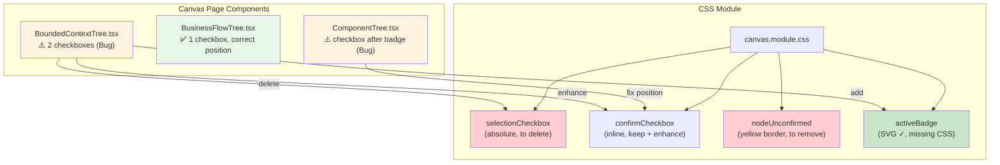

# Architecture: Canvas Checkbox Style Unify

**项目**: canvas-checkbox-style-unify
**版本**: v1.0
**日期**: 2026-04-02
**架构师**: architect
**状态**: ✅ 设计完成

---

## 执行摘要

本任务修复 Canvas 页面 3 类树组件（BoundedContextTree / BusinessFlowTree / ComponentTree）的 checkbox 样式不一致问题：
- ContextTree 有 2 个 checkbox，语义重复
- ComponentTree checkbox 位置错误（在 type badge 后）
- 未确认节点黄色边框视觉冗余

**技术选型**: React + TypeScript + CSS Modules（无架构变更，纯 UI 修复）

---

## 1. Tech Stack

| 技术 | 选择 | 理由 |
|------|------|------|
| **框架** | React 18 + TypeScript | 现有项目，无变更必要 |
| **样式** | CSS Modules（canvas.module.css） | 已有样式系统，保持一致 |
| **图标** | 内联 SVG（确认反馈绿色 ✓） | 轻量，无依赖 |
| **测试** | Jest + React Testing Library | 现有测试框架 |
| **覆盖要求** | > 80% | 符合项目规范 |

**无新增依赖**，无需 npm install。

---

## 2. Architecture Diagram



### 组件职责

| 组件 | 职责 | 修改范围 |
|------|------|----------|
| `BoundedContextTree.tsx` | 渲染 bounded context 节点卡片 | 删除 selectionCheckbox，保留并增强 confirmCheckbox，添加确认反馈 SVG |
| `ComponentTree.tsx` | 渲染 component 节点卡片 | 移动 checkbox 到 type badge 前，移除 div 包裹 |
| `BusinessFlowTree.tsx` | 渲染 business flow 节点卡片 | 添加确认反馈 SVG（E4 可选） |
| `canvas.module.css` | 三组件共享样式 | 删除 nodeUnconfirmed 黄色边框/阴影，补充 activeBadge CSS，保留 confirmCheckbox 样式 |

---

## 3. Component API Changes

### 3.1 BoundedContextTree.tsx

**Before（问题代码）**:
```tsx
// Line 234-243: 绝对定位 selectionCheckbox — 删除
<input type="checkbox" className={styles.selectionCheckbox} ... />

// Line 246-253: inline confirmCheckbox — 保留但增强
<input type="checkbox" className={styles.confirmCheckbox} ... />

// Line 257: nodeTypeBadge — 紧随 confirmCheckbox
<div className={styles.nodeTypeBadge} ... />
```

**After（修复后）**:
```tsx
// 只保留 1 个 checkbox，inline 位置
<input
  type="checkbox"
  className={styles.confirmCheckbox}
  checked={node.status === 'confirmed'}
  onChange={() => confirmContextNode(node.nodeId)}
  aria-label="确认节点"
/>

// 确认状态绿色 ✓ 反馈（新增）
{node.status === 'confirmed' && (
  <span className={styles.confirmedBadge} aria-label="已确认">
    <svg width="12" height="12" viewBox="0 0 16 16" fill="none" aria-hidden="true">
      <path d="M3 8l3.5 3.5L13 5" stroke="var(--color-success)" strokeWidth="2" strokeLinecap="round" strokeLinejoin="round"/>
    </svg>
  </span>
)}

<div className={styles.nodeTypeBadge} ... />
```

### 3.2 ComponentTree.tsx

**Before（问题代码）**:
```tsx
// Line 426-434: checkbox 在 div 包裹内，位置在 type badge 后
<div className={styles.selectionCheckbox} onClick={...}>
  <input type="checkbox" ... />
</div>
<div className={styles.nodeCardHeader}>
  <div className={styles.nodeTypeBadge} ... />  {/* ← badge 在前 */}
  ...
</div>
```

**After（修复后）**:
```tsx
<div className={styles.nodeCardHeader}>
  {/* checkbox 前移到 type badge 前，直接 inline */}
  {onToggleSelect && (
    <input
      type="checkbox"
      className={styles.confirmCheckbox}
      checked={isSelected}
      onChange={() => onToggleSelect(node.nodeId)}
      aria-label="选择节点"
    />
  )}
  <div className={styles.nodeTypeBadge} ... />
  {/* 保留 activeBadge SVG 确认反馈 */}
  {node.isActive !== false && (
    <span className={styles.activeBadge} aria-label="已确认">
      <svg ... />
    </span>
  )}
  ...
</div>
```

### 3.3 canvas.module.css 变更

**删除 nodeUnconfirmed 黄色边框**:
```css
/* Before */
.nodeUnconfirmed {
  border-color: var(--color-warning);
  box-shadow: 0 0 8px rgba(255, 170, 0, 0.2);
}

/* After */
.nodeUnconfirmed {
  /* 移除黄色边框和阴影，仅保留边框 */
  border: 2px solid var(--color-border);
}
```

**补充 activeBadge CSS（缺失）**:
```css
.activeBadge {
  display: inline-flex;
  align-items: center;
  margin-left: 0.25rem;
  vertical-align: middle;
}
```

**新增 confirmedBadge 样式（用于 ContextTree 确认反馈）**:
```css
.confirmedBadge {
  display: inline-flex;
  align-items: center;
  margin-left: 0.25rem;
  vertical-align: middle;
}
```

---

## 4. Data Model

节点数据结构无变更，保持现有接口不变。

```typescript
// BoundedContextNode
interface BoundedContextNode {
  nodeId: string;
  nodeName: string;
  type: 'core' | 'supporting' | 'generic';
  status: 'pending' | 'confirmed' | 'error';
  isActive: boolean;   // 用于确认状态
}

// ComponentNode
interface ComponentNode {
  nodeId: string;
  nodeName: string;
  type: 'page' | 'list' | 'form' | 'detail' | 'popup';
  isActive: boolean;   // 用于确认状态（activeBadge）
}

// BusinessFlowNode
interface BusinessFlowNode {
  nodeId: string;
  flowName: string;
  isActive: boolean;
  status: 'pending' | 'confirmed' | 'error';
}
```

---

## 5. Testing Strategy

### 5.1 测试框架
- **Jest** + **React Testing Library**
- 现有测试桩：`BoundedContextTree.test.tsx`, `ComponentTree.test.tsx`

### 5.2 覆盖率要求
- **> 80%** 语句覆盖率
- 重点覆盖：checkbox 渲染逻辑、确认反馈条件、分支覆盖

### 5.3 核心测试用例

#### BoundedContextTree.test.tsx

```typescript
describe('E1: ContextTree Checkbox Consolidation', () => {
  it('should render only 1 checkbox per node card', () => {
    const { container } = render(<BoundedContextTree nodes={[node]} ... />);
    const checkboxes = container.querySelectorAll('input[type="checkbox"]');
    expect(checkboxes.length).toBe(1);
  });

  it('should show confirm feedback SVG when status is confirmed', () => {
    const confirmedNode = { ...node, status: 'confirmed' };
    const { container } = render(<BoundedContextTree nodes={[confirmedNode]} ... />);
    const badge = container.querySelector('[aria-label="已确认"]');
    expect(badge).not.toBeNull();
  });

  it('should NOT show confirm feedback SVG when status is pending', () => {
    const pendingNode = { ...node, status: 'pending' };
    const { container } = render(<BoundedContextTree nodes={[pendingNode]} ... />);
    const badge = container.querySelector('[aria-label="已确认"]');
    expect(badge).toBeNull();
  });

  it('should checkbox be positioned before nodeTypeBadge in DOM order', () => {
    const { container } = render(<BoundedContextTree nodes={[node]} ... />);
    const checkbox = container.querySelector('input[type="checkbox"]');
    const badge = container.querySelector('[class*="nodeTypeBadge"]');
    const position = checkbox!.compareDocumentPosition(badge!);
    // checkbox 在 badge 前 → DOCUMENT_POSITION_PRECEDING
    expect(position & Node.DOCUMENT_POSITION_PRECEDING).toBeTruthy();
  });

  it('should call confirmContextNode on checkbox change', () => {
    const confirmMock = jest.fn();
    const { container } = render(
      <BoundedContextTree nodes={[node]} confirmContextNode={confirmMock} ... />
    );
    const checkbox = container.querySelector('input[type="checkbox"]') as HTMLInputElement;
    checkbox.click();
    expect(confirmMock).toHaveBeenCalledWith(node.nodeId);
  });
});
```

#### ComponentTree.test.tsx

```typescript
describe('E2: ComponentTree Checkbox Position', () => {
  it('should checkbox be before type badge in DOM order', () => {
    const { container } = render(<ComponentTree nodes={[node]} onToggleSelect={jest.fn()} />);
    const checkbox = container.querySelector('input[type="checkbox"]');
    const badge = container.querySelector('[class*="nodeTypeBadge"]');
    const position = checkbox!.compareDocumentPosition(badge!);
    expect(position & Node.DOCUMENT_POSITION_PRECEDING).toBeTruthy();
  });

  it('should checkbox NOT be inside a div wrapper', () => {
    const { container } = render(<ComponentTree nodes={[node]} onToggleSelect={jest.fn()} />);
    const checkboxWrapper = container.querySelector('div > input[type="checkbox"]');
    expect(checkboxWrapper).toBeNull();
  });

  it('should checkbox NOT use absolute positioning', () => {
    const { container } = render(<ComponentTree nodes={[node]} onToggleSelect={jest.fn()} />);
    const checkbox = container.querySelector('input[type="checkbox"]') as HTMLInputElement;
    expect(checkbox.style.position).not.toBe('absolute');
  });
});
```

#### CSS Regression Tests

```typescript
describe('E3: nodeUnconfirmed Yellow Border Removal', () => {
  it('should nodeUnconfirmed NOT have yellow border color', () => {
    const pendingNode = { ...node, status: 'pending' };
    const { container } = render(<BoundedContextTree nodes={[pendingNode]} ... />);
    const card = container.querySelector('[class*="nodeUnconfirmed"]') as HTMLElement;
    expect(card.style.borderColor).not.toBe('var(--color-warning)');
  });

  it('should nodeUnconfirmed NOT have orange box-shadow', () => {
    const pendingNode = { ...node, status: 'pending' };
    const { container } = render(<BoundedContextTree nodes={[pendingNode]} ... />);
    const card = container.querySelector('[class*="nodeUnconfirmed"]') as HTMLElement;
    expect(card.style.boxShadow).not.toContain('255, 170, 0');
  });
});
```

---

## 6. 性能影响评估

| 维度 | 影响 | 说明 |
|------|------|------|
| **Bundle Size** | 无变化 | 仅修改已有代码，无新增依赖 |
| **Runtime Performance** | 无变化 | 条件渲染逻辑不变，仅移除/添加 CSS 类 |
| **Paint/Layout** | 轻微正向 | 移除黄色边框/阴影，减少重绘区域 |
| **Memory** | 无变化 | 无状态变更 |
| **Accessibility** | 正向 | 改善 aria-label 和语义一致性 |

**结论**: 无性能风险，移除阴影可能有轻微性能收益。

---

## 7. 风险与缓解

| 风险 | 概率 | 影响 | 缓解 |
|------|------|------|------|
| 删除 selectionCheckbox 影响多选功能 | 低 | 中 | 确认 Ctrl+Click 拖选有其他触发方式（事件冒泡到 canvas） |
| activeBadge CSS 缺失导致样式丢失 | 已发现 | 中 | 补充 activeBadge 和 confirmedBadge CSS |
| 黄色边框移除后难以区分节点 | 低 | 低 | type badge 颜色 + 确认反馈 SVG 双重指示 |

---

## 8. 变更文件清单

| 文件 | 操作 | 行数变更 |
|------|------|----------|
| `src/components/canvas/BoundedContextTree.tsx` | 修改 | -10/+15 |
| `src/components/canvas/ComponentTree.tsx` | 修改 | ±5 |
| `src/components/canvas/BusinessFlowTree.tsx` | 修改（E4） | +10 |
| `src/components/canvas/canvas.module.css` | 修改 | ±8 |
| `src/components/canvas/BoundedContextTree.test.tsx` | 新增用例 | +40 |
| `src/components/canvas/ComponentTree.test.tsx` | 新增用例 | +30 |

---

## 9. 架构决策记录

### ADR-001: 删除 ContextTree 双 checkbox 中 selectionCheckbox

**状态**: Accepted

**上下文**: ContextTree 有 2 个 checkbox（selectionCheckbox 绝对定位 + confirmCheckbox inline），语义重复且用户困惑。

**决策**: 删除绝对定位的 `selectionCheckbox`，仅保留 `confirmCheckbox` 作为确认 checkbox。

**后果**:
- ✅ 消除双 checkbox 困惑
- ⚠️ 需要确认 Ctrl+Click 拖选功能不受影响（canvas 层事件处理）
- ⚠️ 需要确认多选功能有其他触发方式

### ADR-002: 移除 nodeUnconfirmed 黄色边框

**状态**: Accepted

**上下文**: 未确认节点用黄色边框 + 阴影区分，与 type badge 颜色重复，视觉冗余。

**决策**: 删除 `border-color: var(--color-warning)` 和 `box-shadow`。

**后果**:
- ✅ 减少视觉噪音
- ✅ 确认状态仅通过绿色 ✓ 图标区分，更精确
- ⚠️ 需要确保 type badge 颜色足以区分节点类型

### ADR-003: 补充 activeBadge CSS（技术债）

**状态**: Accepted

**上下文**: ComponentTree 引用 `styles.activeBadge` 但 CSS Modules 中无定义。

**决策**: 补充 `activeBadge` 和 `confirmedBadge` CSS 样式。

**后果**:
- ✅ 修复未定义 CSS 引用
- ✅ 统一确认反馈视觉

---

## 执行决策

- **决策**: 已采纳
- **执行项目**: canvas-checkbox-style-unify
- **执行日期**: 2026-04-02
