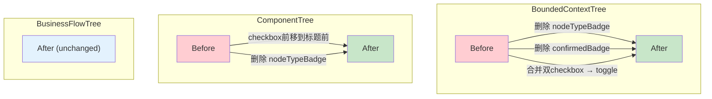

# Architecture: Canvas Checkbox UX 修复

**项目**: canvas-checkbox-ux-fix
**版本**: v1.0
**日期**: 2026-04-02
**架构师**: architect
**状态**: ✅ 设计完成

---

## 执行摘要

修复 Canvas 三树组件 checkbox UX 问题：删除冗余视觉元素（nodeTypeBadge/confirmedBadge），统一单 checkbox toggle 行为。

**技术选型**: React + TypeScript + CSS Modules（无架构变更）
**总工时**: 2h

---

## 1. Tech Stack

| 技术 | 选择 | 理由 |
|------|------|------|
| **框架** | React 18 + TypeScript | 已有，无变更 |
| **样式** | CSS Modules（canvas.module.css） | 已有，补充样式变更 |
| **测试** | Jest + React Testing Library | 已有 |
| **覆盖要求** | > 80% | 符合项目规范 |

---

## 2. Architecture Diagram



---

## 3. Component API Changes

### 3.1 BoundedContextTree.tsx

**Before**:
```tsx
// 2 checkboxes
<input type="checkbox" className={styles.selectionCheckbox} ... />
<input type="checkbox" className={styles.confirmCheckbox} ... />
<div className={styles.nodeTypeBadge} /> {/* type info */}
{node.status === 'confirmed' && <span className={styles.confirmedBadge}>✓</span>}
```

**After**:
```tsx
// 1 checkbox toggle
<input
  type="checkbox"
  className={styles.confirmCheckbox}
  checked={node.status === 'confirmed'}
  onChange={() => toggleContextNode(node.nodeId)}
  aria-label="切换确认状态"
/>
```

### 3.2 ComponentTree.tsx

**Before**:
```tsx
<div className={styles.nodeCardHeader}>
  <div className={styles.nodeTypeBadge} /> {/* ← badge 在前 */}
  <input type="checkbox" />
</div>
```

**After**:
```tsx
<div className={styles.nodeCardHeader}>
  <input type="checkbox" className={styles.confirmCheckbox} /> {/* ← checkbox 在前 */}
  {/* type 通过 border 颜色表达，无需 badge */}
</div>
```

---

## 4. Data Model

无数据模型变更。

```typescript
// 确认状态通过 border 颜色区分
// nodeConfirmed: border-color: var(--color-success) — 绿色边框表示已确认
// 无 nodeTypeBadge，type 通过 border 颜色区分
// - core: 橙色
// - supporting: 蓝色
// - generic: 灰色
```

---

## 5. Testing Strategy

### 5.1 单元测试

```typescript
describe('BoundedContextTree Checkbox Toggle', () => {
  it('should render only 1 checkbox per node', () => {
    const { container } = render(<BoundedContextTree nodes={[node]} />);
    expect(container.querySelectorAll('input[type="checkbox"]').length).toBe(1);
  });

  it('should toggle confirmed status on checkbox change', () => {
    const { container } = render(<BoundedContextTree nodes={[node]} />);
    const checkbox = container.querySelector('input[type="checkbox"]');
    checkbox.click();
    expect(toggleContextNode).toHaveBeenCalledWith(node.nodeId);
  });

  it('should NOT render nodeTypeBadge', () => {
    const { container } = render(<BoundedContextTree nodes={[node]} />);
    expect(container.querySelector('[class*="nodeTypeBadge"]')).toBeNull();
  });

  it('should NOT render confirmedBadge', () => {
    const { container } = render(<BoundedContextTree nodes={[node]} />);
    expect(container.querySelector('[class*="confirmedBadge"]')).toBeNull();
  });
});

describe('ComponentTree Checkbox Position', () => {
  it('should checkbox be inline with title', () => {
    const { container } = render(<ComponentTree nodes={[node]} />);
    const checkbox = container.querySelector('input[type="checkbox"]');
    const title = container.querySelector('[class*="nodeTitle"]');
    const position = checkbox.compareDocumentPosition(title);
    expect(position & Node.DOCUMENT_POSITION_FOLLOWING).toBeTruthy();
  });

  it('should NOT render nodeTypeBadge', () => {
    const { container } = render(<ComponentTree nodes={[node]} />);
    expect(container.querySelector('[class*="nodeTypeBadge"]')).toBeNull();
  });
});
```

---

## 6. Performance Impact

| 维度 | 影响 |
|------|------|
| **Bundle Size** | 无变化 |
| **Runtime** | 无变化 |
| **Paint** | 正向（减少 DOM 节点）|

**结论**: 无性能风险，删除冗余元素减少渲染开销。

---

## 7. 架构决策记录

### ADR-001: 用 border 颜色替代 nodeTypeBadge

**状态**: Accepted

**上下文**: nodeTypeBadge 占用空间，type 信息已通过 border 颜色表达。

**决策**: 删除 nodeTypeBadge，type 通过 border 颜色区分。

**后果**:
- ✅ 卡片信息密度提升
- ⚠️ 色盲用户可能难以区分（已有 type badge tooltip 可补充）

### ADR-002: 用 border 颜色替代 confirmedBadge

**状态**: Accepted

**上下文**: confirmedBadge 占用空间，confirmed 状态已通过 border 颜色表达。

**决策**: 删除 confirmedBadge，confirmed 通过 border 颜色区分。

**后果**:
- ✅ 卡片信息密度提升
- ⚠️ 建议在 border 颜色基础上补充 tooltip 说明

### ADR-003: checkbox 双向 toggle

**状态**: Accepted

**上下文**: confirmContextNode 无反向操作，无法取消确认。

**决策**: toggleContextNode(nodeId) 双向切换 confirmed/pending 状态。

---

## 执行决策

- **决策**: 已采纳
- **执行项目**: canvas-checkbox-ux-fix
- **执行日期**: 2026-04-02
