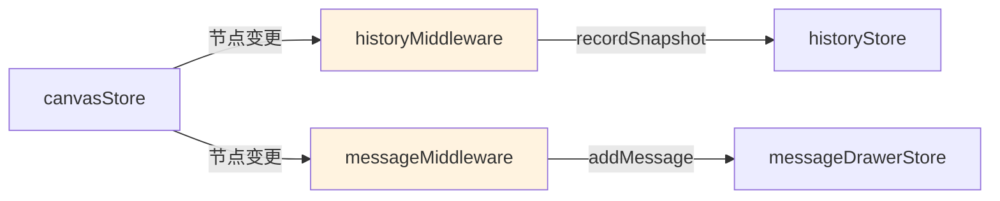

# Architecture: canvas-data-model-unification

**Project**: Canvas 前端数据模型统一
**Agent**: architect
**Date**: 2026-03-31
**PRD**: docs/canvas-data-model-unification/prd.md

---

## 1. 执行摘要

四个独立 store（canvasStore 1288行、messageDrawerStore、historySlice、confirmationStore）数据不统一，BoundedContext/BusinessFlow 在多处重复定义。Phase1 目标：消除重复类型 + 新增 useCanvasSession hook + middleware 自动联动。

---

## 2. 现状分析

### 2.1 类型重复

| 类型 | lib/canvas/types.ts | confirmationStore.ts |
|------|---------------------|---------------------|
| `BoundedContext` | ⚠️ 存在 | ✅ 重复定义 |
| `BusinessFlow` | ⚠️ 存在 | ✅ 重复定义 |
| `ContextRelationship` | ⚠️ 存在 | ✅ 重复定义 |

### 2.2 现有共享类型（`lib/canvas/types.ts`）

```
lib/canvas/types.ts 已有：
- BoundedContextNode, BusinessFlowNode, ComponentNode
- CanvasSlice, ContextSlice, FlowSlice, ComponentSlice
- TreeNode, CanvasSnapshot
- Phase, TreeType, NodeStatus
- 591 行，43 个导出
```

### 2.3 confirmationStore 重复定义

```typescript
// confirmationStore.ts — 重复定义
export interface BoundedContext {
  id, name, description, confirmed, ...    // 与 lib/canvas/types.ts 不同
}
export interface BusinessFlow {
  id, name, ...                             // 与 lib/canvas/types.ts 不同
}
```

---

## 3. 目标架构

### 3.1 共享类型扩展

**文件**: `src/lib/canvas/types.ts`

新增类型（消除 confirmationStore 重复）：
```typescript
// 新增：ConfirmationStore 专用（但与其他 store 共享的部分）
export interface ConfirmationFlowState {
  id: string;
  flowId: string;
  status: 'pending' | 'in_review' | 'confirmed';
  updatedAt: number;
}

export interface ConfirmationSnapshot {
  id: string;
  flowId: string;
  nodes: BoundedContextNode[];
  timestamp: number;
}
```

### 3.2 Middleware 架构



**防止循环触发**：
```typescript
// historyMiddleware.ts
let isRecording = false;

export const historyMiddleware = (store) => (next) => (action) => {
  const result = next(action);
  const isCanvasAction = action.type.startsWith('canvas/');
  const isNodeMutation = ['addContextNode', 'deleteContextNode', 'confirmContextNode'].includes(action.type);

  if (isCanvasAction && isNodeMutation && !isRecording) {
    isRecording = true;
    try {
      store.getState().recordSnapshot();
    } finally {
      isRecording = false;
    }
  }
  return result;
};
```

### 3.3 useCanvasSession Hook

```typescript
// src/lib/canvas/useCanvasSession.ts
import { useCanvasStore } from '@/stores/canvasStore';
import { useMessageDrawerStore } from '@/stores/messageDrawerStore';
import { useHistoryStore } from '@/stores/historyStore';

export function useCanvasSession() {
  const canvas = useCanvasStore();
  const messages = useMessageDrawerStore((s) => s.messages);
  const history = useHistoryStore((s) => s.past);

  return {
    sessionId: canvas.sessionId,
    projectId: canvas.projectId,
    contextNodes: canvas.contextNodes,
    flowNodes: canvas.flowNodes,
    componentNodes: canvas.componentNodes,
    aiStatus: canvas.aiStatus,
    sseStatus: canvas.sseStatus,
    leftDrawerOpen: canvas.leftDrawerOpen,
    rightDrawerOpen: canvas.rightDrawerOpen,
    messages,
    history,
  };
}
```

---

## 4. 文件变更清单

### Phase 1

| 文件 | 操作 | Epic |
|------|------|------|
| `src/lib/canvas/types.ts` | 扩展，新增 ConfirmationFlowState 等 | Epic 1 |
| `src/stores/confirmationStore.ts` | 修改，引用共享类型，删除重复定义 | Epic 1 |
| `src/lib/canvas/useCanvasSession.ts` | 新增 | Epic 2 |
| `src/stores/historyMiddleware.ts` | 新增 | Epic 3 |
| `src/stores/messageMiddleware.ts` | 新增 | Epic 3 |
| `src/stores/canvasStore.ts` | 修改，注册 middleware | Epic 3, 4 |
| `src/stores/migration.ts` | 新增，Zustand persist migration | Epic 5 |
| `__tests__/useCanvasSession.test.ts` | 新增 | Epic 2 |
| `__tests__/middleware.test.ts` | 新增 | Epic 3, 4, 5 |

### Phase 2（未来）

| 文件 | 操作 |
|------|------|
| `src/stores/messageDrawerStore.ts` | 合并 → canvasStore slice |
| `src/stores/historyStore.ts` | 合并 → canvasStore slice |
| `src/stores/canvasStore.ts` | 新增 CanvasSession persist schema |

---

## 5. Zustand Middleware 集成

```typescript
// stores/canvasStore.ts
import { create } from 'zustand';
import { historyMiddleware } from './historyMiddleware';
import { messageMiddleware } from './messageMiddleware';

export const useCanvasStore = create<CanvasState>()(
  subscribeWithSelector,
  (set, get, store) => ({
    // ... existing state
  }),
  // Middleware 包装
  (store) => historyMiddleware(store),
  (store) => messageMiddleware(store)
);
```

---

## 6. Migration 设计

```typescript
// stores/migration.ts
import { StateStorage } from 'zustand/middleware';

export const migration: StateStorage = {
  getItem: (key) => {
    const raw = localStorage.getItem(key);
    if (!raw) return null;
    const parsed = JSON.parse(raw);
    // 检测版本
    if (!parsed._version || parsed._version < 2) {
      return migrateV1toV2(parsed);
    }
    return parsed;
  },
  setItem: (key, value) => {
    const withVersion = { ...value, _version: 2 };
    localStorage.setItem(key, JSON.stringify(withVersion));
  },
};

function migrateV1toV2(old) {
  // 合并 confirmationStore 字段到 canvasStore
  return {
    ...old,
    _version: 2,
    // confirmationStore 字段迁移
  };
}
```

---

## 7. 性能影响

| 指标 | 影响 |
|------|------|
| Middleware 调用 | < 5ms/次（纯同步状态读取） |
| Middleware 内存 | historyMiddleware 最多存 50 个快照 |
| Bundle size | +3 KB（useCanvasSession + middleware） |
| localStorage | +10-50 KB（history snapshots） |

---

## 8. 风险与缓解

| 风险 | 缓解 |
|------|------|
| Middleware 循环触发 | `isRecording` flag 防止 |
| 旧数据 migration 丢失 | migration 测试 + gstack 截图验证 |
| confirmationStore 依赖破坏 | 逐个迁移引用方，每步验证 |

---

## 9. 实施顺序

| Epic | 工时 | Sprint |
|------|------|--------|
| Epic 1: 消除重复类型 | 3.5h | Sprint 0 |
| Epic 2: useCanvasSession | 2.5h | Sprint 0 |
| Epic 3: historyMiddleware | 3h | Sprint 0 |
| Epic 4: messageMiddleware | 2.5h | Sprint 0 |
| Epic 5: Migration + 回归 | 3h | Sprint 0 |

**Phase 1 总工时**: ~14.5h

---

*Architect 产出物 | 2026-03-31*
