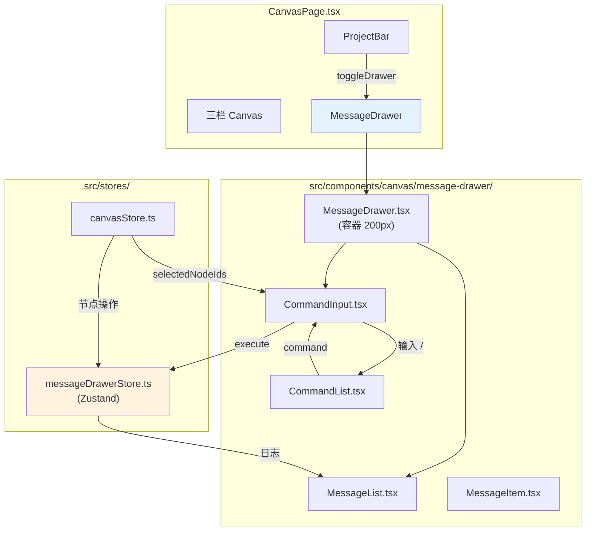

# Architecture: canvas-drawer-msg

**Project**: Canvas 画布页右侧消息抽屉
**Agent**: architect
**Date**: 2026-03-31
**PRD**: docs/canvas-drawer-msg/prd.md
**Analysis**: docs/canvas-drawer-msg/analysis.md

---

## 1. 执行摘要

在 Canvas 页面右侧新增 200px 宽消息抽屉，提供操作历史沉淀和 `/` 命令入口。

**6 项已确认设计决策（约束）**：
- D1: Chat 模式（Slack 风格），不复用 AIChatPanel
- D2: 5 个命令，console.log 控制台输出
- D3: PC 默认 200px，可调整
- D4: 底部输入框展示 `/` 命令，点选卡片后命令过滤
- D5: Phase1 覆盖需求录入 + 卡片过滤 + 控制台日志
- D6: **不展示 API 路由**，控制台输出调用事件

---

## 2. 组件架构



---

## 3. 目录结构

```
vibex-fronted/src/
├── components/canvas/
│   └── message-drawer/
│       ├── MessageDrawer.tsx       # 抽屉容器，动画展开/收起
│       ├── MessageDrawer.module.css
│       ├── MessageList.tsx          # 消息列表，虚拟列表（≥200条时）
│       ├── MessageList.module.css
│       ├── MessageItem.tsx          # 单条消息，支持4种类型
│       ├── MessageItem.module.css
│       ├── CommandInput.tsx        # 底部命令输入框
│       ├── CommandInput.module.css
│       ├── CommandList.tsx         # 命令下拉列表（/ 触发）
│       └── CommandList.module.css
├── stores/
│   └── messageDrawerStore.ts       # Zustand store
└── __tests__/
    └── message-drawer/
        ├── MessageDrawer.test.tsx
        ├── CommandInput.test.tsx
        └── messageDrawerStore.test.ts
```

---

## 4. 数据模型

### 4.1 消息类型

```typescript
// stores/messageDrawerStore.ts

type MessageType = 'user_action' | 'ai_suggestion' | 'system' | 'command_executed';

interface DrawerMessage {
  id: string;
  type: MessageType;
  content: string;
  timestamp: number;
  metadata?: {
    command?: string;
    nodeIds?: string[];
  };
}
```

### 4.2 命令定义

```typescript
// stores/messageDrawerStore.ts

interface Command {
  name: string;         // "/gen-context"
  label: string;        // "生成限界上下文"
  treeType?: 'context' | 'flow' | 'component';
  nodeRequired: boolean; // /update-card=true，其他=false
  consoleMessage: string;
}

const COMMANDS: Command[] = [
  { name: '/submit',       label: '提交需求',       nodeRequired: false, consoleMessage: '[Command] /submit triggered — 提交需求' },
  { name: '/gen-context',  label: '生成限界上下文', treeType: 'context', nodeRequired: false, consoleMessage: '[Command] /gen-context triggered — 生成限界上下文' },
  { name: '/gen-flow',     label: '生成流程树',     treeType: 'flow',    nodeRequired: false, consoleMessage: '[Command] /gen-flow triggered — 生成流程树' },
  { name: '/update-card',  label: '修改选中卡片',   nodeRequired: true,  consoleMessage: '[Command] /update-card triggered — 修改选中卡片' },
  { name: '/gen-component',label: '生成组件',        treeType: 'component',nodeRequired: false,consoleMessage:'[Command] /gen-component triggered — 生成组件' },
];
```

### 4.3 Zustand Store

```typescript
// stores/messageDrawerStore.ts
import { create } from 'zustand';
import { persist } from 'zustand/middleware';

interface MessageDrawerState {
  // 抽屉状态
  isOpen: boolean;
  width: number;           // 默认 200px

  // 消息列表
  messages: DrawerMessage[];
  addMessage: (msg: Omit<DrawerMessage, 'id' | 'timestamp'>) => void;

  // 命令执行
  executeCommand: (command: Command) => void;
  filteredCommands: (search: string, selectedNodeIds: string[]) => Command[];
}

export const useMessageDrawerStore = create<MessageDrawerState>()(
  persist(
    (set, get) => ({
      isOpen: false,
      width: 200,
      messages: [],

      addMessage: (msg) =>
        set((s) => ({
          messages: [
            ...s.messages,
            {
              ...msg,
              id: crypto.randomUUID(),
              timestamp: Date.now(),
            },
          ],
        })),

      executeCommand: (command) => {
        // D6: console.log 输出，不调用 API
        console.log(command.consoleMessage);

        // 追加 command_executed 消息
        get().addMessage({
          type: 'command_executed',
          content: command.consoleMessage,
          metadata: { command: command.name },
        });
      },

      filteredCommands: (search, selectedNodeIds) => {
        const hasSelection = selectedNodeIds.length > 0;
        return COMMANDS.filter((cmd) => {
          const matchesSearch = cmd.name.includes(search) || cmd.label.includes(search);
          const matchesNodeFilter = hasSelection ? cmd.nodeRequired || cmd.treeType !== undefined : true;
          // 如果有选区，隐藏 nodeRequired=false 且 treeType!=undefined 的命令
          // 但 /update-card (nodeRequired=true) 始终显示
          return matchesSearch && (hasSelection ? cmd.nodeRequired || !cmd.treeType : true);
        });
      },
    }),
    { name: 'message-drawer-storage', partialize: (s) => ({ messages: s.messages }) }
  )
);
```

---

## 5. CanvasStore 集成

### 5.1 节点操作 → 追加消息

```typescript
// canvasStore.ts - 节点操作监听
// 在 addContextNode / confirmContextNode / deleteContextNode 等 action 中调用：
useMessageDrawerStore.getState().addMessage({
  type: 'user_action',
  content: `添加了上下文节点: ${nodeName}`,
  metadata: { nodeIds: [nodeId] },
});
```

### 5.2 选区状态 → 命令过滤

```typescript
// CommandInput.tsx
const selectedNodeIds = useCanvasStore((s) => s.selectedNodeIds);
const filteredCommands = useMessageDrawerStore(
  (s) => s.filteredCommands(inputValue, selectedNodeIds || [])
);
```

---

## 6. 命令过滤逻辑详解

**D4 约束：点选卡片后命令过滤**

| 场景 | 显示的命令 |
|------|-----------|
| 无选区（默认） | 全部 5 个 |
| 有选区 | 只显示 `/update-card`（因为它是唯一 `nodeRequired=true`） |

```typescript
// 实际过滤逻辑
filteredCommands(search, selectedNodeIds) {
  const hasSelection = selectedNodeIds.length > 0;
  return COMMANDS.filter(cmd => {
    if (!cmd.name.includes(search)) return false;
    if (hasSelection) {
      // 有选区时：nodeRequired=true 始终显示；nodeRequired=false 且无 treeType 的也显示
      // 即：/submit 和 /update-card 始终显示
      return cmd.nodeRequired || !cmd.treeType;
    }
    return true;
  });
}
```

---

## 7. 响应式设计

```css
/* MessageDrawer.module.css */
.message-drawer {
  width: 200px;
  transition: width 0.3s ease;
}

@media (max-width: 768px) {
  .message-drawer {
    display: none; /* 移动端默认隐藏 */
  }
}
```

移动端（≤768px）默认隐藏，用户可通过 ProjectBar 按钮触发展开。

---

## 8. 性能优化

| 优化项 | 方案 |
|--------|------|
| 消息列表 ≥ 200 条 | `@tanstack/react-virtual` 虚拟列表，只渲染可见行 |
| 消息持久化 | Zustand `persist` 中间件，自动保存到 localStorage |
| 动画性能 | `transform: translateX()` 替代 `width` 动画 |

---

## 9. 文件变更清单

| 文件 | 操作 | Epic |
|------|------|------|
| `components/canvas/message-drawer/MessageDrawer.tsx` | 新增 | Epic 1 |
| `components/canvas/message-drawer/MessageDrawer.module.css` | 新增 | Epic 1 |
| `components/canvas/message-drawer/MessageList.tsx` | 新增 | Epic 1 |
| `components/canvas/message-drawer/MessageItem.tsx` | 新增 | Epic 1 |
| `components/canvas/message-drawer/CommandInput.tsx` | 新增 | Epic 2 |
| `components/canvas/message-drawer/CommandList.tsx` | 新增 | Epic 2 |
| `stores/messageDrawerStore.ts` | 新增 | Epic 1 |
| `stores/canvasStore.ts` | 修改，集成消息追加 | Epic 1 |
| `CanvasPage.tsx` | 修改，引入 MessageDrawer | Epic 1 |
| `ProjectBar.tsx` | 修改，添加抽屉开关按钮 | Epic 1 |
| `__tests__/message-drawer/` | 新增 | Epic 3 |

**无后端改动。**

---

## 10. 测试策略

| 测试类型 | 工具 | 覆盖 |
|---------|------|------|
| 单元测试 | Jest | MessageItem, CommandInput, messageDrawerStore |
| 组件测试 | Testing Library | MessageDrawer, CommandList |
| E2E | Playwright | 打开抽屉、执行命令、节点过滤 |

**关键测试用例**：
```typescript
test('输入 /gen 显示 2 个命令', () => {
  render(<CommandInput />);
  fireEvent.change(input, { target: { value: '/gen' } });
  expect(screen.getAllByRole('option')).toHaveLength(2);
});

test('点选卡片后只显示 /update-card', () => {
  useCanvasStore.setState({ selectedNodeIds: ['node-1'] });
  render(<CommandInput />);
  fireEvent.change(input, { target: { value: '/' } });
  expect(screen.getAllByRole('option')).toHaveLength(1);
  expect(screen.getByText('/update-card')).toBeInTheDocument();
});

test('命令执行后追加 command_executed 消息', () => {
  executeCommand(COMMANDS[0]); // /submit
  expect(useMessageDrawerStore.getState().messages).toContainEqual(
    expect.objectContaining({ type: 'command_executed' })
  );
});
```

---

## 11. 性能影响

| 指标 | 影响 | 评估 |
|------|------|------|
| Bundle size | +15 KB | MessageDrawer + CommandList |
| Canvas 渲染 | +0ms | 抽屉与三栏并列，无交叉影响 |
| localStorage | ≤ 200 条消息 | 约 50 KB，可接受 |

---

*Architect 产出物 | 2026-03-31*
